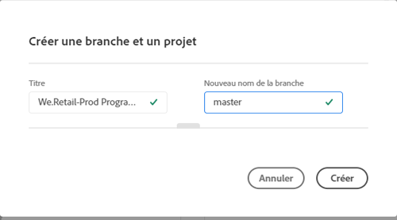
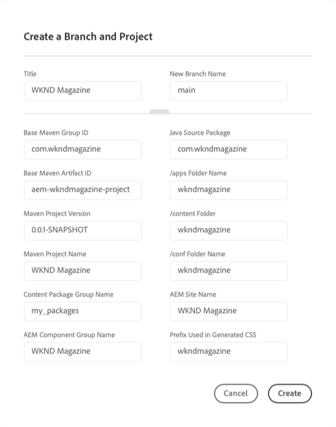
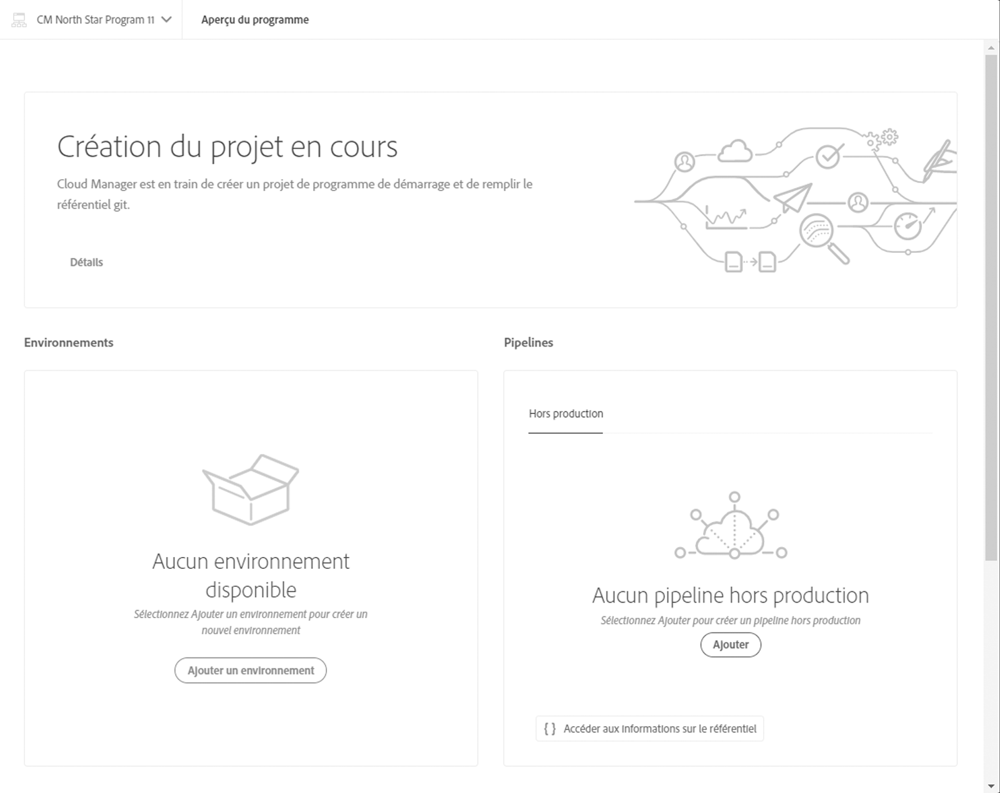

# Assistant de création du projet {#project-creation-wizard}

Une fois votre programme de production créé, Cloud Manager propose un assistant pour créer un projet AEM minimal basé sur l’[archétype de projet AEM](https://experienceleague.adobe.com/docs/experience-manager-core-components/using/developing/archetype/overview.html?lang=fr) pour vous permettre de commencer rapidement.

Suivez ces étapes pour créer un projet d’application AEM dans Cloud Manager à l’aide de l’assistant.

1. Créez un programme de production en suivant les étapes du document [Création de programmes de production](creating-production-programs.md)

1. Une fois la configuration du programme terminée, accédez à l’écran **Présentation** de votre programme et affichez la carte d’appel à l’action **Créer une branche et un projet** dans la partie supérieure.

   

1. Cliquez sur **Créer** pour démarrer l’assistant et confirmez le **Titre** et le **Nom de nouvelle branche** dans la fenêtre **Créer une branche et un projet**.

   

1. Cliquez éventuellement sur le séparateur pour afficher les paramètres supplémentaires de votre projet. Les valeurs par défaut sont fournies par l’archétype de projet AEM et n’ont généralement pas besoin d’être modifiées.

   

1. Cliquez sur **Créer** pour lancer le processus de création du projet.

Une carte **Création du projet en cours** remplace maintenant la carte d’appel à l’action **Créer une branche et un projet** en haut de l’écran **Présentation du programme**.

Une fois la création du programme terminée, une carte **Ajouter un environnement** remplace la carte **Création du projet en cours** en haut de l’écran **Présentation du programme**.

Vous disposez désormais d’un projet AEM basé sur l’archétype AEM ajouté à votre référentiel git afin de servir de base de développement pour votre propre projet. Vous pouvez ensuite créer vos environnements dans lesquels vous pouvez déployer le code du projet.

Consultez [Gestion de vos environnements](/help/implementing/cloud-manager/manage-environments.md) pour savoir comment ajouter ou gérer des environnements.

>[!NOTE]
>
>L’assistant n’est disponible que pour les programmes de production. Étant donné que les [programmes sandbox](introduction-sandbox-programs.md#auto-creation) comprennent une création automatique de projet, l’assistant n’est pas nécessaire.