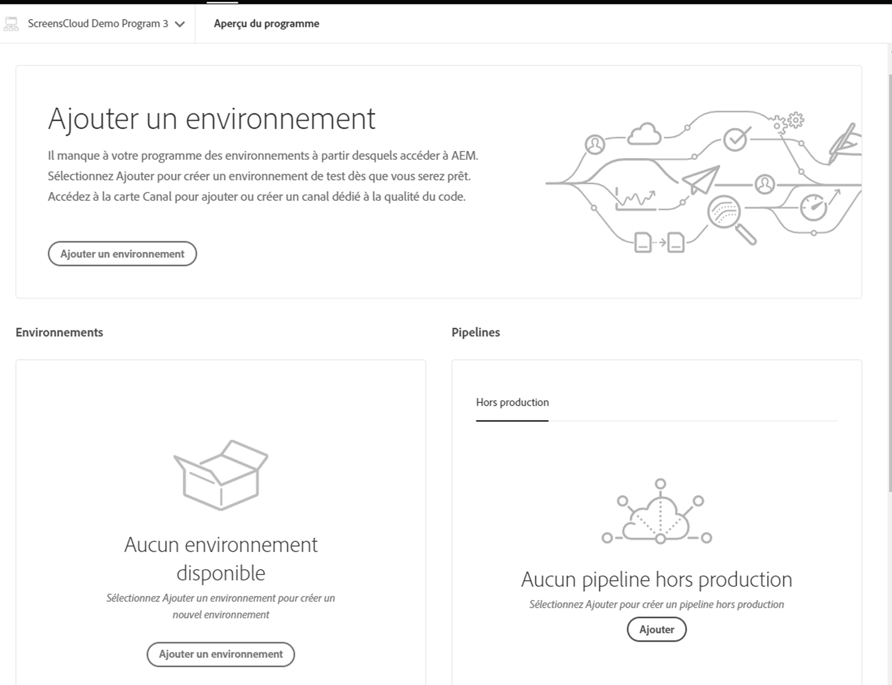

# Assistant de création du projet {#project-creation-wizard}

Une fois votre programme de production créé, Cloud Manager propose un assistant pour créer un projet d’AEM minimal basé sur les [AEM Archétype de projet](https://experienceleague.adobe.com/docs/experience-manager-core-components/using/developing/archetype/overview.html?lang=fr) pour commencer rapidement.

Pour créer un projet d’application AEM dans Cloud Manager à l’aide de l’assistant, procédez comme suit.

1. Créez un programme de production en suivant les étapes du document. [Création de programmes de production](creating-production-programs.md)

1. Une fois la configuration du programme terminée, accédez à la **Présentation** écran de votre programme et affichez la **Créer une branche et un projet** carte d’appel à l’action en haut.

   

1. Cliquez sur **Créer** pour démarrer l’assistant et confirmer le **Titre** et **Nouveau nom de branche** dans le **Création d’une branche et d’un projet** fenêtre.

   

1. Si vous le souhaitez, cliquez sur le séparateur pour afficher les paramètres supplémentaires de votre projet. Les valeurs par défaut sont fournies par AEM Project Archetype et n’ont généralement pas besoin d’être modifiées.

   

1. Cliquez sur **Créer** pour lancer le processus de création du projet.

A **Création du projet en cours** remplace maintenant la carte **Créer une branche et un projet** carte d’appel à l’action en haut de la page **Aperçu du programme** écran.

Une fois la création du programme terminée, une **Ajouter un environnement** remplace la carte **Création du projet en cours** en haut de la page **Aperçu du programme** écran.

Vous disposez désormais d’un projet AEM basé sur l’archétype AEM ajouté à votre référentiel git afin de servir de base de développement pour votre propre projet. Vous pouvez ensuite créer vos environnements dans lesquels vous pouvez déployer le code du projet.

Voir [Gestion des environnements](/help/implementing/cloud-manager/manage-environments.md) pour savoir comment ajouter ou gérer des environnements.

>[!NOTE]
>
>L’assistant n’est disponible que pour les programmes de production. Parce que [programmes sandbox](introduction-sandbox-programs.md#auto-creation) inclure la création automatique de projet, l’assistant n’est pas nécessaire.