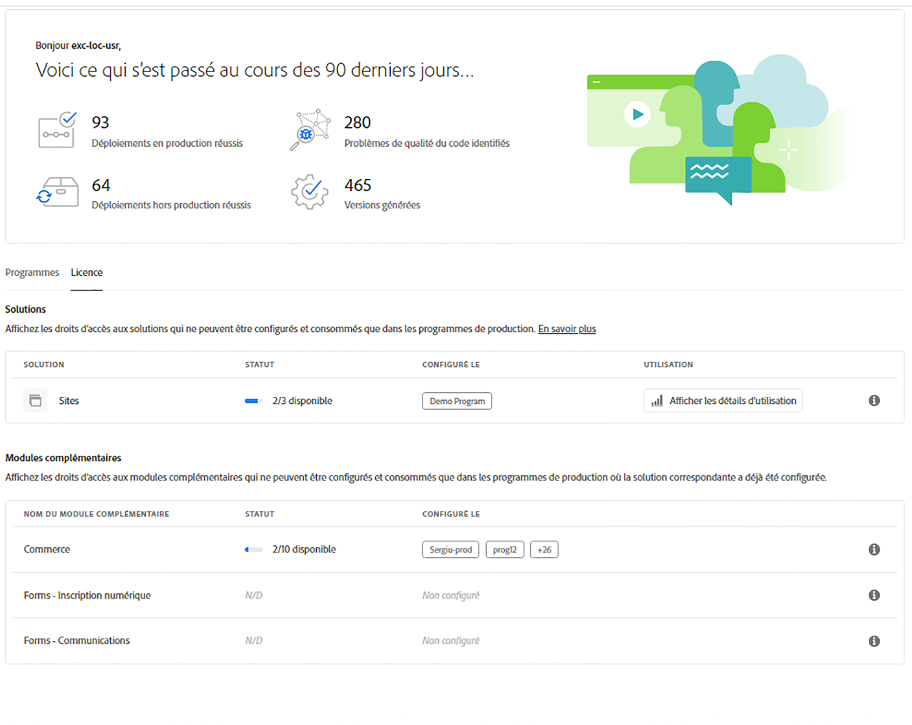

# Tableau de bord des licences {#license-dashboard}

Cloud Manager fournit un tableau de bord pour un affichage convivial des produits AEMaaCS disponibles pour votre entreprise ou vos clients.

>[!IMPORTANT]
>
>Le tableau de bord des licences s’applique uniquement aux programmes AEM as a Cloud Service. Les [programmes AMS](https://experienceleague.adobe.com/en/docs/experience-manager-cloud-manager/content/introduction) ne sont pas inclus dans le tableau de bord des licences.
>
>Pour déterminer le type de service de votre programme (AMS ou AEMaaCS), consultez [Navigation dans l’interface utilisateur de Cloud Manager](/help/implementing/cloud-manager/navigation.md#program-cards).

## Vue d’ensemble {#overview}

Le tableau de bord des licences Cloud Manager permet d’accéder facilement aux droits sur les solutions disponibles pour l’ensemble de vos programmes, y compris ce qui est utilisé et ce qui est disponible. De plus, les mesures de consommation des demandes de contenu affichent les tendances par mois pour la solution Sites.

## Accès au tableau de bord des licences {#using-dashboard}

>[!NOTE]
>
>Un utilisateur possédant le rôle **Propriétaire de l’entreprise** doit être connecté pour consulter le tableau de bord des licences.

1. Connectez-vous à Cloud Manager à l’adresse [my.cloudmanager.adobe.com](https://my.cloudmanager.adobe.com/) et sélectionnez l’organisation appropriée.
1. Sur la console **[Mes programmes](/help/implementing/cloud-manager/navigation.md#my-programs)**, cliquez sur  dans l&#39;en-tête [Cloud Manager](/help/implementing/cloud-manager/navigation.md#cloud-manager-header). Cette action affiche les onglets.
1. Cliquez sur l’option **Licence** dans l’onglet .

Le tableau de bord se divise en trois sections, comme suit :

* **Solutions** - Quelles solutions disposez-vous d’une licence ?
* **Modules complémentaires** - Quels modules complémentaires sont disponibles pour vos solutions sous licence ?
* **Autres droits** - Quel sandbox et environnement de développement et autres droits peuvent être consommés au sein de votre client.

Chaque section résume ce qui est disponible et son utilisation, le cas échéant. Actuellement, seules les solutions Sites et Assets s’affichent même si d’autres solutions existent dans le client.

* La colonne **Statut** indique le nombre de droits inutilisés par rapport au total disponible pour le client.
* La colonne **Configuré sur** indique les programmes sur lesquels le droit de la solution a été appliqué.
   * Un droit est considéré comme utilisé uniquement lorsqu’un environnement de production est créé. Ou, s’il en existe un, si un pipeline de mise à jour y a été exécuté.
   * Seul un nombre limité de programmes sont répertoriés individuellement dans la colonne, le reste étant représenté par une entrée `+x`.
   * Pointez sur l’entrée `+x` pour afficher un pop-up avec les détails de tous les programmes.
* La colonne **Utilisation** affiche un bouton **[Afficher les détails d’utilisation](#view-usage-details)** pour afficher les statistiques d’utilisation de la solution.

>[!TIP]
>
>Pour savoir comment gérer vos droits Adobe dans l’ensemble de l’organisation à partir d’Admin Console, consultez la [présentation d’Admin Console](https://helpx.adobe.com/fr/enterprise/using/admin-console.html).

## Afficher les détails d’utilisation {#view-usage-details}

<!--
The **View usage details** button gives access to the chosen solution's **Usage Details** window. This window gives a detailed breakdown including charts to show your solution's usage. How that usage is measured depends on the chosen solution. -->

Le bouton **Afficher les détails d’utilisation** dans la zone Licence de Cloud Manager fournit une répartition détaillée de l’utilisation actuelle des ressources. Lorsque l’utilisateur clique dessus, un rapport ou un tableau de bord s’ouvre, qui affiche les mesures importantes liées à votre licence. <!-- ADD THIS SENTENCE IF ASSETS USAGE DETAILS GETS REINSTATED ", such as the number of users, storage consumption, or bandwidth usage, depending on the type of services you're using." --> Cette fonctionnalité vous permet de surveiller et de vous assurer que vous respectez les limites de votre contrat tout en offrant des informations pour une meilleure planification et optimisation des ressources.

### Détails d&#39;utilisation des sites {#sites-usage-details}

La fenêtre **Détails d’utilisation des sites** présente des graphiques donnant un aperçu de l’utilisation de vos licences Sites en fonction des [demandes de contenu](#what-is-a-content-request).

Le côté gauche de la fenêtre présente un graphique en secteurs présentant la répartition du contrat pour l&#39;année sélectionnée dans le menu déroulant **Afficher l&#39;année du contrat**.

Le côté droit de la fenêtre présente un graphique en aires montrant l’utilisation répartie par programme au fil du temps pour l’année de contrat sélectionnée. Un pointeur affiche une fenêtre contextuelle avec des détails par programme pour le moment sélectionné.

<!-- REMOVED AS PER CQDOC-21983
### Assets usage details {#assets-usage-details}

The **Assets usage details** window, presents graphs giving an overview of the usage of your Assets licenses based on [storage](#storage) and [standard users](#standard-users). Select the appropriate tab to toggle between the views.

For both storage and standard users views, you can use the **Environment Type** dropdown to toggle the view between production, stage, and development environments.

#### Storage {#storage}

The left side of the window presents a pie chart showing the contract breakdown for the contract year selected in the **View contract year** dropdown.

The right side of the window presents an area chart showing the usage broken down by program over time for the selected contract year. A hover reveals a popup with details per program for the selected point in time.

#### Standard Users {#standard-users}

The left side of the window presents a pie chart showing the contract breakdown for the contract year selected in the **View contract year** dropdown.

The right side of the window presents an area chart showing the usage broken down by program over time for the selected contract year. A hover reveals a popup with details per program for the selected point in time. -->

## Questions fréquentes {#faq}

### Qu’est-ce qu’une requête de contenu ?{#what-is-a-content-request}

Une requête de contenu est toute requête adressée à AEM Sites ou à un système de mise en cache fourni par le client, comme un réseau de diffusion de contenu. Il récupère le contenu ou les données au format HTML pour les pages vues. Ou au format JSON pour les appels API.

Une demande de contenu est comptabilisée pour chaque page vue ou chaque fois que cinq appels d’API sont effectués, mesurée à l’entrée du premier système de mise en cache qui reçoit une demande de contenu. Les demandes de contenu sont comptabilisées par rapport aux environnements de production uniquement.

Les demandes de contenu excluent les demandes ou activités initiées par ou pour le compte d’Adobe dans le seul but de fournir des produits et des services. Le trafic des agents utilisateurs identifiés par Adobe provenant des robots associés aux moteurs de recherche et aux services de médias sociaux est également exclu.

Consultez également la section [Présentation des requêtes de contenu Cloud Service](/help/implementing/cloud-manager/content-requests.md).

### Comment Adobe Experience Manager mesure-t-il les demandes de contenu ?{#how-are-content-requests-measured}

Les demandes de contenu sont suivies sur les serveurs Edge d’AEM as a Cloud Service. Le trafic d’origine n’est pas comptabilisé dans les demandes de contenu. Le réseau CDN intégré à AEM as a Cloud Service effectue le suivi des requêtes HTML et JSON valides.

AEM a également mis en place des règles pour exclure les robots connus, notamment les services connus qui visitent régulièrement le site pour actualiser leur index ou service de recherche.

Voir aussi [Comprendre les demandes de contenu Cloud Service](/help/implementing/cloud-manager/content-requests.md).

### Pourquoi mon rapport Analytics présente-t-il des résultats différents de ceux des requêtes de contenu AEM ?{#why-are-reports-different}

Les demandes de contenu peuvent présenter des variations avec les outils de création de rapports Analytics d’une organisation. Pour plus d’informations, voir [Comprendre les demandes de contenu Cloud Service](/help/implementing/cloud-manager/content-requests.md).

### Comment en savoir plus sur le volume de ma requête de contenu ?{#current-request-volumes}

Si vous souhaitez obtenir des informations supplémentaires sur le volume des requêtes de contenu affiché dans le tableau de bord des licences, votre équipe Adobe peut fournir un rapport qui indique les principaux facteurs de volume des requêtes de contenu. Contactez votre équipe Adobe ou le service clientèle Adobe pour demander un rapport sur l’utilisation optimale.

### Que se passe-t-il si j’utilise mon propre réseau CDN ?{#using-own-cdn}

Le tableau de bord des licences affiche uniquement les données suivies par le réseau CDN Cloud Service. Si vous choisissez d’importer votre propre réseau CDN (BYOCDN), vous signalez annuellement votre volume de requête de contenu à Adobe, comme indiqué dans votre contrat.

