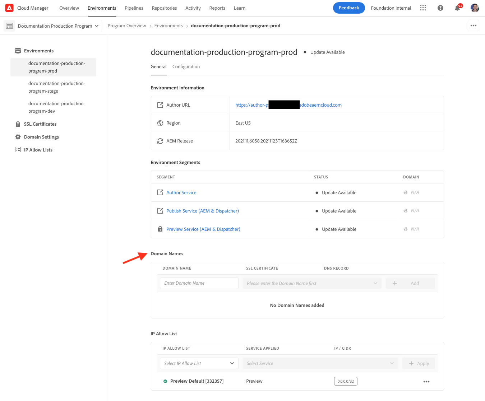

# Gestion des environnements {#managing-environments}

Découvrez les types d’environnements que vous pouvez créer et comment les créer pour votre projet Cloud Manager.

## Types d’environnement {#environment-types}

Un utilisateur disposant des autorisations requises peut créer les types d’environnement suivants (dans les limites de ce qui est disponible pour le client spécifique).

* **Production et évaluation** - Les environnements de production et d’évaluation sont disponibles par paire et sont utilisés respectivement à des fins de production et de test.

* **Développement** - Un environnement de développement peut être créé à des fins de développement et de test et sera associé uniquement aux pipelines qui ne sont pas en production.

Les fonctionnalités de chaque environnement dépendent des solutions activées dans le [programme](/help/implementing/cloud-manager/getting-access-to-aem-in-cloud/program-types.md) conteneur.

* [Sites](/help/sites-cloud/home.md)
* [Assets](/help/assets/home.md)
* [Forms](/help/forms/home.md)
* [Screens](/help/screens-cloud/home.md)

>[!NOTE]
>
>Les environnements de production et d’évaluation ne sont créés que par paire. Vous ne pouvez pas créer uniquement un environnement d’évaluation ou de production.

## Ajout d’un environnement {#adding-environments}

1. Connectez-vous à Cloud Manager à l’adresse [my.cloudmanager.adobe.com](https://my.cloudmanager.adobe.com/) et sélectionnez l’organisation appropriée.

1. Cliquez sur le programme pour lequel vous souhaitez ajouter un environnement.

1. Dans la page **Aperçu du programme**, cliquez sur **Ajouter un environnement** dans la carte **Environnements** pour ajouter un environnement.

   

   * L’option **Ajouter un environnement** est également disponible dans l’onglet **Environnements**.

      

   * L’option **Ajouter un environnement** peut être désactivée en raison d’un niveau d’autorisation insuffisant ou de ressources sous licence.

1. Dans la boîte de dialogue **Ajouter un environnement** qui s’affiche :

   * Sélectionnez un **type d’environnement**.
      * Le nombre d’environnements disponibles/utilisés est indiqué entre parenthèses derrière le type d’environnement Développement.
   * Fournissez un **Nom de l’environnement**.
   * Fournissez une **Description de l’environnement**.
   * Sélectionnez une **Région Cloud**.

   

1. Cliquez sur **Enregistrer** pour ajouter l’environnement spécifié.

L’écran **Aperçu** affiche désormais votre nouvel environnement dans la carte **Environnements**. Vous pouvez désormais configurer des pipelines pour votre nouvel environnement.

## Détails de l’environnement {#viewing-environment}

Vous pouvez utiliser la carte **Environnements** sur la page Aperçu pour accéder aux détails d’un environnement, et ce, de deux manières.

1. Dans la page **Aperçu**, cliquez sur l’onglet **Environnements** dans la partie supérieure de l’écran.

   

   * Vous pouvez également cliquer sur le bouton **Tout afficher** dans la carte **Environnements** pour accéder directement à l’onglet **Environnements**.

      

1. L’onglet **Environnements** ouvre et répertorie tous les environnements du programme.

   

1. Cliquez sur un environnement de la liste pour en afficher les détails.

   

Vous pouvez également cliquer sur le bouton représentant des points de suspension de l’environnement souhaité, puis sélectionner **Afficher les détails**.

>[!NOTE]
>
>La carte **Environnements** répertorie uniquement trois environnements. Cliquez sur le bouton **Tout afficher** comme décrit précédemment pour voir tous les environnements du programme.

### Accès au service d’aperçu {#access-preview-service}

Cloud Manager fournit un service d’aperçu (fourni en tant que service de publication supplémentaire) à chaque environnement AEM as a Cloud Service.

Le service vous permet de prévisualiser l’expérience finale d’un site web avant qu’il n’atteigne l’environnement de publication et soit disponible publiquement.

Lors de la création, une liste d’adresses IP autorisées par défaut est appliquée au service d’aperçu, intitulée `Preview Default [<envId>]`, qui bloque tout le trafic vers le service d’aperçu. Pour activer l’accès, vous devez activement annuler l’application de la liste d’adresses IP autorisées par défaut à partir du service d’aperçu.

Un utilisateur disposant des autorisations requises doit suivre les étapes des options suivantes avant de partager l’URL du service d’aperçu avec l’une de vos équipes, afin de garantir l’accès à l’URL de prévisualisation.

1. Créez une liste d’adresses IP autorisées appropriée, appliquez-la au service d’aperçu et annulez immédiatement l’application de la variable liste autorisée `Preview Default [<envId>]`.

   * Reportez-vous au document [Application et annulation de l’application de Listes autorisées IP](/help/implementing/cloud-manager/ip-allow-lists/apply-allow-list.md) pour plus d’informations.

1. Utilisez le workflow de mise à jour de la **liste d’adresses IP autorisées** pour supprimer l’adresse IP par défaut et ajouter la ou les adresses IP, le cas échéant. Consultez [Gestion des listes autorisées d’adresses IP](/help/implementing/cloud-manager/ip-allow-lists/managing-ip-allow-lists.md) pour en savoir plus.

Une fois l’accès au service d’aperçu déverrouillé, l’icône de verrouillage devant le nom du service d’aperçu ne s’affiche plus.

Une fois activé, vous pouvez publier du contenu dans le service d’aperçu à l’aide de l’interface utilisateur de gestion de la publication d’AEM. Reportez-vous au document [Prévisualisation du contenu](/help/sites-cloud/authoring/fundamentals/previewing-content.md) pour plus d’informations.

>[!NOTE]
>
>Votre environnement doit se trouver dans une version `2021.05.5368.20210529T101701Z` d’AEM ou plus récente. Pour ce faire, vérifiez qu’un pipeline de mise à jour a bien été exécuté sur votre environnement.

## Mise à jour des environnements {#updating-dev-environment}

En tant que service natif du cloud, les mises à jour de vos environnements d’évaluation et de production dans les programmes de production sont automatiquement gérées par Adobe.

Toutefois, les mises à jour apportées aux environnements de développement et aux environnements dans les programmes Sandbox sont gérées dans les programmes. Lorsqu’un tel environnement n’exécute pas la dernière version d’AEM disponible pour le public, le statut de la carte **Environnements** dans l’écran **Aperçu** du programme affiche **Mise à jour disponible**.

### Mises à jour et pipelines {#updates-pipelines}

Les pipelines sont le seul moyen de [déployer le code dans les environnements d’AEM as a Cloud Service.](deploy-code.md) Pour cette raison, chaque pipeline est associé à une version d’AEM spécifique.

Si Cloud Manager détecte qu’une version d’AEM plus récente est disponible que celle qui a été déployée pour la dernière fois avec le pipeline, il affiche le statut **Mise à jour disponible** de l’environnement.

Le processus de mise à jour est donc un processus en deux étapes :

1. Mise à jour du pipeline avec la dernière version AEM
1. Exécution du pipeline pour déployer la nouvelle version d’AEM dans un environnement

### Mise à jour de vos environnements {#updating-your-environments}

L’option **Mettre à jour** est disponible à partir de la carte **Environnements** pour les environnements de développement et les environnements dans les programmes Sandbox en cliquant sur le bouton représentant des points de suspension de l’environnement.

Cette option est également disponible en cliquant sur l’onglet **Environnements** du programme, puis en sélectionnant le bouton représentant des points de suspension de l’environnement.

Un utilisateur avec le rôle **Responsable de déploiement** peut utiliser cette option pour mettre à jour le pipeline associé à cet environnement vers la dernière version d’AEM.

Une fois que la version du pipeline est mise à jour vers la dernière version d’AEM disponible pour le public, l’utilisateur est invité à exécuter le pipeline associé pour déployer la dernière version dans l’environnement.

Le comportement de l’option **Mise à jour** varie en fonction de la configuration et du statut actuel du programme.

* Si le pipeline a déjà été mis à jour, l’option **Mettre à jour** invite l’utilisateur à exécuter le pipeline.
* Si le pipeline est déjà en cours de mise à jour, l’option **Mettre à jour** informe l’utilisateur qu’une mise à jour est déjà en cours d’exécution.
* Si aucun pipeline approprié n’est renvoyé, l’option **Mettre à jour** invite l’utilisateur à en créer un.

## Suppression d’environnements de développement {#deleting-environment}

Un utilisateur disposant des autorisations requises peut supprimer un environnement de développement.

Dans l’écran **Aperçu** du programme dans la carte **Environnements**, cliquez sur le bouton représentant des points de suspension de l’environnement de développement que vous souhaitez supprimer.

L’option de suppression est également disponible dans l’onglet **Environnements** de la fenêtre **Aperçu** du programme. Cliquez sur le bouton représentant des points de suspension de l’environnement et sélectionnez **Supprimer**.

>[!NOTE]
>
>* Les environnements de production et d’évaluation créés dans un programme de production ne peuvent pas être supprimés.
>* Les environnements de production et d’évaluation d’un programme Sandbox peuvent être supprimés.

## Gestion de l’accès {#managing-access}

Sélectionnez **Gérer l’accès** depuis le menu représentant des points de suspension de l’environnement dans la carte **Environnements**. Vous pouvez accéder directement à l’instance d’auteur et gérer l’accès pour votre environnement.

## Accès à la Developer Console {#accessing-developer-console}

Sélectionnez la **Developer Console** depuis le menu représentant des points de suspension de l’environnement dans la carte **Environnements**. Un nouvel onglet s’ouvre alors dans votre navigateur, contenant la page de connexion à la **Developer Console**.

Seul un utilisateur possédant le rôle de **développeur** aura accès à la **Developer Console**. L’exception concerne les programmes Sandbox, où tout utilisateur ayant accès au programme Sandbox aura accès à la **Developer Console**.

Pour plus d’informations, consultez [Mise en veille et réactivation d’environnements Sandbox](https://experienceleague.adobe.com/docs/experience-manager-cloud-service/onboarding/getting-access/cloud-service-programs/sandbox-programs.html?lang=fr#hibernating-introduction).

Cette option est également disponible à partir de l’onglet **Environnement** de la fenêtre **Aperçu** lorsque vous cliquez sur le menu représentant des points de suspension d’un environnement individuel.

## Connexion locale {#login-locally}

Sélectionnez **Connexion locale** dans le menu représentant des points de suspension de la carte **Environnements** pour vous connecter localement à Adobe Experience Manager.

De plus, vous pouvez vous connecter localement à partir de l’onglet **Environnements** de la page **Aperçu**.

## Gestion des noms de domaine personnalisés {#manage-cdn}

Les noms de domaine personnalisés sont pris en charge dans Cloud Manager pour les programmes Sites, pour les services de publication comme de prévisualisation. Chaque environnement Cloud Manager peut héberger jusqu’à 250 domaines personnalisés.

Pour configurer des noms de domaine personnalisés, accédez à l’onglet **Environnements** et cliquez sur un environnement pour afficher les détails de l’environnement.

Vous pouvez exécuter les actions suivantes sur le service de publication pour votre environnement.

* [Ajout d’un nom de domaine personnalisé](/help/implementing/cloud-manager/custom-domain-names/add-custom-domain-name.md)

* [Gestion des noms de domaine personnalisés](/help/implementing/cloud-manager/custom-domain-names/managing-custom-domain-names.md)

* [Vérification du statut d’un nom de domaine personnalisé](/help/implementing/cloud-manager/custom-domain-names/check-domain-name-status.md#pre-existing-cdn) ou d’un [certificat SSL](/help/implementing/cloud-manager/managing-ssl-certifications/managing-certificates.md#pre-existing-cdn).

* [Gestion des listes autorisées d’adresses IP](/help/implementing/cloud-manager/ip-allow-lists/managing-ip-allow-lists.md#pre-existing-cdn)

## Gestion des listes autorisées d’adresses IP {#manage-ip-allow-lists}

Les liste d’adresses IP autorisées sont prises en charge dans Cloud Manager pour les services de création, de publication et de prévisualisation pour les programmes Sites.

Pour gérer les listes d’adresses IP autorisées, accédez à l’onglet **Environnements** de la page **Aperçu** de votre programme. Cliquez sur un environnement pour en gérer les détails.

### Application d’une liste d’adresses IP autorisées {#apply-ip-allow-list}

L’application d’une liste d’adresses IP autorisées associe toutes les plages d’adresses IP incluses dans la définition de la liste autorisée à un service de création ou de publication dans un environnement. Un utilisateur avec le rôle **Propriétaire de l’entreprise** ou **Responsable du déploiement** doit être connecté pour pouvoir appliquer une liste d’adresses IP autorisées.

La liste d’adresses IP autorisées doit exister dans Cloud Manager pour pouvoir être appliquée à un environnement. Pour en savoir plus sur les listes autorisées d’adresses IP dans Cloud Manager, accédez au document [Introduction aux liste d’adresses IP autorisées dans Cloud Manager.](/help/implementing/cloud-manager/ip-allow-lists/introduction.md)

Procédez comme suit pour appliquer une liste d’adresses IP autorisées.

1. Accédez à l’environnement spécifique à partir de l’onglet **Environnements** de l’écran de programme **Aperçu** et accédez au tableau **Liste d’adresses IP autorisées**.
1. Utilisez les champs d’entrée en haut du tableau des liste d’adresses IP autorisées pour sélectionner la liste d’adresses IP autorisées et le service de création ou de publication auquel vous souhaitez l’appliquer.
1. Cliquez sur **Appliquer** et confirmez votre soumission.

### Annulation de l’application d’une liste d’adresses IP autorisées {#unapply-ip-allow-list}

L’annulation de l’application d’une liste d’adresses IP autorisées dissocie toutes les plages d’adresses IP incluses dans la définition de la liste autorisée d’un service d’auteur ou d’éditeur dans un environnement. Un utilisateur avec le rôle **Propriétaire de l’entreprise** ou **Responsable du déploiement** doit être connecté pour pouvoir annuler l’application une liste d’adresses IP autorisées.

Pour annuler l’application d’une liste d’adresses IP autorisées, procédez comme suit.

1. Accédez à l’environnement spécifique à partir de l’onglet **Environnements** de l’écran de programme **Aperçu** et accédez au tableau **Liste d’adresses IP autorisées**.
1. Identifiez la ligne où apparaît la règle de liste d’adresses IP autorisées dont vous souhaitez annuler l’application.
1. Sélectionnez le bouton représentant des points de suspension à partir de la fin de la ligne.
1. Sélectionnez **Annuler l’application** et confirmez votre envoi.
