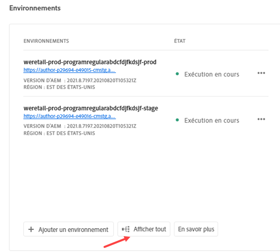

# Gérer les environnements {#managing-environments}

Découvrez les types d’environnements que vous pouvez créer et comment les créer pour votre projet Cloud Manager.

## Types d’environnement {#environment-types}

Un utilisateur disposant des autorisations requises peut créer les types d’environnement suivants (dans les limites de ce qui est disponible pour le client spécifique).

* **Production + Intermédiaire** - Les environnements de production et d’évaluation sont disponibles en une paire et sont utilisés à des fins de production et de test, respectivement. Effectuez des tests de performance et de sécurité dans un environnement intermédiaire. Celui-ci a la même taille que l’environnement de production.

* **Développement** - Un environnement de développement peut être créé à des fins de développement et de test et peut uniquement être associé à des pipelines hors production.  Les environnements de développement n’ont pas la même taille que les environnements de test et de production et ne doivent pas être utilisés pour effectuer des tests de performance et de sécurité.

* **Développement rapide** : un environnement de développement rapide (RDE) permet à l’équipe de développement de déployer et d’examiner rapidement les modifications. Cela permet de réduire le temps nécessaire pour tester les fonctionnalités qui fonctionnent dans un environnement de développement local. Pour plus d’informations sur l’utilisation d’un RDE, consultez la [documentation sur l’environnement de développement rapide](/help/implementing/developing/introduction/rapid-development-environments.md).

Les fonctionnalités de chaque environnement dépendent des solutions activées dans son [programme](/help/implementing/cloud-manager/getting-access-to-aem-in-cloud/program-types.md).

* [Sites](/help/overview/introduction.md)
* [Assets](/help/assets/overview.md)
* [Forms](/help/forms/home.md)
* [Screens](/help/screens-cloud/introduction/introduction.md)

>[!NOTE]
>
>Les environnements de production et d’évaluation ne sont créés que par paire. Vous ne pouvez pas créer uniquement un environnement d’évaluation ou de production.

## Ajouter un environnement {#adding-environments}

Pour ajouter ou modifier un environnement, un utilisateur doit être membre du rôle **Propriétaire de l’entreprise**.

1. Connectez-vous à Cloud Manager à l’adresse [my.cloudmanager.adobe.com](https://my.cloudmanager.adobe.com/) et sélectionnez l’organisation appropriée.

1. Dans la console **[Mes programmes](/help/implementing/cloud-manager/navigation.md#my-programs)**, cliquez sur le programme pour lequel vous souhaitez ajouter un environnement.

1. Sur la console **[Mes programmes](/help/implementing/cloud-manager/navigation.md#my-programs)**, cliquez sur **Ajouter un environnement** sur la carte **Environnements** pour ajouter un environnement.

   

   * L’option **Ajouter un environnement** est également disponible sur l’onglet  **Environnements**.

     

   * L’option **Ajouter un environnement** peut être désactivée en raison d’un niveau d’autorisation insuffisant ou de ressources sous licence.

1. Dans la boîte de dialogue **Ajouter un environnement** :

   * Sélectionnez un [**type d&#39;environnement**](#environment-types).
      * Le nombre d’environnements disponibles/utilisés est indiqué entre parenthèses derrière le nom du type d’environnement.
   * Entrez un **Nom** d’environnement.
      * Le nom de l’environnement ne peut pas être modifié une fois l’environnement créé.
   * Fournissez une **Description** de l’environnement.
   * Si vous ajoutez un environnement de **production et d’évaluation**, vous devez indiquer un nom et une description à l’environnement de production et à celui d’évaluation.
   * Sélectionnez une **Région principale** dans la liste déroulante.
      * La région principale ne peut plus être modifiée après sa création.
      * Selon vos droits disponibles, vous pouvez configurer [plusieurs zones](#multiple-regions).

   

1. Cliquez sur **Enregistrer** pour ajouter l’environnement spécifié.

L’écran **Aperçu** affiche désormais votre nouvel environnement dans la carte **Environnements**. Vous pouvez désormais configurer des pipelines pour votre nouvel environnement.

## Plusieurs zones de publication {#multiple-regions}

Un utilisateur ou utilisatrice ayant le rôle **Propriétaire de l’entreprise** peut configurer les environnements de production et d’évaluation afin d’inclure jusqu’à trois régions de publication supplémentaires en plus de la région principale. D’autres régions de publication peuvent améliorer la disponibilité. Consultez la [documentation sur les régions de publication supplémentaires](/help/operations/additional-publish-regions.md) pour plus d’informations.

>[!TIP]
>
>Vous pouvez utiliser l’[API Cloud Manager](https://developer.adobe.com/experience-cloud/cloud-manager/guides/api-usage/creating-programs-and-environments/#creating-aem-cloud-service-environments) pour interroger une liste actuelle des régions disponibles.

### Ajout de plusieurs zones de publication à un nouvel environnement {#add-regions}

Lorsque vous ajoutez un environnement, vous pouvez choisir de configurer des régions supplémentaires en plus de la région principale.

1. Sélectionnez la **région principale**.
   * La région principale ne peut pas être modifiée après la création de l’environnement.
1. Sélectionnez l’option **Ajout de zones de publication** pour afficher de nouvelles **Zones de publication supplémentaires**.
1. Dans le menu déroulant **Zones de publication supplémentaires**, sélectionnez une zone supplémentaire.
1. La zone géographique sélectionnée est ajoutée sous la liste déroulante pour indiquer sa sélection.
   * Sélectionnez le `X` en regard de la région sélectionnée afin de pouvoir la désélectionner.
1. Sélectionnez une autre zone géographique dans le menu déroulant **Zones de publication supplémentaires** pour ajouter une autre zone géographique.
1. Sélectionnez **Enregistrer** lorsque vous êtes prêt à créer votre environnement.

Les zones géographiques sélectionnées s’appliquent aux environnements de production et d’évaluation.

Si vous ne spécifiez aucune région supplémentaire, [vous pouvez le faire plus tard après la création des environnements](#edit-regions).

Si vous souhaitez configurer la variable [réseau avancé](/help/security/configuring-advanced-networking.md) pour le programme, il est recommandé de procéder à cette configuration avant d’ajouter aux environnements d’autres zones géographiques de publication à l’aide de l’API Cloud Manager. Sinon, le trafic des zones géographiques de publication supplémentaires passe par le proxy de la zone géographique principale.

### Modification de plusieurs zones de publication {#edit-regions}

Si vous n’avez initialement spécifié aucune zone géographique supplémentaire, vous pouvez le faire après la création des environnements si vous disposez des droits nécessaires.

Vous pouvez également supprimer d’autres zones géographiques de publication. Cependant, vous ne pouvez effectuer que l’action d’ajouter ou l’action de supprimer des zones géographiques dans une seule transaction. Si vous devez ajouter une zone géographique et en supprimer une, ajoutez-la d’abord, enregistrez votre modification, puis supprimez-la (ou inversement).

1. Dans la console Aperçu du programme de votre programme, cliquez sur le bouton représentant des points de suspension de votre environnement de production, puis sélectionnez **Modifier** dans le menu.

   

1. Dans la boîte de dialogue **Modifier l’environnement de production**, apportez les modifications nécessaires aux autres zones géographiques de publication.
   * Utilisez le menu déroulant **Zones de publication supplémentaires** pour sélectionner d’autres zones géographiques.
   * Cliquez sur le X en regard des zones géogaphiques de publication supplémentaires sélectionnées pour les désélectionner.

   

1. Sélectionnez **Enregistrer** pour enregistrer les modifications.

Les modifications apportées à l’environnement de production s’appliquent aux environnements de production et d’évaluation. Les modifications apportées à plusieurs zones géographiques de publication ne peuvent être modifiées que dans l’environnement de production.

Si vous souhaitez configurer la variable [réseau avancé](/help/security/configuring-advanced-networking.md) pour le programme, il est recommandé de procéder à cette configuration avant d’ajouter aux environnements des zones géographiques de publication supplémentaires. Sinon, le trafic des zones géographiques de publication supplémentaires passe par le proxy de la zone géographique principale.

## Détails de l’environnement {#viewing-environment}

Sur la page **Aperçu**, vous pouvez accéder aux détails d’un environnement de deux manières différentes.

1. Sur la page **Overview** , cliquez sur l’onglet **Environments** du panneau de navigation latéral.

   

   * Vous pouvez également cliquer sur le bouton **Tout afficher** dans la vignette **Environnements** pour accéder directement à l’onglet **Environnements**.

     

1. L’onglet **Environnements** ouvre et répertorie tous les environnements du programme.

   

1. Appuyez ou cliquez sur un environnement de la liste pour en afficher les détails.

   

Vous pouvez également cliquer sur le bouton représentant des points de suspension de l’environnement souhaité, puis sélectionner **Afficher les détails**.

>[!NOTE]
>
>La carte **Environnements** répertorie uniquement trois environnements. Cliquez sur **Tout afficher** comme décrit précédemment pour voir tous les environnements du programme.

### Accès au service de prévisualisation {#access-preview-service}

Cloud Manager fournit un service de prévisualisation (fourni en tant que service de publication supplémentaire) à chaque environnement AEM as a Cloud Service.

Le service vous permet de prévisualiser l’expérience finale d’un site web avant qu’il atteigne l’environnement de publication et soit disponible publiquement.

Lors de la création, une liste d’adresses IP autorisées par défaut est appliquée au service de prévisualisation, intitulée `Preview Default [<envId>]`, qui bloque tout le trafic vers le service de prévisualisation. Annulez l’application de la liste des adresses IP autorisée par défaut du service de prévisualisation afin que vous puissiez activer l’accès.

Les utilisateurs et utilisatrices disposant des autorisations requises doivent effectuer les étapes suivantes avant de partager l’URL du service de prévisualisation afin d’en assurer l’accès.

1. Créez une liste d’adresses IP autorisées appropriée, appliquez-la au service de prévisualisation et annulez immédiatement l’application de la liste autorisée `Preview Default [<envId>]`.

   * Consultez la section [Application et annulation de l’application de listes d’adresses IP autorisées](/help/implementing/cloud-manager/ip-allow-lists/apply-allow-list.md) pour plus d’informations.

1. Utilisez le workflow de mise à jour de la **liste d’adresses IP autorisées** pour supprimer l’adresse IP par défaut et ajouter la ou les adresses IP, le cas échéant. Consultez [Gestion des listes d’adresses IP autorisées](/help/implementing/cloud-manager/ip-allow-lists/managing-ip-allow-lists.md) pour en savoir plus.

Une fois l’accès au service de prévisualisation déverrouillé, l’icône de verrou devant le nom du service de prévisualisation ne s’affiche plus.

Une fois activé, vous pouvez publier du contenu dans le service d’aperçu à l’aide de l’interface utilisateur de gestion de la publication d’AEM. Consultez le document [Prévisualisation du contenu](/help/sites-cloud/authoring/sites-console/previewing-content.md) pour plus de détails.

>[!NOTE]
>
>Votre environnement doit utiliser la version AEM `2021.05.5368.20210529T101701Z` ou ultérieure pour utiliser le service d’aperçu. Vérifiez qu’un pipeline de mise à jour s’est correctement exécuté sur votre environnement afin de pouvoir utiliser le service de prévisualisation.

### État des régions de publication supplémentaires {#additional-region-status}

Si vous avez activé d’autres régions de publication, vous pouvez vérifier l’état de ces régions à partir de la carte **Environnements** .

1. Sur la page **Overview** , recherchez la carte **Environments** .

1. Sur la carte **Environments** , la colonne **Status** indique s’il existe des problèmes avec les régions de publication supplémentaires configurées. Cliquez sur l’icône **Informations** pour plus d’informations sur les régions.

   

Vous pouvez également accéder aux mêmes informations à partir de l’onglet **Environments**.

1. Sur la page **Overview** , sélectionnez l’onglet **Environments** .

1. Dans l’onglet **Environnements**, sélectionnez l’environnement que vous souhaitez interroger dans le panneau de navigation de gauche.

1. Une fois qu’un environnement est sélectionné :

   * La table **Informations sur l’environnement** indique les régions configurées pour l’environnement sélectionné.
   * La colonne **État** de la table **Segments d’environnement** reflète l’existence de problèmes avec les régions de publication supplémentaires configurées. Passez la souris sur l’état pour plus d’informations sur un problème.

   

Si des problèmes sont signalés avec des régions de publication supplémentaires :

1. Sois patient ! Cloud Manager tente continuellement de récupérer la région et elle peut être disponible à tout moment.
1. Si le problème persiste après plusieurs heures, vous pouvez supprimer la région de publication supplémentaire et la rajouter (la même région ou une autre) pour déclencher un déploiement complet.

La durée d’attente nécessaire pour que le système se remette seul avant d’entreprendre des actions supplémentaires dépend de l’impact de l’échec de cette région sur vos systèmes.

Dans tous les cas, le trafic [est toujours acheminé vers l’autre région la plus proche qui est en ligne ](/help/operations/additional-publish-regions.md). Si vous rencontrez toujours des problèmes, contactez l’assistance clientèle d’Adobe.

## Mise à jour des environnements {#updating-dev-environment}

En tant que service natif du cloud, les mises à jour de vos environnements de développement, d’évaluation et de production dans les programmes de production sont automatiquement gérées par Adobe.

Toutefois, les mises à jour apportées aux environnements dans les programmes Sandbox sont gérées dans les programmes . Lorsqu’un tel environnement n’exécute pas la dernière version d’AEM disponible pour le public, le statut sur la carte **Environnements** sur l’écran **Vue d’ensemble** du programme affiche **Mise à jour disponible**.

### Mises à jour et pipelines {#updates-pipelines}

Les pipelines sont le seul moyen de [déployer du code dans les environnements d’AEM as a Cloud Service](deploy-code.md). Pour cette raison, chaque pipeline est associé à une version d’AEM spécifique.

Si Cloud Manager détecte qu’une version d’AEM plus récente est disponible que celle qui a été déployée pour la dernière fois avec le pipeline, il affiche le statut **Mise à jour disponible** de l’environnement.

Le processus de mise à jour est donc un processus en deux étapes :

1. Mise à jour du pipeline avec la dernière version AEM
1. Exécution du pipeline pour déployer la nouvelle version d’AEM dans un environnement

### Mettre à jour vos environnements {#updating-your-environments}

>[!NOTE]
> Depuis 2024, les instances de développement et certains programmes Sandbox sont déjà automatiquement mis à jour. Il n’est donc plus nécessaire de gérer manuellement les mises à jour pour ces programmes. En raison de cette transition, l’option Mettre à jour manuellement l’environnement pour les instances de développement peut ne pas être disponible pour _une partie_ de vos programmes.

L’option **Mettre à jour** est disponible à partir de la carte **Environnements** pour certains environnements et environnements de développement dans les programmes Sandbox en cliquant sur le bouton représentant des points de suspension de l’environnement.

Cette option est également disponible en cliquant sur l’onglet **Environnements** du programme, puis en sélectionnant le bouton représentant des points de suspension de l’environnement.

Un utilisateur disposant du rôle **Responsable de déploiement** ou **Propriétaire de l’entreprise** peut utiliser cette option pour mettre à jour le pipeline associé à cet environnement vers la dernière version d’AEM.

Une fois que la version du pipeline est mise à jour vers la dernière version d’AEM disponible pour le public, l’utilisateur est invité à exécuter le pipeline associé pour déployer la dernière version dans l’environnement.

Le comportement de l’option **Mise à jour** varie en fonction de la configuration et du statut actuel du programme.

* Si le pipeline a déjà été mis à jour, l’option **Mettre à jour** invite l’utilisateur à exécuter le pipeline.
* Si le pipeline est déjà en cours de mise à jour, l’option **Mettre à jour** informe l’utilisateur qu’une mise à jour est déjà en cours d’exécution.
* Si aucun pipeline approprié n’existe, l’option **Mettre à jour** invite l’utilisateur à en créer un.

## Supprimez les environnements de développement {#deleting-environment}

Un utilisateur disposant du rôle **Responsable de déploiement** ou **Propriétaire de l’entreprise** peut supprimer un environnement de développement.

Dans l’écran **Vue d’ensemble** du programme dans la carte **Environnements**, cliquez sur le bouton représentant des points de suspension de l’environnement de développement que vous souhaitez supprimer.

L’option de suppression est également disponible dans l’onglet **Environnements** de la fenêtre **Aperçu** du programme. Cliquez sur le bouton représentant des points de suspension de l’environnement et sélectionnez **Supprimer**.

>[!NOTE]
>
>* Les environnements de production et d’évaluation créés dans un programme de production ne peuvent pas être supprimés.
>* Les environnements de production et d’évaluation d’un programme Sandbox peuvent être supprimés.

## Gérer l’accès {#managing-access}

Sélectionnez **Gérer l’accès** depuis le menu représentant des points de suspension de l’environnement dans la carte **Environnements**. Vous pouvez accéder directement à l’instance d’auteur et gérer l’accès pour votre environnement.

>[!TIP]
>
>Consultez le document [Profils de produits et équipe AEM as a Cloud Service](/help/onboarding/aem-cs-team-product-profiles.md) pour découvrir comment l’équipe et les profils de produits AEM as a Cloud Service peuvent accorder et limiter l’accès à vos solutions Adobe sous licence.

## Accès à Developer Console {#accessing-developer-console}

Sélectionnez la **Developer Console** depuis le menu représentant des points de suspension de l’environnement dans la carte **Environnements**. Un nouvel onglet s’ouvre dans votre navigateur avec la page de connexion à **Developer Console**.

Seul un utilisateur ou une utilisatrice possédant le rôle de **développeur** aura accès à la **Developer Console**. L’exception concerne les programmes sandbox, où tout utilisateur ou toute utilisatrice ayant accès au programme sandbox aura accès à **Developer Console**.

Pour plus d’informations, consultez [Mise en veille et réactivation d’environnements Sandbox](https://experienceleague.adobe.com/docs/experience-manager-cloud-service/content/implementing/using-cloud-manager/programs/introduction-sandbox-programs.html?lang=fr#hibernation).

Cette option est également disponible à partir de l’onglet **Environnement** de la fenêtre **Aperçu** lorsque vous cliquez sur le menu représentant des points de suspension d’un environnement individuel.

## Connexion locale {#login-locally}

Sélectionnez **Connexion locale** dans le menu de points de suspension de l’environnement dans la carte **Environnements** pour vous connecter localement à Adobe Experience Manager.

De plus, vous pouvez vous connecter localement à partir de l’onglet **Environnements** de la page **Vue d’ensemble**.

## Gestion des noms de domaine personnalisés {#manage-cdn}

Les noms de domaine personnalisés sont pris en charge dans Cloud Manager pour les programmes Sites pour les services de publication et de prévisualisation.

>[!TIP]
>
>Pour plus d’informations, voir [Présentation des noms de domaine personnalisés](/help/implementing/cloud-manager/custom-domain-names/introduction.md).

## Gérer les listes d’adresses IP autorisées {#manage-ip-allow-lists}

Les listes d’adresses IP autorisées sont prises en charge dans Cloud Manager pour les services de création, de publication et de prévisualisation pour les programmes Sites.

Pour gérer les listes d’adresses IP autorisées, accédez à l’onglet **Environnements** de la page **Vue d’ensemble** de votre programme. Cliquez sur un environnement pour en gérer les détails.

### Appliquer une Liste autorisée IP {#apply-ip-allow-list}

L’application d’une liste autorisée IP associe toutes les plages d’adresses IP incluses dans la définition de la liste autorisée à un service de création ou de publication dans un environnement.

>[!TIP]
>
>Pour plus d’informations, voir [Présentation des Listes autorisées IP](/help/implementing/cloud-manager/ip-allow-lists/introduction.md).
