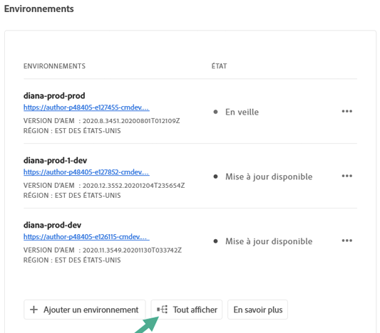
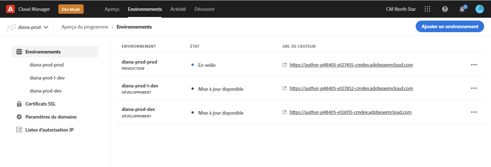
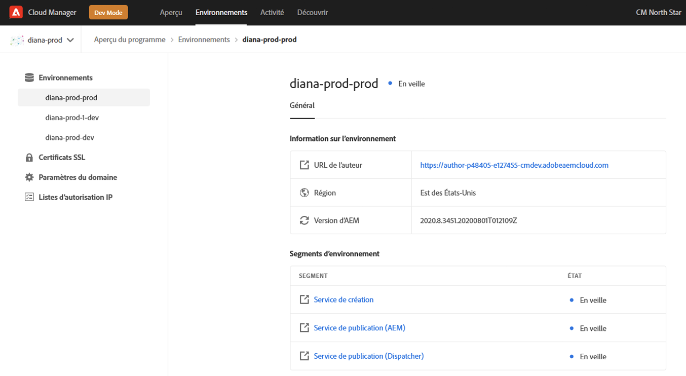
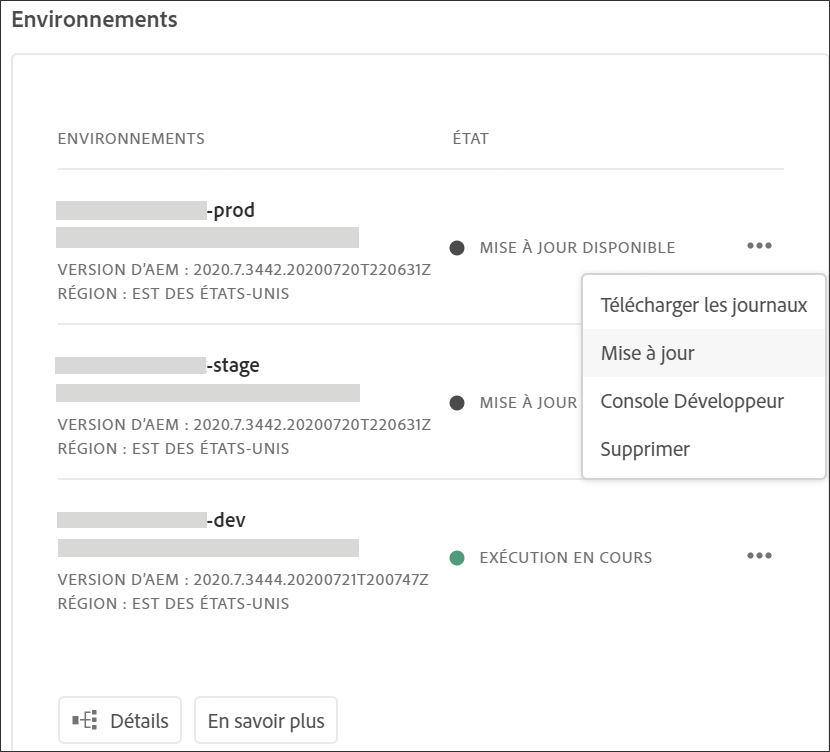
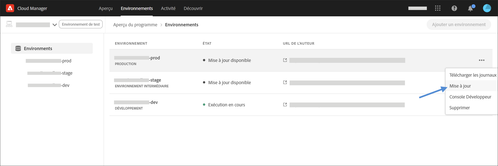
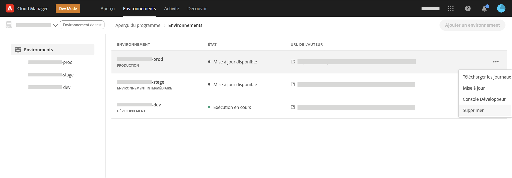
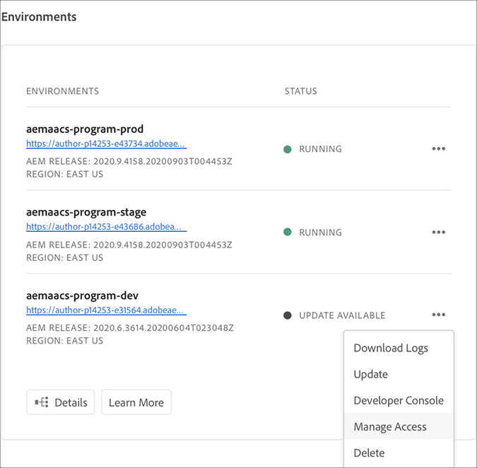
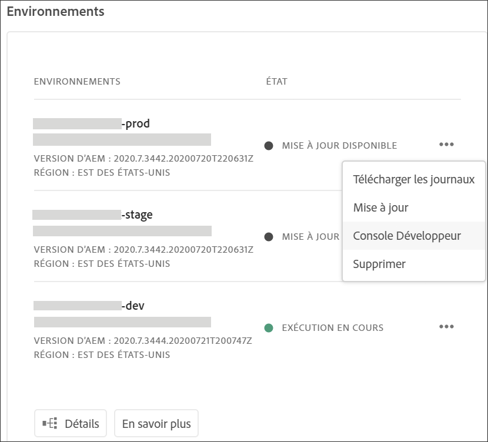

# Gestion des environnements {#manage-environments}

La section suivante décrit les types d’environnement qu’un utilisateur peut créer et comment cet utilisateur peut créer un environnement.

## Types d’environnement {#environment-types}

Un utilisateur disposant des autorisations requises peut créer les types d’environnement suivants (dans les limites de ce qui est disponible pour le client spécifique).

* **Environnement de production et de test** : les environnements de production et de test sont disponibles en duo et sont utilisés à des fins de test et de production.

* **Développement** : un environnement de développement peut être créé à des fins de développement et de test et sera associé uniquement aux pipelines qui ne sont pas en production.

   >[!NOTE]
   >Un environnement de développement créé automatiquement dans un programme Sandbox sera configuré pour inclure les solutions Sites et Assets.

   Le tableau suivant récapitule les types d’environnement et leurs attributs :

   | Nom | Niveau de création | Niveau de publication | L’utilisateur peut créer | L’utilisateur peut supprimer | Pipeline pouvant être associé à l’environnement |
   |--- |--- |--- |--- |---|---|
   | Production | Oui | Oui si Sites est inclus | Oui | Non | Pipeline de production |
   | Scène | Oui | Oui si Sites est inclus | Oui | Non | Pipeline de production |
   | Développement | Oui | Oui si Sites est inclus | Oui | Oui | Pipeline hors production |

   >[!NOTE]
   >La production et le test sont disponibles en duo et sont utilisés à des fins de test et de production. L’utilisateur ne pourra pas créer uniquement un environnement de production ou de test.

## Environnement Ajoutant {#adding-environments}

1. Cliquez sur **Ajouter un environnement** pour ajouter un environnement. Ce bouton sera accessible à l’aide de l’écran **Environnements**.
   

   L’option **Ajouter un environnement** est également disponible sur la carte **Environnements** lorsqu’il n’y a aucun environnement dans le programme.

   

   >[!NOTE]
   >L’option **Ajouter un environnement** sera désactivée en raison de l’absence d’autorisations ou de conditions contractuelles.

1. La boîte de dialogue **Ajouter un environnement** s’affiche. L’utilisateur doit ajouter des détails tels que le **type d’environnement**, **nom de l’environnement** et la **description de l’environnement** (selon l’objectif de l’utilisateur lors de la création de l’environnement dans les limites de ce qui est disponible pour le client spécifique).

   

   >[!NOTE]
   >Lors de la création d’un environnement, une ou plusieurs *intégrations* sont créées dans les E/S Adobe. Elles sont visibles par les utilisateurs clients qui ont accès à la console d’E/S Adobe et ne doivent pas être supprimées. Cette suppression est déconseillée dans la description de la console d’E/S Adobe.

   

1. Cliquez sur **Enregistrer** pour ajouter un environnement avec les critères renseignés. Désormais, l’écran *Aperçu* affiche la carte à partir de laquelle vous pouvez configurer votre pipeline.

   >[!NOTE]
   >Si vous n’avez pas encore configuré votre pipeline hors production, l’écran *Aperçu* affiche la carte d’où vous pouvez créer votre pipeline hors production.

## Affichage de l’Environnement {#viewing-environment}

La carte **Environnements** de la page Aperçu liste jusqu’à trois environnements.

1. Cliquez sur le bouton **Afficher tout** pour accéder à la page de résumé de l’ **Environnement** et vue d’un tableau avec une liste complète d’environnements.

   

1. La page **Environnements** affiche la liste de tous les environnements existants.

   

1. Sélectionnez l&#39;un des environnements de la liste à la vue des détails de l&#39;environnement.

   

## Mise à jour de l’environnement {#updating-dev-environment}

Les mises à jour des environnements Test et Production sont gérées automatiquement par Adobe.

Les mises à jour des environnements de développement sont gérées par les utilisateurs du programme. Lorsqu’un environnement n’exécute pas la dernière version d’AEM disponible pour le public, l’état de la carte Environnements sur l’écran d’accueil affiche **MISE À JOUR DISPONIBLE**.

L’option **Mettre à jour** est disponible à partir de la carte **Environnements**.
Cette option est également disponible si vous cliquez sur **Détails** dans la carte **Environnements**. La page **Environnements** s’ouvre. Une fois que vous avez sélectionné l’environnement de développement, cliquez sur **...** et sélectionnez **Mettre à jour**, comme illustré dans la figure ci-dessous :

Si vous sélectionnez cette option, un gestionnaire de déploiement pourra mettre à jour le pipeline associé à cet environnement vers la dernière version, puis exécuter le pipeline.

Si le pipeline a déjà été mis à jour, l’utilisateur est invité à exécuter le pipeline.

## Suppression d’un environnement {#deleting-environment}

Un utilisateur disposant des autorisations requises peut supprimer un environnement de développement.

L’option **Supprimer** est disponible dans le menu déroulant de la carte **Environnements.** Cliquez sur **...** pour un environnement de développement que vous souhaitez supprimer.

L’option de suppression est également disponible si vous cliquez sur **Détails** dans la carte **Environnements**. La page **Environnements** s’ouvre. Une fois que vous avez sélectionné l’environnement de développement, cliquez sur **...** et sélectionnez **Supprimer**, comme illustré dans la figure ci-dessous :

>[!NOTE]
>
>Cette fonction n’est pas disponible pour l’environnement de production/d’évaluation défini dans une configuration de programme normale à des fins de production. Cette fonction est toutefois disponible pour les environnements de production/d’évaluation dans un programme Sandbox.

## Managing Access {#managing-access}

Select **Manage Access** from the dropdown menu in the **Environments** Card. Vous pouvez accéder directement à l’instance d’auteur et gérer l’accès pour votre environnement.

Consultez [Gestion de l’accès à l’instance](/help/onboarding/getting-access-to-aem-in-cloud/navigation.md#manage-access-aem) d’auteur pour en savoir plus.

## Accès à Developer Console {#accessing-developer-console}

Sélectionnez **Developer Console** dans le menu déroulant de la carte **Environnements**. Un nouvel onglet s’ouvre alors dans votre navigateur, contenant la page de connexion à **Developer Console**.

Seul un utilisateur possédant le rôle de développeur aura accès à **Developer Console**. L’exception concerne les programmes Sandbox, où tout utilisateur ayant accès au programme Cloud Manager Sandbox aura accès à **Developer Console**.

Pour plus d’informations, voir [Mise en hibernation et déshibernation des environnements Sandbox](https://docs.adobe.com/content/help/fr-FR/experience-manager-cloud-service/onboarding/getting-access/cloud-service-programs/sandbox-programs.html#hibernating-introduction).

Cette option est également disponible si vous cliquez sur **Détails** dans la carte **Environnements**. La page **Environnements** s’ouvre. Une fois que vous avez sélectionné un environnement, cliquez sur **...** et sélectionnez **Console développeur**.

## Connexion locale {#login-locally}

Sélectionnez Connexion **** locale dans le menu déroulant de la carte des **Environnements** pour vous connecter localement à Adobe Experience Manager.

De plus, vous pouvez vous connecter localement à partir de la page de résumé des **Environnements** .

