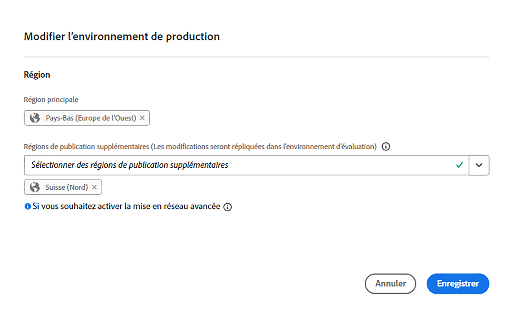

# Gérer les environnements {#managing-environments}

Découvrez les types d’environnements que vous pouvez créer et comment les créer pour votre projet Cloud Manager.

## Types d’environnement {#environment-types}

Un utilisateur disposant des autorisations requises peut créer les types d’environnement suivants (dans les limites de ce qui est disponible pour le client spécifique).

| Type d’environnement | Description |
| --- | --- |
| **Production + Évaluation** | Les environnements de production et d’évaluation sont disponibles par paire et sont utilisés respectivement à des fins de production et de test. Effectuez des tests de performance et de sécurité sur l’environnement d’évaluation. Celui-ci a la même taille que l’environnement de production. |
| **Développement** | Un environnement de développement peut être créé à des fins de développement et de test et sera associé uniquement aux pipelines qui ne sont pas en production. Les environnements de développement n’ont pas la même taille que les environnements de test et de production et ne doivent pas être utilisés pour effectuer des tests de performance et de sécurité. |
| **Développement rapide** | Un environnement de développement rapide (RDE) permet aux développeurs de déployer et d’examiner rapidement les modifications. Cette fonctionnalité réduit le temps nécessaire pour tester les fonctionnalités qui ont déjà été validées dans un environnement de développement local. Pour plus d’informations sur l’utilisation d’un RDE, consultez la [documentation sur l’environnement de développement rapide](/help/implementing/developing/introduction/rapid-development-environments.md). |
| **Environnement de test spécialisé** | Les environnements de test spécialisés offrent un espace dédié pour valider les fonctionnalités dans des conditions de quasi-production, idéal pour les tests de résistance et les contrôles avancés avant déploiement. Voir [Ajout d’un environnement de test spécialisé](/help/implementing/cloud-manager/specialized-test-environment.md) |

<!-- 
>[!NOTE]
>
>The **Specialized Testing Environment** feature is currently available only through the private beta program. To sign up for the private beta, see [Specialized Testing Environment](/help/implementing/cloud-manager/release-notes/current.md#specialized-test-environment).
-->

Les fonctionnalités de chaque environnement dépendent des solutions activées dans le [programme](/help/implementing/cloud-manager/getting-access-to-aem-in-cloud/program-types.md) de l’environnement.

* [Sites](/help/overview/introduction.md)
* [Assets](/help/assets/overview.md)
* [Forms](/help/forms/home.md)
* [Screens](/help/screens-cloud/introduction/introduction.md)

>[!NOTE]
>
>Les environnements de production et d’évaluation ne sont créés que par paire. Vous ne pouvez pas créer d’environnement de production uniquement ou d’évaluation uniquement.

## Ajout d’un environnement {#adding-environments}

Pour ajouter ou modifier un environnement, un utilisateur doit disposer du rôle **Propriétaire de l’entreprise**.

**Pour ajouter un environnement, procédez comme suit**

1. Connectez-vous à Cloud Manager à l’adresse [my.cloudmanager.adobe.com](https://my.cloudmanager.adobe.com/) et sélectionnez l’organisation appropriée.

1. Sur la console **[Mes programmes](/help/implementing/cloud-manager/navigation.md#my-programs)**, cliquez sur le programme pour lequel vous souhaitez ajouter un environnement.

1. Utilisez l’une des méthodes suivantes :

   Si l’option **Ajouter un environnement** est grisée (désactivée), cela peut être dû à un manque d’autorisations ou à une dépendance aux ressources sous licence.

   * Sur la console **[Mes programmes](/help/implementing/cloud-manager/navigation.md#my-programs)**, sur la carte **Environnements**, cliquez sur **Ajouter un environnement**.

   

   * Sur le panneau de gauche, cliquez sur  **Environnements**, puis sur la page Environnements, près du coin supérieur droit, cliquez sur **Ajouter un environnement**.

     

1. Dans la boîte de dialogue **Ajouter un environnement**, procédez comme suit :

   * Sélectionnez un [**type d’environnement**](#environment-types). Le nombre d’environnements disponibles/utilisés est indiqué entre parenthèses derrière le nom du type d’environnement.
   * Fournissez un environnement **Nom**. Le nom de l’environnement ne peut pas être modifié une fois l’environnement créé.
   * Ajoutez une **Description** de l’environnement (facultatif).
   * Si vous ajoutez un environnement de **production et d’évaluation**, vous devez indiquer un nom et une description à l’environnement de production et à celui d’évaluation.
   * Sélectionnez une région de Principal **&#x200B;**&#x200B;dans la liste déroulante. La région principale ne peut pas être modifiée après la création. En outre, en fonction des droits disponibles, vous pouvez configurer [plusieurs régions](#multiple-regions).

   

1. Cliquez sur **Enregistrer**.

La page **Aperçu** affiche désormais votre nouvel environnement dans la vignette **Environnements**. Vous pouvez désormais configurer des pipelines pour votre nouvel environnement.

## Plusieurs régions de publication {#multiple-regions}

Un utilisateur ou utilisatrice ayant le rôle **Propriétaire de l’entreprise** peut configurer les environnements de production et d’évaluation afin d’inclure jusqu’à trois régions de publication supplémentaires en plus de la région principale. D’autres régions de publication peuvent améliorer la disponibilité. Consultez la [documentation sur les régions de publication supplémentaires](/help/operations/additional-publish-regions.md) pour plus d’informations.

>[!TIP]
>
>Vous pouvez utiliser l’[API Cloud Manager](https://developer.adobe.com/experience-cloud/cloud-manager/guides/api-usage/creating-programs-and-environments/#creating-aem-cloud-service-environments) pour interroger une liste actuelle des régions disponibles.

### Ajouter plusieurs régions de publication à un nouvel environnement {#add-regions}

Lorsque vous ajoutez un environnement, vous pouvez choisir de configurer des régions supplémentaires en plus de la région principale.

1. Sélectionnez la **région principale**.
   * La région principale ne peut pas être modifiée après la création de l’environnement.
1. Sélectionnez l’option **Ajout de zones de publication** pour afficher de nouvelles **Zones de publication supplémentaires**.
1. Dans le menu déroulant **Zones de publication supplémentaires**, sélectionnez une zone supplémentaire.
1. La zone géographique sélectionnée est ajoutée sous la liste déroulante pour indiquer sa sélection.
   * Sélectionnez la `X` en regard de la région sélectionnée pour pouvoir la désélectionner.
1. Sélectionnez une autre zone géographique dans le menu déroulant **Zones de publication supplémentaires** pour ajouter une autre zone géographique.
1. Sélectionnez **Enregistrer** lorsque vous êtes prêt à créer votre environnement.

Les zones géographiques sélectionnées s’appliquent aux environnements de production et d’évaluation.

Si vous ne spécifiez aucune région supplémentaire, [vous pouvez le faire ultérieurement, une fois les environnements créés](#edit-regions).

Si vous souhaitez configurer la variable [réseau avancé](/help/security/configuring-advanced-networking.md) pour le programme, il est recommandé de procéder à cette configuration avant d’ajouter aux environnements d’autres zones géographiques de publication à l’aide de l’API Cloud Manager. Sinon, le trafic des zones géographiques de publication supplémentaires passe par le proxy de la zone géographique principale.

### Modification de plusieurs régions de publication {#edit-regions}

Si vous n’avez pas spécifié de régions supplémentaires au départ, vous pouvez le faire après la création de l’environnement et vous disposez des droits nécessaires.

Vous pouvez également supprimer d’autres zones géographiques de publication. Cependant, vous ne pouvez ajouter ou supprimer des régions que dans une seule transaction. Si vous devez ajouter une zone géographique et en supprimer une, ajoutez-la d’abord, enregistrez votre modification, puis supprimez-la (ou inversement).

1. Dans la console Aperçu du programme de votre programme, cliquez sur  pour votre environnement de production et sélectionnez **Modifier** dans le menu.

   

1. Dans la boîte de dialogue **Modifier l’environnement de production**, apportez les modifications nécessaires aux autres zones géographiques de publication.
   * Utilisez le menu déroulant **Zones de publication supplémentaires** pour sélectionner d’autres zones géographiques.
   * Cliquez sur le X en regard des zones géogaphiques de publication supplémentaires sélectionnées pour les désélectionner.

   

1. Sélectionnez **Enregistrer** pour enregistrer les modifications.

Les modifications apportées à l’environnement de production s’appliquent aux environnements de production et d’évaluation. Les modifications apportées à plusieurs zones géographiques de publication ne peuvent être modifiées que dans l’environnement de production.

Si vous souhaitez configurer la variable [réseau avancé](/help/security/configuring-advanced-networking.md) pour le programme, il est recommandé de procéder à cette configuration avant d’ajouter aux environnements des zones géographiques de publication supplémentaires. Sinon, le trafic des zones géographiques de publication supplémentaires passe par le proxy de la zone géographique principale.

## Affichage des détails d’un environnement {#viewing-environment}

1. Connectez-vous à Cloud Manager à l’adresse [my.cloudmanager.adobe.com](https://my.cloudmanager.adobe.com/) et sélectionnez l’organisation appropriée.

1. Sur la console **[Mes programmes](/help/implementing/cloud-manager/navigation.md#my-programs)**, cliquez sur le programme pour lequel vous souhaitez afficher les détails d’un environnement.

1. Répertoriez tous les environnements du programme en effectuant l’une des opérations suivantes :

   * Dans le menu de gauche, sous **Services**, cliquez sur  **Environnements**.

   

   * Dans le menu de gauche, sous **Programme**, cliquez sur **Aperçu**, puis, dans la vignette **Environnements**, cliquez sur  **Tout afficher**.

     

   >[!NOTE]
   >
   >La carte **Environnements** répertorie uniquement trois environnements. Cliquez sur **Tout afficher** dans la carte pour afficher *tous* les environnements du programme.

1. Sur la page Environnements , effectuez l’une des opérations suivantes :

   * Cliquez sur un environnement de la liste pour en afficher les détails.

   

   * Cliquez sur  de l’environnement souhaité, puis sur **Afficher les détails**.

   

## Restaurer le contenu d’un environnement {#restore-environment}

Voir [Restaurer du contenu dans AEM as a Cloud Service](/help/operations/restore.md).

## Restaurer le code précédemment déployé {#restore-previous-code-deployed}

Voir [Restaurer le code précédemment déployé dans AEM as a Cloud Service](/help/operations/restore-previous-code-deployed.md).

### Accès au service d’aperçu {#access-preview-service}

Cloud Manager fournit un service de prévisualisation (fourni en tant que service de publication supplémentaire) à chaque environnement AEM as a Cloud Service.

Le service vous permet de prévisualiser l’expérience finale d’un site web avant qu’il atteigne l’environnement de publication et soit disponible publiquement.

Lors de la création, une liste d’adresses IP autorisées par défaut est appliquée au service de prévisualisation, intitulée `Preview Default [<envId>]`, qui bloque tout le trafic vers le service de prévisualisation. Annulez l’application de la liste des adresses IP autorisée par défaut du service de prévisualisation afin que vous puissiez activer l’accès.

Un utilisateur disposant des autorisations requises doit effectuer les étapes suivantes avant de partager l’URL du service d’aperçu pour en assurer l’accès.

1. Créez une Liste autorisée place sur la liste autorisée IP appropriée, appliquez-la au service d’aperçu et annulez immédiatement l’application de la `Preview Default [<envId>]`.

   Voir [&#x200B; Application et annulation de l’application de Listes autorisées IP &#x200B;](/help/implementing/cloud-manager/ip-allow-lists/apply-allow-list.md) pour plus d’informations.

1. Utilisez le workflow de mise à jour **Liste autorisée IP** pour supprimer l’adresse IP par défaut et ajouter les adresses IP nécessaires. Voir [Gérer les Listes autorisées IP](/help/implementing/cloud-manager/ip-allow-lists/managing-ip-allow-lists.md) pour en savoir plus.

Une fois l’accès au service d’aperçu déverrouillé, l’icône de verrouillage devant le nom du service d’aperçu ne s’affiche plus.

Une fois activé, vous pouvez publier du contenu dans le service d’aperçu à l’aide de l’interface utilisateur **`Manage Publication`** d’AEM. Voir [Prévisualisation du contenu](/help/sites-cloud/authoring/sites-console/previewing-content.md) pour plus d’informations.

>[!NOTE]
>
>Votre environnement doit utiliser la version AEM `2021.05.5368.20210529T101701Z` ou ultérieure pour utiliser le service d’aperçu. Vérifiez qu’un pipeline de mise à jour s’est correctement exécuté sur votre environnement afin de pouvoir utiliser le service de prévisualisation.

### Statut des régions de publication supplémentaires {#additional-region-status}

Si vous avez activé des régions de publication supplémentaires, vous pouvez vérifier le statut de ces régions à partir de la carte **Environnements**.

1. Sur la page **Aperçu**, recherchez la vignette **Environnements**.

1. Sur la vignette **Environnements**, la colonne **Statut** indique s’il existe des problèmes avec les régions de publication supplémentaires configurées. Cliquez sur l’icône **Info** pour afficher les détails des régions.

   

Vous pouvez également accéder aux mêmes informations à partir de l’onglet **Environnements**.

1. Sur la page **Aperçu**, cliquez sur  **environnements**.

1. Sur la page **Environnements**, sélectionnez l’environnement sur lequel effectuer la requête dans le menu de gauche.

1. Une fois l’environnement sélectionné :

   * Le tableau **Informations sur l’environnement** indique les régions configurées pour l’environnement sélectionné.
   * La colonne **Statut** du tableau **Segments d’environnement** indique s’il existe des problèmes avec les régions de publication supplémentaires configurées. Passez la souris sur le statut pour afficher les détails du problème.

   

Si des problèmes sont signalés avec d’autres régions de publication, veuillez patienter. Cloud Manager tente continuellement de récupérer la région et elle peut être disponible à tout moment. Si le problème persiste au bout de plusieurs heures, vous pouvez supprimer la zone géographique de publication supplémentaire et la rajouter (dans la même zone géographique ou dans une autre) pour déclencher un déploiement complet.

La durée pendant laquelle vous attendez que le système se rétablisse de lui-même avant de prendre des mesures supplémentaires dépend de l’impact de la défaillance de cette région sur vos systèmes.

Quoi qu’il en soit, [le trafic est toujours acheminé vers la région en ligne la plus proche](/help/operations/additional-publish-regions.md). Si les problèmes persistent, contactez l’assistance clientèle d’Adobe.

## Mettre à jour les environnements {#updating-dev-environment}

En tant que service natif du cloud, Adobe gère automatiquement les mises à jour de vos environnements de développement, d’évaluation et de production dans les programmes de production.

Toutefois, les mises à jour apportées aux environnements dans les programmes Sandbox sont gérées dans les programmes. Lorsqu’un tel environnement n’exécute pas la dernière version d’AEM disponible pour le public, le statut sur la carte **Environnements** sur l’écran **Vue d’ensemble** du programme affiche **Mise à jour disponible**.

### Mises à jour et pipelines {#updates-pipelines}

Les pipelines sont le seul moyen de [déployer le code dans les environnements d’AEM as a Cloud Service](deploy-code.md). Pour cette raison, chaque pipeline est associé à une version d’AEM spécifique.

Lorsque Cloud Manager détecte une version d’AEM plus récente que la dernière déployée avec le pipeline, il affiche le statut **Mise à jour disponible** de l’environnement.

Le processus de mise à jour est donc un processus en deux étapes :

1. Mise à jour du pipeline avec la dernière version AEM
1. Exécution du pipeline pour déployer la nouvelle version d’AEM dans un environnement

### Mise à jour des environnements {#updating-your-environments}

>[!NOTE]
> Depuis 2024, les instances de développement et certains programmes Sandbox sont automatiquement mis à jour. Il n’est donc pas nécessaire de gérer les mises à jour manuellement pour ces instances. Suite à cette transition, l’option Mise à jour manuelle de l’environnement pour les instances de développement peut ne pas être disponible pour _certains_ de vos programmes.

L’option **Mettre à jour** est disponible sur la carte **Environnements** pour des environnements de développement et des sandbox spécifiques. Cliquez sur  en regard de l’environnement pour accéder à **Mise à jour**.

Cette option est également disponible en cliquant sur l’onglet **Environnements** du programme, puis sur l’icône  de l’environnement.

Un utilisateur avec le rôle **Responsable de déploiement** ou **Propriétaire de l’entreprise** peut utiliser cette option pour mettre à jour le pipeline associé à cet environnement vers la dernière version d’AEM.

Une fois que la version du pipeline est mise à jour vers la dernière version d’AEM disponible pour le public, l’utilisateur est invité à exécuter le pipeline associé pour déployer la dernière version dans l’environnement.

Le comportement de l’option **Mise à jour** varie en fonction de la configuration et du statut actuel du programme.

| État | L’option Mettre à jour... |
| --- | --- |
| Le pipeline a déjà été mis à jour | invite l’utilisateur à exécuter le pipeline. |
| Le pipeline est déjà mis à jour. | informe l’utilisateur qu’une mise à jour est déjà en cours d’exécution. |
| Le pipeline n’existe pas | invite l’utilisateur à en créer un. |

## Supprimez les environnements de développement {#deleting-environment}

Un utilisateur doté du rôle **Responsable de déploiement** ou **Propriétaire de l’entreprise** peut supprimer un environnement de développement.

Dans l’écran **Aperçu** du programme dans la carte **Environnements**, cliquez sur  de l’environnement de développement à supprimer.

L’option **Supprimer** est également disponible à partir de l’onglet **Environnements** de la fenêtre **Aperçu** du programme. Cliquez sur l’icône  de l’environnement et sélectionnez **Supprimer**.

>[!NOTE]
>
>* Les environnements de production et d’évaluation créés dans un programme de production ne peuvent pas être supprimés.
>* Les environnements de production et d’évaluation d’un programme Sandbox peuvent être supprimés.

## Gérer l’accès {#managing-access}

Sélectionnez **Gérer l’accès** depuis le menu représentant des points de suspension de l’environnement dans la carte **Environnements**. Vous pouvez accéder directement à l’instance de création et gérer l’accès pour votre environnement.

>[!TIP]
>
>Voir [Équipe AEM as a Cloud Service et profils de produits](/help/onboarding/aem-cs-team-product-profiles.md) pour découvrir comment l’équipe AEM as a Cloud Service et les profils de produits peuvent accorder et limiter l’accès à vos solutions Adobe sous licence.

## Accès à la Developer Console {#accessing-developer-console}

1. Dans la vignette **Environnement**, cliquez sur , puis sur **Developer Console**.

Un nouvel onglet s’ouvre dans votre navigateur avec la page de connexion à **Developer Console**.

Seul un utilisateur ou une utilisatrice possédant le rôle de **développeur** aura accès à la **Developer Console**. Toutefois, pour les programmes Sandbox, tout utilisateur ayant accès au programme Sandbox a accès à **Developer Console**.

Pour plus d’informations, consultez [Mise en veille et réactivation d’environnements Sandbox](https://experienceleague.adobe.com/fr/docs/experience-manager-cloud-service/content/implementing/using-cloud-manager/programs/introduction-sandbox-programs#hibernation).

Cette option est également disponible à partir de l’onglet **Environnement** de la fenêtre **Aperçu** lorsque vous cliquez sur l’icône  d’un environnement individuel.

## Connexion locale {#login-locally}

1. Utilisez l’une des méthodes suivantes :

   * Dans la vignette **Environnement**, cliquez sur , puis sur **Connexion locale**.

     

   * Dans le panneau de gauche, cliquez sur  **environnements**. Sur la page **Environnements**, cliquez sur , puis sur **Connexion locale**.

     

## Gestion des noms de domaine personnalisés {#manage-cdn}

Les noms de domaine personnalisés sont pris en charge dans Cloud Manager pour les programmes Sites pour les services de publication et de prévisualisation.

>[!TIP]
>
>Pour plus d’informations, voir [Présentation des noms de domaine personnalisés](/help/implementing/cloud-manager/custom-domain-names/introduction.md).

## Gérer les listes d’adresses IP autorisées {#manage-ip-allow-lists}

Une Liste autorisée IP est prise en charge dans Cloud Manager pour les services de création, de publication et de prévisualisation des programmes Sites.

Pour gérer les Listes autorisées IP, accédez à la page  **Environnements** de la page **Aperçu** de votre programme. Cliquez sur un environnement pour en gérer les détails.

### Application d’une Liste autorisée IP {#apply-ip-allow-list}

L’application d’une Liste autorisée IP associe toutes les plages d’adresses IP définies à un service de création ou de publication dans l’environnement.

>[!TIP]
>
>Pour plus d’informations, voir [&#x200B; Présentation des Listes autorisées IP &#x200B;](/help/implementing/cloud-manager/ip-allow-lists/introduction.md).
