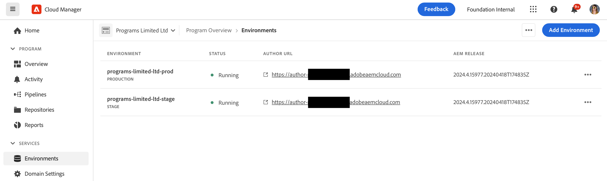

# Gestion des environnements {#managing-environments}

Découvrez les types d’environnements que vous pouvez créer et comment les créer pour votre projet Cloud Manager.

## Types d’environnement {#environment-types}

Un utilisateur disposant des autorisations requises peut créer les types d’environnement suivants (dans les limites de ce qui est disponible pour le client spécifique).

* **Production et évaluation** - Les environnements de production et d’évaluation sont disponibles sous la forme d’une paire et sont utilisés à des fins de production et de test, respectivement.

* **Développement** - Un environnement de développement peut être créé à des fins de développement et de test et peut uniquement être associé à des pipelines hors production.

Les fonctionnalités de chaque environnement dépendent des solutions activées dans le conteneur . [programme.](/help/implementing/cloud-manager/getting-access-to-aem-in-cloud/program-types.md)

* [Sites](/help/sites-cloud/home.md)
* [Assets](/help/assets/home.md)
* [Formulaires](/help/forms/home.md)
* [Screens](/help/screens-cloud/home.md)

>[!NOTE]
>
>Les environnements de production et d’évaluation ne sont créés qu’en tant que paire. Vous ne pouvez pas créer uniquement un environnement intermédiaire ou un environnement de production.

## Ajout d’un environnement {#adding-environments}

1. Connectez-vous à Cloud Manager à l’adresse [my.cloudmanager.adobe.com](https://my.cloudmanager.adobe.com/) et sélectionnez l’organisation appropriée.

1. Cliquez sur le programme pour lequel vous souhaitez ajouter un environnement.

1. Dans la **Aperçu du programme** page, cliquez sur **Ajouter un environnement** sur le **Environnements** pour ajouter un environnement.

   

   * Le **Ajouter un environnement** est également disponible sur la **Environnements** .

      

   * Le **Ajouter un environnement** peut être désactivée en raison d’un manque d’autorisations ou en fonction des ressources sous licence.

1. Dans le **Ajouter un environnement** qui s’affiche :

   * Sélectionnez une **Type d’environnement**.
      * Le nombre d’environnements disponibles/utilisés est indiqué entre parenthèses derrière le type Environnement de développement .
   * Fournissez un **Nom de l’environnement**.
   * Fournissez un **Description de l’environnement**.
   * Sélectionnez une **Région du cloud**.

   

1. Cliquez sur **Enregistrer** pour ajouter l’environnement spécifié.

Le **Présentation** affiche désormais votre nouvel environnement dans la **Environnements** carte. Vous pouvez désormais configurer des pipelines pour votre nouvel environnement.

## Détails de l’environnement {#viewing-environment}

Vous pouvez utiliser la variable **Environnements** sur la page d’aperçu pour accéder aux détails d’un environnement de deux manières.

1. Dans la **Présentation** , cliquez sur le bouton **Environnements** dans la partie supérieure de l’écran.

   

   * Vous pouvez également cliquer sur le bouton **Tout afficher** sur le bouton **Environnements** pour accéder directement à la **Environnements** .

      

1. Le **Environnements** ouvre et répertorie tous les environnements du programme.

   

1. Cliquez sur un environnement de la liste pour en afficher les détails.

   

Vous pouvez également cliquer sur le bouton représentant des points de suspension de l’environnement souhaité, puis sélectionner **Afficher les détails**.

>[!NOTE]
>
>Le **Environnements** carte répertorie uniquement trois environnements. Cliquez sur le bouton **Tout afficher** comme décrit précédemment pour voir tous les environnements du programme.

### Accès au service de prévisualisation {#access-preview-service}

Cloud Manager fournit un service d’aperçu (fourni en tant que service de publication supplémentaire) à chaque environnement as a Cloud Service AEM.

Le service vous permet de prévisualiser l’expérience finale d’un site web avant qu’il n’atteigne l’environnement de publication réel et soit disponible publiquement.

Lors de la création, une liste autorisée IP par défaut est appliquée au service de prévisualisation, intitulée `Preview Default [<envId>]`, qui bloque tout le trafic vers le service d’aperçu. Pour activer l’accès, vous devez activement annuler l’application de la liste autorisée IP par défaut à partir du service de prévisualisation.

Un utilisateur disposant des autorisations requises doit suivre les étapes des options suivantes avant de partager l’URL du service d’aperçu avec l’une de vos équipes, afin de garantir l’accès à l’URL d’aperçu.

1. Créez une liste autorisée IP appropriée, appliquez-la au service de prévisualisation et annulez immédiatement l’application de la variable `Preview Default [<envId>]` liste autorisée.

   * Voir [Annulation de l’application d’une Liste autorisée IP](/help/implementing/cloud-manager/ip-allow-lists/unapply-ip-allow-list.md) pour plus d’informations.

1. Utiliser la mise à jour **LISTE AUTORISÉE IP** pour supprimer l’adresse IP par défaut et ajouter des adresses IP, le cas échéant. Pour en savoir plus, voir [Affichage et mise à jour d’une liste d’adresses IP autorisées](/help/implementing/cloud-manager/ip-allow-lists/view-update-ip-allow-list.md).

Une fois l’accès au service de prévisualisation déverrouillé, l’icône de verrouillage devant le nom du service de prévisualisation ne s’affiche plus.

Une fois activé, vous pouvez publier du contenu dans le service d’aperçu à l’aide de l’interface utilisateur de gestion de publication d’AEM. Reportez-vous au document [Aperçu du contenu](/help/sites-cloud/authoring/fundamentals/previewing-content.md) pour plus d’informations.

>[!NOTE]
>
>Votre environnement doit se trouver sur AEM version `2021.05.5368.20210529T101701Z` ou plus récent. Pour ce faire, vérifiez qu’un pipeline de mise à jour a bien été exécuté sur votre environnement.

## Mise à jour des environnements {#updating-dev-environment}

En tant que service natif du cloud, les mises à jour de vos environnements d’évaluation et de production dans les programmes de production sont automatiquement gérées par Adobe.

Toutefois, les mises à jour apportées aux environnements de développement et aux environnements dans les programmes Sandbox sont gérées dans les programmes. Lorsqu’un tel environnement n’exécute pas la dernière version d’AEM disponible pour le public, l’état de la variable **Environnements** sur la carte **Présentation** l’écran du programme s’affiche. **Mise à jour disponible**.

### Mises à jour et pipelines {#updates-pipelines}

Les pipelines sont le seul moyen de [déployez le code dans les environnements d’AEM as a Cloud Service.](deploy-code.md) Pour cette raison, chaque pipeline est associé à une version d’AEM spécifique.

Si Cloud Manager détecte qu’une version d’AEM plus récente est disponible que celle qui a été déployée pour la dernière fois avec le pipeline, il affiche la variable **Mise à jour disponible** statut de l’environnement.

Le processus de mise à jour est donc un processus en deux étapes :

1. Mise à jour du pipeline avec la dernière version AEM
1. Exécution du pipeline pour déployer la nouvelle version d’AEM dans un environnement

### Mise à jour de vos environnements {#updating-your-environments}

Le **Mettre à jour** est disponible à partir de la **Environnements** pour les environnements de développement et les environnements dans les programmes sandbox en cliquant sur le bouton représentant des points de suspension de l’environnement.

Cette option est également disponible en cliquant sur la **Environnements** de l&#39;application, puis en sélectionnant le bouton représentant des points de suspension de l&#39;environnement.

Un utilisateur avec la variable **Responsable de déploiement** Le rôle peut utiliser cette option pour mettre à jour le pipeline associé à cet environnement vers la dernière version d’AEM.

Une fois que la version du pipeline est mise à jour vers la dernière version d’AEM disponible pour le public, l’utilisateur est invité à exécuter le pipeline associé pour déployer la dernière version dans l’environnement.

Le **Mettre à jour** Le comportement de l’option varie en fonction de la configuration et de l’état actuel du programme.

* Si le pipeline a déjà été mis à jour, la variable **Mettre à jour** invite l’utilisateur à exécuter le pipeline.
* Si le pipeline est déjà en cours de mise à jour, la variable **Mettre à jour** informe l’utilisateur qu’une mise à jour est déjà en cours d’exécution.
* Si le pipeline approprié ne sort pas, la variable **Mettre à jour** invite l’utilisateur à en créer une.

## Suppression d’environnements de développement {#deleting-environment}

L’utilisateur disposant des autorisations requises peut supprimer un environnement de développement.

Dans la **Présentation** écran du programme sur la **Environnements** , cliquez sur le bouton représentant des points de suspension de l’environnement de développement que vous souhaitez supprimer.

L’option de suppression est également disponible dans la **Environnements** de l’onglet **Présentation** de la fenêtre du programme. Cliquez sur le bouton représentant des points de suspension de l’environnement et sélectionnez **Supprimer**.

>[!NOTE]
>
>* Les environnements de production et d’évaluation créés dans un programme de production ne peuvent pas être supprimés.
>* Les environnements de production et d’évaluation d’un programme Sandbox peuvent être supprimés.

## Gestion de l’accès {#managing-access}

Sélectionner **Gérer l’accès** depuis le menu représentant des points de suspension de l’environnement sur la **Environnements** carte. Vous pouvez accéder directement à l’instance d’auteur et gérer l’accès pour votre environnement.

## Accès à Developer Console {#accessing-developer-console}

Sélectionner **Developer Console** depuis le menu représentant des points de suspension de l’environnement sur la **Environnements** carte. Un nouvel onglet s’ouvre alors dans votre navigateur, avec la page de connexion à la fonction **Developer Console**.

Seul un utilisateur avec la variable **Développeur** aura accès à la fonction **Developer Console**. Toutefois, pour les programmes Sandbox, tout utilisateur ayant accès au programme Sandbox aura accès à **Developer Console**.

Reportez-vous au document [Mise en veille et réactivation d’environnements Sandbox](https://experienceleague.adobe.com/docs/experience-manager-cloud-service/onboarding/getting-access/cloud-service-programs/sandbox-programs.html?lang=fr#hibernating-introduction) pour plus d’informations.

Cette option est également disponible à partir du **Environnement** de l’onglet **Présentation** lorsque vous cliquez sur le menu représentant des points de suspension d’un environnement individuel.

## Connexion locale {#login-locally}

Sélectionner **Connexion locale** depuis le menu représentant des points de suspension de l’environnement dans la **Environnements** pour vous connecter localement à Adobe Experience Manager.

De plus, vous pouvez vous connecter localement à partir de la variable **Environnements** de l’onglet **Présentation** page.

## Gestion des noms de domaine personnalisés {#manage-cdn}

Les noms de domaine personnalisés sont pris en charge dans Cloud Manager pour les programmes Sites pour les services de publication et d’aperçu. Chaque environnement Cloud Manager peut héberger jusqu’à 250 domaines personnalisés.

Pour configurer des noms de domaine personnalisés, accédez à la **Environnements** et cliquez sur un environnement pour afficher les détails de l’environnement.

Les actions suivantes peuvent être effectuées sur le service de publication pour votre environnement.

* [Ajout d’un nom de domaine personnalisé](/help/implementing/cloud-manager/custom-domain-names/add-custom-domain-name.md)

* [Gestion des noms de domaine personnalisés](/help/implementing/cloud-manager/custom-domain-names/managing-custom-domain-names.md)

* [Vérification de l’état d’un nom de domaine personnalisé](/help/implementing/cloud-manager/custom-domain-names/check-domain-name-status.md#pre-existing-cdn) ou d’un [certificat SSL](/help/implementing/cloud-manager/managing-ssl-certifications/managing-certificates.md#pre-existing-cdn).

* [Vérification de l’état d’une liste d’adresses IP autorisées](/help/implementing/cloud-manager/ip-allow-lists/check-ip-allow-list-status.md#pre-existing-cdn)

## Gestion des listes autorisées d’adresses IP {#manage-ip-allow-lists}

Les listes autorisées IP sont prises en charge dans Cloud Manager pour les services de création, de publication et d’aperçu pour les programmes Sites.

Pour gérer les listes autorisées IP, accédez au **Environnements** de l’onglet **Présentation** de votre programme. Cliquez sur un environnement pour en gérer les détails.

### Application d’une liste d’adresses IP autorisées {#apply-ip-allow-list}

L’application d’une liste autorisée IP associe toutes les plages d’adresses IP incluses dans la définition de la liste autorisée à un service de création ou de publication dans un environnement. Un utilisateur de la variable **Propriétaire de l’entreprise** ou **Responsable de déploiement** doit être connecté pour pouvoir appliquer une liste autorisée IP.

La liste autorisée IP doit exister dans Cloud Manager pour l’appliquer à un environnement. Pour en savoir plus sur les listes autorisées IP dans Cloud Manager, reportez-vous au document .[Présentation des Listes autorisées IP dans Cloud Manager.](/help/implementing/cloud-manager/ip-allow-lists/introduction.md)

Pour appliquer une liste autorisée IP, procédez comme suit.

1. Accédez à l’environnement spécifique à partir du **Environnements** onglet du programme **Présentation** et accédez au **LISTES AUTORISÉES IP** table.
1. Utilisez les champs de saisie en haut du tableau liste autorisée IP pour sélectionner la liste autorisée IP et le service de création ou de publication auquel vous souhaitez l’appliquer.
1. Cliquez sur **Appliquer** et confirmez votre soumission.

### Annulation de l’application d’une Liste autorisée IP {#unapply-ip-allow-list}

L’annulation de l’application d’une liste autorisée IP dissocie toutes les plages d’adresses IP incluses dans la définition de la liste autorisée d’un service d’auteur ou d’éditeur dans un environnement. Un utilisateur de la variable **Propriétaire de l’entreprise** ou **Responsable de déploiement** doit être connecté pour pouvoir annuler l’application d’une liste autorisée IP.

Pour annuler l’application d’une liste autorisée IP, procédez comme suit.

1. Accédez à l’environnement spécifique à partir du **Environnements** onglet du programme **Présentation** et accédez au **LISTES AUTORISÉES IP** table.
1. Identifiez la ligne sur laquelle la règle de liste autorisée IP que vous souhaitez annuler est répertoriée.
1. Sélectionnez le bouton représentant des points de suspension à partir de la fin de la ligne.
1. Sélectionner **Non applicable** et confirmez votre envoi.
