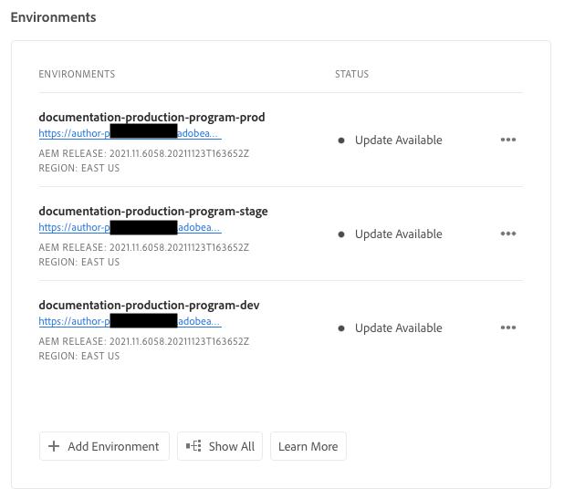
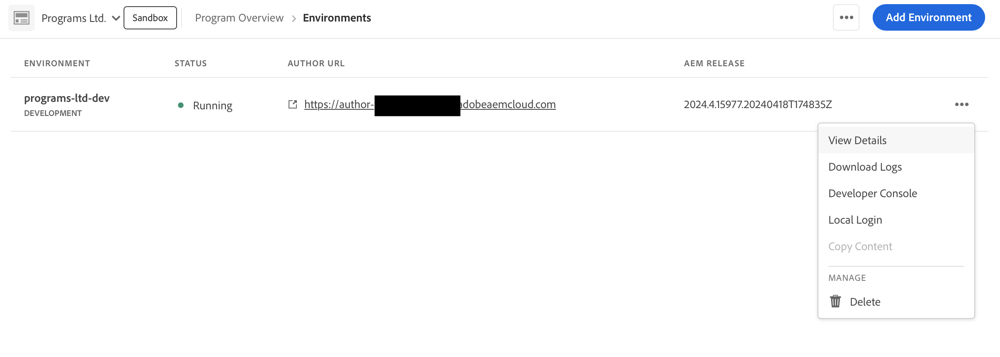

# Gestion des environnements {#managing-environments}

Découvrez les types d’environnements que vous pouvez créer et comment les créer pour votre projet Cloud Manager.

## Types d’environnement {#environment-types}

Un utilisateur disposant des autorisations requises peut créer les types d’environnement suivants (dans les limites de ce qui est disponible pour le client spécifique).

* **Production et évaluation** : les environnements de production et d’évaluation sont disponibles par paire et sont utilisés respectivement à des fins de production et de test.

* **Développement** : vous pouvez créer un environnement de développement à des fins de développement et de test qui sera associé uniquement aux pipelines hors production.

* **Développement rapide** - Un environnement de développement rapide (RDE) permet aux développeurs de déployer et de passer rapidement en revue les modifications, en minimisant le temps nécessaire pour tester les fonctionnalités dont il est prouvé qu’elles fonctionnent dans un environnement de développement local. Voir [la documentation sur l’environnement de développement rapide ;](/help/implementing/developing/introduction/rapid-development-environments.md) pour plus d’informations sur l’utilisation d’un RDE.

Les fonctionnalités de chaque environnement dépendent des solutions activées dans son [programme](/help/implementing/cloud-manager/getting-access-to-aem-in-cloud/program-types.md).

* [Sites](/help/sites-cloud/home.md)
* [Assets](/help/assets/home.md)
* [Forms](/help/forms/home.md)
* [Screens](/help/screens-cloud/home.md)

>[!NOTE]
>
>Les environnements de production et d’évaluation ne sont créés que par paire. Vous ne pouvez pas créer uniquement un environnement intermédiaire ou un environnement de production.

## Ajout d’un environnement {#adding-environments}

1. Connectez-vous à Cloud Manager à l’adresse [my.cloudmanager.adobe.com](https://my.cloudmanager.adobe.com/) et sélectionnez l’organisation appropriée.

1. Cliquez sur le programme pour lequel vous souhaitez ajouter un environnement.

1. Dans la **Aperçu du programme** page, cliquez sur **Ajouter un environnement** sur le **Environnements** pour ajouter un environnement.

   

   * L’option **Ajouter un environnement** est également disponible dans l’onglet **Environnements**.

     

   * L’option **Ajouter un environnement** peut être désactivée en raison d’un niveau d’autorisation insuffisant ou de ressources sous licence.

1. Dans la boîte de dialogue **Ajouter un environnement** qui s’affiche :

   * Sélectionnez un [**type d’environnement**.](#environment-types)
      * Le nombre d’environnements disponibles/utilisés est indiqué entre parenthèses derrière le nom du type d’environnement.
   * Entrez un **Nom** d’environnement.
   * Fournissez une **Description** de l’environnement.
   * Si vous ajoutez une **Production + Évaluation** , vous devez fournir un nom et une description de l’environnement pour vos environnements de production et d’évaluation.
   * Sélectionnez une **Région principale** dans la liste déroulante.
      * La région Principale ne peut plus être modifiée après sa création.
      * Selon vos droits disponibles, vous pouvez configurer [zones multiples](#multiple-regions).

   

1. Cliquez sur **Enregistrer** pour ajouter l’environnement spécifié.

L’écran **Aperçu** affiche désormais votre nouvel environnement dans la carte **Environnements**. Vous pouvez désormais configurer des pipelines pour votre nouvel environnement.

## Plusieurs régions de publication {#multiple-regions}

Un utilisateur avec la variable **Propriétaire de l’entreprise** Le rôle peut configurer les environnements de production et d’évaluation afin d’inclure jusqu’à trois régions de publication supplémentaires en plus de la région Principale. D’autres régions de publication peuvent améliorer la disponibilité. Voir [Documentation sur les régions de publication supplémentaires](/help/operations/additional-publish-regions.md) pour plus d’informations.

>[!TIP]
>
>Vous pouvez utiliser la variable [API Cloud Manager](https://developer.adobe.com/experience-cloud/cloud-manager/guides/api-usage/creating-programs-and-environments/#creating-aem-cloud-service-environments) pour interroger une liste actuelle des régions disponibles.

### Ajout de plusieurs régions de publication à un nouvel environnement {#add-regions}

Lorsque vous ajoutez un environnement, vous pouvez choisir de configurer des régions supplémentaires en plus de la région Principale.

1. Sélectionnez la **région Principal**.
   * La région Principale ne peut pas être modifiée après la création de l’environnement.
1. Sélectionner l’option **Ajout de zones de publication** et une nouvelle **Régions de publication supplémentaires** s’affiche.
1. Dans le **Régions de publication supplémentaires** , sélectionnez une région supplémentaire.
1. La région sélectionnée est ajoutée sous la liste déroulante pour indiquer sa sélection.
   * Appuyez ou cliquez sur le bouton `X` en regard de la région sélectionnée afin que vous puissiez la désélectionner.
1. Sélectionnez une autre région dans la **Régions de publication supplémentaires** pour ajouter une autre région.
1. Appuyez ou cliquez sur **Enregistrer** lorsque vous êtes prêt à créer votre environnement.

Les régions sélectionnées s’appliquent aux environnements de production et d’évaluation.

Si vous ne spécifiez aucune région supplémentaire, [vous pouvez le faire ultérieurement une fois les environnements créés.](#edit-regions)

Si vous souhaitez configurer la variable [réseau avancé](/help/security/configuring-advanced-networking.md) pour le programme, il est recommandé de procéder à cette configuration avant d’ajouter d’autres régions de publication aux environnements à l’aide de l’API Cloud Manager. Sinon, le trafic des régions de publication supplémentaires passe par le proxy de la région Principale.

### Modification de plusieurs régions de publication {#edit-regions}

Si vous n’avez initialement spécifié aucune région supplémentaire, vous pouvez le faire après la création des environnements si vous disposez des droits nécessaires.

Vous pouvez également supprimer d’autres régions de publication. Cependant, vous ne pouvez ajouter ou supprimer que des régions dans une seule transaction. Si vous devez ajouter une région et en supprimer une, ajoutez d’abord, enregistrez votre modification, puis supprimez (ou inversement).

1. Dans la console Aperçu du programme de votre programme, cliquez sur le bouton représentant des points de suspension de votre environnement de production, puis sélectionnez **Modifier** dans le menu.

   

1. Dans le **Modifier l’environnement de production** , apportez les modifications nécessaires aux autres régions de publication.
   * Utilisez la variable **Régions de publication supplémentaires** pour sélectionner d’autres régions.
   * Cliquez sur le X en regard des régions de publication supplémentaires sélectionnées pour les désélectionner.

   

1. Appuyez ou cliquez sur **Enregistrer** pour enregistrer les modifications.

Les modifications apportées à l’environnement de production s’appliquent aux environnements de production et d’évaluation. Les modifications apportées à plusieurs zones de publication ne peuvent être modifiées que dans l’environnement de production.

Si vous souhaitez configurer la variable [réseau avancé](/help/security/configuring-advanced-networking.md) pour le programme, il est recommandé de procéder à cette configuration avant d’ajouter des régions de publication supplémentaires aux environnements. Sinon, le trafic des régions de publication supplémentaires passe par le proxy de la région Principale.

## Détails de l’environnement {#viewing-environment}

Vous pouvez utiliser la variable **Environnements** sur la page d’aperçu pour accéder aux détails d’un environnement de deux manières.

1. Dans la **Présentation** , cliquez sur la page **Environnements** dans la partie supérieure de l’écran.

   

   * Vous pouvez également cliquer sur le bouton **Tout afficher** sur le bouton **Environnements** pour accéder directement à la **Environnements** .

     

1. L’onglet **Environnements** ouvre et répertorie tous les environnements du programme.

   

1. Cliquez sur un environnement de la liste pour en afficher les détails.

   

Vous pouvez également cliquer sur le bouton représentant des points de suspension de l’environnement souhaité, puis sélectionner **Afficher les détails**.

>[!NOTE]
>
>La carte **Environnements** répertorie uniquement trois environnements. Cliquez sur **Tout afficher** comme décrit précédemment pour voir tous les environnements du programme.

### Accès au service d’aperçu {#access-preview-service}

Cloud Manager fournit un service d’aperçu (fourni en tant que service de publication supplémentaire) à chaque environnement as a Cloud Service AEM.

Le service vous permet de prévisualiser l’expérience finale d’un site web avant qu’il n’atteigne l’environnement de publication et soit disponible publiquement.

Lors de la création, une liste autorisée IP par défaut est appliquée au service de prévisualisation : `Preview Default [<envId>]`, qui bloque tout le trafic vers le service d’aperçu. Annulez l’application de la liste autorisée IP par défaut du service de prévisualisation afin que vous puissiez activer l’accès.

Un utilisateur disposant des autorisations requises doit effectuer les étapes suivantes avant de partager l’URL du service d’aperçu pour s’assurer de son accès.

1. Créez une liste autorisée IP appropriée, appliquez-la au service d’aperçu, puis annulez immédiatement l’application de la variable `Preview Default [<envId>]` liste autorisée.

   * Voir [Application et annulation de l’application de Listes autorisées IP](/help/implementing/cloud-manager/ip-allow-lists/apply-allow-list.md) pour plus d’informations.

1. Utilisez le workflow de mise à jour de la **liste d’adresses IP autorisées** pour supprimer l’adresse IP par défaut et ajouter la ou les adresses IP, le cas échéant. Voir [Gestion des Listes autorisées IP](/help/implementing/cloud-manager/ip-allow-lists/managing-ip-allow-lists.md) pour en savoir plus.

Une fois l’accès au service de prévisualisation déverrouillé, l’icône de verrouillage devant le nom du service de prévisualisation ne s’affiche plus.

Une fois activé, vous pouvez publier du contenu dans le service d’aperçu à l’aide de l’interface utilisateur de gestion de la publication d’AEM. Voir [Aperçu du contenu](/help/sites-cloud/authoring/fundamentals/previewing-content.md) pour plus d’informations.

>[!NOTE]
>
>Votre environnement doit utiliser la version AEM `2021.05.5368.20210529T101701Z` ou ultérieure pour utiliser le service d’aperçu. Assurez-vous qu’un pipeline de mise à jour s’est correctement exécuté sur votre environnement afin que vous puissiez utiliser le service de prévisualisation.

## Mise à jour des environnements {#updating-dev-environment}

En tant que service natif du cloud, les mises à jour de vos environnements d’évaluation et de production dans les programmes de production sont automatiquement gérées par Adobe.

Toutefois, les mises à jour apportées aux environnements de développement et aux environnements dans les programmes Sandbox sont gérées dans les programmes. Lorsqu’un tel environnement n’exécute pas la dernière version d’AEM disponible pour le public, l’état de la variable **Environnements** sur la carte **Présentation** écran du programme **Mise à jour disponible**.

### Mises à jour et pipelines {#updates-pipelines}

Les pipelines sont le seul moyen de [déployer le code dans les environnements d’AEM as a Cloud Service.](deploy-code.md) Pour cette raison, chaque pipeline est associé à une version d’AEM spécifique.

Si Cloud Manager détecte qu’une version d’AEM plus récente est disponible que celle qui a été déployée pour la dernière fois avec le pipeline, il affiche la variable **Mise à jour disponible** statut de l’environnement.

Le processus de mise à jour est donc un processus en deux étapes :

1. Mise à jour du pipeline avec la dernière version AEM
1. Exécution du pipeline pour déployer la nouvelle version d’AEM dans un environnement

### Mise à jour de vos environnements {#updating-your-environments}

Le **Mettre à jour** est disponible à partir de la **Environnements** pour les environnements de développement et les environnements dans les programmes sandbox en cliquant sur le bouton représentant des points de suspension de l’environnement.

Cette option est également disponible en cliquant sur le bouton **Environnements** de l&#39;application, puis en sélectionnant le bouton représentant des points de suspension de l&#39;environnement.

Un utilisateur avec le rôle **Responsable de déploiement** peut utiliser cette option pour mettre à jour le pipeline associé à cet environnement vers la dernière version d’AEM.

Une fois que la version du pipeline est mise à jour vers la dernière version d’AEM disponible pour le public, l’utilisateur est invité à exécuter le pipeline associé pour déployer la dernière version dans l’environnement.

Le comportement de l’option **Mise à jour** varie en fonction de la configuration et du statut actuel du programme.

* Si le pipeline a déjà été mis à jour, l’option **Mettre à jour** invite l’utilisateur à exécuter le pipeline.
* Si le pipeline est déjà en cours de mise à jour, l’option **Mettre à jour** informe l’utilisateur qu’une mise à jour est déjà en cours d’exécution.
* Si aucun pipeline approprié n’est renvoyé, l’option **Mettre à jour** invite l’utilisateur à en créer un.

## Suppression d’environnements de développement {#deleting-environment}

L’utilisateur disposant de l’autorisation requise peut supprimer un environnement de développement.

Dans la **Présentation** écran du programme sur la **Environnements** , cliquez sur le bouton représentant des points de suspension de l’environnement de développement que vous souhaitez supprimer.

L’option de suppression est également disponible dans l’onglet **Environnements** de la fenêtre **Aperçu** du programme. Cliquez sur le bouton représentant des points de suspension de l’environnement et sélectionnez **Supprimer**.

>[!NOTE]
>
>* Les environnements de production et d’évaluation créés dans un programme de production ne peuvent pas être supprimés.
>* Les environnements de production et d’évaluation d’un programme Sandbox peuvent être supprimés.

## Gestion de l’accès {#managing-access}

Sélectionnez **Gérer l’accès** depuis le menu représentant des points de suspension de l’environnement dans la carte **Environnements**. Vous pouvez accéder directement à l’instance d’auteur et gérer l’accès pour votre environnement.

>[!TIP]
>
>Voir [AEM équipe as a Cloud Service et profils de produits](/help/onboarding/aem-cs-team-product-profiles.md) si vous souhaitez découvrir comment AEM équipe as a Cloud Service et les profils de produits peuvent accorder et limiter l’accès à vos solutions d’Adobe sous licence.

## Accès à la Developer Console {#accessing-developer-console}

Sélectionnez la **Developer Console** depuis le menu représentant des points de suspension de l’environnement dans la carte **Environnements**. Un nouvel onglet s’ouvre dans votre navigateur avec la page de connexion à l’ **Developer Console**.

Seul un utilisateur avec la variable **Développeur** a accès à la fonction **Developer Console**. Toutefois, pour les programmes Sandbox, tout utilisateur ayant accès au programme Sandbox a accès à **Developer Console**.

Voir [Mise en veille et réactivation d’environnements Sandbox](https://experienceleague.adobe.com/docs/experience-manager-cloud-service/content/implementing/using-cloud-manager/programs/introduction-sandbox-programs.html#hibernation) pour plus d’informations.

Cette option est également disponible à partir de l’onglet **Environnement** de la fenêtre **Aperçu** lorsque vous cliquez sur le menu représentant des points de suspension d’un environnement individuel.

## Connexion locale {#login-locally}

Sélectionner **Connexion locale** depuis le menu représentant des points de suspension de l’environnement dans la **Environnements** afin que vous puissiez vous connecter localement à Adobe Experience Manager.

En outre, vous pouvez vous connecter localement à partir de l’ **Environnements** de l’onglet **Présentation** page.

## Gestion des noms de domaine personnalisés {#manage-cdn}

Les noms de domaine personnalisés sont pris en charge dans Cloud Manager pour les programmes Sites, pour les services de publication comme de prévisualisation. Chaque environnement Cloud Manager peut héberger jusqu’à 250 domaines personnalisés.

Pour configurer des noms de domaine personnalisés, accédez à la **Environnements** et cliquez sur un environnement pour afficher les détails de l’environnement.

Vous pouvez exécuter les actions suivantes sur le service de publication pour votre environnement.

* [Ajout d’un nom de domaine personnalisé](/help/implementing/cloud-manager/custom-domain-names/add-custom-domain-name.md)

* [Gestion des noms de domaine personnalisés](/help/implementing/cloud-manager/custom-domain-names/managing-custom-domain-names.md)

* [Vérification du statut d’un nom de domaine personnalisé](/help/implementing/cloud-manager/custom-domain-names/check-domain-name-status.md#pre-existing-cdn) ou d’un [certificat SSL](/help/implementing/cloud-manager/managing-ssl-certifications/managing-certificates.md#pre-existing-cdn).

* [Gestion des listes d’adresses IP autorisées](/help/implementing/cloud-manager/ip-allow-lists/managing-ip-allow-lists.md#pre-existing-cdn)

## Gestion des listes d’adresses IP autorisées {#manage-ip-allow-lists}

Les listes autorisées IP sont prises en charge dans Cloud Manager pour les services de création, de publication et d’aperçu pour les programmes Sites.

Pour gérer les listes autorisées IP, accédez au **Environnements** de l’onglet **Présentation** de votre programme. Cliquez sur un environnement pour en gérer les détails.

### Application d’une liste d’adresses IP autorisées {#apply-ip-allow-list}

L’application d’une liste autorisée IP associe toutes les plages d’adresses IP incluses dans la définition de la liste autorisée à un service de création ou de publication dans un environnement. Un utilisateur de la variable **Propriétaire de l’entreprise** ou **Responsable de déploiement** doit être connecté pour pouvoir appliquer une liste autorisée IP.

La liste autorisée IP doit exister dans Cloud Manager pour l’appliquer à un environnement. Pour en savoir plus sur les listes autorisées IP dans Cloud Manager, voir [Présentation des Listes autorisées IP dans Cloud Manager](/help/implementing/cloud-manager/ip-allow-lists/introduction.md).

**Pour appliquer une liste autorisée IP :**

1. Accédez à l’environnement spécifique à partir de l’onglet **Environnements** de l’écran de programme **Aperçu** et accédez au tableau **Liste d’adresses IP autorisées**.
1. Utilisez les champs de saisie en haut du tableau liste autorisée IP pour sélectionner la liste autorisée IP et le service de création ou de publication auquel vous souhaitez l’appliquer.
1. Cliquez sur **Appliquer** et confirmez votre soumission.

### Annulation de l’application d’une liste autorisée IP {#unapply-ip-allow-list}

La suppression d’une liste autorisée IP dissocie toutes les plages d’adresses IP incluses dans la définition de la liste autorisée d’un service d’auteur ou d’éditeur dans un environnement. Un utilisateur de la variable **Propriétaire de l’entreprise** ou **Responsable de déploiement** doit être connecté pour pouvoir annuler l’application d’une liste autorisée IP.

**Pour annuler l’application d’une liste autorisée IP :**

1. Accédez à l’environnement spécifique à partir de l’onglet **Environnements** de l’écran de programme **Aperçu** et accédez au tableau **Liste d’adresses IP autorisées**.
1. Identifiez la ligne où est répertoriée la règle de liste autorisée IP que vous souhaitez annuler.
1. Sélectionnez le bouton représentant des points de suspension à partir de la fin de la ligne.
1. Sélectionnez **Annuler l’application** et confirmez votre envoi.
