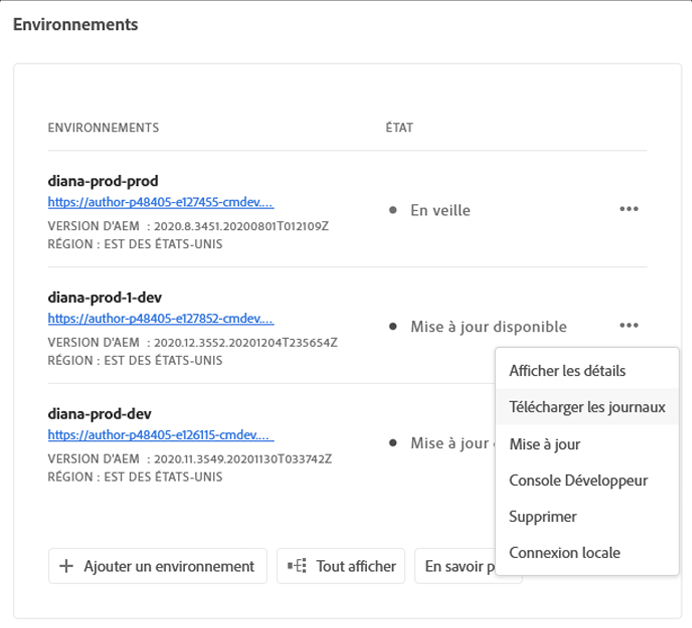
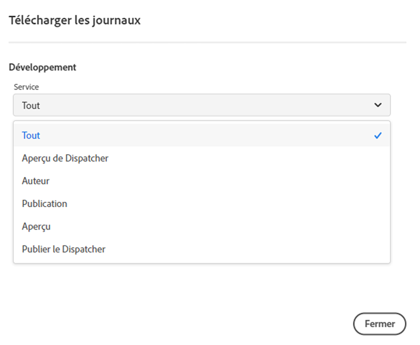
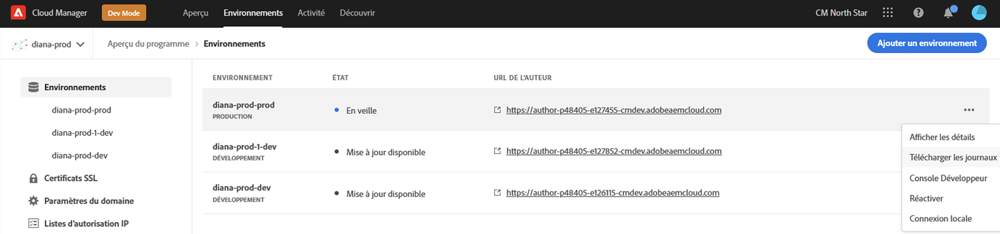

# Accéder aux journaux et les gérer {#manage-logs}

Découvrez comment accéder aux journaux et les gérer pour faciliter votre processus de développement dans AEM as a Cloud Service.

Vous pouvez accéder à la liste des fichiers journaux disponibles pour l’environnement sélectionné à l’aide de la carte **Environnements** de la page **Vue d’ensemble** ou de la page Détails de l’environnement.

Les journaux sont conservés pendant sept jours.

## Télécharger les journaux {#download-logs}

Pour télécharger les journaux, procédez comme suit :

1. Connectez-vous à Cloud Manager à l’adresse [my.cloudmanager.adobe.com](https://my.cloudmanager.adobe.com/) et sélectionnez l’organisation appropriée.

1. Sur la console **[Mes programmes](/help/implementing/cloud-manager/navigation.md#my-programs)**, sélectionnez le programme.

1. Accédez à la carte **Environnements** à partir de la page **Vue d’ensemble**.

1. Sélectionnez **Télécharger les journaux** dans le menu représentant des points de suspension.

   

1. Dans la boîte de dialogue **Télécharger les journaux**, sélectionnez le **service** approprié dans le menu déroulant

   

   Si des [Régions de publication supplémentaires](/help/operations/additional-publish-regions.md) sont activées pour votre environnement, vous pouvez sélectionner chaque région et télécharger ses journaux séparément, comme illustré ci-dessous :

   

1. Une fois que vous avez sélectionné votre service, cliquez sur l’icône de téléchargement en regard du journal que vous souhaitez récupérer.

Vous pouvez également accéder à vos journaux à partir de la page **Environnements**.



## Journaux via l’API {#logs-through-api}

En plus de l’interface utilisateur, les journaux sont disponibles via l’API et l’interface de ligne de commande.

Pour télécharger les fichiers journaux d’un environnement spécifique, la commande est similaire à la suivante.

```shell
$ aio cloudmanager:download-logs --programId 5 1884 author aemerror
```

En outre, vous pouvez suivre les journaux à l’aide de l’interface de ligne de commande.

```shell
$ aio cloudmanager:tail-log --programId 5 1884 author aemerror
```

Pour obtenir l’ID d’environnement (1884 dans ce cas) et les options de nom de service ou de journal disponibles, utilisez les commandes suivantes :

```shell
$ aio cloudmanager:list-environments
Environment Id Name                     Type  Description                          
1884           FoundationInternal_dev   dev   Foundation Internal Dev environment  
1884           FoundationInternal_stage stage Foundation Internal STAGE environment
1884           FoundationInternal_prod  prod  Foundation Internal Prod environment
 
 
$ aio cloudmanager:list-available-log-options 1884
Environment Id Service    Name         
1884           author     aemerror     
1884           author     aemrequest   
1884           author     aemaccess    
1884           publish    aemerror     
1884           publish    aemrequest   
1884           publish    aemaccess    
1884           dispatcher httpderror   
1884           dispatcher aemdispatcher
1884           dispatcher httpdaccess
```

### Ressources supplémentaires {#resources}

>[!TIP]
>
>Consultez [cette ressource vidéo](https://app.frame.io/reviews/28cdf463-b7fc-443b-a54a-93cb7da6567e/dbf158f1-568b-4efc-8fbc-3b241561cbab) pour en savoir plus sur le débogage d’AEM as a Cloud Service.

Reportez-vous aux ressources supplémentaires suivantes pour en savoir plus sur l’API Cloud Manager et l’interface de ligne de commande d’Adobe I/O :

* [Documentation de l’API Cloud Manager](https://developer.adobe.com/experience-cloud/cloud-manager/)
* [Interface de ligne de commande d’Adobe I/O](https://github.com/adobe/aio-cli-plugin-cloudmanager)

Consultez les ressources supplémentaires suivantes pour en savoir plus sur les fichiers journaux dans AEM as a Cloud Service :

* [Fichiers journaux AEM Cloud 5](https://experienceleague.adobe.com/fr/docs/experience-manager-learn/cloud-service/expert-resources/cloud-5/cloud5-aem-log-files#)
* [Déboguer AEM as a Cloud Service à l’aide de journaux](https://experienceleague.adobe.com/fr/docs/experience-manager-learn/cloud-service/debugging/debugging-aem-as-a-cloud-service/logs#)
