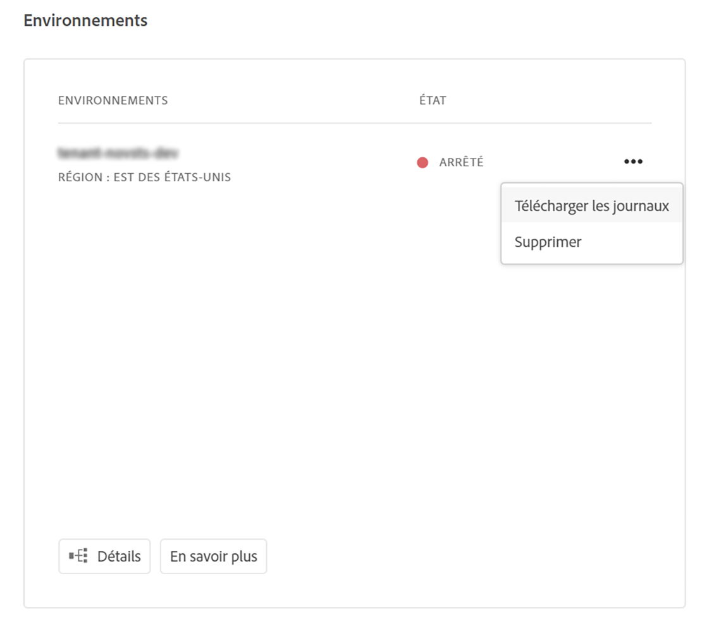

# Accès aux journaux et leur gestion {#manage-logs}

Les utilisateurs peuvent accéder à un de fichiers journaux disponibles pour l’ sélectionné à l’aide de la carte de.  Les utilisateurs peuvent accéder à un de fichiers journaux disponibles pour l’ de sélectionné.

Ces fichiers peuvent être téléchargés via l’interface utilisateur, soit à partir de la page **Aperçu** .



Ou bien, la page de **du** :


>[!Note]
>Quel que soit l’emplacement d’ouverture, la même boîte de dialogue s’affiche et permet de télécharger un fichier journal individuel.


## Connexion à l’API {#logs-thorugh-api}

Outre le téléchargement de journaux via l’interface utilisateur, les journaux seront disponibles via l’API et l’interface de ligne de commande.

Par exemple, pour télécharger les fichiers journaux d’un  de  spécifique, la commande serait quelque chose d’unique avec les lignes de

```java
$ aio cloudmanager:download-logs --programId 5 1884 author aemerror
```

La commande suivante permet de tailler les journaux :

```java
$ aio cloudmanager:tail-log --programId 5 1884 author aemerror
```

Pour obtenir l’ID de  (1884 dans ce cas) et les options de service ou de nom de journal disponibles, vous pouvez utiliser :

```java
$ aio cloudmanager:list-environments
Environment Id Name                     Type  Description                          
1884           FoundationInternal_dev   dev   Foundation Internal Dev environment  
1884           FoundationInternal_stage stage Foundation Internal STAGE environment
1884           FoundationInternal_prod  prod  Foundation Internal Prod environment
 
 
$ aio cloudmanager:list-available-log-options 1884
Environment Id Service    Name         
1884           author     aemerror     
1884           author     aemrequest   
1884           author     aemaccess    
1884           publish    aemerror     
1884           publish    aemrequest   
1884           publish    aemaccess    
1884           dispatcher httpderror   
1884           dispatcher aemdispatcher
1884           dispatcher httpdaccess
```

>[!Note]
>Tandis que l’option **Téléchargement de journaux** est disponible via l’interface utilisateur et l’API, l’option **Suivi de journaux** est uniquement disponible via API/CLI.

### Ressources supplémentaires {#resources}

Reportez-vous aux ressources supplémentaires suivantes pour en savoir plus sur l’API Cloud Manager et l’interface de ligne de commande des E/S Adobe :

* [Documentation de l’API Cloud Manager](https://www.adobe.io/apis/experiencecloud/cloud-manager/docs.html)
* [Interface de ligne de commande des E/S Adobe](https://github.com/adobe/aio-cli-plugin-cloudmanager)