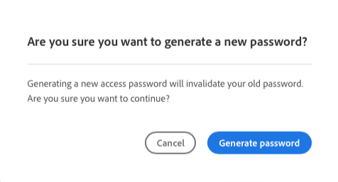
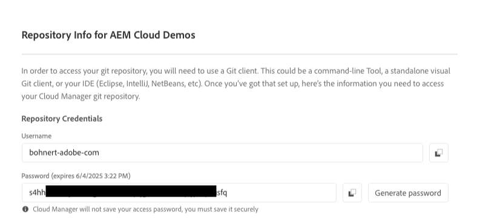

# Informations d’accès au référentiel {#accessing-repos}

Découvrez comment accéder à votre référentiel Git géré par Adobe et comment le gérer à l’aide de la gestion de compte Git en libre-service, à partir de Cloud Manager.

## Accès aux informations du référentiel à partir de la page Vue d’ensemble {#overview-page}

Cloud Manager facilite la récupération des informations de votre référentiel pour les référentiels gérés par Adobe à l’aide du bouton **Accéder aux informations sur le référentiel** mis en avant sur la carte de pipeline.

1. Connectez-vous à Cloud Manager à l’adresse [my.cloudmanager.adobe.com](https://my.cloudmanager.adobe.com/) et sélectionnez l’organisation et le programme appropriés.

1. Accédez à la carte **Pipelines** à partir de votre page **Vue d’ensemble du programme**.

   

1. Appuyez ou cliquez sur le bouton **Accéder aux informations sur le référentiel** pour ouvrir la boîte de dialogue **Informations sur le référentiel** et afficher :

   * Le nom d’utilisateur Git.
   * Le mot de passe Git.
   * L’URL vers le référentiel Git de Cloud Manager.
   * Des commandes Git préconfigurées pour ajouter rapidement un référentiel distant à votre référentiel Git et pour transférer du code.

   

1. Pour accéder au mot de passe, un nouveau mot de passe doit être généré. Pour ce faire, appuyez ou cliquez sur le bouton **Générer un mot de passe**.

1. Confirmez la génération du mot de passe dans la boîte de dialogue **Voulez-vous confirmer...** en appuyant ou en cliquant sur **Générer un mot de passe**.

   

1. Le mot de passe est généré et visible pour la copie dans la champ **Mot de passe**.

   * La génération d’un mot de passe invalide le mot de passe précédent.
   * Cloud Manager n’enregistre pas le mot de passe. Il vous appartient d’enregistrer ce mot de passe en toute sécurité.
   * Étant donné que Cloud Manager n’enregistre pas le mot de passe, si vous le perdez, vous devez en régénérer un nouveau.

   

À l’aide de ces informations d’identification, vous pouvez cloner une copie locale du référentiel et apporter des modifications à ce référentiel local. Lorsque vous avez terminé, vous pouvez ensuite valider toutes les modifications du code vers le référentiel de code distant dans Cloud Manager.

>[!NOTE]
>
>* L’option **Accéder aux informations sur le référentiel** est visible par les utilisateurs et utilisatrices possédant les rôles **Responsable du développement** ou **Responsable de déploiement**.
>* Le bouton **Accéder aux informations sur le référentiel** n’affiche que les informations d’accès au référentiel pour les référentiels gérés par Adobe. Les informations d’accès relatives aux [référentiels privés](private-repositories.md) ne sont pas disponibles dans Cloud Manager.

## Accès aux informations sur le référentiel à partir de la fenêtre Référentiels {#repositories-window}

Un bouton **Accéder à Repo Info** est également disponible dans la barre d’outils de la fenêtre [**Référentiels**](managing-repositories.md). Il affiche les mêmes informations sur l’accès aux référentiels gérés par Adobe.

## Révocation d’un mot de passe d’accès {#revoke-password}

Vous pouvez révoquer un mot de passe d’accès à tout moment. Pour ce faire, [créez un ticket d’assistance pour cette demande](https://experienceleague.adobe.com/?support-solution=Experience+Manager&amp;support-tab=home#support).

Le ticket est traité en priorité et la révocation devrait être effectuée dans la journée.
