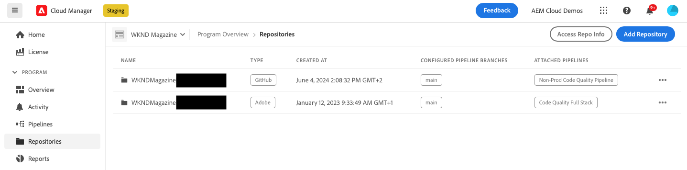
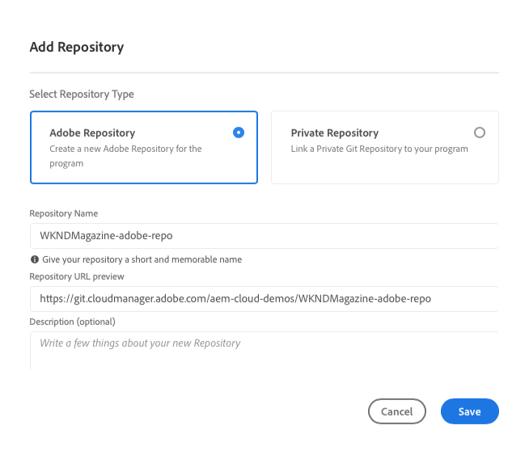

# Ajouter un référentiel Adobe dans Cloud Manager {#adobe-repositories}

Découvrez comment ajouter un référentiel géré par Adobe dans Cloud Manager.

La page **Référentiels** vous permet d’ajouter des référentiels gérés par Adobe supplémentaires à un programme sélectionné.

**Pour ajouter un référentiel Adobe dans Cloud Manager :**

1. Connectez-vous à Cloud Manager à l’adresse [my.cloudmanager.adobe.com](https://my.cloudmanager.adobe.com/) et sélectionnez l’organisation appropriée et le programme auquel ajouter un référentiel géré par Adobe.

1. Sur la page **Aperçu du programme**, dans le menu latéral, cliquez sur l’onglet  **Référentiels**.

1. Sur la page **Référentiels**, près du coin supérieur droit, cliquez sur **Ajouter un référentiel**.

   

1. Dans la boîte de dialogue **Ajouter un référentiel**, assurez-vous que **Référentiel Adobe** est sélectionné comme type de référentiel.

1. Dans les champs de texte respectifs, saisissez ce qui suit :

   * **Nom du référentiel** : nom expressif de votre nouveau référentiel.
   * **Aperçu de l’URL du référentiel** - Vous n’avez pas besoin de saisir un chemin d’URL ni de modifier le chemin existant, car l’infrastructure du référentiel est déjà configurée, intégrée et gérée par Adobe.
   * **Description (facultatif)** : description détaillée du référentiel.

   

1. Cliquez sur **Enregistrer**.
Votre nouveau référentiel s’affiche dans le tableau de la page **Référentiels**.

Vous pouvez désormais associer un [Pipeline CI/CD](/help/implementing/cloud-manager/configuring-pipelines/introduction-ci-cd-pipelines.md) à celui-ci, ou le gérer dans la fenêtre [**Référentiels**](managing-repositories.md).

>[!TIP]
>
>Vous pouvez également ajouter des référentiels GitHub que vous gérez vous-même, en tant que [référentiels privés](private-repositories.md).
