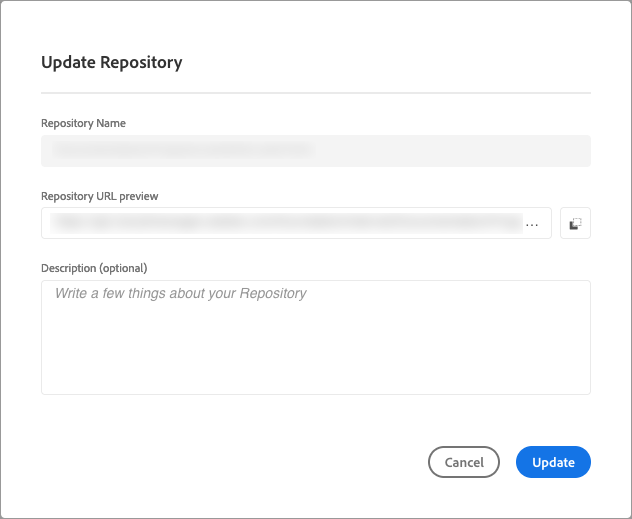

# Gestion des référentiels dans Cloud Manager {#managing-repos}

Découvrez comment afficher, ajouter et supprimer vos référentiels Git dans Cloud Manager.

## À propos des référentiels dans Cloud Manager {#overview}

Les référentiels dans Cloud Manager permettent de stocker et de gérer le code de votre projet à l’aide de Git. Pour chaque *program* que vous ajoutez, un référentiel géré par Adobe est automatiquement créé.

En outre, vous avez la possibilité de créer d’autres référentiels gérés par l’Adobe ou d’ajouter vos propres référentiels privés. Tous les référentiels liés à votre programme peuvent être affichés sur la page **Référentiels** .

Les référentiels créés dans Cloud Manager peuvent également être sélectionnés lors de l’ajout ou de la modification de pipelines. Pour plus d’informations sur la configuration des pipelines, voir [Pipelines CI-CD](/help/implementing/cloud-manager/configuring-pipelines/introduction-ci-cd-pipelines.md).

Chaque pipeline est lié à un référentiel ou à une branche principale. Cependant, avec la [prise en charge du sous-module Git](git-submodules.md), plusieurs branches secondaires peuvent être incluses pendant le processus de création.

## Affichage de la page Référentiels {#repositories-window}

Sur la page **Référentiels**, vous pouvez afficher des détails sur le référentiel sélectionné. Ces informations incluent le type de référentiel en cours d’utilisation. Si le référentiel est marqué comme **Adobe**, il indique qu’il s’agit d’un référentiel géré par Adobe. S’il est étiqueté **GitHub**, il fait référence à un référentiel GitHub privé que vous gérez. En outre, la page fournit des détails tels que le moment où le référentiel a été créé et les pipelines qui lui sont associés.

Pour agir sur un référentiel sélectionné, vous pouvez cliquer sur le référentiel et utiliser  pour ouvrir un menu déroulant. Pour les référentiels gérés par Adobe, vous pouvez **[Vérifier les branches / Créer un projet](#check-branches)**.

*Menu déroulant sur la page Référentiels.*

Parmi les autres actions disponibles dans le menu déroulant, citons **[Copy Repository URL](#copy-url)**, **[View &amp; Update](#view-update)** et **[Delete](#delete)** the repository.

**Pour afficher la page Référentiels :**

1. Connectez-vous à Cloud Manager à l’adresse [my.cloudmanager.adobe.com](https://my.cloudmanager.adobe.com/) et sélectionnez l’organisation et le programme appropriés.

1. Sur la page **Aperçu du programme**, dans le menu latéral, cliquez sur  **Référentiels**.

1. La page **Référentiels** affiche tous les référentiels associés au programme sélectionné.

   
   *Page Référentiels dans Cloud Manager.*

## Ajout d’un référentiel {#adding-repositories}

Un utilisateur doit avoir le rôle **Deployment Manager** ou **Business Owner** pour ajouter un référentiel.

Sur la page **Référentiels**, près du coin supérieur droit, cliquez sur **Ajouter un référentiel**

*Boîte de dialogue Ajouter un référentiel.*

Cloud Manager prend en charge deux types de référentiels : les référentiels gérés par l’Adobe (**Adobe Repository**) et les référentiels gérés automatiquement (**Private Repository**). Les champs requis pour la configuration varient en fonction du type de référentiel que vous choisissez d’ajouter. Pour plus d’informations, consultez les sections suivantes :

* [Ajouter des référentiels Adobe dans Cloud Manager](adobe-repositories.md)
* [Ajouter des référentiels privés dans Cloud Manager](private-repositories.md)

Les référentiels sont limités à 300 pour tous les programmes d’une société ou d’une organisation IMS donnée.

## Accès aux informations du référentiel {#repo-info}

Lorsque vous consultez vos référentiels dans la fenêtre **Référentiels**, vous pouvez consulter des informations sur la façon d’accéder aux référentiels gérés par Adobe par programmation, en cliquant sur le bouton **Accéder aux informations sur le référentiel** dans la barre d’outils.

La fenêtre **Informations sur le référentiel** s’ouvre et affiche les détails. Pour plus d’informations sur l’accès aux informations du référentiel, voir la section [Accéder aux informations du référentiel](/help/implementing/cloud-manager/managing-code/accessing-repos.md).

## Vérifier les branches / Créer un projet {#check-branches}

Dans **AEM Cloud Manager**, l’action **Vérifier les branches / Créer un projet** a deux objectifs, selon l’état actuel du référentiel.

* Si le référentiel est nouvellement créé, cette action génère un exemple de projet à l’aide de [l’archétype de projet AEM](https://experienceleague.adobe.com/fr/docs/experience-manager-core-components/using/developing/archetype/overview).
* Si l’exemple de projet est déjà créé dans le référentiel, l’action vérifie l’état du référentiel et de ses branches, en indiquant si l’exemple de projet existe déjà.

  

## Copier l’URL du référentiel {#copy-url}

L’action **Copier l’URL du référentiel** copie l’URL du référentiel sélectionné dans la page **Référentiels** dans le Presse-papiers à utiliser ailleurs.

## Affichage et mise à jour d’un référentiel {#view-update}

L’action **Afficher et mettre à jour** ouvre la boîte de dialogue **Mettre à jour le référentiel**, dans laquelle vous pouvez afficher les **Nom** et l’ **aperçu de l’URL du référentiel** du référentiel. En outre, il vous permet de mettre à jour la **description** du référentiel.

## Suppression d’un référentiel {#delete}

L’action **Supprimer** supprime le référentiel de votre projet. Un référentiel ne peut pas être supprimé s’il est associé à un pipeline.

La suppression d’un référentiel rend son nom inutilisable pour tout nouveau référentiel créé ultérieurement. Si vous tentez d’ajouter un référentiel portant le même nom qu’un référentiel supprimé, le message d’erreur suivant s’affiche :

`Repository name should be unique within organization.`

En outre, le référentiel supprimé n’est plus disponible dans Cloud Manager et ne peut être lié à aucun pipeline.

