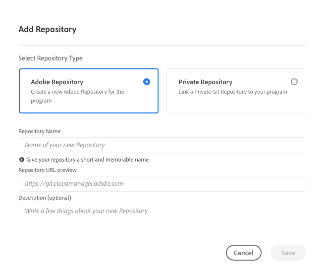

# Gestion des référentiels dans Cloud Manager {#managing-repos}

Découvrez comment créer, afficher et supprimer vos référentiels Git dans Cloud Manager.

## Vue d’ensemble {#overview}

Les référentiels permettent de stocker et de gérer le code de votre projet à l’aide de Git. Chaque programme que vous créez dans Cloud Manager comporte un référentiel géré par Adobe.

Vous pouvez choisir de créer d’autres référentiels gérés par Adobe et d’ajouter vos propres référentiels privés. Tous les référentiels associés à votre programme peuvent être affichés dans la **Référentiels** fenêtre.

Vous pouvez également sélectionner les référentiels créés dans Cloud Manager lors de l’ajout ou de la modification de pipelines. Consultez [Pipelines CI-CD](/help/implementing/cloud-manager/configuring-pipelines/introduction-ci-cd-pipelines.md) pour en savoir plus.

Il existe un référentiel principal unique ou une branche pour chaque pipeline donné. Avec [prise en charge des sous-modules git,](git-submodules.md) de nombreuses branches secondaires peuvent être incluses au moment de la création.

## Fenêtre Référentiels {#repositories-window}

1. Connectez-vous à Cloud Manager à l’adresse [my.cloudmanager.adobe.com](https://my.cloudmanager.adobe.com/) et sélectionnez l’organisation et le programme appropriés.

1. Dans la **Aperçu du programme** , sélectionnez **Référentiels** pour basculer vers l’onglet **Référentiels** page.

1. La variable **Référentiels** affiche tous les référentiels associés à votre programme.

   

La variable **Référentiels** La fenêtre fournit des détails sur les référentiels :

* Type de référentiel
   * **Adobe** indique les référentiels gérés par Adobe
   * **Privé** indique les référentiels GitHub que vous gérez ;
* Lorsqu’elle a été créée
* Pipelines associés au référentiel

Vous pouvez sélectionner le référentiel dans la fenêtre et cliquer sur le bouton représentant des points de suspension pour agir sur le référentiel sélectionné.

* **[Vérifier les branches / Créer un projet](#check-branches)** (disponible uniquement pour les référentiels d’Adobe)
* **[Copier l’URL du référentiel](#copy-url)**
* **[Afficher et mettre à jour](#view-update)**
* **[Supprimer](#delete)**

## Ajouter des référentiels {#adding-repositories}

Appuyez ou cliquez sur le bouton **Ajouter un référentiel** dans le **Référentiels** pour lancer la **Ajouter un référentiel** assistant.

Cloud Manager prend en charge les deux référentiels gérés par Adobe (**Référentiel Adobe**) ainsi que vos propres référentiels auto-gérés (**Référentiel privé**). Les champs requis varient en fonction du type de référentiel que vous choisissez d’ajouter. Pour plus d’informations, consultez les documents suivants.

* [Ajout de référentiels Adobe dans Cloud Manager](adobe-repositories.md)
* [Ajout de référentiels privés dans Cloud Manager](private-repositories.md)

>[!NOTE]
>
>* Un utilisateur ou une utilisatrice doit disposer du rôle **Responsable de déploiement** ou **Propriétaire de l’entreprise** pour pouvoir ajouter un référentiel.
>* Les référentiels sont limités à 300 pour tous les programmes d’une société ou d’une organisation IMS donnée.

## Accéder aux informations sur le référentiel {#repo-info}

Lors de l’affichage de vos référentiels dans le **Référentiels** vous pouvez afficher les détails sur la manière d’accéder par programmation aux référentiels gérés par Adobe en appuyant ou en cliquant sur le **Accès aux informations sur le référentiel** dans la barre d’outils.

La variable **Informations sur le référentiel** s’ouvre avec les détails. Pour plus d’informations sur l’accès aux informations du référentiel, consultez le document . [Accès aux informations du référentiel.](accessing-repos.md)

## Vérifier les branches {#check-branches}

## Copier l’URL du référentiel {#copy-url}

La variable **Copier l’URL du référentiel** copie l’URL du référentiel sélectionné dans la variable **Référentiels** vers le Presse-papiers à utiliser ailleurs.

## Afficher et mettre à jour {#view-update}

La variable **Afficher et mettre à jour** ouvre l’action **Mettre à jour le référentiel** boîte de dialogue. Vous pouvez ainsi afficher la variable **Nom** et **Aperçu de l’URL du référentiel** et mettre à jour la variable **Description** du référentiel.

## Supprimer {#delete}

La variable **Supprimer** supprime le référentiel de votre projet. Un référentiel ne peut pas être supprimé s’il est associé à un pipeline.

La suppression d’un référentiel entraînera les éléments suivants :

* Le nom du référentiel supprimé sera inutilisable pour de nouveaux référentiels qui pourraient être créés ultérieurement.
   * Le message d’erreur `Repository name should be unique within organization.` s’affiche dans de tels cas.
* Le référentiel supprimé sera indisponible dans Cloud Manager et ne pourra donc pas être lié à un pipeline.
