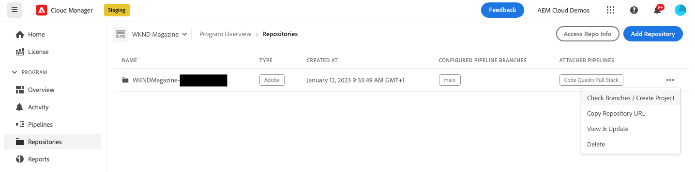
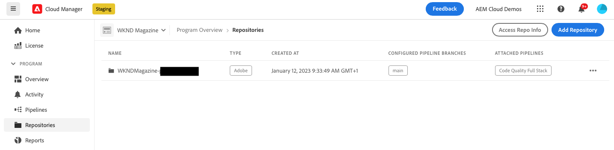
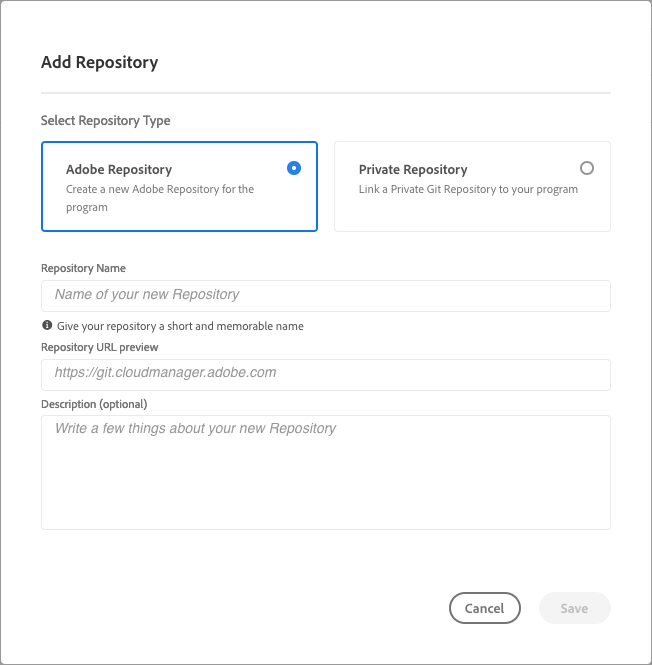
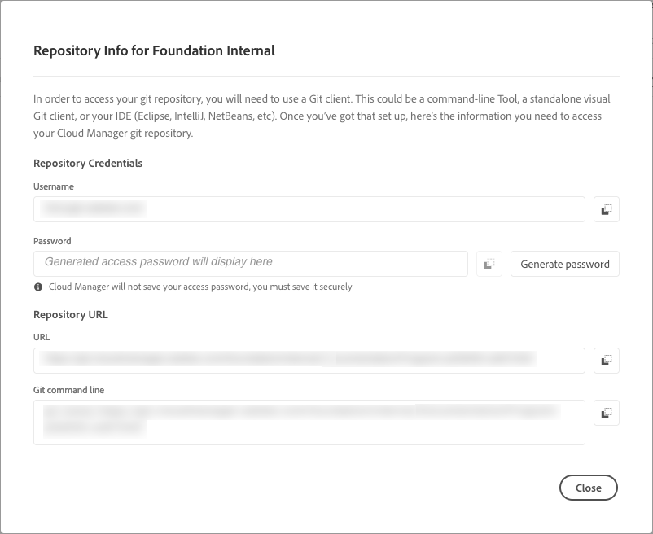
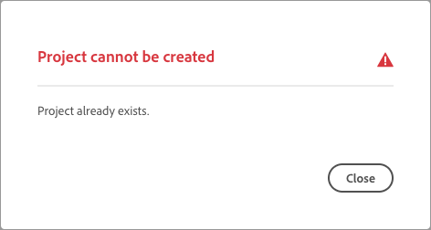
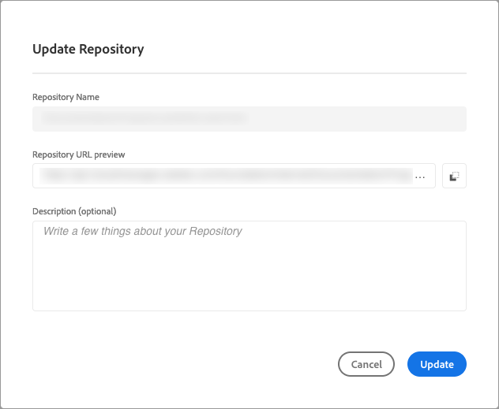
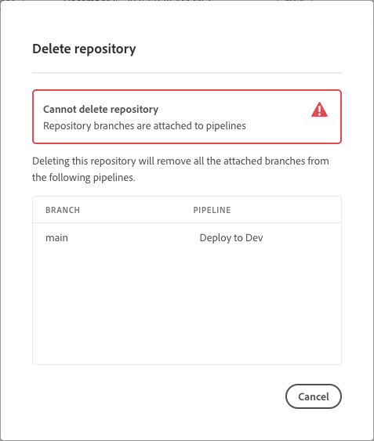

# Gérer les référentiels dans Cloud Manager {#managing-repos}

Découvrez comment afficher, ajouter et supprimer vos référentiels Git dans Cloud Manager.

## À propos des référentiels dans Cloud Manager {#overview}

Les référentiels de Cloud Manager servent à stocker et gérer le code de votre projet à l’aide de Git. Pour chaque *programme* que vous ajoutez, un référentiel géré par Adobe est automatiquement créé.

En outre, vous avez la possibilité de créer d’autres référentiels gérés par Adobe ou vos propres référentiels autogérés hébergés chez un fournisseur Git externe. Pour les référentiels auto-gérés, les étapes d’intégration varient en fonction de l’emplacement d’hébergement de votre code. Les référentiels sur `github.com` utilisent l’application GitHub d’Adobe, tandis que les référentiels auto-hébergés et les autres référentiels externes utilisent un jeton d’accès personnel et un webhook. Tous les référentiels associés à votre programme peuvent être consultés sur la page **Référentiels**.

Les référentiels créés dans Cloud Manager peuvent également être sélectionnés lors de l’ajout ou de la modification de pipelines. Pour plus d’informations sur la configuration des pipelines, voir [Pipelines CI-CD](/help/implementing/cloud-manager/configuring-pipelines/introduction-ci-cd-pipelines.md).

Chaque pipeline est lié à un référentiel ou à une branche principale. Toutefois, grâce à la [prise en charge des sous-modules Git](git-submodules.md), de nombreuses branches secondaires peuvent être incluses au moment de la création.

## Afficher la page Référentiels {#repositories-window}

Dans la page **Référentiels**, vous pouvez afficher des détails sur le référentiel sélectionné. Ces informations incluent le type de référentiel en cours d’utilisation. Si le référentiel est marqué comme **Adobe**, il s’agit d’un référentiel géré par Adobe. S’il est étiqueté **GitHub**, il s’agit d’un référentiel GitHub privé que vous gérez. En outre, la page fournit des détails tels que le moment où le référentiel a été créé et les pipelines qui lui sont associés.

Pour agir sur un référentiel sélectionné, vous pouvez cliquer sur le référentiel et utiliser l’ pour ouvrir un menu déroulant. Pour les référentiels gérés par Adobe, vous pouvez **[Vérifier les branches / Créer un projet](#check-branches)**.

*Menu déroulant de la page Référentiels.*

Parmi les autres actions disponibles dans le menu déroulant, citons notamment **[Copier l’URL du référentiel](#copy-url)**, **[Afficher et mettre à jour](#view-update)** et **[Supprimer](#delete)** le référentiel.

**Pour afficher la page Référentiels :**

1. Connectez-vous à Cloud Manager à l’adresse [my.cloudmanager.adobe.com](https://my.cloudmanager.adobe.com/) et sélectionnez l’organisation et le programme appropriés.

1. Sur la page **Aperçu du programme**, dans le menu latéral, cliquez sur l’, **Référentiels**.

1. La page **Référentiels** affiche tous les référentiels associés à votre programme sélectionné.

   
   *Page Référentiels dans Cloud Manager.*

## Ajout d’un référentiel Adobe {#adding-repositories}

Un utilisateur ou une utilisatrice doit disposer du rôle **Responsable de déploiement** ou **Propriétaire de l’entreprise** pour ajouter un référentiel.

Pour plus d’informations sur le choix entre les méthodes de référentiel privé et externe, voir [Ajouter un référentiel non Adobe](#add-non-adobe-repositories).

1. Sur la page **Référentiels**, près du coin supérieur droit, cliquez sur **Ajouter un référentiel**.

   
   *Boîte de dialogue Ajouter un référentiel.*

1. Cliquez sur **Référentiel**. Voir [Ajout de référentiels Adobe dans Cloud Manager](adobe-repositories.md).

   Les référentiels sont limités à 300 pour tous les programmes d’une société ou d’une organisation IMS donnée.

### Ajout d’un référentiel non Adobe {#add-non-adobe-repositories}

Si vous hébergez votre code en dehors d’Adobe, la page d’instructions que vous utilisez et la méthode de validation de la propriété dépendent toutes deux de l’emplacement d’hébergement du référentiel. Utilisez le tableau suivant pour choisir le chemin d’accès correct.

| Emplacement d’hébergement de votre référentiel | Méthode de validation | Page des instructions d’utilisation |
| --- | --- | --- |
| `github.com` (tout forfait GitHub tel que Free, Pro, Team ou Enterprise Cloud) | Application GitHub Adobe et fichier secret. Aucun webhook requis. | [Ajouter un référentiel GitHub privé dans Cloud Manager](/help/implementing/cloud-manager/managing-code/private-repositories.md) |
| GitHub Enterprise Server (auto-hébergé) | Jeton d’accès personnel et webhook | [Ajouter des référentiels externes dans Cloud Manager](/help/implementing/cloud-manager/managing-code/external-repositories.md) |
| DevOps GitLab, Bitbucket ou Azure | Jeton d’accès personnel et webhook | [Ajouter des référentiels externes dans Cloud Manager](https://experienceleague.adobe.com/en/docs/experience-manager-cloud-service/content/implementing/using-cloud-manager/managing-code/external-repositories) |

## Accéder aux informations du référentiel {#repo-info}

Lorsque vous consultez vos référentiels dans la fenêtre **Référentiels**, vous pouvez consulter des informations sur la façon d’accéder aux référentiels gérés par Adobe par programmation, en cliquant sur le bouton **Accéder aux informations sur le référentiel** dans la barre d’outils.

La fenêtre **Informations sur le référentiel** s’ouvre et affiche les détails. Pour plus d’informations sur l’accès aux informations du référentiel, voir la section [Accéder aux informations du référentiel](/help/implementing/cloud-manager/managing-code/accessing-repos.md).

## Vérifier les branches / Créer un projet {#check-branches}

Dans **AEM Cloud Manager**, l’action **Vérifier les branches / Créer un projet** a deux objectifs, selon l’état actuel du référentiel.

* Si le référentiel est nouvellement créé, l’action génère un exemple de projet basé sur l’[archétype de projet AEM](https://experienceleague.adobe.com/fr/docs/experience-manager-core-components/using/developing/archetype/overview).
* Si l’exemple de projet est déjà créé dans le référentiel, l’action vérifie le statut du référentiel et de ses branches, en indiquant si l’exemple de projet existe déjà.

  

## Copier l’URL du référentiel {#copy-url}

L’action **Copier l’URL du référentiel** copie l’URL du référentiel sélectionné à la page **Référentiels** vers le Presse-papiers afin d’utiliser cette URL ailleurs.

## Affichage et mise à jour d’un référentiel {#view-update}

L’action **Afficher et mettre à jour** ouvre la boîte de dialogue **Mettre à jour le référentiel**, dans laquelle vous pouvez afficher le **Nom** et l’**aperçu de l’URL du référentiel**. En outre, elle permet de mettre à jour la **description** du référentiel.

## Supprimer un référentiel {#delete}

L’action **Supprimer** supprime le référentiel de votre projet. Un référentiel ne peut pas être supprimé s’il est associé à un pipeline.

La suppression d’un référentiel empêche son nom d’être utilisé pour tout nouveau référentiel créé à l’avenir. Si vous tentez d’ajouter un référentiel portant le même nom qu’un référentiel supprimé, le message d’erreur suivant s’affiche :

`Repository name should be unique within organization.`

En outre, le référentiel supprimé n’est plus disponible dans Cloud Manager et ne peut pas être lié à des pipelines.

