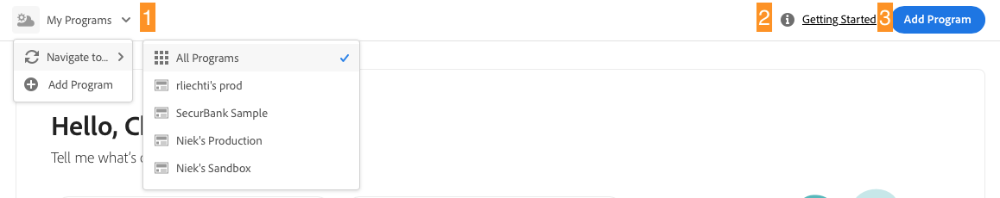
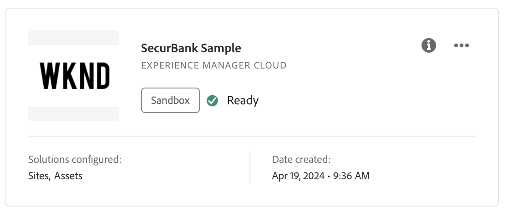

# Navigation dans l’interface utilisateur de Cloud Manager {#navigation}

Découvrez comment l’interface utilisateur de Cloud Manager est organisée et comment gérer vos programmes et environnements.

L’interface utilisateur de gestion de Cloud se compose principalement de deux interfaces graphiques :

* [La console Mes programmes](#my-programs) où vous pouvez afficher et gérer tous vos programmes.
* [Fenêtre Aperçu du programme](#program-overview) où vous pouvez voir le détail et gérer un programme individuel.

>[!TIP]
>
>Consultez également la section [parcours de documentation d’intégration](/help/journey-onboarding/overview.md) pour une présentation complète de la prise en main d’AEM as a Cloud Service à l’aide de Cloud Manager.

## Ma console Programmes {#my-programs}

Lorsque vous vous connectez à Cloud Manager sur la page [my.cloudmanager.adobe.com](https://my.cloudmanager.adobe.com/) et sélectionnez l’organisation appropriée, vous accédez au **Mes programmes** console.

La console Mes programmes fournit un aperçu de tous les programmes auxquels vous avez accès dans l’organisation sélectionnée. Il est composé de plusieurs parties.

1. [Barres d’outils](#toolbars-my-programs-toolbars) pour la sélection, les alertes et les paramètres du compte d’une organisation
1. [Statistiques et appels à l&#39;action](#statistics) pour un aperçu de votre activité récente
1. [Programmes et licences](#programs-license) pour comprendre votre état de licence actuel et gérer vos programmes
1. [Liens rapides](#quick-links) pour accéder facilement aux ressources connexes

>[!TIP]
>
>Consultez le document [Programmes et types de programmes](/help/implementing/cloud-manager/getting-access-to-aem-in-cloud/program-types.md) pour plus d’informations sur les programmes.

### Barres d’outils {#my-programs-toolbars}

Il y a deux barres d&#39;outils l&#39;une au-dessus de l&#39;autre.

#### En-tête de Cloud Manager {#cloud-manager-header}

Le premier est l’en-tête de Cloud Manager, qui est persistant lorsque vous naviguez dans Cloud Manager. Il s’agit d’une ancre qui vous donne accès aux paramètres et aux informations qui s’appliquent à l’ensemble des programmes Cloud Manager.

1. Le bouton Cloud Manager vous ramène à la console Mes programmes de Cloud Manager, où que vous soyez dans Cloud Manager.
1. Appuyez ou cliquez sur le bouton Commentaires pour fournir des commentaires à Adobe sur Cloud Manager.
1. Le sélecteur d’organisation affiche l’organisation dans laquelle vous êtes actuellement connecté (dans cet exemple, Foundation Internal). Appuyez ou cliquez sur pour passer à une autre organisation si votre Adobe ID est associé à plusieurs d’entre elles.
1. Appuyez ou cliquez sur le sélecteur de solutions pour accéder rapidement à d’autres solutions Experience Cloud.
1. L’icône d’aide permet d’accéder rapidement aux ressources d’apprentissage et d’assistance.
1. L’icône de notification comporte un badge indiquant le nombre d’éléments incomplets actuellement attribués. [notifications.](/help/implementing/cloud-manager/notifications.md)
1. Sélectionnez l’icône représentant votre utilisateur pour accéder à vos paramètres utilisateur. Si vous n’avez configuré aucune image d’utilisateur ou d’utilisatrice, une icône est attribuée de manière aléatoire.

#### Barre d’outils du programme {#program-toolbar}

La barre d’outils du programme fournit des liens pour basculer entre les programmes Cloud Manager et les actions appropriées au contexte.

1. Le sélecteur de programme s’ouvre dans une liste déroulante où vous pouvez sélectionner rapidement d’autres programmes ou prendre des mesures contextuelles, telles que la création d’un nouveau programme.
1. Le lien de prise en main permet d’accéder au [parcours de documentation d’intégration](/help/journey-onboarding/overview.md) pour vous familiariser avec Cloud Manager.
1. Le bouton d’action propose des actions contextuelles, telles que la création d’un programme.

### Statistiques {#statistics}

La section statistiques fournit des données agrégées pour votre organisation. Par exemple, si vous avez configuré vos programmes avec succès, les statistiques de vos activités au cours des 90 derniers jours peuvent s’afficher, notamment :

* Nombre de [déploiements](/help/implementing/cloud-manager/deploy-code.md)
* Nombre de [problèmes de qualité du code](/help/implementing/cloud-manager/code-quality-testing.md) identifié
* Nombre de versions

Si vous ne commencez que la configuration de votre organisation, vous pouvez obtenir des conseils sur les étapes suivantes ou les ressources de documentation.

### Programmes et licences {#programs-license}

Le contenu principal de la console Mes programmes est la liste des programmes et l’état de votre licence.

#### Onglet Programmes {#programs}

La variable **Programmes** répertorie les cartes représentant chaque programme auquel vous avez accès. Appuyez ou cliquez sur une carte pour accéder au **Aperçu du programme** page du programme pour plus d’informations sur le programme.

Utilisez les options de tri pour mieux trouver le programme dont vous avez besoin.

* Trier par
   * Date de création (par défaut)
   * Nom du programme
   * Statut
* ascendant (par défaut) / descendant
* Affichage de la grille (par défaut)
* Vue Liste

Chaque programme est représenté par une carte (ou une ligne dans un tableau), donnant un aperçu du programme et des liens rapides pour agir.

* Image du programme (si configurée)
* Nom du programme
* Type de service : **Experience Manager Cloud** pour les AEM en tant que * programmes de Cloud Service ou [**Experience Manager** pour les programmes AMS](https://experienceleague.adobe.com/en/docs/experience-manager-cloud-manager/content/introduction)
* [Type de programme](/help/implementing/cloud-manager/getting-access-to-aem-in-cloud/program-types.md): environnement de test ou production
* Statut
* Solutions configurées
* Date de création

Selon les options sélectionnées lors de la création du programme, un programme de production peut être marqué pour afficher des fonctionnalités supplémentaires.

* [HIPAA](/help/implementing/cloud-manager/getting-access-to-aem-in-cloud/creating-production-programs.md#security)

  

* [Protection WAF-DDOS](/help/implementing/cloud-manager/getting-access-to-aem-in-cloud/creating-production-programs.md#security)

  

* [Contrat de niveau de service à 99,99 %](/help/implementing/cloud-manager/getting-access-to-aem-in-cloud/creating-production-programs.md#sla)

  

L’icône d’informations permet également d’accéder rapidement à des informations supplémentaires sur le programme (utiles en mode Liste).

L’icône représentant des points de suspension permet d’accéder à des actions supplémentaires que vous pouvez effectuer sur le programme.

* Accédez à un [environnement](/help/implementing/cloud-manager/manage-environments.md) du programme
* Ouvrez le [présentation du programme](#program-overview)
* [Modifier le programme](/help/implementing/cloud-manager/getting-access-to-aem-in-cloud/editing-programs.md#editing)
* [Suppression d’un programme d’environnement de test](/help/implementing/cloud-manager/getting-access-to-aem-in-cloud/editing-programs.md#delete-sandbox-program)

>[!TIP]
>
>Pour plus d’informations sur les programmes et la création et la gestion des programmes, consultez les documents suivants.
>
>* [Programmes et types de programmes](/help/implementing/cloud-manager/getting-access-to-aem-in-cloud/program-types.md)
>* [Création de programmes Sandbox](/help/implementing/cloud-manager/getting-access-to-aem-in-cloud/creating-sandbox-programs.md)
>* [Création de programmes de production](/help/implementing/cloud-manager/getting-access-to-aem-in-cloud/creating-production-programs.md)

#### Onglet Licence {#license-tab}

La variable **Licence** permet d’accéder rapidement à la fonction [Tableau de bord de la licence.](/help/implementing/cloud-manager/license-dashboard.md)

### Liens rapides {#quick-links}

La section Liens rapides vous donne accès aux ressources connexes couramment utilisées.

## Fenêtre Aperçu du programme {#program-overview}

Une fois que vous avez sélectionné un programme dans la console Mes programmes , vous accédez à la Présentation du programme.

La présentation du programme vous donne accès à tous les détails d’un programme Cloud Manager. Comme la console Mes programmes, elle est composée de plusieurs parties.

1. [Barres d’outils](#program-overview-toolbar) pour revenir rapidement à la console Mes programmes et parcourir le programme
1. [Onglets](#program-tabs) pour passer d’un aspect à l’autre du programme
1. A [appel à l&#39;action](#cta) en fonction des dernières actions du programme
1. Un [présentation des environnements](#environments) du programme
1. Un [aperçu des pipelines](#pipelines) du programme
1. Un [présentation des performances](#performance) du programme
1. Liens vers [ressources utiles](#useful-resources)

### Barres d’outils {#program-overview-toolbar}

Les barres d’outils de la présentation du programme sont très similaires à celles de la section [Console Mes programmes.](#my-programs-toolbars) Seules les différences sont illustrées ici.

#### En-tête de Cloud Manager {#cloud-manager-header-2}

L’en-tête de Cloud Manager comporte un menu de hamburger qui s’ouvre automatiquement pour afficher les onglets navigables de la présentation du programme.

Appuyez ou cliquez sur l’icône de menu du hamburger pour masquer les onglets.

#### Barre d’outils du programme {#program-toolbar-2}

La barre d’outils du programme vous permet toujours de passer rapidement à d’autres programmes, mais donne également accès à des actions contextuelles telles que l’ajout et la modification du programme.

De plus, la barre d’outils indique toujours l’onglet sur lequel vous vous trouvez si vous avez choisi de masquer les onglets à l’aide du menu hamburger.

### Onglets Programme {#program-tabs}

Chaque programme est associé à de nombreuses options et données. Ces données sont regroupées dans des onglets afin de faciliter la navigation dans le programme. Les onglets permettent d&#39;accéder aux éléments suivants :

* Présentation : présentation du programme, comme décrit dans le document actif.
* [Activité](/help/implementing/cloud-manager/configuring-pipelines/managing-pipelines.md#activity) - Historique des exécutions de pipeline du programme
* [Pipelines](/help/implementing/cloud-manager/configuring-pipelines/managing-pipelines.md#pipelines) - Tous les pipelines configurés pour le programme
* [Référentiels](/help/implementing/cloud-manager/managing-code/cloud-manager-repositories.md) - Tous les référentiels configurés pour le programme
* [Rapports](/help/implementing/cloud-manager/sla-reporting.md) - Mesures telles que les données SLA
* [Environnements](/help/implementing/cloud-manager/manage-environments.md) - Tous les environnements configurés pour le programme
* [Visionneuses de contenu](/help/implementing/developing/tools/content-copy.md) - Ensembles de contenu créé à des fins de copie
* [Copie de l’activité de contenu](/help/implementing/developing/tools/content-copy.md) - Activités de copie de contenu
* Chemins d’apprentissage - Ressources d’apprentissage supplémentaires sur Cloud Manager

Par défaut, lorsque vous ouvrez un programme, vous accédez au **Présentation** . L’onglet actif est mis en surbrillance. Sélectionnez un autre onglet pour afficher ses détails.

Utilisez le menu hamburger dans la [En-tête de Cloud Manager](#cloud-manager-header-2) pour masquer les onglets.

### Appel à l’action {#cta}

La section Appel à l’action vous donne des informations utiles en fonction de l’état de votre programme. Pour un nouveau programme, vous pouvez voir les prochaines étapes proposées ainsi qu&#39;un rappel d&#39;une date de mise en service, [défini lors de la création du programme.](/help/implementing/cloud-manager/getting-access-to-aem-in-cloud/editing-programs.md)

Pour un programme actif, l’état de votre dernier déploiement avec des liens pour plus de détails et le démarrage d’un nouveau déploiement.

### carte Environnements {#environments}

La variable **Environnements** vous donne un aperçu de vos environnements ainsi que des liens pour les actions rapides.

La carte **Environnements** répertorie uniquement trois environnements. Cliquez sur **Tout afficher** pour afficher tous les environnements du programme.

Consultez le document [Gestion des environnements](/help/implementing/cloud-manager/manage-environments.md) pour plus d’informations sur la gestion de vos environnements.

### Pipelines Card {#pipelines}

La variable **Pipelines** carte vous donne un aperçu de vos pipelines ainsi que des liens pour les actions rapides.

La variable **Pipelines** La carte ne répertorie que trois pipelines. Cliquez sur **Tout afficher** pour afficher tous les pipelines du programme.

Consultez le document [Gestion des pipelines](/help/implementing/cloud-manager/configuring-pipelines/managing-pipelines.md) pour plus d’informations sur la gestion des pipelines.

### Carte de performance {#performance}

La variable **Performances** La carte donne un aperçu de la variable **[Tableau de bord du réseau CDN.](/help/implementing/cloud-manager/cdn-performance.md)**

### Ressources utiles {#useful-resources}

La variable **Ressources utiles** fournit des liens vers des ressources d’apprentissage supplémentaires pour Cloud Manager.
