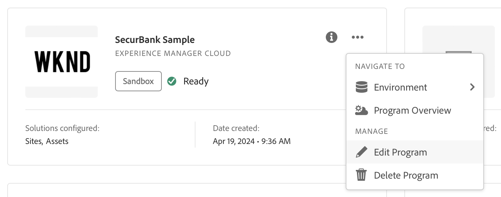

# Navigation dans l’interface utilisateur de Cloud Manager {#navigation}

Découvrez l’organisation de l’interface d’utilisation de Cloud Manager et comment gérer vos programmes et vos environnements.

L’interface d’utilisation de Cloud Manager est composée principalement de deux interfaces graphiques :

* [La console Mes programmes](#my-programs-console) permet d’afficher et de gérer tous vos programmes.
* [La fenêtre Vue d’ensemble du programme](#program-overview) permet de consulter les détails d’un programme individuel et de le gérer.

>[!TIP]
>
>Consultez également le [parcours de documentation d’intégration](/help/journey-onboarding/overview.md) pour un aperçu complet de la mise en service d’AEM as a Cloud Service à l’aide de Cloud Manager.

## Assistant IA dans AEM

Pour les clients qui ont [rempli les critères prérequis](/help/implementing/cloud-manager/ai-assistant-in-aem.md#get-access), l’assistant AI dans AEM est disponible pour les utilisateurs de leur entreprise. Voir [Assistant IA dans AEM](/help/implementing/cloud-manager/ai-assistant-in-aem.md).

## Console Mes programmes {#my-programs-console}

Lorsque vous vous connectez à Cloud Manager sur la page [my.cloudmanager.adobe.com](https://my.cloudmanager.adobe.com/) et que vous sélectionnez l’organisation appropriée, vous accédez à la console **Mes programmes**.

La console Mes programmes fournit une vue d’ensemble de tous les programmes auxquels vous avez accès dans l’organisation sélectionnée. Elle est constituée de plusieurs éléments.

1. Des [Barres d’outils](#toolbars-my-programs-toolbars) pour la sélection de l’organisation, les alertes et les paramètres de compte.
1. Onglets permettant de changer l’affichage actuel de vos programmes.
   * Vue **Accueil** (par défaut) qui sélectionne la vue **Mes programmes** avec une vue d’ensemble de tous les programmes.
   * **Licence** qui accède au [Tableau de bord des licences](/help/implementing/cloud-manager/license-dashboard.md).
   * Notez que les onglets sont fermés par défaut et peuvent être affichés à l’aide de l’icône  dans l’en-tête [Cloud Manager](#cloud-manager-header).
1. Des [Statistiques et un appel à l’action](#statistics) pour une vue d’ensemble de votre activité récente.
1. [**Section Mes programmes**](#my-programs-section) avec une vue d’ensemble de tous vos programmes.
1. [Liens rapides](#quick-links-section) pour accéder facilement aux ressources connexes.

>[!TIP]
>
>Voir la section [Programmes et types de programmes](/help/implementing/cloud-manager/getting-access-to-aem-in-cloud/program-types.md) pour plus d’informations sur les programmes.

### Barres d’outils {#my-programs-toolbars}

Il y a deux barres d’outils superposées.

#### Barre de navigation supérieure d’Experience Platform {#cloud-manager-header}

La première est la barre de navigation supérieure d’Experience Platform, qui persiste lorsque vous naviguez dans Cloud Manager. Il s’agit d’un élément ancré qui permet d’accéder aux paramètres et aux informations relatifs à l’ensemble des programmes Cloud Manager.

* L’icône  (afficher ou masquer le menu latéral) vous donne accès à divers onglets qui peuvent vous conduire à des parties spécifiques d’un programme individuel. Vous pouvez également basculer entre la console [Tableau de bord des licences](/help/implementing/cloud-manager/license-dashboard.md) et la console **[Mes programmes](#my-programs-console)** en fonction du contexte.
* L’ ([Notifications](/help/implementing/cloud-manager/notifications.md)) vous donne accès aux notifications et aux annonces, entre autres.

Pour plus d’informations sur la barre de navigation supérieure d’Experience Platform, consultez le guide de l’interface utilisateur de Adobe Experience Platform [&#128279;](https://experienceleague.adobe.com/fr/docs/experience-platform/landing/platform-ui/ui-guide#top-navigation-bar).

#### Barre d’outils du programme {#program-toolbar}

La barre d’outils des programmes fournit des liens pour basculer entre les programmes Cloud Manager et des actions contextuelles.

1. Le sélecteur **Mes programmes** ouvre une liste déroulante dans laquelle vous pouvez sélectionner rapidement d’autres programmes ou prendre des mesures adaptées au contexte, comme créer un nouveau programme
1. Le lien **Prise en main** vous donne accès au [parcours de documentation d’intégration](/help/journey-onboarding/overview.md) pour vous familiariser avec Cloud Manager.
1. Le bouton d’action propose des actions contextuelles, telles que l’ajout d’un programme.

### Statistiques et appels à l’action {#statistics}

La section Statistiques et call-to-action fournit des données agrégées pour votre organisation. Par exemple, si vous avez correctement configuré vos programmes, les statistiques de vos activités au cours des 90 derniers jours peuvent s’afficher, notamment :

* Le nombre de [déploiements](/help/implementing/cloud-manager/deploy-code.md)
* Le nombre de [problèmes relatifs à la qualité du code](/help/implementing/cloud-manager/code-quality-testing.md) identifiés
* Le nombre de versions

Si vous êtes au commencement de la configuration de votre organisation, vous pouvez obtenir des conseils sur les étapes suivantes ou des ressources de documentation.

### Section Mes programmes {#my-programs-section}

Le contenu principal de la console **Mes programmes** est la liste des programmes dans la section **Mes programmes**.

La section **Mes programmes** répertorie les cartes représentant chaque programme. Cliquez sur une carte pour accéder à la page **Vue d’ensemble du programme** du programme concerné pour obtenir plus d’informations sur le programme.

>[!NOTE]
>
>Selon vos privilèges, il se peut que vous ne puissiez pas sélectionner certains programmes.

Pour trouver plus facilement le programme dont vous avez besoin, utilisez les options de tri.

* Trier par :
   * **Date de création** (par défaut)
   * **Nom du programme**
   * **Statut**
*  Croissant (par défaut) /  Décroissant
*  Vue Grille (par défaut)
*  Vue Liste

#### Cartes de programme {#program-cards}

Une carte (ou une ligne dans un tableau) représente chaque programme, fournissant un aperçu du programme et des liens rapides pour agir.

* Image associée au programme, si elle est configurée. L’image ci-dessus est « WKND ».
* Nom attribué au programme. L’image ci-dessus montre « SecurBank Sample » comme nom du programme.
* Type de service :
   * **Experience Manager Cloud** — pour les programmes AEM as a Cloud Service
   * **Experience Manager** — pour les programmes [AMS (Adobe Managed Services)](https://experienceleague.adobe.com/fr/docs/experience-manager-cloud-manager/content/introduction)
* [Type de programme](/help/implementing/cloud-manager/getting-access-to-aem-in-cloud/program-types.md) :
   * Sandbox
   * Production
* Statut. Dans l’image ci-dessus, l’état est Prêt avec une coche.
* Solutions configurées. Dans l’image ci-dessus, Sites et Assets sont les solutions configurées.
* Date de création.

Un programme de production peut être badgé pour afficher les fonctionnalités supplémentaires que vous avez choisies au moment de l’ajouter, telles que :

*  [HIPAA](/help/implementing/cloud-manager/getting-access-to-aem-in-cloud/creating-production-programs.md#security)

*  [Protection WAF-DDOS](/help/implementing/cloud-manager/getting-access-to-aem-in-cloud/creating-production-programs.md#security)

* [99,99 % SLA (Service level agreement)](/help/implementing/cloud-manager/getting-access-to-aem-in-cloud/creating-production-programs.md#sla)

L’icône d’informations permet un accès rapide à des informations supplémentaires sur le programme (utile dans la vue Liste).

L’icône  vous donne accès à des actions supplémentaires que vous pouvez exécuter sur le programme.

* Accédez à une  [environnement](/help/implementing/cloud-manager/manage-environments.md) du programme
* Ouvrez l’ [présentation du programme](#program-overview)
*  [modifier le programme](/help/implementing/cloud-manager/getting-access-to-aem-in-cloud/editing-programs.md#editing)
*  [Supprimer un programme Sandbox](/help/implementing/cloud-manager/getting-access-to-aem-in-cloud/editing-programs.md#delete-sandbox-program)

>[!TIP]
>
>Pour plus d’informations sur les programmes, ainsi que sur l’ajout et la gestion de programmes, voir :
>
>* [Programmes et types de programmes](/help/implementing/cloud-manager/getting-access-to-aem-in-cloud/program-types.md)
>* [Créer des programmes de production](/help/implementing/cloud-manager/getting-access-to-aem-in-cloud/creating-production-programs.md)
>* [Créer des programmes Sandbox](/help/implementing/cloud-manager/getting-access-to-aem-in-cloud/creating-sandbox-programs.md)

### Section Liens rapides {#quick-links-section}

La section des liens rapides vous donne accès aux ressources couramment utilisées qui sont liées.

## Page de présentation du programme {#program-overview}

Lorsqu’un programme est sélectionné dans la console **[Mes programmes](#my-programs-console)**, vous êtes dirigé vers la page **Aperçu du programme**.

La vue d’ensemble du programme vous donne accès à toutes les informations d’un programme Cloud Manager. Comme la console **Mes programmes**, elle est composée de plusieurs parties.

1. [&#x200B; Barres d’outils &#x200B;](#program-overview-toolbar) pour revenir rapidement à la console Mes programmes et parcourir le programme
1. Des [onglets](#program-tabs) pour basculer entre les différents éléments du programme.
1. Un [appel à l’action](#cta) basé sur les dernières actions du programme.
1. Une [vue d’ensemble des environnements](#environments) du programme.
1. Une [vue d’ensemble des pipelines](#pipelines) du programme.
1. Un [aperçu des performances](#performance) du programme
1. Des liens vers des [ressources utiles](#useful-resources).

### Barres d’outils {#program-overview-toolbar}

Les barres d’outils de la présentation du programme sont similaires à celles de la [console Mes programmes](#my-programs-toolbars). Seules les différences sont indiquées ici.

#### En-tête de Cloud Manager {#cloud-manager-header-2}

Dans le coin supérieur gauche de la page se trouve l’en-tête Adobe Cloud Manager . Vous pouvez cliquer sur  pour afficher ou masquer le menu latéral des onglets dans d’autres zones du logiciel.

Cliquez sur Adobe Cloud Manager pour revenir à l’Accueil.

#### Barre d’outils du programme {#program-toolbar-2}

La barre d’outils du programme permet de basculer rapidement vers d’autres programmes, mais permet également d’accéder à des actions contextuelles telles que l’ajout et la modification du programme.

La barre d’outils affiche toujours l’onglet sur lequel vous vous trouvez actuellement, même si vous avez masqué les onglets à l’aide de l’icône .

### Onglets des programmes {#program-tabs}

Chaque programme comporte de nombreuses options et des données associées. Ces options et données sont regroupées dans des onglets pour faciliter la navigation dans le programme. Les onglets permettent d’accéder aux éléments suivants :

**Programme**

*  Aperçu - Aperçu du programme tel que décrit dans le document actuel
*  [Activité](/help/implementing/cloud-manager/configuring-pipelines/managing-pipelines.md#activity) - Historique des exécutions de pipeline du programme
*  [Pipelines](/help/implementing/cloud-manager/configuring-pipelines/managing-pipelines.md#pipelines) - Tous les pipelines configurés pour le programme
*  [Référentiels](/help/implementing/cloud-manager/managing-code/managing-repositories.md) - Tous les référentiels configurés pour le programme
*  [Rapports](/help/implementing/cloud-manager/reports/report-sla.md) - Mesures telles que les données SLA

**Services**

*  [Environnements](/help/implementing/cloud-manager/manage-environments.md) - Tous les environnements configurés pour le programme
*  [Sites Edge Delivery](/help/implementing/cloud-manager/edge-delivery/introduction-to-edge-delivery-services.md) - Gérer les sites Edge Delivery
*  [Paramètres de domaine](/help/implementing/cloud-manager/custom-domain-names/introduction.md) - Gérer les noms de domaine personnalisés pour le programme
*  [Certificats SSL](/help/implementing/cloud-manager/managing-ssl-certifications/introduction-to-ssl-certificates.md) - Gérer les certificats SSL du programme
*  [Mappages de domaine](/help/implementing/cloud-manager/custom-domain-names/introduction.md) - Gérer les mappages de domaine
*  [`IP Allow Lists`](/help/implementing/cloud-manager/ip-allow-lists/introduction.md) - Définissez des listes autorisées pour certaines adresses IP
*  [Jeux de contenu](/help/implementing/developing/tools/content-copy.md) - Jeux de contenu créés à des fins de copie
*  [Activité de copie de contenu](/help/implementing/developing/tools/content-copy.md) - Activités de copie de contenu
*  [Infrastructure réseau](/help/security/configuring-advanced-networking.md) - Gérer les options de mise en réseau avancées pour le programme

**Ressources**

*  Parcours d’apprentissage - Ressources d’apprentissage supplémentaires sur Cloud Manager

Par défaut, lorsque vous ouvrez un programme, vous accédez à l’onglet **Vue d’ensemble**. L’onglet actif est mis en surbrillance. Sélectionnez un autre onglet pour afficher ses détails.

Dans le coin supérieur gauche de l&#39;en-tête [Cloud Manager](#cloud-manager-header-2), cliquez sur  pour afficher ou masquer le menu latéral des onglets.

### Appel à l’action {#cta}

La section Appel à l’action fournit des informations utiles en fonction du statut de votre programme. Pour un nouveau programme, vous pouvez voir les étapes suivantes données et un rappel d’une date de mise en production, [définie lors de la création du programme](/help/implementing/cloud-manager/getting-access-to-aem-in-cloud/editing-programs.md).

Pour un programme actif, vous pouvez voir le statut de votre dernier déploiement accompagné de liens pour obtenir plus de détails pour démarrer un nouveau déploiement.

### Carte Environnements {#environments}

La carte **Environnements** vous fournit une vue d’ensemble de vos environnements, ainsi que des liens vers les actions rapides.

La carte **Environnements** répertorie seulement trois environnements. Cliquez sur  **Tout afficher** pour afficher tous les environnements du programme.

Voir aussi [Gérer les environnements](/help/implementing/cloud-manager/manage-environments.md).

### Carte Pipelines {#pipelines}

La carte **Pipelines** fournit une vue d’ensemble de vos pipelines ainsi que des liens vers les actions rapides.

La vignette **Pipelines** répertorie seulement trois pipelines. Cliquez sur  **Tout afficher** pour afficher tous les pipelines du programme.

Voir aussi [Gestion des pipelines](/help/implementing/cloud-manager/configuring-pipelines/managing-pipelines.md) pour plus d’informations sur la gestion de vos pipelines.

### Carte de performance {#performance}

La carte **Performances** donne un aperçu du tableau de bord **[CDN](/help/implementing/cloud-manager/cdn-performance.md)**.

### Ressources utiles {#useful-resources}

La section **Ressources utiles** fournit des liens vers des ressources de formation supplémentaires pour Cloud Manager.
