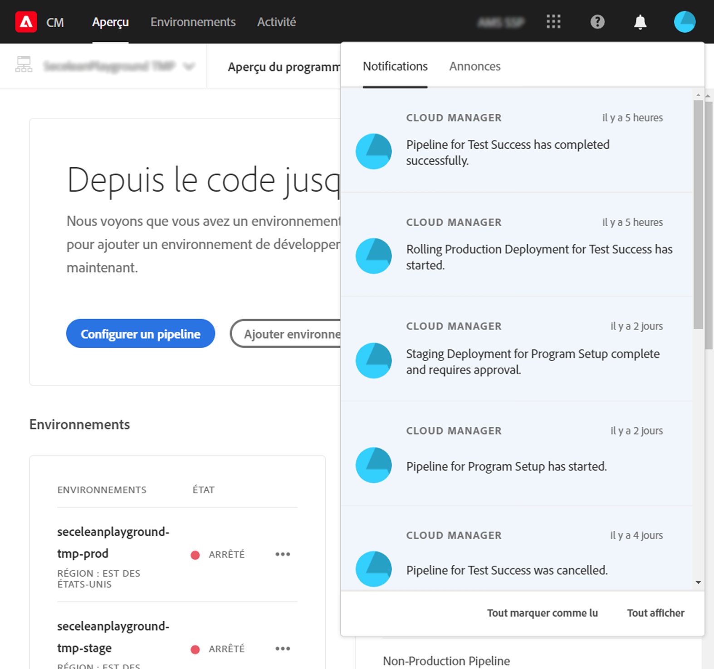

# Présentation des notifications {#notifications}

[!UICONTROL Cloud Manager] permet à l’utilisateur de recevoir des notifications lorsque le pipeline de production démarre et se termine (avec succès ou non), au début d’un déploiement de production. Ces notifications sont envoyées via le système de notification Adobe [!UICONTROL Experience Cloud].

>[!NOTE]
>
>Les notifications Approbation et Planifié sont envoyées uniquement aux utilisateurs ayant les rôles Propriétaire de l’entreprise, Responsable de programme et Responsable de déploiement.

Les notifications s’affichent dans une barre latérale dans l’IU (interface utilisateur) de [!UICONTROL Cloud Manager] et dans Adobe [!UICONTROL Experience Cloud].

Cliquez sur l’icône représentant une cloche dans l’en-tête pour ouvrir la barre latérale et afficher les notifications, comme illustré dans la figure suivante :

La barre latérale répertorie les notifications les plus récentes.

## Notifications par e-mail {#email-notifications}

Par défaut, les notifications sont disponibles dans l’interface utilisateur web de toutes les solutions Adobe [!UICONTROL Experience Cloud]. Les utilisateurs peuvent également opter pour l’envoi de ces notifications par e-mail, de manière immédiate ou dans le cadre de résumé.

L’utilisateur sera alors dirigé vers l’écran Préférences de notifications dans Adobe [!UICONTROL Experience Cloud].

Les utilisateurs peuvent activer les notifications par e-mail et (facultativement) sélectionner les types de notifications qu’ils souhaitent recevoir par e-mail.

>[!NOTE]
>
>Vous pouvez également activer la synthèse à partir d’Adobe [!UICONTROL Experience Cloud], comme illustré ci-dessous :
