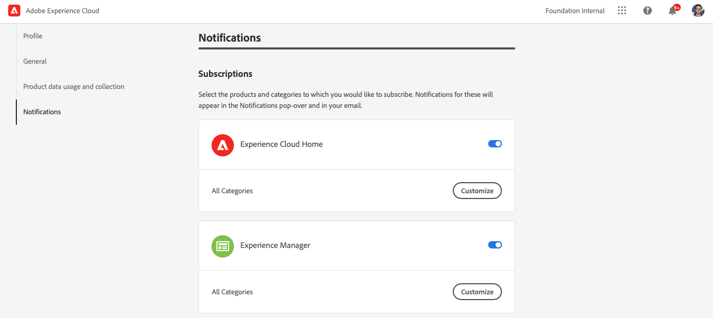

# Notifications {#notifications}

[!UICONTROL Cloud Manager] permet à l’utilisateur de recevoir des notifications lorsque le pipeline de production démarre et se termine (avec succès ou non), lors d’un déploiement en production.

Ces notifications sont envoyées via l’Adobe [!UICONTROL Experience Cloud] système de notification aux utilisateurs disposant de rôles **Propriétaire de l’entreprise**, **Responsable de programme**, et **Responsable de déploiement**.

Les notifications s’affichent à l’extrémité droite de la barre de menus dans la [!UICONTROL Cloud Manager] Interface utilisateur et dans tout l’Adobe [!UICONTROL Experience Cloud].

L’icône représentant une cloche est marquée d’un badge lorsqu’il y a de nouvelles notifications. Cliquez dessus pour ouvrir un panneau afin d’afficher les notifications.

Le panneau répertorie uniquement les notifications les plus récentes. Cliquez sur **Afficher tout** au bas du panneau pour afficher toutes vos notifications.

## Notifications par e-mail {#email-notifications}

Par défaut, les notifications sont disponibles dans l’interface utilisateur de toutes les solutions [!UICONTROL Experience Cloud] d’Adobe. Les utilisateurs peuvent également choisir d’envoyer ces notifications par courrier électronique en procédant comme suit.

1. Cliquez sur l’icône représentant une cloche pour afficher les notifications.
1. Cliquez sur le bouton **Modifier les préférences** (en forme d’engrenage) en haut du panneau des notifications.
1. Dans la fenêtre qui s’ouvre, cliquez sur **Notifications** dans le volet de navigation de gauche.
   
1. Faites défiler l’écran vers le bas jusqu’à **Email** en-tête.
   
1. Sélectionnez le mode de réception de vos emails.
   * Ne pas envoyer d’emails (par défaut)
   * Notifications instantanées
   * Résumé quotidien
   * Résumé hebdomadaire

Une fois votre sélection effectuée, votre choix est automatiquement enregistré sans qu’il faille cliquer sur un bouton Enregistrer ou appliquer .
