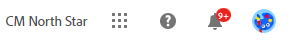
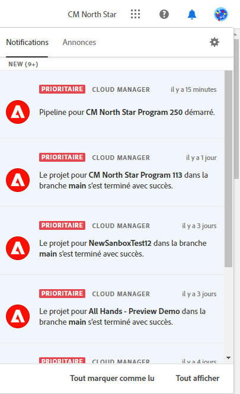
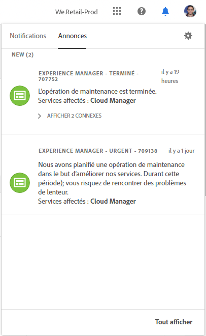
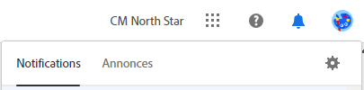
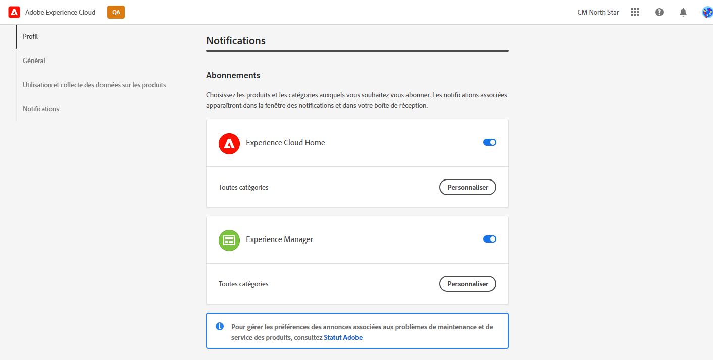
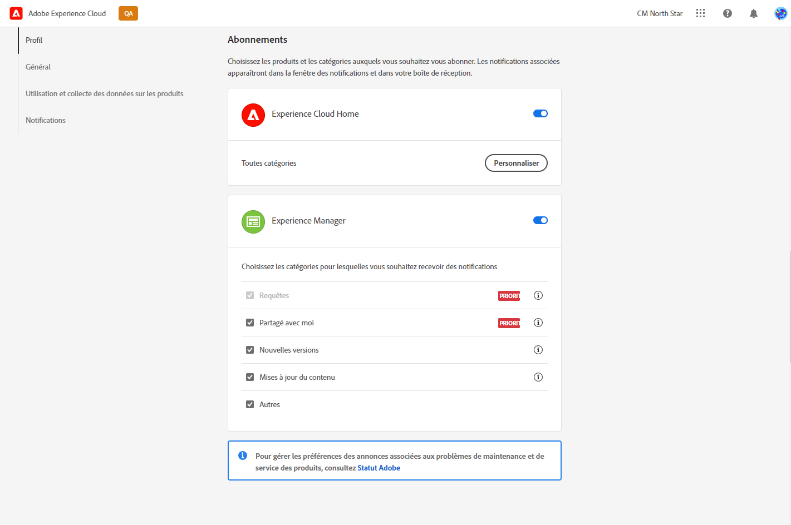
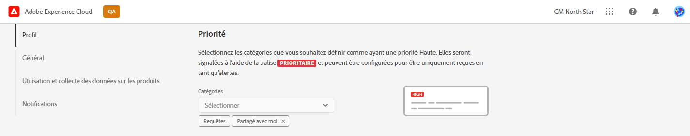
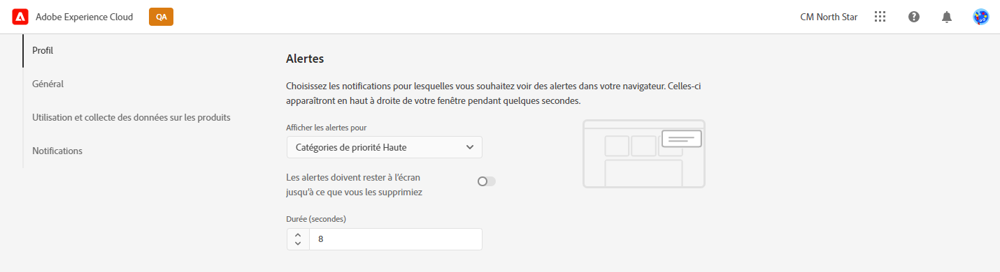
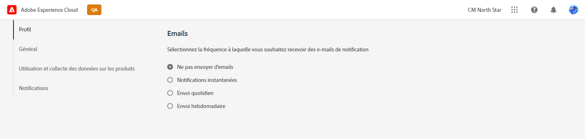

# Notifications {#notifications}

Découvrez comment Cloud Manager vous informe des événements importants.

## Notifications dans Cloud Manager {#cloud-manager-notifications}

 Fournit des notifications lorsqu’un pipeline de production démarre et se termine (avec succès ou non) au cours d’un déploiement en production.

Ces notifications sont envoyées via le système de notification [!UICONTROL CX Enterprise] aux utilisateurs possédant les rôles **Propriétaire de l’entreprise**, **Responsable de programme** et **Responsable de déploiement**.

Les notifications s’affichent dans une barre latérale dans  et dans Adobe [!UICONTROL CX Enterprise]. L’icône représentant une cloche dans l’en-tête affiche un badge lorsque vous recevez de nouvelles notifications.

Cliquez sur l’icône en forme de cloche pour ouvrir la barre latérale et afficher les notifications. L’onglet **Notifications** dans la barre latérale répertorie les notifications les plus récentes, telles que les confirmations de déploiement. Les notifications concernent vos environnements.

L’onglet **Annonces** comprend les annonces de produits Adobe. Les annonces concernent le produit.

Cliquez sur une notification ou une annonce pour en afficher les détails. Les notifications liées à des activités telles que les déploiements de pipeline vous permettent d’accéder aux détails de cette activité, tels que la fenêtre d’exécution du pipeline.

Cliquez sur l’option **Afficher tout** au bas du panneau pour afficher toutes les annonces dans votre boîte de réception.

Cliquez sur l’option **Tout marquer comme lu** au bas du panneau pour marquer toutes les notifications non lues comme lues et effacer le badge de l’icône en forme de cloche.

## Configuration des notifications {#configuration}

Vous pouvez personnaliser le mode de réception des notifications et les notifications que vous recevez.

Cliquez sur l’icône des paramètres située en haut de la barre latérale de notifications pour ouvrir la fenêtre **Préférences CX Enterprise**. À partir de là, vous pouvez définir vos abonnements aux notifications et la manière dont vous recevez les notifications.

### Abonnements {#subscriptions}

Les abonnements définissent les produits pour lesquels vous recevez des notifications et les types de notifications que vous recevez.

Par défaut, vous recevez toutes les notifications pour tous les produits dans l’application et par e-mail. Cliquez sur le chevron en regard d’un nom de produit pour afficher les options détaillées et définir les types de notifications que vous recevez pour ce produit. Vous pouvez également cocher ou désélectionner les options au niveau du produit pour sélectionner/désélectionner toutes les options du produit.

### Priorité {#priority}

Les alertes de priorité sont marquées d’un libellé **ÉLEVÉ**. Vous pouvez configurer leur réception en tant qu’alertes. Dans la section **Priorité**, vous pouvez définir les catégories qui remplissent les critères de notification de priorité.

Utilisez le menu déroulant pour ajouter à la liste des catégories qui remplissent les critères de priorité. Cliquez sur l’icône de suppression en regard des noms de catégorie pour les supprimer.

### Alertes {#alerts}

Les alertes s’affichent dans le coin supérieur droit de la fenêtre pendant quelques secondes. Utilisez la section **Alertes** pour définir les notifications pour lesquelles vous recevez des alertes.

Vous pouvez définir le comportement des alertes.

* **Afficher les alertes pour** - Définit les types de notifications qui déclenchent des alertes.
* **Les alertes restent à l’écran jusqu’à ce que vous les supprimiez** - Contrôle si les alertes persistent, sauf si vous les ignorez activement.
* **Durée** - Définit la durée pendant laquelle l’alerte reste à l’écran si vous ne les avez pas configurées pour persister.

### E-mails {#emails}

Les notifications sont disponibles dans l’interface utilisateur web de toutes les solutions Adobe [!UICONTROL CX Enterprise]. Pour que ces notifications soient envoyées par e-mail, utilisez la section **E-mails**.

Par défaut, aucun e-mail n’est envoyé. Vous pouvez choisir de recevoir des e-mails :

* Immédiatement
* Chaque jour
* Chaque semaine

Lorsque vous choisissez **Notifications instantanées**, les e-mails sont envoyés immédiatement pour chaque notification. Pour **Envoi quotidien** et **Envoi hebdomadaire**, vous pouvez choisir le moment où votre résumé quotidien est envoyé, ainsi que le jour et le moment où votre résumé hebdomadaire est envoyé.