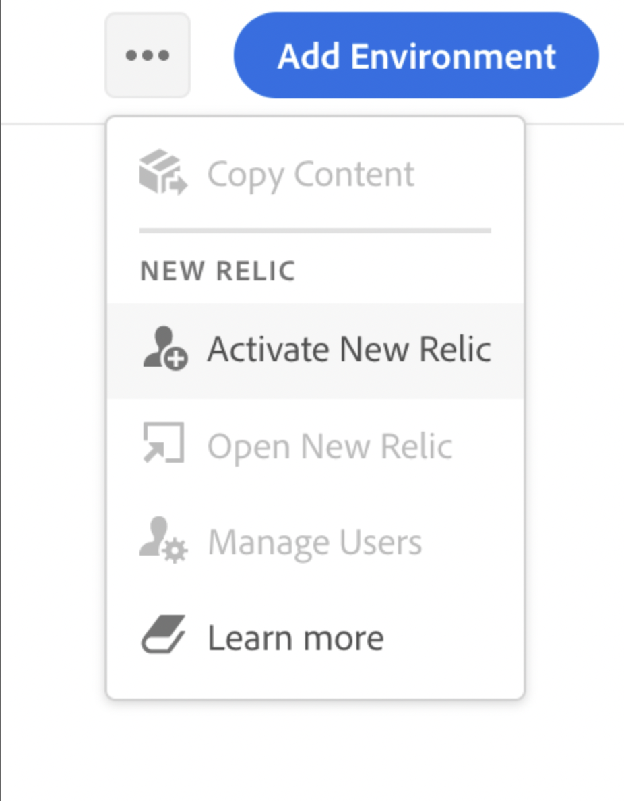

# New Relic One {#user-access}

Découvrez le service de surveillance des performances de l’application New Relic One (APM) pour AEM as a Cloud Service et comment y accéder.

## À propos de New Relic One {#introduction}

Adobe accorde une importance considérable à la surveillance, la disponibilité et les performances de votre application. AEM as a Cloud Service permet d’accéder à la surveillance New Relic One, offrant ainsi aux équipes une visibilité complète sur les mesures de performances du système et de l’environnement dans le cadre de l’offre de produit standard.

Ce document explique comment gérer l’accès aux fonctionnalités de surveillance des performances des applications (APM) New Relic One dans les environnements AEM as a Cloud Service. Une gestion efficace de ces fonctionnalités permet d’obtenir des performances optimales et d’optimiser les avantages d’AEM as a Cloud Service.

Lors de la création d’un programme de production, le sous-compte New Relic One associé à votre programme AEM as a Cloud Service est automatiquement créé. [Ce sous-compte doit être activé](#activate-sub-account) pour commencer l’ingestion de données.

## Fonctionnalités {#transaction-monitoring}

Les fonctionnalités de surveillance des performances (APM) de l’application New Relic One d’AEM as a Cloud Service sont nombreuses.

* Accès direct à un compte New Relic One dédié.

* Agent New Relic One APM instrumenté qui affiche les appels de méthode exacts avec les numéros de ligne, y compris les dépendances externes et les bases de données.

* Optimisation holistique des performances en combinant des mesures clés issues de la surveillance au niveau de l’infrastructure et de la surveillance des applications (Adobe Experience Manager).

## Activation de votre sous-compte New Relic One {#activate-sub-account}

Pour un programme nouvellement créé, un sous-compte New Relic One est créé pour vous. Cependant, vous devez l’activer pour qu’il puisse ingérer des données. Cette activation n’est pas automatique. Pour activer votre sous-compte, procédez comme suit.

>[!NOTE]
>
>Un utilisateur doté du rôle **Propriétaire de l’entreprise** doit être connecté pour gérer le sous-compte New Relic One.

1. Connectez-vous à Cloud Manager à l’adresse [my.cloudmanager.adobe.com](https://my.cloudmanager.adobe.com/) et sélectionnez l’organisation appropriée.

1. Sur la console **[Mes programmes](/help/implementing/cloud-manager/navigation.md#my-programs)**, cliquez sur le programme pour lequel vous souhaitez gérer vos utilisateurs New Relic One.

1. Au bas de la vignette **Environnements** sur la page de présentation du programme, cliquez sur  et sélectionnez **Activer New Relic**.

   

   * Vous pouvez également accéder à l’option **Gérer les utilisateurs**. Dans la partie supérieure de l’écran **Environnements** de votre programme, cliquez sur .

1. [Exécutez un pipeline](/help/implementing/cloud-manager/configuring-pipelines/managing-pipelines.md#running-pipelines) pour le même environnement jusqu’à la fin réussie de l’activation du sous-compte.

Lorsque le sous-compte est désactivé, il n’y a aucune ingestion de données.

## Gestion des utilisateurs New Relic One {#manage-users}

Suivez ces étapes pour définir les utilisateurs de votre sous-compte New Relic One relatifs à votre programme AEM as a Cloud Service.

>[!NOTE]
>
>Un utilisateur doté du rôle **Propriétaire de l’entreprise** ou **Responsable de déploiement** doit être connecté pour gérer les utilisateurs New Relic One.

1. Connectez-vous à Cloud Manager à l’adresse [my.cloudmanager.adobe.com](https://my.cloudmanager.adobe.com/) et sélectionnez l’organisation appropriée.

1. Cliquez sur le programme pour lequel vous souhaitez gérer vos utilisateurs New Relic One.

1. Au bas de la vignette **Environnements** sur la page de présentation du programme, cliquez sur  et sélectionnez **Gérer les utilisateurs**.

   

   * Vous pouvez également accéder à l’option **Gérer les utilisateurs**. Dans la partie supérieure de l’écran **Environnements** de votre programme, cliquez sur .

1. Dans la boîte de dialogue **Gérer les utilisateurs New Relic**, saisissez le prénom et le nom de l’utilisateur que vous souhaitez ajouter, puis cliquez sur le bouton **Ajouter**. Répétez cette étape pour tous les utilisateurs que vous souhaitez ajouter.

   

1. Pour supprimer un utilisateur New Relic One, cliquez sur le bouton de suppression à l’extrémité droite de la ligne représentant l’utilisateur.

1. Cliquez sur **Enregistrer** pour créer les utilisateurs.

Une fois les utilisateurs définis, New Relic envoie un e-mail de confirmation à chaque utilisateur auquel vous avez accordé l’accès afin que l’utilisateur puisse terminer le processus de configuration et se connecter.

>[!NOTE]
>
>Si vous gérez les utilisateurs New Relic One, vous devez également vous ajouter en tant qu’utilisateur pour pouvoir y accéder vous-même. Être le **propriétaire de l’entreprise** ou le **responsable de déploiement** ne suffit pas pour avoir accès à New Relic One. Vous devez également vous créer en tant qu’utilisateur.

## Activation de votre compte utilisateur New Relic One {#activate-user-account}

Une fois qu’un compte d’utilisateur New Relic One est créé, comme décrit dans la section d’aperçu [Gérer les utilisateurs New Relic One](#manage-users), New Relic envoie à ces utilisateurs un e-mail de confirmation à l’adresse fournie. Pour utiliser ces comptes, les utilisateurs doivent d’abord activer leurs comptes avec New Relic en réinitialisant leurs mots de passe.

**Pour activer votre compte utilisateur New Relic One, procédez comme suit**

1. Cliquez sur le lien fourni dans l’e-mail à partir de New Relic.

1. Sur la page de connexion de New Relic, cliquez sur **Mot de passe oublié ?**

   

1. Saisissez l’adresse e-mail à laquelle vous avez reçu l’e-mail de confirmation, puis sélectionnez **Envoyer mon lien de réinitialisation**.

   

1. New Relic vous envoie un e-mail contenant un lien pour confirmer le compte.

Si vous ne recevez pas d’e-mail de confirmation de la part de New Relic, consultez la [section de dépannage](#troubshooting).

## Accéder à New Relic One {#accessing-new-relic}

Une fois que vous avez [activé votre compte New Relic](#activate-account), vous pouvez accéder à New Relic One par le biais de Cloud Manager ou directement.

**Pour accéder à New Relic One par le biais de Cloud Manager :**

1. Connectez-vous à Cloud Manager à l’adresse [my.cloudmanager.adobe.com](https://my.cloudmanager.adobe.com/) et sélectionnez l’organisation appropriée.

1. Cliquez sur le programme pour lequel vous souhaitez accéder à New Relic One.

1. Au bas de la vignette **Environnements** sur la page de présentation du programme, cliquez sur  et sélectionnez **Ouvrir New Relic**.

   

   * Vous pouvez également accéder à New Relic. Dans la partie supérieure de l’écran **Environnements** de votre programme, cliquez sur .

1. Dans le nouvel onglet du navigateur qui s’ouvre, connectez-vous à New Relic One.

**Pour accéder directement à New Relic One, procédez comme suit**

1. Accédez à la page de connexion de New Relic à l’adresse [`https://login.newrelic.com/login`](https://login.newrelic.com/login)

1. Connectez-vous à New Relic One.

### Vérifier l’e-mail {#verify-email}

S’il vous est demandé de vérifier votre e-mail lors de la connexion à New Relic One, cela signifie que celui-ci est associé à plusieurs comptes. Vous pouvez choisir le compte auquel accéder.

Si vous ne vérifiez pas votre adresse e-mail, New Relic tente de vous connecter avec l’enregistrement utilisateur le plus récemment créé associé à votre adresse e-mail. Pour éviter de vérifier votre e-mail à chaque connexion, cochez la case **Mémoriser mon adresse** dans l’écran de connexion.

Pour obtenir de l’aide, ouvrez un ticket de support via le [Portail d’assistance AEM](https://helpx.adobe.com/fr/enterprise/using/support-for-experience-cloud.html).

## Résolution des problèmes d’accès des utilisateurs de New Relic One {#troubleshooting}

Si vous avez été ajouté en tant qu’utilisateur New Relic One, comme décrit dans [Gérer les utilisateurs New Relic One](#manage-users), et que vous ne parvenez pas à localiser l’e-mail de confirmation de compte d’origine, vous pouvez effectuer les étapes de dépannage suivantes.

**Pour résoudre les problèmes d’accès utilisateur de New Relic One, procédez comme suit**

1. Accédez à la page de connexion de New Relic à l’adresse [`login.newrelic.com/login`](https://login.newrelic.com/login).

1. Cliquez sur **[!UICONTROL Mot de passe oublié ?]**.

   

1. Saisissez l’adresse e-mail utilisée pour créer votre compte, puis sélectionnez **Envoyer mon lien de réinitialisation**.

   

1. New Relic vous envoie un e-mail contenant un lien pour confirmer le compte.

Si vous avez terminé le processus d’inscription et que vous ne parvenez pas à vous connecter à votre compte en raison de messages d’erreur relatifs à votre e-mail ou à votre mot de passe, enregistrez un ticket d’assistance par le biais de [Admin Console](https://adminconsole.adobe.com/).

Si vous ne recevez pas d’e-mail de New Relic, procédez comme suit :

* Vérifiez vos [filtres anti-spam](https://docs.newrelic.com/docs/accounts/accounts-billing/account-setup/create-your-new-relic-account/).
* Le cas échéant, [ajoutez New Relic placer sur la liste autorisée à votre e-mail](https://docs.newrelic.com/docs/accounts/accounts/account-maintenance/account-email-settings/#email-whitelist).
* Si aucune suggestion ne vous aide, envoyez vos commentaires sur le ticket d’assistance.

## Remarques sur l’utilisation {#usage-notes}

* 30 utilisateurs ou utilisatrices au maximum peuvent être ajouté(e)s. Si le nombre maximal d’utilisateurs et utilisatrices a été atteint, supprimez des utilisateurs et utilisatrices pour pouvoir en ajouter de nouveaux.
* Les utilisateurs ajoutés à New Relic sont de type **De base**. Voir la documentation de [New Relic pour plus de détails](https://docs.newrelic.com/docs/accounts/accounts-billing/new-relic-one-user-management/user-type/).
* AEM as a Cloud Service ne propose que la solution New Relic One APM et ne prend pas en charge les intégrations d’alertes, de journalisation ou d’API.

>[!NOTE]
>
>Si aucune activité **connexion utilisateur** n’est détectée dans votre sous-compte New Relic One pendant 30 jours ou plus, l’agent APM est arrêté. Les données ne sont pas envoyées d’AEM Cloud Service vers New Relic. *Les données ne sont pas envoyées à nouveau tant que votre sous-compte n’est pas réactivé.*
>
>Suivez les mêmes étapes que celles de la section [ Activer votre sous-compte New Relic One ](#activate-sub-account) de ce document pour réactiver votre sous-compte New Relic One.

Pour obtenir de l’aide ou des conseils supplémentaires sur les offres New Relic One pour votre programme AEM as a Cloud Service, ouvrez un ticket de support au moyen du Portail d’assistance AEM .

## Questions fréquentes {#faqs}

+++**Que surveille Adobe avec New Relic One ?**

Adobe contrôle les services de création, de publication et de prévisualisation (le cas échéant) d’AEM as a Cloud Service via le plug-in Java de New Relic One. Adobe active la télémétrie et la surveillance personnalisées de New Relic One APM dans les environnements AEM as a Cloud Service de production et hors production.

Votre compte New Relic One est associé à un compte principal géré par Adobe et comporte plusieurs rapports d’applications ; trois par environnement AEM as a Cloud Service.

* Une application pour le service de création par environnement.
* Une application pour le service `Publish` par environnement (y compris la publication Golden).
* Une application pour le service de prévisualisation par environnement.

Remarque :

* Chaque application utilise une clé de licence.
* Les environnements AEM as a Cloud Service ne signalent qu’un seul compte New Relic One.
* Les mesures et événements de surveillance complets pour les deux New Relic One sont conservés pendant trois mois.

+++

+++**Adobe envoie-t-il des notifications d’alerte depuis New Relic One ?**

Adobe fournit un accès à New Relic One à des fins d’observabilité uniquement et ne l’utilise pas pour les alertes client ou opérationnelles internes. Les notifications relatives aux incidents sont envoyées à l’aide de [ profils de notification utilisateur ](/help/journey-onboarding/notification-profiles.md).
+++

+++**Qui peut accéder aux données du service cloud New Relic One ?**

Un accès complet en lecture est accordé à un maximum de 30 membres de votre équipe. L’accès en lecture comprend toutes les mesures APM collectées par l’agent New Relic One.
+++

+++**La configuration personnalisée de l’authentification unique est-elle prise en charge ?**

La configuration personnalisée de la fonction SSO n’est pas prise en charge pour le compte New Relic One fourni par Adobe.
+++

+++**Que se passe-t-il si je dispose déjà d’un abonnement New Relic On-premise ?**

New Relic One est la nouvelle plateforme d’observabilité de New Relic. Elle permet à l’assistance d’Adobe et à vos équipes d’observer, de surveiller et d’afficher les mesures et les événements, le tout à un seul endroit.

New Relic One offre aux utilisateurs la possibilité d’effectuer des recherches dans tous les comptes auxquels ils ont accès et de visualiser les données de tous les services et hôtes en une seule vue.

L’assistance Adobe surveille AEM as a Cloud Service avec New Relic One et d’autres outils, tandis que vos équipes peuvent toujours utiliser New Relic pour les services et infrastructures sur site. Elles pourront visualiser les données provenant à la fois du compte New Relic One d’Adobe et des comptes New Relic gérés par le client ou la cliente.

>[!NOTE]
>
>Pour afficher les deux jeux de données dans New Relic One, un utilisateur ou une utilisatrice doit disposer des autorisations appropriées et utiliser la même méthodologie de connexion pour les deux comptes (New Relic One d’Adobe et les comptes New Relic gérés par le client ou la cliente).

+++

+++**L&#39;agent APM pour mon compte New Relic One est arrêté. Que s&#39;est-il passé ?**

[Les agents APM sont arrêtés](#limitations) si aucune activité n’est détectée pendant 30 jours ou plus. Suivez les mêmes étapes que celles de la section [ Activer votre sous-compte New Relic One ](#activate-sub-account) de ce document pour réactiver votre sous-compte New Relic One.
+++
