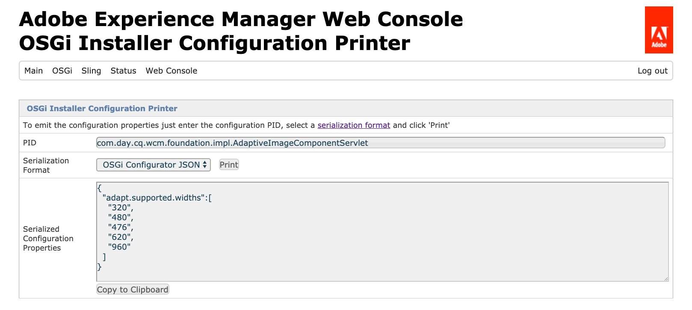

# Configuration d’OSGi pour Adobe Experience Manager as a Cloud Service {#configuring-osgi-for-aem-as-a-cloud-service}

Le framework [OSGi](https://www.osgi.org/) est un élément fondamental de la pile technologique d’Adobe Experience Manager (AEM). Il est utilisé pour contrôler les lots composites d’AEM et leurs configurations.

OSGi fournit les primitives normalisées qui permettent de construire des applications à partir de petits composants réutilisables et collaboratifs. Ces composants peuvent être créés dans une application et déployés. Cela permet une gestion conviviale des lots OSGi, car ils peuvent être arrêtés, installés et démarrés individuellement. Les interdépendances sont gérées automatiquement. Chaque composant OSGi est contenu dans l’un des différents lots. Pour plus d’informations, voir la [spécification OSGi](https://help.eclipse.org/latest/index.jsp).

Vous pouvez gérer les paramètres de configuration des composants OSGi par le biais de fichiers de configuration intégrés à un projet de code AEM.

>[!TIP]
>
>Vous pouvez utiliser Cloud Manager pour configurer les variables d’environnement. Pour plus d’informations, reportez-vous à la documentation [ici](/help/implementing/cloud-manager/environment-variables.md).

## Fichiers de configuration OSGi {#osgi-configuration-files}

Les modifications de configuration sont définies dans les packages de code du projet AEM (`ui.config`) en tant que fichiers de configuration (`.cfg.json`) sous les dossiers de configuration spécifiques au mode d’exécution :

`/apps/example/config.<runmode>`

Le format des fichiers de configuration OSGi est basé sur JSON et suit le format `.cfg.json` défini par le projet Apache Sling.

Les configurations OSGi ciblent les composants OSGi à l’aide de leur identifiant persistant (PID), qui correspond, par défaut, au nom de classe Java™ du composant OSGi. Par exemple, pour fournir une configuration OSGi pour un service OSGi implémenté par :

`com.example.workflow.impl.ApprovalWorkflow.java`

un fichier de configuration OSGi est défini à l’adresse suivante :

`/apps/example/config/com.example.workflow.impl.ApprovalWorkflow.cfg.json`

selon le format de configuration OSGi `cfg.json`.

>[!NOTE]
>
>Les versions antérieures d’AEM prenaient en charge les fichiers de configuration OSGi à l’aide de différents formats de fichiers tels que `.cfg`, `.config` et les définitions de ressources `sling:OsgiConfig` XML. Ces formats sont remplacés par le format de configuration OSGi `.cfg.json`.

>[!NOTE]
>
>Les configurations OSGi ne sont pas stockées sous /apps comme les instances AEM standard dans le cloud, elles sont stockées dans un emplacement externe. Archivez Cloud Manager [Developer Console](https://experienceleague.adobe.com/fr/docs/experience-manager-learn/cloud-service/debugging/debugging-aem-as-a-cloud-service/developer-console#configurations) pour afficher les configurations OSGi.

## Résolution du mode d’exécution {#runmode-resolution}

>[!TIP]
>
>AEM 6.x prend en charge les modes d’exécution personnalisés, mais AEM as a Cloud Service ne le fait pas. AEM as a Cloud Service prend en charge un [ensemble exact de modes d’exécution](./overview.md#runmodes). Toute variation des configurations OSGi entre les environnements AEM as a Cloud Service doit être traitée à l’aide de [Variables d’environnement de configuration OSGi](#environment-specific-configuration-values).

Il est possible de cibler des configurations OSGi spécifiques sur des instances AEM données grâce aux modes d’exécution. Pour utiliser un mode d’exécution, créez des dossiers de configuration sous `/apps/example` (« example » correspondant au nom de votre projet), selon le format suivant :

`/apps/example/config.<author|publish>.<dev|stage|prod>/`

Les configurations OSGi de ces dossiers sont utilisées si les modes d’exécution définis dans le nom de dossier de configuration correspondent aux modes utilisés par AEM.

Par exemple, si AEM utilise les modes d’exécution author et dev, les nœuds de configuration contenus dans `/apps/example/config.author/` et `/apps/example/config.author.dev/` sont appliqués, tandis que les nœuds de configuration contenus dans `/apps/example/config.publish/` et `/apps/example/config.author.stage/` ne le sont pas.

Si plusieurs configurations correspondant au même PID sont applicables, la configuration comportant le nombre le plus élevé de modes d’exécution correspondants est appliquée.

La granularité de cette règle se trouve au niveau du PID. Vous ne pouvez pas définir certaines propriétés pour le même PID dans `/apps/example/config.author/` et des propriétés plus spécifiques dans `/apps/example/config.author.dev/` pour le même PID. La configuration comportant le nombre le plus élevé de modes d’exécution correspondants est effective pour tout le PID.

>[!NOTE]
>
>Un dossier de configuration OSGI `config.preview` **ne peut pas** être déclaré de la même manière qu’un `config.publish` peut être déclaré en tant que dossier. Au lieu de cela, le niveau de prévisualisation hérite de sa configuration OSGI des valeurs du niveau de publication.

Lors d’un développement local, un paramètre de démarrage en mode d’exécution, `-r`, est utilisé pour spécifier la configuration OSGI du mode d’exécution.

```shell
$ java -jar aem-sdk-quickstart-xxxx.x.xxx.xxxx-xxxx.jar -r publish,dev
```

### Vérifier les modes d’exécution

Les modes d’exécution AEM as a Cloud Service sont bien définis en fonction du type d’environnement et du service. Consultez la [liste complète des modes d’exécution d’AEM as a Cloud Service disponibles](./overview.md#runmodes).

Les valeurs de configuration OSGi spécifiées par le mode d’exécution peuvent être vérifiées en :

1. Ouvrant [Developer Console](https://experienceleague.adobe.com/docs/experience-manager-learn/cloud-service/debugging/debugging-aem-as-a-cloud-service/developer-console.html?lang=fr) pour les environnements AEM as a Cloud Services
1. Sélectionnant le ou les niveaux de service à inspecter, à l’aide de la liste déroulante __Pod__
1. Sélectionnant l’onglet __Statut__ 
1. Sélectionnant __Configurations__ dans la liste déroulante __Export de statut__
1. Cliquant sur le bouton __Obtenir le statut__

La vue résultante affiche toutes les configurations de composant OSGi pour le ou les niveaux sélectionnés avec leurs valeurs de configuration OSGi applicables. Ces valeurs peuvent être référencées de manière croisée avec les valeurs de configuration OSGi dans le code source du projet AEM sous `/apps/example/osgiconfig/config.<runmode(s)>`.


Pour vérifier que les valeurs de configuration OSGi appropriées sont appliquées :

1. Dans la sortie Configuration de Developer Console
1. Recherchez le `pid` représentant la configuration OSGi à vérifier ; il s’agit du nom du fichier de configuration OSGi dans le code source du projet AEM.
1. Vérifiez la liste `properties` pour le `pid` et que la clé et les valeurs correspondent au fichier de configuration OSGi dans le code source du projet AEM pour le mode d’exécution en cours de vérification. =


## Types de valeurs de configuration OSGi {#types-of-osgi-configuration-values}

Il existe trois types de valeurs de configuration OSGi utilisables avec Adobe Experience Manager as a Cloud Service.

1. **Valeurs intégrées**, codées en dur dans la configuration OSGi et stockées dans Git. Par exemple :

   ```json
   {
      "connection.timeout": 1000
   }
   ```

1. **Valeurs secrètes**, qui ne doivent pas être stockées dans Git pour des raisons de sécurité. Par exemple :

   ```json
   {
   "api-key": "$[secret:server-api-key]"
   } 
   ```

1. **Valeurs spécifiques à un environnement**, qui varient selon les environnements de développement et ne peuvent donc pas être ciblées avec précision par le mode d’exécution (puisqu’il existe un seul mode d’exécution `dev` dans Adobe Experience Manager as a Cloud Service). Par exemple :

   ```json
   {
    "url": "$[env:server-url]"
   }
   ```

   Un seul fichier de configuration OSGi peut utiliser conjointement n’importe quelle combinaison de ces types de valeurs de configuration. Par exemple :

   ```json
   {
   "connection.timeout": 1000,
   "api-key": "$[secret:server-api-key]",
   "url": "$[env:server-url]"
   }
   ```

## Choix du type de valeur de configuration OSGi approprié {#how-to-choose-the-appropriate-osgi-configuration-value-type}

Le cas le plus courant pour OSGi consiste à utiliser des valeurs de configuration OSGi intégrées. Les configurations spécifiques à un environnement ne s’appliquent que pour des cas d’utilisation spécifiques où une valeur diffère d’un environnement de développement à l’autre.


Les configurations spécifiques à un environnement étendent les configurations OSGi traditionnelles définies de manière statique, qui contiennent des valeurs intégrées. Elles permettent de gérer les valeurs de configuration OSGi de manière externe via l’API Cloud Manager. Il est important de comprendre dans quels cas appliquer l’approche la plus courante et traditionnelle consistant à définir les valeurs intégrées et à les stocker dans Git, au lieu de les abstraire dans des configurations spécifiques à un environnement.

Les conseils suivants expliquent dans quels cas utiliser des configurations spécifiques à un environnement, secrètes ou non :

### Cas d’utilisation de valeurs de configuration intégrées {#when-to-use-inline-configuration-values}

Les valeurs de configuration intégrées sont considérées comme l’approche standard à utiliser dans la mesure du possible. Les configurations intégrées offrent les avantages suivants :

* Elles sont gérées à l’aide de règles de gouvernance et d’un historique des versions dans Git.
* Les valeurs sont implicitement liées aux déploiements de code.
* Elles ne nécessitent aucune autre considération ni coordination de déploiement.

Lorsque vous définissez une valeur de configuration OSGi, commencez avec des valeurs intégrées, et ne sélectionnez que les configurations secrètes ou spécifiques à un environnement, si le cas d’utilisation le nécessite.

### Cas d’utilisation de valeurs de configuration non secrètes spécifiques à un environnement {#when-to-use-non-secret-environment-specific-configuration-values}

N’utilisez des configurations spécifiques à un environnement (`$[env:ENV_VAR_NAME]`) que pour les valeurs de configuration non secrètes lorsque les valeurs varient pour le niveau d’aperçu ou varient selon les environnements de développement. Cela inclut les instances de développement en local et les environnements de développement Adobe Experience Manager as a Cloud Service. Outre la définition de valeurs uniques pour le niveau d’aperçu, évitez d’utiliser des configurations non secrètes spécifiques à des environnements d’évaluation ou de production d’Adobe Experience Manager as a Cloud Service.

* N’utilisez des configurations non secrètes spécifiques à un environnement que pour les valeurs de configuration qui diffèrent entre le niveau de publication et de prévisualisation, ou pour les valeurs qui diffèrent entre les environnements de développement, y compris les instances de développement locales.
* Outre le scénario où le niveau d’aperçu doit varier du niveau de publication, utilisez les valeurs intégrées standard dans les configurations OSGi pour les valeurs non secrètes d’évaluation et de production. À cet égard, il n’est pas recommandé d’utiliser des configurations spécifiques à un environnement pour faciliter les modifications de configuration au moment de l’exécution dans les environnements d’évaluation et de production ; ces modifications doivent être introduites par le biais du processus de gestion du code source.

### Cas d’utilisation de valeurs secrètes de configuration spécifiques à un environnement {#when-to-use-secret-environment-specific-configuration-values}

Adobe Experience Manager as a Cloud Service nécessite des configurations spécifiques à un environnement (`$[secret:SECRET_VAR_NAME]`) pour toute valeur secrète de configuration OSGi (mots de passe, clés d’API privées) ou toute autre valeur qui ne peut pas être stockée dans Git pour des raisons de sécurité.

Utilisez des configurations secrètes spécifiques à un environnement pour stocker les valeurs secrètes de tous les environnements Adobe Experience Manager as a Cloud Service, y compris ceux d’évaluation et de production.

## Création de configurations OSGi {#creating-osgi-configurations}

Deux méthodes sont possibles pour créer des configurations OSGi, comme décrit ci-dessous. La première méthode est en général appliquée pour configurer des composants OSGi personnalisés qui possèdent des propriétés et des valeurs OSGi connues du développeur, la seconde pour les composants OSGi fournis par AEM.

### Écriture de configurations OSGi {#writing-osgi-configurations}

Les fichiers de configuration OSGi au format JSON peuvent être écrits manuellement directement dans le projet AEM. C’est souvent la méthode la plus rapide pour créer des configurations OSGi relatives à des composants OSGi bien connus, et en particulier pour les composants OSGi personnalisés, conçus et mis au point par le développeur qui définit également les configurations. Cette approche peut également être utilisée pour copier/coller et mettre à jour des configurations pour un même composant OSGi sur différents dossiers de mode d’exécution.

1. Dans votre IDE, ouvrez le projet `ui.apps`, recherchez ou créez le dossier de configuration (`/apps/.../config.<runmode>`) qui cible les modes d’exécution auxquels la nouvelle configuration OSGi doit s’appliquer
1. Dans ce dossier de configuration, créez un fichier `<PID>.cfg.json`. Le PID est l’identité persistante du composant OSGi. Il s’agit généralement du nom de classe complet de l’implémentation du composant OSGi. Par exemple :
   `/apps/.../config/com.example.workflow.impl.ApprovalWorkflow.cfg.json`
Les noms des fichiers de configuration OSGi d’usine appliquent la convention de nommage `<factoryPID>-<name>.cfg.json`
1. Ouvrez le nouveau fichier `.cfg.json` et définissez les combinaisons clé/valeur pour les paires propriété et valeur OSGi, en appliquant le [format de configuration OSGi JSON](https://sling.apache.org/documentation/bundles/configuration-installer-factory.html#configuration-files-cfgjson-1).
1. Enregistrez les modifications dans le nouveau fichier `.cfg.json`.
1. Ajoutez et validez votre nouveau fichier de configuration OSGi sur Git.

### Génération de configurations OSGi à l’aide de l’environnement d’exécution Quickstart du SDK AEM {#generating-osgi-configurations-using-the-aem-sdk-quickstart}

Il est possible d’utiliser la console web AEM de l’environnement d’exécution Quickstart Jar du SDK AEM pour configurer les composants OSGi et exporter les configurations OSGi au format JSON. La console facilite la configuration des composants OSGi fournis par AEM dont les propriétés OSGi et leurs formats de valeurs ne sont pas nécessairement bien maîtrisés par le développeur chargé de définir les configurations OSGi du projet AEM.

>[!NOTE]
>
>L’interface utilisateur de configuration de la console web AEM écrit des fichiers `.cfg.json` dans le référentiel. N’oubliez pas de tenir compte de ce workflow afin d’éviter un comportement inattendu potentiel lors du développement local, lorsque les configurations OSGi définies par projet AEM peuvent différer des configurations générées.

1. Connectez-vous en tant qu’administrateur ou administratrice à la console Web de Quickstart Jar du SDK AEM à l’adresse `https://<host>:<port>/system/console`.
1. Accédez à **OSGi** > **Configuration**.
1. Pour configurer, localisez le composant OSGi et sélectionnez son titre à modifier
   
1. Modifiez, si nécessaire, les valeurs des propriétés de configuration OSGi à l’aide de l’interface utilisateur web.
1. Enregistrez l’identité persistante (PID) en lieu sûr. Cette méthode est utilisée ultérieurement pour générer le fichier JSON de configuration OSGi.
1. Sélectionnez Enregistrer .
1. Accédez à OSGi > OSGi Installer Configuration Printer (Imprimante de configuration du programme d’installation OSGi).
1. Collez le PID copié à l’étape 5 et assurez-vous que le format de sérialisation est défini sur OSGi Configurator JSON (Configurateur OSGi au format JSON).
1. Sélectionner Imprimer
1. La configuration OSGi au format JSON s’affichera dans la section Propriétés de configuration sérialisées.
   
1. Dans votre IDE, ouvrez le projet `ui.apps`, recherchez ou créez le dossier de configuration (`/apps/.../config.<runmode>`) qui cible les modes d’exécution auxquels la nouvelle configuration OSGi doit s’appliquer.
1. Dans ce dossier de configuration, créez un fichier `<PID>.cfg.json`. Le PID est la même valeur qu’à l’étape 5.
1. Collez les propriétés de configuration sérialisées de l’étape 10 dans le fichier `.cfg.json`.
1. Enregistrez les modifications dans le nouveau fichier `.cfg.json`.
1. Ajoutez et validez votre nouveau fichier de configuration OSGi sur Git.


## Formats des propriétés de configuration OSGi {#osgi-configuration-property-formats}

### Valeurs intégrées {#inline-values}

Les valeurs insérées sont formatées en tant que paires nom-valeur normales, selon la syntaxe JSON standard. Par exemple :

```json
{
   "my_var1": "val",
   "my_var2": [ "abc", "def" ],
   "my_var3": 500
}
```

### Valeurs de configuration spécifiques à un environnement {#environment-specific-configuration-values}

La configuration OSGi doit attribuer un espace réservé à la variable qui doit être définie pour chaque environnement :

```
use $[env:ENV_VAR_NAME]
```

Les clients ne doivent utiliser cette technique que pour les propriétés de configuration OSGi liées à leur code personnalisé ; elle ne doit pas être employée pour remplacer la configuration OSGi définie par Adobe.

>[!NOTE]
>
>Les espaces réservés ne peuvent pas être utilisés dans les [instructions repoinit](/help/implementing/deploying/overview.md#repoinit).

### Valeurs de configuration secrètes {#secret-configuration-values}

La configuration OSGi doit attribuer un espace réservé au secret qui doit être défini pour chaque environnement :

```
use $[secret:SECRET_VAR_NAME]
```

### Dénomination des variables {#variable-naming}

Les règles ci-dessous s’appliquent à la fois aux valeurs de configuration secrètes et à celles spécifiques à un environnement.

Les noms des variables doivent respecter les règles suivantes :

* Longueur minimale : 2
* Longueur maximale : 100
* Respect de l’expression régulière : `[a-zA-Z_][a-zA-Z_0-9]*`

Les valeurs des variables ne doivent pas dépasser 2 048 caractères.

>[!CAUTION]
>
>Il existe des règles relatives à l’utilisation de certains préfixes pour les noms de variables :
>
>1. Les noms de variables utilisant un préfixe `INTERNAL_`, `ADOBE_` ou `CONST_` sont réservés par Adobe. Toutes les variables définies par le client ou la cliente commençant par ces préfixes sont ignorées.
>
>1. Les clients ne doivent pas référencer de variables dotées du préfixe `INTERNAL_` ou `ADOBE_`.
>
>1. Les variables d’environnement dotées du préfixe `AEM_` sont définies par le produit comme API publique à utiliser et définir par les clients.
>   Bien que les clients puissent utiliser et définir des variables d’environnement commençant par le préfixe `AEM_`, ils ne doivent pas définir leurs propres variables avec ce préfixe.

### Valeurs par défaut {#default-values}

Les règles ci-dessous s’appliquent à la fois aux valeurs de configuration secrètes et à celles spécifiques à un environnement.

Si aucune valeur spécifique à l’environnement n’est définie, l’espace réservé n’est pas remplacé au moment de l’exécution. Il est conservé, car aucune interpolation n’a eu lieu. Pour éviter cette situation, une valeur par défaut peut être fournie dans l’espace réservé selon la syntaxe suivante :

```
$[env:ENV_VAR_NAME;default=<value>]
```

Si une valeur par défaut est fournie, l’espace réservé est remplacé par la valeur spécifique à l’environnement, s’il en existe une, ou par la valeur par défaut fournie.

### Développement local {#local-development}

Les règles ci-dessous s’appliquent à la fois aux valeurs de configuration secrètes et à celles spécifiques à un environnement.

Les variables peuvent être définies dans l’environnement local afin d’être récupérées par l’instance AEM locale au moment de l’exécution. Par exemple, sous Linux® :

```bash
export ENV_VAR_NAME=my_value
```

Il est recommandé d’écrire un script bash simple qui définit les variables d’environnement utilisées dans les configurations et qui les exécute avant de démarrer AEM. Il est possible de simplifier cette approche à l’aide d’outils tels que [https://direnv.net/](https://direnv.net/). Selon leurs types, il est possible d’archiver les valeurs dans la gestion du code source (si elles peuvent être partagées avec tous).

Les valeurs des secrets sont lues à partir de fichiers. Il est donc nécessaire de créer un fichier texte contenant la valeur secrète pour chaque espace réservé utilisant un secret.

Si, par exemple, `$[secret:server_password]` est utilisé, un fichier texte nommé **server_password** doit être créé. Tous ces fichiers secrets doivent être stockés dans le même répertoire et la propriété de framework `org.apache.felix.configadmin.plugin.interpolation.secretsdir` doit être configurée avec ce répertoire local.

>[!CAUTION]
>
>Les extensions de fichier ne sont pas autorisées pour le fichier texte.
>
>Pour l’exemple ci-dessus, le fichier texte doit donc être nommé **server_password**, sans extension de fichier.

`org.apache.felix.configadmin.plugin.interpolation.secretsdir` est une propriété de framework Sling. Par conséquent, cette propriété n’est pas définie dans la console Felix (/system/console), mais dans le fichier sling.properties utilisé lors du démarrage du système. Ce fichier se trouve dans le sous-répertoire /conf du dossier Jar/install extrait (crx-quickstart/conf).

Exemple : ajoutez la ligne suivante à la fin du fichier « crx-quickstart/conf/sling.properties » pour configurer « crx-quickstart/secretsdir » en tant que dossier secret :

```
org.apache.felix.configadmin.plugin.interpolation.secretsdir=${sling.home}/secretsdir
```

### Configuration de création ou de publication {#author-vs-publish-configuration}

Si une propriété OSGI nécessite des valeurs différentes pour la création et la publication :

* Des dossiers OSGi `config.author` et `config.publish` distincts sont nécessaires, comme décrit dans la section [Résolution du mode d’exécution](#runmode-resolution).
* Deux options permettent de créer des noms de variable indépendants :
   * la première option, recommandée : dans tous les dossiers OSGI (comme `config.author` et `config.publish`) déclarés pour définir des valeurs différentes, utilisez le même nom de variable. Par exemple :

     `$[env:ENV_VAR_NAME;default=<value>]`, où la valeur par défaut correspond à la valeur par défaut de ce niveau (auteur ou publication). Lors de la définition de la variable d’environnement par le biais de l’API [Cloud Manager ou d’un client](#cloud-manager-api-format-for-setting-properties) différenciez les niveaux à l’aide du paramètre « service », comme décrit dans la documentation de référence de l’API Cloud Manager [&#128279;](https://developer.adobe.com/experience-cloud/cloud-manager/reference/api/). Le paramètre « service » lie la valeur de la variable au niveau OSGI approprié. Il peut s’agir de « création », « publication » ou « aperçu ».
   * la deuxième option, qui consiste à déclarer des variables distinctes à l’aide d’un préfixe tel que `author_<samevariablename>` et `publish_<samevariablename>` ;

### Exemples de configurations {#configuration-examples}

Dans les exemples ci-dessous, supposons qu’il y ait trois environnements de développement, en plus des environnements d’évaluation et de production.

**Exemple 1**

L’objectif est que la valeur de la propriété OSGi `my_var1` soit identique pour l’évaluation et la production, mais différente pour chacun des trois environnements de développement.

<table>
<tr>
<td>
<b>Dossier</b>
</td>
<td>
<b>Contenu de myfile.cfg.json</b>
</td>
</tr>
<tr>
<td>
config
</td>
<td>
<pre>
&lbrace; 
 "my_var1": "val",
 "my_var2": "abc",
 "my_var3": 500
&rbrace;
</pre>
</td>
</tr>
<tr>
<td>
config.dev
</td>
<td>
<pre>
&lbrace; 
 "my_var1" : "$[env:my_var1]"
 "my_var2": "abc",
 "my_var3": 500
&rbrace;
</pre>
</td>
</tr>
</table>

**Exemple 2**

L’objectif est que la valeur de la propriété OSGi `my_var1` soit différente pour l’évaluation, la production ainsi que pour chacun des trois environnements de développement. Il est donc nécessaire d’appeler l’API Cloud Manager afin de définir la valeur de `my_var1` pour chaque environnement de développement.

<table>
<tr>
<td>
<b>Dossier</b>
</td>
<td>
<b>Contenu de myfile.cfg.json</b>
</td>
</tr>
<tr>
<td>
config.stage
</td>
<td>
<pre>
&lbrace; 
 "my_var1": "val1",
 "my_var2": "abc",
 "my_var3": 500
&rbrace;
</pre>
</td>
</tr>
<tr>
<td>
config.prod
</td>
<td>
<pre>
&lbrace; 
 "my_var1": "val2",
 "my_var2": "abc",
 "my_var3": 500
&rbrace;
</pre>
</td>
</tr>
<tr>
<td>
config.dev
</td>
<td>
<pre>
&lbrace; 
 "my_var1" : "$[env:my_var1]"
 "my_var2": "abc",
 "my_var3": 500
&rbrace;
</pre>
</td>
</tr>
</table>

**Exemple 3**

L’objectif est que la valeur de la propriété OSGi `my_var1` soit identique pour l’évaluation, la production et un seul des environnements de développement, mais différente pour les deux autres. Dans ce cas, il est nécessaire d’appeler l’API Cloud Manager afin de définir la valeur de `my_var1` pour chacun des environnements de développement, y compris celui dont la valeur doit être identique à celle de l’évaluation et de la production. Il n’héritera pas de la valeur définie dans le dossier **config**.

<table>
<tr>
<td>
<b>Dossier</b>
</td>
<td>
<b>Contenu de myfile.cfg.json</b>
</td>
</tr>
<tr>
<td>
config
</td>
<td>
<pre>
&lbrace; 
 "my_var1": "val1",
 "my_var2": "abc",
 "my_var3": 500
&rbrace;
</pre>
</td>
</tr>
<tr>
<td>
config.dev
</td>
<td>
<pre>
&lbrace; 
 "my_var1" : "$[env:my_var1]"
 "my_var2": "abc",
 "my_var3": 500
&rbrace;
</pre>
</td>
</tr>
</table>

Vous pouvez également définir une valeur par défaut pour le jeton de remplacement dans le dossier config.dev, de sorte qu’elle soit identique à celle du dossier **config**.

<table>
<tr>
<td>
<b>Dossier</b>
</td>
<td>
<b>Contenu de myfile.cfg.json</b>
</td>
</tr>
<tr>
<td>
config
</td>
<td>
<pre>
&lbrace; 
 "my_var1": "val1",
 "my_var2": "abc",
 "my_var3": 500
&rbrace;
</pre>
</td>
</tr>
<tr>
<td>
config.dev
</td>
<td>
<pre>
&lbrace; 
 "my_var1": "$[env:my_var1;default=val1]"
 "my_var2": "abc",
 "my_var3": 500
&rbrace;
</pre>
</td>
</tr>
</table>

## Format de l’API Cloud Manager pour la définition des propriétés {#cloud-manager-api-format-for-setting-properties}

Voir [Adobe Cloud Manager sur le site web d’Adobe Developer](https://developer.adobe.com/experience-cloud/cloud-manager/docs/) pour plus d’informations sur l’API Cloud Manager et sa configuration.

>[!NOTE]
>
>Assurez-vous que l’API Cloud Manager utilisée a attribué le rôle « Responsable de déploiement – Cloud Service ». Les autres rôles ne peuvent pas exécuter toutes les commandes ci-dessous.

>[!TIP]
>
>Vous pouvez également utiliser Cloud Manager pour configurer des variables d’environnement. Pour plus d’informations, consultez [Variables d’environnement Cloud Manager](/help/implementing/cloud-manager/environment-variables.md).

### Définition de valeurs via l’API {#setting-values-via-api}

L’appel à l’API déploie les nouvelles variables et valeurs dans un environnement cloud, comme pour un pipeline de déploiement de code client classique. Les services de création et de publication sont redémarrés et font référence aux nouvelles valeurs, généralement en quelques minutes.

```
PATCH /program/{programId}/environment/{environmentId}/variables
```

```json
[
        {
                "name" : "MY_VAR1",
                "value" : "plaintext value",
                "type" : "string"  <---default
        },
        {
                "name" : "MY_VAR2",
                "value" : "<secret value>",
                "type" : "secretString"
        }
]
```

>[!NOTE]
>Les variables par défaut ne sont pas définies via l’API, mais dans la propriété OSGi elle-même.
>
>Voir [API Cloud Manager](https://developer.adobe.com/experience-cloud/cloud-manager/reference/api/) pour plus d’informations.

### Obtention de valeurs via l’API {#getting-values-via-api}

```
GET /program/{programId}/environment/{environmentId}/variables
```

Voir [API Cloud Manager](https://developer.adobe.com/experience-cloud/cloud-manager/reference/api/) pour plus d’informations.

### Suppression de valeurs via l’API {#deleting-values-via-api}

```
PATCH /program/{programId}/environment/{environmentId}/variables
```

Pour supprimer une variable, indiquez-la avec une valeur vide.

Voir [API Cloud Manager](https://developer.adobe.com/experience-cloud/cloud-manager/reference/api/) pour plus d’informations.

### Obtention de valeurs via la ligne de commande {#getting-values-via-cli}

```bash
$ aio cloudmanager:list-environment-variables ENVIRONMENT_ID
Name     Type         Value
MY_VAR1  string       plaintext value 
MY_VAR2  secretString ****
```


### Définition de valeurs via la ligne de commande {#setting-values-via-cli}

```bash
$ aio cloudmanager:set-environment-variables ENVIRONMENT_ID --variable MY_VAR1 "plaintext value" --secret MY_VAR2 "some secret value"
```

### Suppression de valeurs via la ligne de commande {#deleting-values-via-cli}

```bash
$ aio cloudmanager:set-environment-variables ENVIRONMENT_ID --delete MY_VAR1 MY_VAR2
```

>[!NOTE]
>
>Voir [aio-cli-plugin-cloudmanager sur GitHub](https://github.com/adobe/aio-cli-plugin-cloudmanager#aio-cloudmanagerset-environment-variables-environmentid) pour plus d’informations sur la configuration des valeurs à l’aide du plug-in Cloud Manager pour l’interface de ligne de commande d’Adobe I/O.

### Nombre de variables {#number-of-variables}

Jusqu’à 200 variables peuvent être déclarées par environnement.

## Considérations relatives au déploiement pour les valeurs de configuration secrètes et spécifiques à chaque environnement {#deployment-considerations-for-secret-and-environment-specific-configuration-values}

Les valeurs de configuration secrètes et spécifiques à chaque environnement étant situées en dehors de Git, et ne faisant pas partie des mécanismes de déploiement officiels d’Adobe Experience Manager as a Cloud Service, le client doit les gérer, les administrer et les intégrer dans le processus de déploiement d’Adobe Experience Manager as a Cloud Service.

Comme mentionné ci-dessus, l’appel à l’API déploie les nouvelles variables et valeurs dans des environnements cloud, comme pour un pipeline de déploiement de code client classique. Les services de création et de publication sont redémarrés et font référence aux nouvelles valeurs, généralement en quelques minutes. Les points de contrôle qualité et les tests exécutés par Cloud Manager lors d’un déploiement de code standard ne sont pas effectués au cours de ce processus.

En règle générale, les clients appellent l’API pour définir les variables d’environnement avant de déployer le code associé dans Cloud Manager. Dans certains cas, vous pouvez modifier une variable existante après le déploiement du code.

>[!NOTE]
>
>L’API ne réussira pas nécessairement si un pipeline est en cours d’utilisation, lors d’une mise à jour d’AEM ou d’un déploiement client, en fonction de la partie du pipeline de bout en bout exécutée à cet instant. L’erreur renvoyée indique que la demande a échoué, sans fournir de raison précise.

Dans certains scénarios, le déploiement du code client planifié nécessite de définir de nouvelles valeurs pour les variables existantes, ce qui n’est pas approprié avec le code en l’état. Si cela pose problème, il est recommandé d’effectuer des modifications par ajout de variables. Pour ce faire, créez des noms de variable au lieu de simplement modifier la valeur des anciennes. Ainsi, l’ancien code ne fera jamais référence à la nouvelle valeur. Ensuite, lorsque la nouvelle version client semble stable, vous pouvez supprimer les anciennes valeurs.

De même, comme les versions des valeurs d’une variable ne sont pas contrôlées, une restauration du code pourrait entraîner des références à des valeurs plus récentes qui posent problème. La stratégie d’ajout de variables mentionnée ci-dessus pourrait aussi contribuer à éviter cette situation.

Cette stratégie d’ajout de variables est également utile pour les scénarios de reprise après sinistre. Dans ce cas, si une version de code datée de plusieurs jours doit être redéployée, les noms et les valeurs de variables auxquels il fait référence restent inchangés. Cette démarche s’appuie sur une stratégie prévoyant qu’un client attend quelques jours avant de supprimer les variables plus anciennes. Dans le cas contraire, l’ancien code ne pourrait pas faire référence aux variables appropriées.
