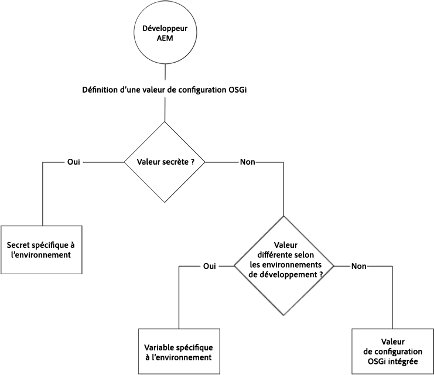

# Configuration d’OSGi pour AEM en tant que service Cloud {#configuring-osgi-for-aem-as-a-cloud-service}

[OSGi est un élément fondamental de la pile technologique d’Adobe Experience Manager (AEM). ](https://www.osgi.org/) Il est utilisé pour contrôler les lots composites d’AEM et ses configurations.

OSGi fournit les primitives normalisées qui permettent de construire des applications à partir de petits composants réutilisables et collaboratifs. Ces composants peuvent être composés dans une application et déployés. Cela permet une gestion facile des lots OSGi, car ils peuvent être arrêtés, installés, démarrés individuellement. Les interdépendances sont gérées automatiquement. Chaque composant OSGi est contenu dans l&#39;un des différents lots. Pour plus d’informations, voir la spécification [](https://www.osgi.org/Specifications/HomePage)OSGi.

Vous pouvez gérer les paramètres de configuration des composants OSGi par le biais de fichiers de configuration qui font partie d’un projet de code AEM.

## Fichiers de configuration OSGi {#osgi-configuration-files}

Les modifications de configuration sont définies dans les packages de code du projet AEM (`ui.apps`) en tant que fichiers de configuration (`.cfg.json`) sous les dossiers de configuration spécifiques au mode d’exécution :

`/apps/example/config.<runmode>`

Le format des fichiers de configuration OSGi est basé sur JSON et utilise le `.cfg.json` format défini par le projet Apache Sling.

Les configurations OSGi cible les composants OSGi via leur identifiant persistant (PID), qui correspond par défaut au nom de classe Java du composant OSGi. Par exemple, pour fournir une configuration OSGi pour un service OSGi implémenté par :

`com.example.workflow.impl.ApprovalWorkflow.java`

un fichier de configuration OSGi est défini à l’adresse suivante :

`/apps/example/config/com.example.workflow.impl.ApprovalWorkflow.cfg.json`

suivant le format de configuration OSGi de cfg.json.

> [!NOTE]
>
> Les versions antérieures des fichiers de configuration OSGi d’AEM prenaient en charge différents formats de fichier tels que .cfg., .config et en tant que définitions de ressources sling:OsgiConfig XML. Ces formats sont remplacés par le format de configuration OSGi cfg.json.

## Résolution du mode d’exécution {#runmode-resolution}

Des configurations OSGi spécifiques peuvent être ciblées sur des instances AEM spécifiques en utilisant les modes d’exécution. Pour utiliser le mode d&#39;exécution, créez des dossiers de configuration sous `/apps/example` (où le nom du projet, par exemple), au format suivant :

`/apps/example/config.<author|publish>.<dev|stage|prod>/`

Toutes les configurations OSGi de ces dossiers seront utilisées si les modes d’exécution définis dans le nom de dossier de configuration correspondent aux modes d’exécution utilisés par AEM.

Par exemple, si AEM utilise les modes d’exécution author et dev, les noeuds de configuration dans `/apps/example/config.author/` et `/apps/example/config.author.dev/` seront appliqués, tandis que les noeuds de configuration dans `/apps/example/config.publish/` et `/apps/example/config.author.stage/` ne seront pas appliqués.

Si plusieurs configurations correspondant au même PID sont applicables, la configuration comportant le nombre le plus élevé de modes d’exécution correspondants est appliquée.

La granularité de cette règle se trouve au niveau du PID. This means you cannot define some properties for the same PID in `/apps/example/config.author/` and more specific ones in `/apps/example/config.author.dev/` for the same PID.  La configuration avec le plus grand nombre de modes d&#39;exécution correspondants sera efficace pour l&#39;ensemble du PID.

Lors du développement local, un paramètre de démarrage en mode d’exécution peut être transmis pour indiquer la configuration OSGI en mode d’exécution à utiliser.

## Types de valeurs de configuration OSGi {#types-of-osgi-configuration-values}

Il existe trois types de valeurs de configuration OSGi qui peuvent être utilisées avec AEM en tant que service Cloud.

1. **Valeurs** intégrées, qui sont des valeurs codées en dur dans la configuration OSGi et stockées dans Git. Par exemple :

   ```json
   {
      "connection.timeout": 1000
   }
   ```

1. **Valeurs** secrètes, qui sont des valeurs qui ne doivent pas être stockées dans Git pour des raisons de sécurité. Par exemple :

   ```json
   {
   "api-key": "$[secret:server-api-key]"
   } 
   ```

1. **Les valeurs** spécifiques à un Environnement, qui sont des valeurs qui varient selon les environnements de développement et ne peuvent donc pas être ciblées avec précision par le mode d’exécution (puisqu’il existe un seul `dev` mode d’exécution dans AEM en tant que service Cloud). Par exemple :

   ```json
   {
    "url": "$[env:server-url]"
   }
   ```

   Notez qu’un seul fichier de configuration OSGi peut utiliser n’importe quelle combinaison de ces types de valeur de configuration en conjonction. Par exemple :

   ```json
   {
   "connection.timeout": 1000,
   "api-key": "$[secret:server-api-key]",
   "url": "$[env:server-url]"
   }
   ```

## Comment choisir le type de valeur de configuration OSGi approprié {#how-to-choose-the-appropriate-osgi-configuration-value-type}

Le cas le plus courant pour OSGi utilise des valeurs de configuration OSGi intégrées. Les configurations spécifiques à un Environnement ne sont utilisées que pour des cas d’utilisation spécifiques où une valeur diffère d’un environnement de développement à l’autre.



Les configurations spécifiques à l’Environnement étendent les configurations OSGi traditionnelles définies de manière statique, qui contiennent des valeurs insérées, ce qui permet de gérer les valeurs de configuration OSGi de manière externe via l’API Cloud Manager. Il est important de comprendre quand l&#39;approche commune et traditionnelle consistant à définir les valeurs insérées et à les stocker dans Git doit être utilisée, plutôt que de les abstraire dans des configurations spécifiques à l&#39;environnement.

Les conseils suivants expliquent quand utiliser des configurations spécifiques à un environnement non secret ou secret :

### Quand utiliser les valeurs de configuration intégrées {#when-to-use-inline-configuration-values}

Les valeurs de configuration en ligne sont considérées comme l&#39;approche standard et doivent être utilisées lorsque cela est possible. Les configurations en ligne offrent les avantages suivants :

* Ils sont maintenus, avec la gouvernance et l&#39;historique des versions en Git
* Les valeurs sont implicitement liées aux déploiements de code.
* Ils ne nécessitent aucune autre prise en compte du déploiement ou coordination

Chaque fois que vous définissez une valeur de configuration OSGi, début avec des valeurs insérées, n&#39;importe quelle personne ne sélectionne que les configurations secrètes ou spécifiques à un environnement si nécessaire pour le cas d&#39;utilisation.

### Quand utiliser des valeurs de configuration spécifiques à un Environnement non secret {#when-to-use-non-secret-environment-specific-configuration-values}

N’utilisez des configurations spécifiques à un environnement (`$[env:ENV_VAR_NAME]`) que pour les valeurs de configuration non secrètes lorsque les valeurs varient selon les environnements de développement. Cela inclut les instances de développement local et tout environnement de développement de service AEM en tant qu’ de service Cloud. Evitez d’utiliser des configurations spécifiques à des environnements non secrets pour AEM en tant qu’étape de service Cloud ou environnements de production.

* Utilisez uniquement des configurations spécifiques à des environnements non secrets pour les valeurs de configuration qui diffèrent entre les environnements de développement, y compris les instances de développement local.
* Utilisez plutôt les valeurs en ligne standard dans les configurations OSGi pour les valeurs non secrètes Stage et Production.  À cet égard, il n&#39;est pas recommandé d&#39;utiliser des configurations spécifiques à l&#39;environnement pour faciliter les modifications de configuration au moment de l&#39;exécution vers les environnements d&#39;étape et de production ; ces modifications devraient être introduites par le biais de la gestion du code source.

### Quand utiliser des valeurs de configuration secrètes spécifiques à un environnement {#when-to-use-secret-environment-specific-configuration-values}

AEM en tant que service Cloud requiert l’utilisation de configurations spécifiques à l’environnement (`$[secret:SECRET_VAR_NAME]`) pour toute valeur de configuration OSGi secrète, telle que les mots de passe, les clés d’API privées ou toute autre valeur qui ne peut pas être stockée dans Git pour des raisons de sécurité.

Utilisez des configurations secrètes spécifiques à un environnement pour stocker la valeur des secrets sur tous les environnements de service AEM en tant qu’ de service Cloud, y compris Stage et Production.

<!-- ### Adding a New Configuration to the Repository {#adding-a-new-configuration-to-the-repository}

#### What You Need to Know {#what-you-need-to-know}

To add a new configuration to the repository you need to know the following:

1. The **Persistent Identity** (PID) of the service.

   Reference the **Configurations** field in the Web console. The name is shown in brackets after the bundle name (or in the **Configuration Information** towards the bottom of the page).

   For example, create a node `com.day.cq.wcm.core.impl.VersionManagerImpl.` to configure **AEM WCM Version Manager**.

   

1. Whether a specific runmode is required. Create the folder:

    * `config` - for all run modes
    * `config.author` - for the author environment
    * `config.publish` - for the publish environment
    * `config.<run-mode>` - as appropriate

1. Whether a **Configuration** or **Factory Configuration** is necessary.
1. The individual parameters to be configured; including any existing parameter definitions that will need to be recreated.

   Reference the individual parameter field in the Web console. The name is shown in brackets for each parameter.

   For example, create a property
   `versionmanager.createVersionOnActivation` to configure **Create Version on Activation**.

   

1. Does a configuration already exist in `/libs`? To list all configurations in your instance, use the **Query** tool in CRXDE Lite to submit the following SQL query:

   `select * from sling:OsgiConfig`

   If so, this configuration can be copied to ` /apps/<yourProject>/`, then customized in the new location. -->

## Création de la configuration dans le référentiel {#creating-the-configuration-in-the-repository}

Pour ajouter la nouvelle configuration au référentiel :

1. Dans votre projet ui.apps, créez un `/apps/…/config.xxx` dossier en fonction du mode d’exécution utilisé.

1. Créez un nouveau fichier JSON avec le nom du PID et ajoutez l’ `.cfg.json` extension.


1. Renseigner le fichier JSON avec les paires clé-valeur de configuration OSGi

   >[!NOTE]
   >
   >Si vous configurez un service OSGi prêt à l’emploi, vous pouvez rechercher les noms des propriétés OSGi via `/system/console/configMgr`


1. Enregistrez le fichier JSON dans votre projet. -->

## Format de la propriété de configuration dans le contrôle de code source {#configuration-property-format-in-source-control}

La création d’une nouvelle propriété de configuration OSGI est décrite dans la section [Ajout d’une nouvelle configuration au référentiel](#creating-the-configuration-in-the-repository) ci-dessus.

Suivez ces étapes et modifiez la syntaxe comme indiqué dans les sous-sections ci-dessous :

### Valeurs intégrées {#inline-values}

Comme on peut s’y attendre, les valeurs intégrées sont formatées en paires nom-valeur standard, selon la syntaxe JSON standard. Par exemple :

```json
 {

 "my_var1": "val",
 "my_var2": "abc",
 "my_var3": 500

}
```

### Valeurs de configuration spécifiques à un Environnement {#environment-specific-configuration-values}

La configuration OSGi doit affecter un espace réservé à la variable qui doit être définie par environnement :

```
use $[env:ENV_VAR_NAME]
```

Les clients ne doivent utiliser cette technique que pour les propriétés de configuration OSGI liées à leur code personnalisé ; il ne doit pas être utilisé pour remplacer la configuration OSGI définie par Adobe.

### Valeurs de configuration secrètes {#secret-configuration-values}

La configuration OSGi doit affecter un espace réservé au secret qui doit être défini par environnement :

```
use $[secret:SECRET_VAR_NAME]
```

### Nommage des variables {#variable-naming}

Ce qui suit s&#39;applique à la fois aux valeurs de configuration spécifiques à un environnement et aux valeurs de configuration secrètes.

Les noms des variables doivent respecter les règles suivantes :

* longueur minimale : 2
* longueur maximale : 100
* doit correspondre à regex : `[a-zA-Z_][a-zA-Z_0-9]*`

Les valeurs des variables ne doivent pas dépasser 2 048 caractères.

### Valeurs par défaut {#default-values}

Ce qui suit s&#39;applique à la fois aux valeurs de configuration spécifiques à un environnement et aux valeurs de configuration secrètes.

Si aucune valeur par environnement n’est définie, l’espace réservé n’est pas remplacé au moment de l’exécution et n’est pas conservé car aucune interpolation n’a eu lieu. Pour éviter cela, une valeur par défaut peut être fournie dans le cadre de l’espace réservé avec la syntaxe suivante :

```
$[env:ENV_VAR_NAME;default=<value>]
```

Si une valeur par défaut est fournie, l’espace réservé est remplacé par la valeur par environnement, le cas échéant, ou par la valeur par défaut fournie.

### Développement local {#local-development}

Ce qui suit s&#39;applique à la fois aux valeurs de configuration spécifiques à un environnement et aux valeurs de configuration secrètes.

Les variables peuvent être définies dans l’environnement local afin qu’elles soient récupérées par AEM local au moment de l’exécution. Par exemple, sous Linux :

```bash
export ENV_VAR_NAME=my_value
```

Il est recommandé d’écrire un script bash simple qui définit les variables d’environnement utilisées dans les configurations et qui les exécute avant de démarrer AEM. Des outils tels que [https://direnv.net/](https://direnv.net/) aident à simplifier cette approche. Selon le type des valeurs, elles peuvent être archivées dans la gestion du code source, si elles peuvent être partagées entre tous.

Les valeurs des secrets sont lues à partir de fichiers. Par conséquent, pour chaque espace réservé utilisant un secret, un fichier texte contenant la valeur secrète doit être créé.

Si, par exemple, `$[secret:server_password]` est utilisé, un fichier texte nommé **server_password** doit être créé. Tous ces fichiers secrets doivent être stockés dans le même répertoire et la propriété framework `org.apache.felix.configadmin.plugin.interpolation.secretsdir` doit être configurée avec ce répertoire local.

### Configuration de l’auteur ou de la publication {#author-vs-publish-configuration}

Si une propriété OSGI requiert des valeurs différentes pour auteur et publication :

* des dossiers distincts `config.author` et `config.publish` OSGi doivent être utilisés, comme décrit dans la section [Résolution du](#runmode-resolution)mode d’exécution.
* des noms de variable indépendants doivent être utilisés. Il est recommandé d’utiliser un préfixe tel que `author_<variablename>` et `publish_<variablename>` où les noms de variable sont identiques.

### Exemples de configuration {#configuration-examples}

Dans les exemples ci-dessous, supposons qu&#39;il y ait 3 environnements de développement, en plus des environnements d&#39;étape et de production.

**Exemple 1**

L’intention est que la valeur de la propriété OSGI soit la même pour l’étape et la prod, mais soit différente pour chacun des 3 environnements de développement. `my_var1`

<table>
<tr>
<td>
<b>Folder</b>
</td>
<td>
<b>Contenu de myfile.cfg.json</b>
</td>
</tr>
<tr>
<td>
config
</td>
<td>
<pre>
{ "my_var1": "val", "my_var2" : "abc", "my_var3" : 500}
</pre>
</td>
</tr>
<tr>
<td>
config.dev
</td>
<td>
<pre>
{ "my_var1" : "$[env:my_var1]" "my_var2" : "abc", "my_var3" : 500}
</pre>
</td>
</tr>
</table>

**Exemple 2**

L’intention est que la valeur de la propriété OSGI diffère pour l’étape, la prod et pour chacun des 3 environnements de développement. `my_var1` L’API de Cloud Manager devra donc être appelée pour définir la valeur de `my_var1` chaque fichier de développement.

<table>
<tr>
<td>
<b>Folder</b>
</td>
<td>
<b>Contenu de myfile.cfg.json</b>
</td>
</tr>
<tr>
<td>
config.stage
</td>
<td>
<pre>
{ "my_var1": "val1", "my_var2" : "abc", "my_var3" : 500}
</pre>
</td>
</tr>
<tr>
<td>
config.prod
</td>
<td>
<pre>
{ "my_var1": "val2", "my_var2" : "abc", "my_var3" : 500}
</pre>
</td>
</tr>
<tr>
<td>
config.dev
</td>
<td>
<pre>
{ "my_var1" : "$[env:my_var1]" "my_var2" : "abc", "my_var3" : 500}
</pre>
</td>
</tr>
</table>

**Exemple 3**

L&#39;intention est que la valeur de la propriété OSGi soit la même pour l&#39;étape, la production et un seul des environnements de développement, mais qu&#39;elle soit différente pour les deux autres environnements de développement. `my_var1` Dans ce cas, l’API Cloud Manager devra être appelée pour définir la valeur de `my_var1` pour chacun des environnements de développement, y compris pour l’environnement de développement qui doit avoir la même valeur que l’étape et la production. Il n&#39;héritera pas de la valeur définie dans la **configuration** du dossier.

<table>
<tr>
<td>
<b>Folder</b>
</td>
<td>
<b>Contenu de myfile.cfg.json</b>
</td>
</tr>
<tr>
<td>
config
</td>
<td>
<pre>
{ "my_var1": "val1", "my_var2" : "abc", "my_var3" : 500}
</pre>
</td>
</tr>
<tr>
<td>
config.dev
</td>
<td>
<pre>
{ "my_var1" : "$[env:my_var1]" "my_var2" : "abc", "my_var3" : 500}
</pre>
</td>
</tr>
</table>

Pour ce faire, vous pouvez également définir une valeur par défaut pour le jeton de remplacement dans le dossier config.dev, de sorte qu’elle soit identique à celle du dossier **config** .

<table>
<tr>
<td>
<b>Folder</b>
</td>
<td>
<b>Contenu de myfile.cfg.json</b>
</td>
</tr>
<tr>
<td>
config
</td>
<td>
<pre>
{ "my_var1": "val1", "my_var2" : "abc", "my_var3" : 500}
</pre>
</td>
</tr>
<tr>
<td>
config.dev
</td>
<td>
<pre>
{ "my_var1": "$[env:my_var1;default=val1]" "my_var2" : "abc", "my_var3" : 500}
</pre>
</td>
</tr>
</table>

## Format de l’API de Cloud Manager pour la définition des propriétés {#cloud-manager-api-format-for-setting-properties}

### Définition de valeurs via l’API {#setting-values-via-api}

L’appel de l’API déploie les nouvelles variables et valeurs sur un environnement Cloud, comme dans un pipeline de déploiement du code client classique. Les services d’auteur et de publication sont redémarrés et référencent les nouvelles valeurs, généralement en quelques minutes.

```
PATCH /program/{programId}/environment/{environmentId}/variables
```

```
]
        {
                "name" : "MY_VAR1",
                "value" : "plaintext value",
                "type" : "string"  <---default
        },
        {
                "name" : "MY_VAR2",
                "value" : "<secret value>",
                "type" : "secretString"
        }
]
```

Notez que les variables par défaut ne sont pas définies via l’API, mais dans la propriété OSGi elle-même.

Pour plus d’informations, consultez [cette page](https://www.adobe.io/apis/experiencecloud/cloud-manager/api-reference.html#/Environment_Variables/patchEnvironmentVariables).

### Obtention de valeurs via l’API {#getting-values-via-api}

```
GET /program/{programId}/environment/{environmentId}/variables
```

Pour plus d’informations, consultez [cette page](https://www.adobe.io/apis/experiencecloud/cloud-manager/api-reference.html#/Environment_Variables/getEnvironmentVariables).

### Suppression de valeurs par API {#deleting-values-via-api}

```
PATCH /program/{programId}/environment/{environmentId}/variables
```

Pour supprimer une variable, incluez-la avec une valeur vide.

Pour plus d’informations, consultez [cette page](https://www.adobe.io/apis/experiencecloud/cloud-manager/api-reference.html#/Environment_Variables/patchEnvironmentVariables).

### Obtention de valeurs via la ligne de commande {#getting-values-via-cli}

```bash
$ aio cloudmanager:list-environment-variables ENVIRONMENT_ID
Name     Type         Value
MY_VAR1  string       plaintext value 
MY_VAR2  secretString ****
```


### Définition de valeurs via la ligne de commande {#setting-values-via-cli}

```bash
$ aio cloudmanager:set-environment-variables ENVIRONMENT_ID --variable MY_VAR1 "plaintext value" --secret MY_VAR2 "some secret value"
```

### Suppression de valeurs par le biais de la ligne de commande {#deleting-values-via-cli}

```bash
$ aio cloudmanager:set-environment-variables ENVIRONMENT_ID --delete MY_VAR1 MY_VAR2
```

> [!NOTE]
>
> Voir [cette page](https://github.com/adobe/aio-cli-plugin-cloudmanager#aio-cloudmanagerset-environment-variables-environmentid) pour plus d’informations sur la configuration des valeurs à l’aide du plug-in Cloud Manager pour l’interface de ligne de commande des E/S d’Adobe.

### Nombre de variables {#number-of-variables}

Vous pouvez déclarer jusqu’à 20 variables.

## Considérations relatives au déploiement pour les valeurs de configuration spécifiques aux Environnements et aux secrets {#deployment-considerations-for-secret-and-environment-specific-configuration-values}

Etant donné que les valeurs de configuration spécifiques au secret et à l’environnement résident en dehors de Git, et par conséquent ne font pas partie des mécanismes de déploiement officiels d’AEM en tant que service Cloud, le client doit gérer, gouverner et intégrer AEM en tant que processus de déploiement de service Cloud.

Comme mentionné ci-dessus, l’appel de l’API déploie les nouvelles variables et valeurs sur les environnements Cloud, comme dans un pipeline de déploiement du code client classique. Les services d’auteur et de publication sont redémarrés et référencent les nouvelles valeurs, généralement en quelques minutes. Notez que les barrières de qualité et les tests exécutés par Cloud Manager lors d’un déploiement régulier du code ne sont pas effectués pendant ce processus.

En règle générale, les clients appellent l’API pour définir des variables d’environnement avant de déployer le code qui en dépend dans Cloud Manager. Dans certains cas, vous pouvez modifier une variable existante après le déploiement du code.

Notez que l’API peut ne pas réussir lorsqu’un pipeline est en cours d’utilisation, qu’il s’agisse d’une mise à jour AEM ou d’un déploiement de clients, selon la partie du pipeline de bout en bout exécutée à ce moment. La réponse à l&#39;erreur indique que la demande a échoué, bien qu&#39;elle n&#39;indique pas la raison précise.

Il peut y avoir des scénarios où un déploiement planifié du code client repose sur des variables existantes pour avoir de nouvelles valeurs, ce qui ne serait pas approprié avec le code actuel. S&#39;il s&#39;agit d&#39;un problème, il est recommandé d&#39;apporter des modifications variables de façon additive. Pour ce faire, créez de nouveaux noms de variable au lieu de simplement modifier la valeur des anciennes variables afin que l’ancien code ne fasse jamais référence à la nouvelle valeur. Ensuite, lorsque la nouvelle version du client semble stable, vous pouvez choisir de supprimer les anciennes valeurs.

De même, comme les valeurs d’une variable ne sont pas versionnées, une annulation de code peut la faire référence à des valeurs plus récentes qui posent problème. La stratégie de variable additive mentionnée ci-dessus pourrait également y contribuer.

Cette stratégie d&#39;ajout de variables est également utile pour les scénarios de reprise après sinistre où, si le code de plusieurs jours auparavant devait être redéployé, les noms et valeurs de variables auxquels elle fait référence restent inchangés. Cela repose sur une stratégie dans laquelle un client attend quelques jours avant de supprimer ces variables plus anciennes, sinon l’ancien code n’aurait pas de variables appropriées à référencer.