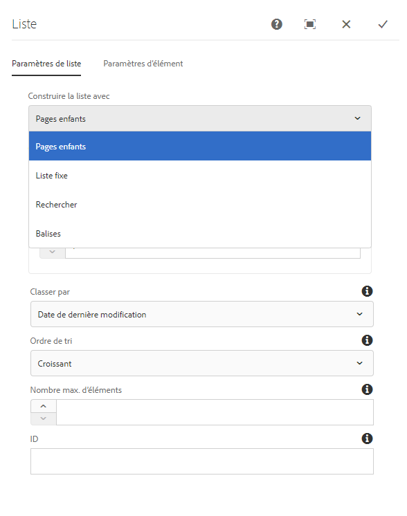
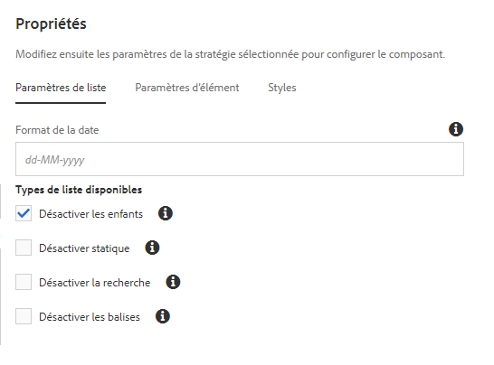
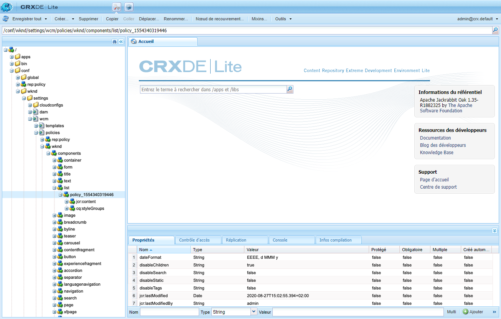
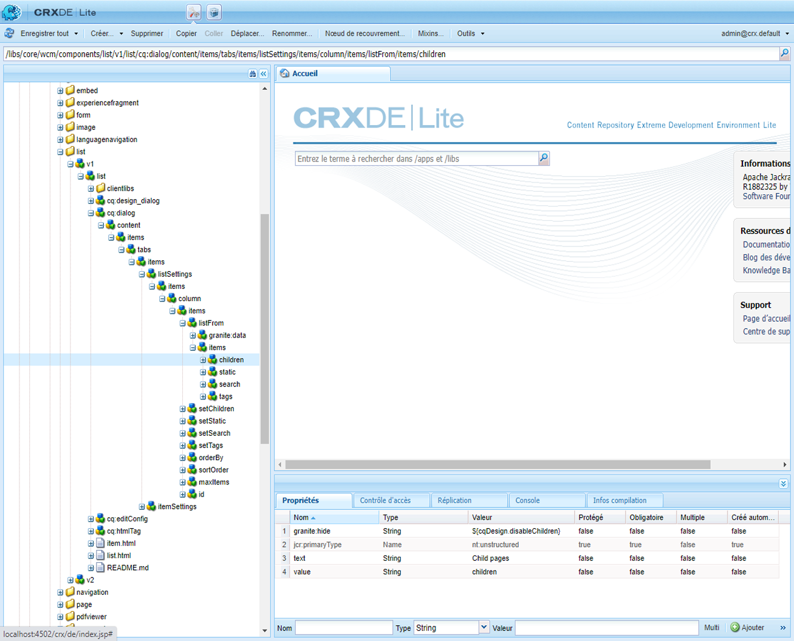
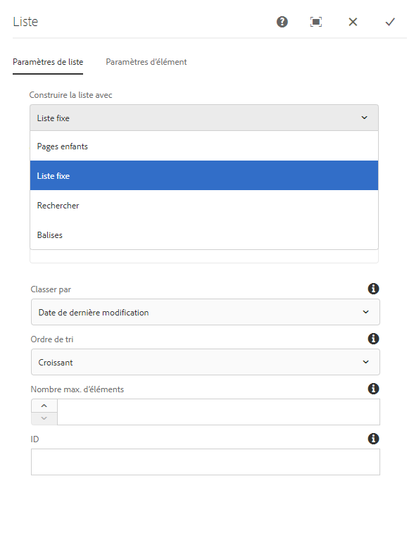

# Utilisation de conditions de masquage {#using-hide-conditions}

Vous pouvez utiliser des conditions de masquage pour déterminer si une ressource de composant est générée ou non. Par exemple, lorsqu’un créateur ou une créatrice de modèles configure le composant principal [composant de liste](https://experienceleague.adobe.com/docs/experience-manager-core-components/using/components/list.html?lang=fr) dans l’[éditeur de modèles](/help/sites-cloud/authoring/page-editor/templates.md) et décide de désactiver les options pour créer la liste en fonction des pages enfants. La désactivation de cette option dans la boîte de dialogue de conception définit une propriété de sorte que lorsque le rendu du composant de liste est effectué, la condition de masquage est évaluée et l’option d’affichage des pages enfants n’est pas affichée.

## Vue d’ensemble {#overview}

Les boîtes de dialogue peuvent devenir très complexes et contenir de nombreuses options. Cependant, l’utilisateur ne pourra peut-être exploiter qu’une petite partie de celles mises à sa disposition. Cela peut entraîner une surcharge des expériences de l’interface utilisateur pour les utilisateurs et utilisatrices.

En utilisant les conditions de masquage, les administrateurs et administratrices, les développeurs et développeuses, et les super-utilisateurs et super-utilisatrices disposent d’un moyen de masquer les ressources en fonction d’un ensemble de règles. Cette fonction leur permet de décider quelles ressources afficher lorsqu’un créateur ou une créatrice modifie le contenu.

>[!NOTE]
>
>Le masquage d’une ressource à partir d’une expression ne remplace pas les autorisations ACL. Le contenu reste modifiable mais n’est tout simplement pas affiché.

## Détails relatifs à la mise en œuvre et à l’utilisation {#implementation-and-usage-details}

`com.adobe.granite.ui.components.FilteringResourceWrapper` est chargé de filtrer les ressources en fonction de l’existence et de la valeur de la propriété `granite:hide`, située sur le champ à filtrer. L’implémentation de `/libs/cq/gui/components/authoring/dialog/dialog.jsp` comprend une instance de `FilteringResourceWrapper.`

L’implémentation utilise l’[API ELResolver](https://helpx.adobe.com/fr/experience-manager/6-5/sites/developing/using/reference-materials/granite-ui/api/jcr_root/libs/granite/ui/docs/server/el.html) de Granite et ajoute une variable personnalisée `cqDesign` via ExpressionCustomizer.

Voici quelques exemples de conditions de masquage sur un nœud de conception situé sous `etc/design` ou sous la forme d’une politique de contenu.

```
${cqDesign.myProperty}
${!cqDesign.myProperty}
${cqDesign.myProperty == 'someText'}
${cqDesign.myProperty != 'someText'}
${cqDesign.myProperty == true}
${cqDesign.myProperty == true}
${cqDesign.property1 == 'someText' && cqDesign.property2 || cqDesign.property3 != 1 || header.myHeader}
```

Lors de la définition de votre expression de masquage, veuillez tenir compte des points suivants :

* Pour être valide, la portée dans laquelle se trouve la propriété doit être exprimée (`cqDesign.myProperty`, par exemple).
* Les valeurs sont en lecture seule.
* Les fonctions (si nécessaire) doivent être limitées à un ensemble donné fourni par le service.

## Exemple {#example}

Vous trouverez des exemples de conditions de masquage dans AEM et dans les [composants principaux](https://experienceleague.adobe.com/docs/experience-manager-core-components/using/introduction.html?lang=fr) en particulier. Par exemple, considérez le [composant principal Liste](https://experienceleague.adobe.com/docs/experience-manager-core-components/using/components/list.html?lang=fr) tel qu’il est implémenté dans le [tutoriel WKND](/help/implementing/developing/introduction/develop-wknd-tutorial.md).

[En utilisant l’éditeur de modèles](/help/sites-cloud/authoring/page-editor/templates.md), le créateur ou la créatrice de modèles peut définir, dans la boîte de dialogue de conception, les options du composant de liste mises à la disposition du créateur ou de la créatrice de pages. Des options telles que l’autorisation de la liste en tant que liste statique, une liste de pages enfants, une liste de pages balisées, etc. peuvent être activées ou désactivées.

Si un créateur ou une créatrice de modèles choisit de désactiver l’option des pages enfants, une propriété de conception est définie et une condition de masquage est évaluée par rapport à cette propriété, ce qui fait que l’option ne s’affiche pas pour le créateur ou la créatrice de la page.

1. Par défaut, le créateur ou la créatrice de la page peut utiliser le composant principal Liste pour créer une liste à l’aide de pages enfants en sélectionnant l’option **Pages enfants**.

   

1. Dans la boîte de dialogue de création du composant principal Liste, l’auteur de modèles peut sélectionner l’option **Désactiver les enfants** pour éviter que l’option de génération d’une liste sur la base de pages enfants ne soit présentée à l’auteur de pages.

   

1. Un nœud de politique est créé sous `/conf/wknd/settings/wcm/policies/wknd/components/list` avec une propriété `disableChildren` définie sur `true`.

   

1. La condition de masquage est définie comme la valeur d’une propriété `granite:hide` sur le nœud de propriété de boîte de dialogue `/libs/core/wcm/components/list/v2/list/cq:dialog/content/items/tabs/items/listSettings/items/columns/items/column/items/listFrom/items/children`.

   

1. La valeur de `disableChildren` est extraite de la configuration de conception et l’expression `${cqDesign.disableChildren}` est évaluée sur `false`, ce qui signifie que le rendu de l’option ne sera pas effectué dans le cadre du composant.

1. L’option **Pages enfants** n’est plus rendue pour l’auteur de pages lors de l’utilisation du composant de liste.

   
