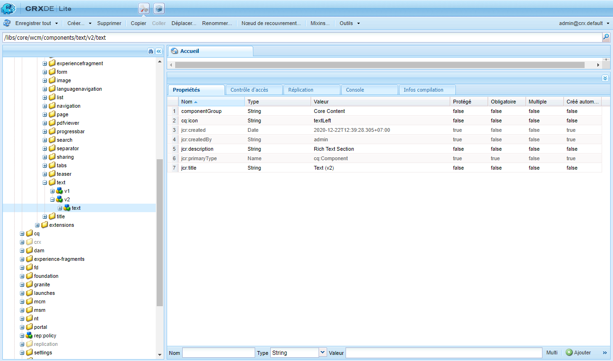
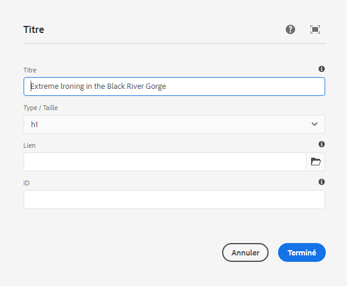
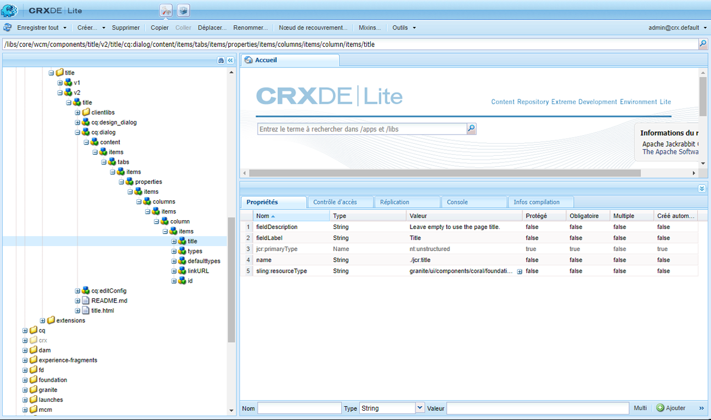
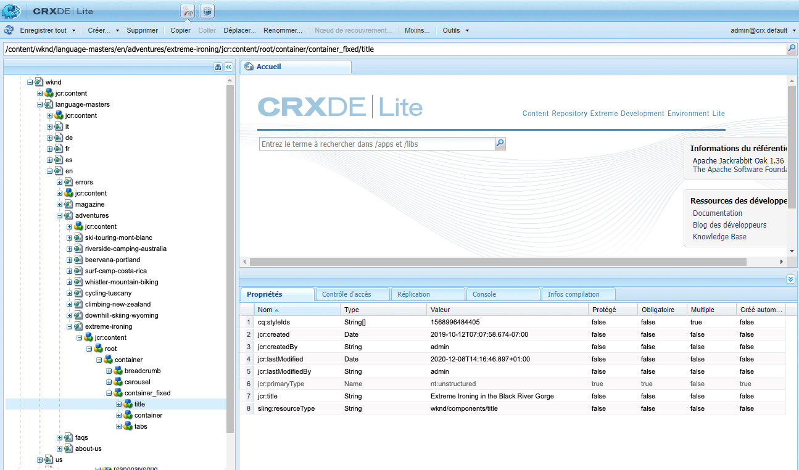
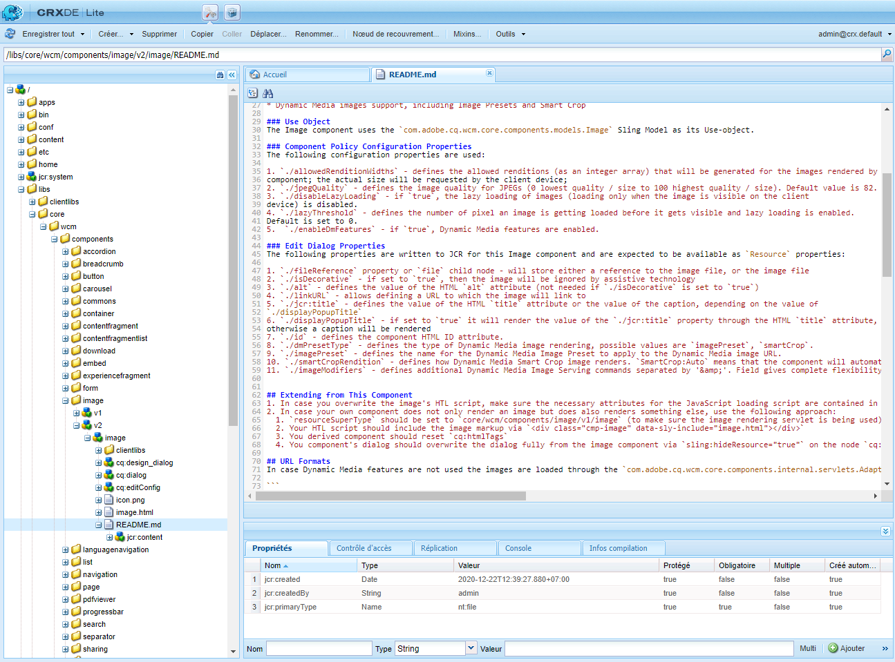
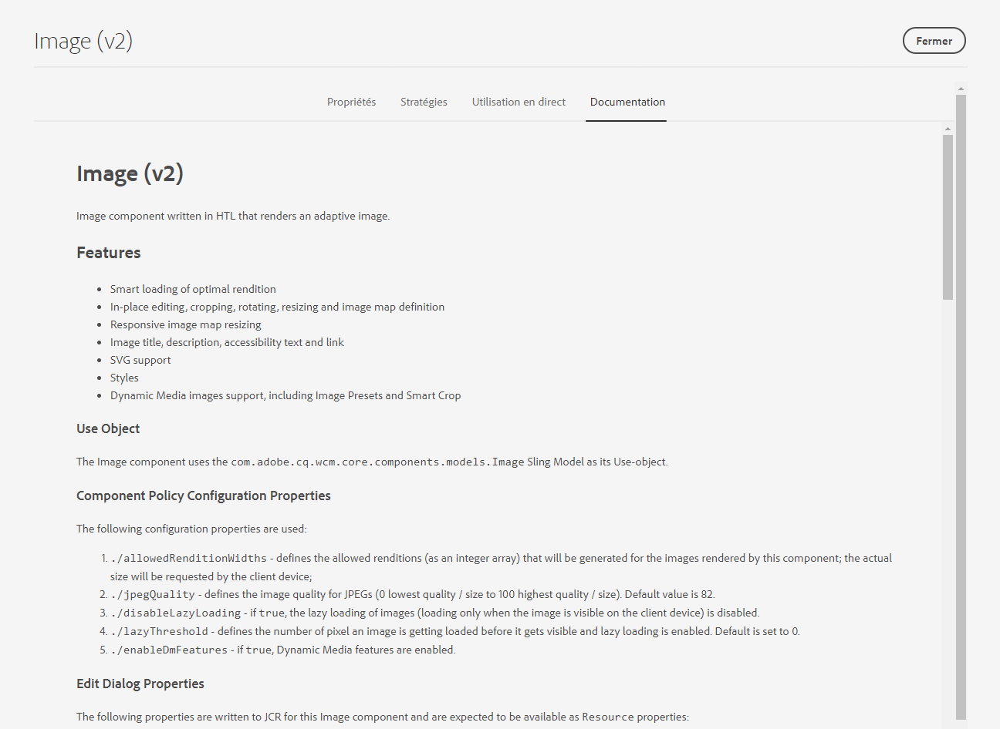

# Guide de référence des composants {#components-reference-guide}

Les composants sont essentiels à la création d’une expérience dans AEM. Les [Composants principaux](https://experienceleague.adobe.com/docs/experience-manager-core-components/using/introduction.html?lang=fr) et l’[Archétype de projet AEM](https://experienceleague.adobe.com/docs/experience-manager-core-components/using/developing/archetype/overview.html?lang=fr) facilitent la prise en main d’un ensemble de composants robustes et prêts à l’emploi. Le [tutoriel WKND](/help/implementing/developing/introduction/develop-wknd-tutorial.md) explique à l’équipe de développement comment utiliser ces outils et comment créer des composants personnalisés pour créer un site AEM.

>[!TIP]
>
>Avant de faire consulter ce document, assurez-vous d’avoir suivi le [tutoriel WKND](/help/implementing/developing/introduction/develop-wknd-tutorial.md) et de connaître ainsi les [composants principaux](https://experienceleague.adobe.com/docs/experience-manager-core-components/using/introduction.html?lang=fr) et l’[Archétype de projet AEM.](https://experienceleague.adobe.com/docs/experience-manager-core-components/using/developing/archetype/overview.html?lang=fr)

Comme le tutoriel WKND aborde la plupart des cas d’utilisation, ce document est uniquement conçu comme un supplément à ces ressources. Il présente des détails techniques sur la structuration et la configuration des composants dans AEM et n’est pas conçu comme un guide de prise en main.

## Vue d’ensemble {#overview}

Cette section décrit les concepts et les problèmes majeurs et sert d’introduction aux informations dont vous avez besoin pour développer vos propres composants.

### Planification {#planning}

Avant de commencer à configurer ou coder votre composant, vous devez vous poser la question suivante :

* De quoi avez-vous besoin exactement pour le nouveau composant ?
* Devez-vous créer votre composant de toutes pièces ou pouvez-vous hériter des bases d’un composant existant ?
* Votre composant aura-t-il besoin d’une logique pour sélectionner/manipuler le contenu ?
   * La logique doit rester distincte de la couche de l’interface utilisateur. HTL est conçu pour faciliter cette distinction.
* Votre composant aura-t-il besoin d’une mise en forme CSS ?
   * La mise en forme CSS doit rester distincte des définitions de composants. Définissez des conventions pour nommer vos éléments HTML afin que vous puissiez les modifier via des fichiers CSS externes.
* Quelles sont les implications potentielles de votre nouveau composant sur la sécurité ?

### Réutilisation de composants existants {#reusing-components}

Avant de consacrer du temps à la création d’un tout nouveau composant, envisagez de personnaliser ou d’étendre les composants existants. [Les composants principaux](https://experienceleague.adobe.com/docs/experience-manager-core-components/using/introduction.html?lang=fr) sont une suite de composants prêts à la production, flexibles, robustes et ayant fait l’objet de tests complets.

#### Extension des composants principaux {#extending-core-components}

Les composants principaux proposent également des [modèles de personnalisation clairs](https://experienceleague.adobe.com/docs/experience-manager-core-components/using/developing/customizing.html?lang=fr) que vous pouvez adapter aux besoins de votre projet.

#### Superposition de composants {#overlying-components}

Il est également possible de redéfinir les composants avec une [superposition](/help/implementing/developing/introduction/overlays.md) en fonction de la logique du chemin de recherche. Cependant, dans ce cas, le [Sling Resource Merger](/help/implementing/developing/introduction/sling-resource-merger.md) n’est pas déclenché et `/apps` doit définir la superposition en entier.

#### Extension des boîtes de dialogue des composants {#extending-component-dialogs}

Il est également possible de remplacer une boîte de dialogue de composant en utilisant le Sling Resource Merger et en définissant la propriété `sling:resourceSuperType`.

Ainsi, vous avez seulement besoin de redéfinir les modifications à apporter et non pas toute la boîte de dialogue.

### Logique de contenu et balisage de rendu   {#content-logic-and-rendering-markup}

Votre composant est rendu en [HTML](https://www.w3schools.com/htmL/html_intro.asp). Votre composant doit définir l’HTML nécessaire pour prendre le contenu requis, puis le rendre selon les besoins, dans les environnements de création et de publication.

Il est recommandé de séparer le code responsable du balisage et du rendu du code qui contrôle la logique utilisée pour sélectionner le contenu du composant.

Cette approche est compatible avec [HTL](https://experienceleague.adobe.com/docs/experience-manager-htl/content/overview.html?lang=fr), un langage de modèle intentionnellement limité pour s’assurer qu’un vrai langage de programmation est utilisé afin de définir la logique métier sous-jacente. Ce mécanisme met en évidence le code appelé pour une vue donnée et, si nécessaire, autorise une logique spécifique pour différentes vues du même composant.

Cette logique (facultative) peut être mise en œuvre de différentes manières et est appelée à partir de HTL avec des commandes spécifiques :

* Utilisation de Java : [Use-API Java HTL](https://experienceleague.adobe.com/docs/experience-manager-htl/content/java-use-api.html?lang=fr) permet à un fichier HTL d’accéder aux méthodes d’assistance dans une classe Java personnalisée. Cela vous permet d’utiliser le code JavaScript pour implémenter la logique de sélection et de configuration du contenu du composant.
* Utilisation de JavaScript : [Le HTL JavaScript Use-API](https://experienceleague.adobe.com/docs/experience-manager-htl/using/htl/use-api-javascript.html?lang=fr) permet à un fichier HTL d’accéder au code d’assistance écrit en JavaScript. Cela vous permet d’utiliser le code JavaScript pour implémenter la logique de sélection et de configuration du contenu du composant.
* Utilisation de bibliothèques côté client : les sites web modernes sont très dépendants du traitement côté client effectué par du code JavaScript et CSS complexe. Pour plus d’informations, consultez le document [Utilisation de bibliothèques côté client sur AEM as a Cloud Service](/help/implementing/developing/introduction/clientlibs.md).

## Structure des composants {#structure}

La structure d’un composant AEM est puissante et flexible. Les principales parties sont les suivantes :

* [Type de ressource](#resource-type)
* [Définition du composant](#component-definition)
* [Propriétés et nœuds enfants d’un composant](#properties-and-child-nodes-of-a-component)
* [Boîtes de dialogue](#dialogs)
* [Boîtes de dialogue de conception](#design-dialogs)

### Type de ressource {#resource-type}

Le type de ressource est un élément clé de la structure.

* La structure du contenu déclare les intentions.
* Le type de ressource les met en œuvre.

Ceci est une abstraction qui permet de s’assurer que même lorsque l’aspect change au fil du temps, l’intention reste la durée.

### Définition du composant {#component-definition}

La définition d’un composant peut être décomposée comme suit :

* Les composants AEM sont basés sur [Sling.](https://sling.apache.org/documentation.html)
* Les composants AEM sont stockés sous `/libs/core/wcm/components`.
* Les composants spécifiques au projet/site sont stockés sous `/apps/<myApp>/components`.
* Les composants standard d’AEM sont définis comme `cq:Component` et possèdent les éléments clés suivants :
   * Propriétés jcr : liste des propriétés jcr. Elles sont variables et certaines peuvent être facultatives si la structure de base d’un nœud de composant, ses propriétés et ses sous-nœuds sont définis par la définition `cq:Component`.
   * Ressources : elles définissent les éléments statiques utilisés par le composant.
   * Scripts : ils sont utilisés pour implémenter le comportement de l’instance résultante du composant.

#### Propriétés vitales {#vital-properties}

* **Nœud racine** :
   * `<mycomponent> (cq:Component)` – Nœud de hiérarchie du composant.
* **Propriétés vitales** :
   * `jcr:title` – Titre du composant, utilisé par exemple comme une étiquette lorsque le composant est répertorié dans le [navigateur de composants](/help/sites-cloud/authoring/page-editor/editor-side-panel.md#components-browser) et la [console des composants](/help/sites-cloud/authoring/components-console.md)
   * `jcr:description` – Description du composant affichée lorsque l’on place le curseur de la souris au-dessus dans le navigateur de composants et la console de composants
   * Voir la section [Icône de composant](#component-icon) pour plus de détails.
* **Nœuds enfants essentiels** :
   * `cq:editConfig (cq:EditConfig)` – Définit les propriétés de modification du composant et permet au composant d’apparaître dans le navigateur de composants
      * Si le composant présente une boîte de dialogue, elle apparaît automatiquement dans le navigateur de composants ou le sidekick, même si le cq:editConfig n’existe pas.
   * `cq:childEditConfig (cq:EditConfig)` – Contrôle les aspects de l’IU de création pour les composants enfants qui ne définissent pas leur propre `cq:editConfig`.
   * `cq:dialog (nt:unstructured)` – Boîte de dialogue pour ce composant. Définit l’interface permettant à l’utilisateur de configurer le composant et/ou de modifier le contenu.
   * `cq:design_dialog (nt:unstructured)` – Modification de la conception du composant

#### Icône de composant {#component-icon}

L’icône ou l’abréviation du composant est définie via les propriétés JCR du composant lorsque le composant est créé par le développeur. Ces propriétés sont évaluées dans l’ordre suivant, la première propriété valide trouvée étant utilisée.

1. `cq:icon` – Propriété de chaîne pointant vers une icône standard dans la [bibliothèque de l’IU Coral](https://opensource.adobe.com/coral-spectrum/examples/#icon) à afficher dans le navigateur de composants
   * Utilisez la valeur de l’attribut HTML de l’icône Coral.
1. `abbreviation` – Propriété de chaîne servant à personnaliser l’abréviation du nom du composant dans le navigateur de composants
   * L’abréviation devrait être limitée à deux caractères.
   * La saisie d’une chaîne vide crée l’abréviation à partir des deux premiers caractères de la propriété `jcr:title`.
      * Par exemple, « Im » pour « Image »
      * Le titre localisé est utilisé pour créer l’abréviation.
   * L’abréviation n’est traduite que si le composant possède une propriété `abbreviation_commentI18n`, qui est ensuite utilisée comme indice de traduction.
1. `cq:icon.png` ou `cq:icon.svg` – Icône du composant, affichée dans le navigateur de composants
   * La taille des icônes des composants standard est de 20 x 20 pixels.
      * Les icônes plus grandes sont réduites (côté client).
   * La couleur recommandée est rgb(112, 112, 112) > # 707070
   * L’arrière-plan des icônes de composants standard est transparent.
   * Seuls les fichiers `.png` et `.svg` sont pris en charge.
   * Si vous importez à partir du système de fichiers via le module externe Eclipse, les noms de fichiers doivent être configurés comme `_cq_icon.png` ou `_cq_icon.svg`, par exemple.
   * `.png` est prioritaire sur `.svg` si les deux sont présents.

Si aucune des propriétés ci-dessus (`cq:icon.png`, `cq:icon`, `abbreviation` ou `cq:icon.svg`) n’existe pour le composant :

* Le système recherche les mêmes propriétés sur les super-composants selon la propriété `sling:resourceSuperType`.
* Si aucune propriété n’est détectée, hormis une abréviation vide, au niveau du super composant, le système crée l’abréviation à partir des premières lettres de la propriété `jcr:title` du composant actif.

Pour annuler l’héritage des icônes à partir de super-composants, la définition d’une propriété `abbreviation` vide sur le composant rétablit le comportement par défaut.

La [console des composants](/help/sites-cloud/authoring/components-console.md#component-details) affiche la façon dont est définie l’icône d’un composant particulier.

#### Exemple d’icône SVG {#svg-icon-example}

```xml
<?xml version="1.0" encoding="utf-8"?>
<!DOCTYPE svg PUBLIC "-//W3C//DTD SVG 1.1//EN" "https://www.w3.org/Graphics/SVG/1.1/DTD/svg11.dtd">
<svg version="1.1" id="Layer_1" xmlns="https://www.w3.org/2000/svg" xmlns:xlink="https://www.w3.org/1999/xlink" x="0px" y="0px"
     width="20px" height="20px" viewBox="0 0 20 20" enable-background="new 0 0 20 20" xml:space="preserve">
    <ellipse cx="5" cy="5" rx="3" ry="3" fill="#707070"/>
    <ellipse cx="15" cy="5" rx="4" ry="4" fill="#707070"/>
    <ellipse cx="5" cy="15" rx="5" ry="5" fill="#707070"/>
    <ellipse cx="15" cy="15" rx="4" ry="4" fill="#707070"/>
</svg>
```

### Propriétés et nœuds enfants d’un composant {#properties-and-child-nodes-of-a-component}

La plupart des nœuds/propriétés nécessaires pour définir un composant sont communs aux deux interfaces utilisateur, les différences restant indépendantes pour que votre composant puisse fonctionner dans les deux environnements.

Un composant est un nœud de type `cq:Component` et possède les propriétés et les nœuds enfants suivants :

| Nom | Type | Description |
|---|---|---|
| `.` | `cq:Component` | Ceci représente le composant actuel. Un composant possède le type de noeud `cq:Component`. |
| `componentGroup` | `String` | Il s’agit du groupe sous lequel le composant peut être sélectionné dans l’[explorateur de composants](/help/sites-cloud/authoring/page-editor/editor-side-panel.md#components-browser). Une valeur commençant par `.` est utilisée pour les composants qui ne peuvent pas être sélectionnés dans l’interface utilisateur, tels que les composants de base dont héritent d’autres composants. |
| `cq:isContainer` | `Boolean` | Cela indique si le composant est un composant de type « container » qui peut donc contenir d’autres composants, tels qu’un système de paragraphes. |
| `cq:dialog` | `nt:unstructured` | Définition de la boîte de dialogue de modification du composant. |
| `cq:design_dialog` | `nt:unstructured` | Définition de la boîte de dialogue de conception du composant. |
| `cq:editConfig` | `cq:EditConfig` | Définit la configuration de [modification du composant.](#edit-behavior) |
| `cq:htmlTag` | `nt:unstructured` | Renvoie des attributs de balise supplémentaires ajoutés à la balise HTML environnante. Active l’ajout d’attributs aux divs générés automatiquement. |
| `cq:noDecoration` | `Boolean` | Si la valeur est true, le composant n’est pas rendu avec les classes div et css générées automatiquement. |
| `cq:template` | `nt:unstructured` | S’il est détecté, ce nœud est utilisé comme modèle de contenu lorsque le composant est ajouté depuis l’explorateur de composants. |
| `jcr:created` | `Date` | Date de création du composant. |
| `jcr:description` | `String` | Description du composant. |
| `jcr:title` | `String` | Titre du composant. |
| `sling:resourceSuperType` | `String` | Lorsqu’il est défini, le composant hérite de ce composant. |
| `component.html` | `nt:file` | Fichier de script HTL du composant. |
| `cq:icon` | `String` | Cette valeur pointe vers l’[icône du composant](#component-icon) et apparaît dans le navigateur de composants. |

Si vous observez le composant **Texte**, vous pouvez voir plusieurs de ces éléments :



Les propriétés d’intérêt particulier sont les suivantes :

* `jcr:title` – Titre du composant utilisé pour identifier le composant dans le navigateur de composants.
* `jcr:description` – Description du composant.
* `sling:resourceSuperType` – Indique le chemin de l’héritage lors de l’extension d’un composant (en remplaçant une définition).

Les nœuds d’enfant d’un intérêt particulier sont les suivants :

* `cq:editConfig` – Contrôle les aspects visuels du composant lors de la modification.
* `cq:dialog` – Définit la boîte de dialogue de modification du contenu de ce composant.
* `cq:design_dialog` – Spécifie les options de modification de conception pour le composant.

### Boîtes de dialogue {#dialogs}

Les boîtes de dialogue constituent un élément majeur de votre composant car elles fournissent une interface permettant aux auteurs de configurer le composant sur une page de contenu et de commenter ce composant. Voir la [documentation de création](/help/sites-cloud/authoring/page-editor/edit-content.md) pour en savoir plus sur la façon dont les auteurs de contenu interagissent avec les composants.

Selon la complexité du composant, votre boîte de dialogue peut nécessiter un ou plusieurs onglets.

Les boîtes de dialogue pour les composants AEM :

* Sont des nœuds `cq:dialog` de type `nt:unstructured`.
* Sont situées sous leurs nœuds `cq:Component` et à côté de leurs définitions de composants.
* Définissent la boîte de dialogue pour la modification du contenu de ce composant.
* Sont définies à l’aide de composants de l’IU Granite.
* Sont rendues côté serveur (en tant que composants Sling), en fonction de la structure de leur contenu et de la propriété `sling:resourceType`.
* Contiennent une structure de nœud décrivant les champs dans la boîte de dialogue
   * Ces nœuds sont `nt:unstructured` avec la propriété `sling:resourceType` obligatoire.



Dans la boîte de dialogue, des champs individuels sont définis :



### Boîtes de dialogue de conception {#design-dialogs}

Les boîtes de dialogue de conception sont similaires aux boîtes de dialogue utilisées pour modifier et configurer le contenu, mais elles fournissent une interface permettant aux auteurs de modèles de configurer et de fournir des détails de conception pour ce composant sur un modèle de page. Les modèles de page sont ensuite utilisés par les auteurs de contenu pour créer des pages de contenu. Consultez la [documentation sur les modèles](/help/sites-cloud/authoring/page-editor/templates.md) pour plus de détails sur la création des modèles.

[Les boîtes de dialogue de création sont utilisées lors de la modification d’un modèle de page](/help/sites-cloud/authoring/page-editor/templates.md), bien qu’elles ne soient pas nécessaires pour tous les composants. Par exemple, les composants **Titre** et **Image** ont tous deux des boîtes de dialogue de conception, contrairement au composant **Partage sur les réseaux sociaux**.

### IU Coral et IU Granite {#coral-and-granite}

L’IU Coral et l’IU Granite définissent l’aspect d’AEM.

* [L’IU Coral](https://opensource.adobe.com/coral-spectrum/documentation/) fournit une interface utilisateur uniforme dans toutes les solutions cloud.
* [L’IU Granite](https://helpx.adobe.com/fr/experience-manager/6-5/sites/developing/using/reference-materials/granite-ui/api/jcr_root/libs/granite/ui/index.html) fournit le balisage de l’IU Coral encapsulé dans les composants Sling pour la création de consoles d’interface utilisateur et de boîtes de dialogue.

L’IU Granite offre un vaste éventail de widgets de base nécessaires pour créer une boîte de dialogue dans l’environnement de création. Si nécessaire, vous pouvez étendre cette sélection et créer votre propre widget.

Pour plus de détails, reportez-vous aux ressources suivantes :

* [Structure de l’interface utilisateur d’AEM](/help/implementing/developing/introduction/ui-structure.md)

### Personnalisation des champs de boîte de dialogue {#customizing-dialog-fields}

<!--
Content not found

>[!TIP]
>
>See the [AEM Gems session](https://docs.adobe.com/content/ddc/en/gems/customizing-dialog-fields-in-touch-ui.html) on customizing dialog fields.
-->

Pour créer un widget à utiliser dans une boîte de dialogue de composant, vous devez créer un composant de champ de l’IU Granite.

Si vous configurez votre boîte de dialogue comme un conteneur simple pour un élément de formulaire, vous pouvez également voir le contenu principal du contenu de la boîte de dialogue sous la forme de champs de formulaire. Pour créer un champ de formulaire, vous devez créer un type de ressource, ce qui équivaut à créer un composant. Pour vous aider dans cette tâche, l’IU Granite propose un composant de champ générique duquel hériter (en utilisant `sling:resourceSuperType`) :

`/libs/granite/ui/components/coral/foundation/form/field`

Plus précisément, l’IU Granite offre divers composants de champ qui conviennent pour une utilisation dans des boîtes de dialogue, ou de manière plus générale dans des [formulaires.](https://helpx.adobe.com/fr/experience-manager/6-5/sites/developing/using/reference-materials/granite-ui/api/jcr_root/libs/granite/ui/components/foundation/form/index.html)

Une fois que vous avez créé votre type de ressource, vous pouvez instancier le champ en ajoutant un nouveau nœud dans la boîte de dialogue, avec la propriété `sling:resourceType` faisant référence au type de ressource que vous venez d’introduire.

#### Accès aux champs de boîte de dialogue {#access-to-dialog-fields}

Vous pouvez également utiliser les conditions de rendu (`rendercondition`) pour contrôler qui a accès à des onglets/champs spécifiques dans votre boîte de dialogue. Par exemple :

```text
+ mybutton
  - sling:resourceType = granite/ui/components/coral/foundation/button
  + rendercondition
    - sling:resourceType = myapp/components/renderconditions/group
    - groups = ["administrators"]
```

## Utilisation des composants {#using-components}

Après avoir créé un composant, vous devez l’activer pour l’utiliser. Son utilisation montre comment la structure du composant se rattache à la structure du contenu résultant dans le référentiel.

### Ajout de votre composant au modèle {#adding-your-component-to-the-template}

Une fois qu’un composant a été défini, il doit être disponible pour utilisation. Pour permettre l’utilisation d’un composant dans un modèle, vous devez activer ce composant dans les politiques du conteneur de disposition du modèle.

Consultez la [documentation sur les modèles](/help/sites-cloud/authoring/page-editor/templates.md) pour plus de détails sur la création des modèles.

### Composants et contenu qu’ils créent {#components-and-the-content-they-create}

Si nous créons et configurons une instance du composant **Titre** sur la page : `/content/wknd/language-masters/en/adventures/extreme-ironing.html`


Ensuite, nous pouvons voir la structure du contenu créé dans le référentiel :



En particulier, si vous vous intéressez au texte actuel d’un composant **Titre** :

* Le contenu contient une propriété `jcr:title` contenant le texte actuel du titre saisi par l’auteur.
* Il contient également une référence `sling:resourceType` à la définition du composant.

Les propriétés définies dépendent des définitions individuelles. Bien qu’elles puissent être plus complexes qu’auparavant, elles suivent toujours les mêmes principes de base.

## Hiérarchie et héritage des composants {#component-hierarchy-and-inheritance}

Les composants dans AEM sont soumis à la **Hiérarchie du type de ressource**. Elle est utilisée pour étendre des composants à l’aide de la propriété `sling:resourceSuperType`. Cela permet au composant d’hériter d’un autre composant.

Pour plus d’informations, consultez [Réutilisation de composants](#reusing-components).

## Comportement de modification {#edit-behavior}

Cette section explique comment configurer le comportement de modification d’un composant. Cela inclut les attributs tels que les actions disponibles pour le composant, les caractéristiques de l’éditeur statique et les écouteurs associés aux événements sur le composant.

Le comportement de modification d’un composant est configuré en ajoutant un nœud `cq:editConfig` de type `cq:EditConfig` en dessous du nœud de composant (de type `cq:Component`) et en ajoutant des propriétés spécifiques et des nœuds enfants. Les propriétés et les nœuds enfants suivants sont disponibles :

* Propriétés du nœud `cq:editConfig`
* Nœuds enfants [`cq:editConfig`](#configuring-with-cq-editconfig-child-nodes) :
   * `cq:dropTargets` (type de nœud `nt:unstructured`) : définit une liste de cibles de dépôt pouvant accepter une ressource déplacée du Content Finder (une seule cible de dépôt est autorisée)
   * `cq:inplaceEditing` (type de nœud `cq:InplaceEditingConfig`) : définit une configuration de modification locale pour le composant
   * `cq:listeners` (type de nœud `cq:EditListenersConfig`) : définit ce qui se passe avant ou après une action sur le composant

Il existe de nombreuses configurations dans AEM. Vous pouvez facilement rechercher des propriétés spécifiques ou des nœuds enfants à l’aide de l’outil de Requête dans **CRXDE Lite**.

### Espaces réservés de composant {#component-placeholders}

Les composants doivent toujours générer du code HTML visible par l’auteur ou l’autrice, même si le composant ne comporte aucun contenu, sans quoi il pourrait disparaître visuellement de l’interface de l’éditeur, ce qui le rend techniquement présent, mais invisible sur la page et dans l’éditeur. Dans ce cas, les auteurs ne pourraient pas sélectionner ce composant vide ni interagir avec lui.

Pour cette raison, les composants doivent générer un espace réservé tant qu’ils n’affichent pas de sortie visible lorsque la page est rendue dans l’éditeur de page (lorsque le WCM est en mode `edit` ou `preview`).
L’annotation HTML type d’un espace réservé est la suivante :

```HTML
<div class="cq-placeholder" data-emptytext="Component Name"></div>
```

Le script HTL type pour effectuer le rendu du code HTML d’espace réservé ci-dessus est le suivant :

```HTML
<div class="cq-placeholder" data-emptytext="${component.properties.jcr:title}"
     data-sly-test="${(wcmmode.edit || wcmmode.preview) && isEmpty}"></div>
```

Dans l’exemple précédent, `isEmpty` est une variable vraie uniquement lorsque le composant n’a aucun contenu et est invisible pour l’auteur.

Pour éviter la répétition, Adobe recommande que les implémenteurs des composants utilisent un modèle HTL pour ces espaces réservés, [comme celui fourni par les composants principaux.](https://github.com/adobe/aem-core-wcm-components/blob/master/content/src/content/jcr_root/apps/core/wcm/components/commons/v1/templates.html)

L’utilisation du modèle dans le lien précédent se fait ensuite grâce à la ligne HTL suivante :

```HTML
<sly data-sly-use.template="core/wcm/components/commons/v1/templates.html"
     data-sly-call="${template.placeholder @ isEmpty=!model.text}"></sly>
```

Dans l’exemple précédent, `model.text` est la variable qui est vraie uniquement lorsque le contenu comporte du contenu et est visible.

Vous trouverez un exemple d’utilisation de ce modèle dans les composants principaux, [tels que dans le composant Titre.](https://github.com/adobe/aem-core-wcm-components/blob/master/content/src/content/jcr_root/apps/core/wcm/components/title/v2/title/title.html#L27)

### Configuration avec des nœuds enfants cq:EditConfig {#configuring-with-cq-editconfig-child-nodes}

#### Dépôt de ressources dans une boîte de dialogue – cq:dropTargets {#cq-droptargets}

Le nœud `cq:dropTargets` (type de nœud `nt:unstructured`) définit la cible de dépôt pouvant accepter une ressource déplacée à partir du Content Finder. Il s’agit d’un nœud de type `cq:DropTargetConfig`.

Le nœud enfant de type `cq:DropTargetConfig` définit une cible de dépôt dans le composant.

### Modification locale – cq:inplaceEditing {#cq-inplaceediting}

Un éditeur local permet à l’utilisateur ou à l’utilisatrice de modifier le contenu directement dans le flux de contenu, sans avoir besoin d’ouvrir une boîte de dialogue. Par exemple, les composants standard **Texte** et **Titre** possèdent tous deux un éditeur local.

Un éditeur local n’est pas nécessaire/déterminant pour chaque type de composant.

Le nœud `cq:inplaceEditing` (type de nœud `cq:InplaceEditingConfig`) définit une configuration de modification locale pour le composant. Il peut posséder les propriétés suivantes :

| Nom de la propriété | Type de propriété | Valeur de la propriété |
|---|---|---|
| `active` | `Boolean` | `true` pour activer la modification locale du composant. |
| `configPath` | `String` | Chemin d’accès de la configuration de l’éditeur, qui peut être spécifié par un nœud de configuration |
| `editorType` | `String` | Les types disponibles sont les suivants : `plaintext` pour le contenu non HTML, `title` convertit les titres graphiques en texte en clair avant le début de la modification et `text` utilise l’éditeur de texte enrichi |

La configuration suivante active la modification locale du composant et définit `plaintext` comme type d’éditeur :

```text
    <cq:inplaceEditing
        jcr:primaryType="cq:InplaceEditingConfig"
        active="{Boolean}true"
        editorType="plaintext"/>
```

### Gestion des événements de champ – cq:listeners {#cq-listeners}

La méthode de gestion des événements dans les champs de boîte de dialogue est appliquée avec les écouteurs d’une [bibliothèque cliente personnalisée](/help/implementing/developing/introduction/clientlibs.md).

Pour injecter une logique dans votre champ, vous devez :

* marquer votre champ avec une classe CSS donnée (le hook) ;
* définir dans votre bibliothèque cliente un écouteur JS associé à ce nom de classe CSS (pour garantir que la logique personnalisée est limitée à ce champ et n’affecte pas les autres champs du même type).

Pour ce faire, vous devez connaître la bibliothèque de widgets sous-jacente avec laquelle vous souhaitez interagir. [Consultez la documentation relative à l’IU Coral](https://opensource.adobe.com/coral-spectrum/documentation/) pour identifier l’événement auquel vous voulez réagir.

Le nœud `cq:listeners` (type de nœud `cq:EditListenersConfig`) définit ce qui se passe avant ou après une action sur le composant. Le tableau suivant définit ses propriétés possibles.

| Nom de la propriété | Valeur de la propriété |
|---|---|
| `beforedelete` | Le gestionnaire est déclenché avant la suppression du composant. |
| `beforeedit` | Le gestionnaire est déclenché avant la modification du composant. |
| `beforecopy` | Le gestionnaire est déclenché avant la copie du composant. |
| `beforeremove` | Le gestionnaire est déclenché avant le déplacement du composant. |
| `beforeinsert` | Le gestionnaire est déclenché avant l’insertion du composant. |
| `beforechildinsert` | Le gestionnaire est déclenché avant l’insertion du composant dans un autre composant (conteneurs uniquement). |
| `afterdelete` | Le gestionnaire est déclenché après la suppression du composant. |
| `afteredit` | Le gestionnaire est déclenché après la modification du composant. |
| `aftercopy` | Le gestionnaire est déclenché après la copie du composant. |
| `afterinsert` | Le gestionnaire est déclenché après l’insertion du composant. |
| `aftermove` | Le gestionnaire est déclenché après le déplacement du composant. |
| `afterchildinsert` | Le gestionnaire est déclenché après l’insertion du composant dans un autre composant (conteneurs uniquement). |

>[!NOTE]
>
>Dans le cas des composants imbriqués, certaines restrictions existent sur les actions définies en tant que propriétés sur le nœud `cq:listeners`. Pour les composants imbriqués, les valeurs des propriétés **doivent** être `REFRESH_PAGE` :
>
>* `aftermove`
>* `aftercopy`

Le gestionnaire d’événements peut être mis en œuvre avec une implémentation personnalisée. Par exemple (où `project.customerAction` est une méthode statique) :

`afteredit = "project.customerAction"`

L’exemple suivant est équivalent à la configuration `REFRESH_INSERTED` :

`afterinsert="function(path, definition) { this.refreshCreated(path, definition); }"`

Avec la configuration suivante, la page est actualisée après la suppression, la modification, l’insertion ou le déplacement du composant :

```text
    <cq:listeners
        jcr:primaryType="cq:EditListenersConfig"
        afterdelete="REFRESH_PAGE"
        afteredit="REFRESH_PAGE"
        afterinsert="REFRESH_PAGE"
        afterMove="REFRESH_PAGE"/>
```

### Validation de champ {#field-validation}

La validation du champ dans l’IU Granite et les widgets de l’IU Granite est effectuée à l’aide de l’API `foundation-validation`. Voir la [`foundation-valdiation`documentation de Granite](https://helpx.adobe.com/fr/experience-manager/6-5/sites/developing/using/reference-materials/granite-ui/api/jcr_root/libs/granite/ui/components/coral/foundation/clientlibs/foundation/js/validation/index.html) pour plus de détails.

### Détection de la disponibilité de la boîte de dialogue {#dialog-ready}

Si vous disposez d’un JavaScript personnalisé qui ne doit être exécuté que lorsque la boîte de dialogue est disponible et prête, vous devez écouter l’événement `dialog-ready`.

Ce événement est déclenché chaque fois que la boîte de dialogue se charge (ou se recharge) et est prête à l’emploi, soit chaque fois qu’une modification (création ou mise à jour) a lieu dans le DOM de la boîte de dialogue.

`dialog-ready` peut être utilisé pour associer du code personnalisé JavaScript qui effectue des personnalisations dans les champs d’une boîte de dialogue ou pour des tâches similaires.

## Comportement de la prévisualisation {#preview-behavior}

Le cookie [WCM Mode ](https://www.adobe.io/experience-manager/reference-materials/cloud-service/javadoc/com/day/cq/wcm/api/WCMMode.html)est défini lors du passage en mode Aperçu même lorsque la page n’est pas rafraîchie.

Pour les composants dont le rendu est sensible au mode WCM, ils doivent être définis de manière à s’actualiser eux-mêmes, puis s’appuyer sur la valeur du cookie.

## Documentation des composants {#documenting-components}

Pour les développeurs, il est préférable d’accéder facilement à la documentation des composants afin de pouvoir comprendre rapidement les éléments suivants du composant :

* sa description ;
* son utilisation prévue ;
* la structure et les propriétés du contenu
* API exposées et points d’extension
* Etc.

Pour cette raison, il est assez facile de rendre tout markdown de documentation existant disponible dans le composant lui-même.

Il suffit de placer un fichier `README.md` dans la structure du composant.



Ce Markdown est ensuite affiché dans la [console du composant](/help/sites-cloud/authoring/components-console.md).



Le Markdown pris en charge est le même que pour les [fragments de contenu](/help/sites-cloud/administering/content-fragments/overview.md).
