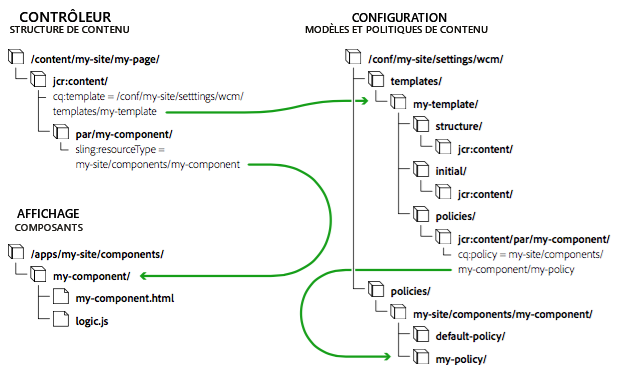
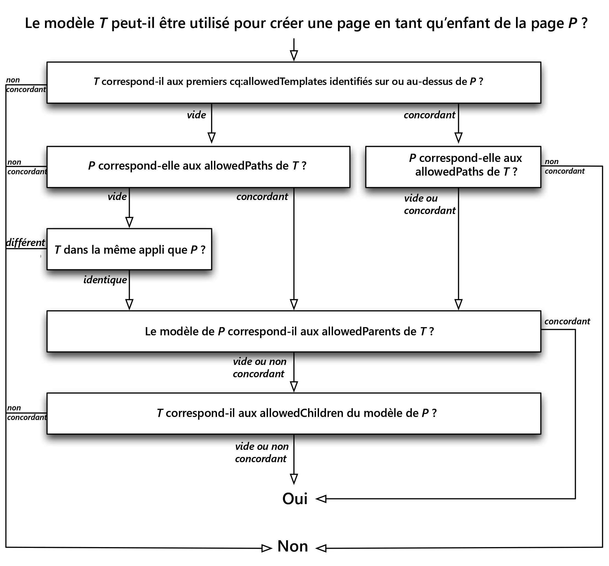

# Modèles modifiables {#editable-templates}

Découvrez comment les modèles modifiables sont utilisés lors de la création d’une page, de la définition de son contenu initial, de son contenu structuré, des politiques de création et de la mise en page.

## Vue d’ensemble {#overview}

Lors de la création d’une page, vous devez sélectionner un modèle. Le modèle de page est utilisé comme base pour la nouvelle page. Le modèle peut définir la structure de la page créée, le contenu initial et les composants qui peuvent être utilisés (propriétés de conception).

* Les modèles modifiables permettent aux créateurs et créatrices de créer et d’utiliser des modèles.
* Les modèles modifiables peuvent être utilisés pour créer des pages modifiables avec à la fois :
   * [ Éditeur de page ](/help/sites-cloud/authoring/page-editor/templates.md) et
   * [Éditeur universel](/help/sites-cloud/authoring/universal-editor/templates.md)

Les modèles de page utilisés pour créer des pages modifiables avec l’éditeur universel utilisent un sous-ensemble limité de fonctionnalités de modèle modifiables. Par conséquent, le reste de ce document se concentre sur les modèles modifiables utilisés pour créer des pages modifiables avec l’éditeur de page.

## Modèles modifiables et pages modifiées à l’aide de l’éditeur de page {#page-editor}

Lors de la création de modèles pour créer des pages modifiables avec l’éditeur de page, les auteurs et autrices normalement spécialisés sont identifiés.

* Ces auteurs spécialisés sont connus sous le nom de **créateurs (ou auteurs) de modèles**.
* Les créateurs de modèles doivent être membres du groupe `template-authors`.
* Les modèles modifiables conservent un lien dynamique avec toutes les pages créées à partir d’eux. De cette manière, toute modification apportée au modèle est répercutée dans les pages proprement dites.
* Les modèles modifiables rendent le composant de page plus générique, de sorte que le composant de page principal peut être utilisé sans personnalisation.

Avec les modèles modifiables, les éléments qui constituent une page sont isolés au sein des composants. Vous pouvez configurer les combinaisons de composants nécessaires dans une interface utilisateur, rendant ainsi inutile le développement d’un nouveau composant de page pour chaque variante de page.

Ce document :

* Donne un aperçu de la création d’un modèle modifiable.
* décrit les tâches d’administration ou de développement requises pour créer des modèles modifiables ;
* décrit les bases techniques des modèles modifiables ;
* décrit comment AEM évalue la disponibilité d’un modèle.

>[!NOTE]
>
>Dans ce document, nous partons du principe que vous êtes déjà rompu à la création et la modification de modèles. Consultez le document de création [Modèles pour créer des pages modifiables avec l’éditeur de page](/help/sites-cloud/authoring/page-editor/templates.md) qui présente les fonctionnalités des modèles modifiables exposés à l’auteur du modèle.

>[!TIP]
>
>Le [tutoriel WKND](/help/implementing/developing/introduction/develop-wknd-tutorial.md) explique en détail comment utiliser des modèles modifiables en implémentant un exemple. Il est très utile pour comprendre comment configurer un modèle dans un nouveau projet

## Création d’un modèle modifiable {#creating-a-new-template}

La création de modèles modifiables s’effectue essentiellement à l’aide de la [console de modèles et de l’éditeur de modèles](/help/sites-cloud/authoring/page-editor/templates.md). Cette tâche est de la responsabilité d’une personne spécialisée dans la création de modèles. Cette section vous donne un aperçu de ce processus. Elle décrit ensuite ce qui se passe au niveau technique.

Lors de la création d’un modèle modifiable :

1. Créez un [dossier pour les modèles](#template-folders). Cela n’est pas obligatoire, mais cela fait partie des bonnes pratiques recommandées.
1. Sélectionnez un [type de modèle](#template-type). Il est copié afin de créer la [définition du modèle](#template-definitions).

   >[!NOTE]
   >
   >Une sélection de types de modèles prêts à l’emploi est fournie. Vous pouvez également [créer vos propres types de modèles spécifiques à un site](#creating-template-types) si nécessaire.

1. Configurez la structure, les politiques de contenu, le contenu initial et la mise en page du nouveau modèle.

   **Structure**

   * La structure vous permet de définir les composants et le contenu de votre modèle.
   * Les composants définis dans la structure du modèle ne peuvent pas être déplacés sur une page créée ni supprimés des pages créées.
   * Si vous souhaitez que les personnes créant les pages puissent ajouter et supprimer des composants, ajoutez un système de paragraphes au modèle.
   * Les composants peuvent être déverrouillés (et reverrouillés) pour que vous puissiez définir le contenu initial.

   Pour plus d’informations sur la façon dont un auteur de modèles définit la structure, voir [ Modèles pour créer des pages modifiables avec l’éditeur de page](/help/sites-cloud/authoring/page-editor/templates.md#editing-a-template-structure-template-author).

   Pour connaître les détails techniques de la structure, consultez la section [Structure](#structure) de ce document.

   **Politiques**

   * Les politiques de contenu définissent les propriétés de conception d’un composant.

      * Par exemple, les composants disponibles ou les dimensions minimales/maximales.

   * Ces politiques s’appliquent au modèle (et aux pages créées avec le modèle).

   Pour plus d’informations sur la façon dont une personne créant des modèles définit des politiques, consultez [Modèles pour créer des pages modifiables avec l’éditeur de page](/help/sites-cloud/authoring/page-editor/templates.md#editing-a-template-structure-template-author).

   Pour connaître les détails techniques des politiques, consultez la section [Politiques de contenu](#content-policies) de ce document.

   **Contenu initial**

   * Le contenu initial définit le contenu qui s’affiche lors de la première création d’une page en fonction du modèle.
   * Le contenu initial peut ensuite être modifié par les personnes créant les pages.

   Pour plus d’informations sur la façon dont un auteur de modèles définit la structure, voir [ Modèles pour créer des pages modifiables avec l’éditeur de page](/help/sites-cloud/authoring/page-editor/templates.md#editing-a-template-initial-content-author).

   Pour plus d’informations techniques sur le contenu initial, reportez-vous à la rubrique [Contenu initial](#initial-content) de ce document.

   **Disposition**

   * Vous pouvez définir la disposition du modèle pour différents appareils.
   * La mise en page réactive pour les modèles fonctionne de la même manière que pour la création de pages.

   Pour plus d’informations sur la manière dont l’auteur du modèle définit la mise en page du modèle, voir [ Modèles pour créer des pages modifiables avec l’éditeur de page](/help/sites-cloud/authoring/page-editor/templates.md#editing-a-template-layout-template-author).

   Pour plus d’informations techniques sur la mise en page d’un modèle, reportez-vous à la rubrique [mise en page](#layout) de ce document.

1. Activez le modèle, puis autorisez-le pour des arborescences de contenu spécifiques.

   * Un modèle peut être activé ou désactivé afin de le rendre disponible ou indisponible pour les personnes créant les pages.
   * Un modèle peut être rendu disponible ou indisponible pour certaines branches de la page.

   Pour plus d’informations sur la manière dont un créateur de modèles active un modèle, voir [Modèles pour créer des pages modifiables avec l’éditeur de page](/help/sites-cloud/authoring/page-editor/templates.md#enabling-and-allowing-a-template-template-author).

   Pour obtenir des informations techniques sur l’activation d’un modèle, consultez la section [Activation et autorisation d’un modèle à utiliser](#enabling-and-allowing-a-template-for-use) dans ce document

1. Utilisez-le pour créer des pages de contenu.

   * Lorsque vous utilisez un modèle pour créer une page, il n’existe aucune différence visible ni indication permettant de distinguer les modèles statiques des modèles modifiables.
   * Pour le créateur de pages, le processus est transparent.

   Pour plus d’informations sur la façon dont un créateur de pages utilise le modèle afin de créer une page, voir [Création et organisation des pages](/help/sites-cloud/authoring/sites-console/organizing-pages.md#templates).

   Pour obtenir des informations techniques sur la création de pages à l’aide de modèles modifiables, consultez la section [Pages de contenu créées](#resultant-content-pages) de ce document.

>[!TIP]
>
>Ne saisissez jamais d’informations qui doivent être internationalisées dans un modèle. Pour l’internationalisation, il est recommandé d’utiliser les [fonctions de localisation des composants principaux](https://experienceleague.adobe.com/docs/experience-manager-core-components/using/get-started/localization.html?lang=fr).

>[!NOTE]
>
>Les modèles sont des outils puissants pour rationaliser votre processus de création de page. Cependant, un nombre excessif de modèles peut submerger les auteurs et semer la confusion dans la création de pages. Une bonne règle d’or consiste à maintenir le nombre de modèles au-dessous de 100.
>
>Adobe ne recommande pas d’avoir plus de 1 000 modèles en raison des impacts potentiels sur le rendement.

>[!NOTE]
>
>La bibliothèque cliente de l’éditeur suppose que l’espace de noms `cq.shared` existe dans les pages de contenu. Si cet élément est absent, l’erreur JavaScript `Uncaught TypeError: Cannot read property 'shared' of undefined` est renvoyée.
>
>`cq.shared` est inclus dans tous les exemples de pages de contenu. Par conséquent, tout contenu basé sur ces pages inclut automatiquement `cq.shared`. Toutefois, si vous décidez de créer vos propres pages de contenu à partir de zéro, sans vous servir de l’exemple de contenu, vous devez veiller à inclure l’espace de noms `cq.shared`.
>
>Pour plus d’informations, voir [Utilisation des bibliothèques côté client](/help/implementing/developing/introduction/clientlibs.md).

## Dossiers de modèles {#template-folders}

Pour organiser vos modèles, vous pouvez utiliser les dossiers suivants :

* `global`
* Spécifique au site

>[!NOTE]
>
>Bien que vous puissiez imbriquer vos dossiers, lorsque l’utilisateur les visualise dans la console **Modèles**, ils sont présentés sous la forme d’une structure plate.

Dans une instance AEM standard, le dossier `global` existe déjà dans la console de modèles. Il contient les modèles par défaut et fait office de dossier de rechange si le dossier actif ne contient pas de politiques et/ou de types de modèles. Vous pouvez ajouter vos modèles par défaut à ce dossier ou créer un dossier (recommandé).

>[!NOTE]
>
>Il est recommandé de créer un dossier pour contenir vos modèles personnalisés et de ne pas utiliser le dossier `global`.

>[!CAUTION]
>
>Les dossiers doivent être créés par un utilisateur disposant des droits `admin`.

Les types de modèles et les politiques sont hérités dans tous les dossiers selon l’ordre de priorité suivant :

1. Dossier actif
1. Parent(s) du dossier actif
1. `/conf/global`
1. `/apps`
1. `/libs`

Une liste de toutes les entrées autorisées est créée. Si des configurations se chevauchent (`path`/`label`), seule l’instance la plus proche du dossier actif s’affiche pour l’utilisateur.

Pour créer un dossier, vous pouvez effectuer l’une des opérations suivantes :

* Par programmation ou avec CRXDE Lite
* Utilisation de l’[explorateur de configurations](/help/implementing/developing/introduction/configurations.md#using-configuration-browser)

## Utilisation de CRXDE Lite {#using-crxde-lite}

1. Un nouveau dossier (sous /conf) peut être créé pour votre instance, soit par programmation soit avec CRXDE Lite.

   La structure suivante doit être utilisée :

   ```xml
   /conf
       <your-folder-name> [sling:Folder]
           settings [sling:Folder]
               wcm [cq:Page]
                   templates [cq:Page]
                   policies [cq:Page]
   ```

1. Vous pouvez ensuite définir les propriétés suivantes sur le nœud racine du dossier :

   `<your-folder-name> [sling:Folder]`

   * Nom : `jcr:title`
   * Type : `String`
   * Valeur : titre (du dossier) que vous souhaitez afficher dans la console **Modèles**.

1. Outre les autorisations et les droits de création standard (par exemple, `content-authors`), vous devez maintenant attribuer le(s) groupe(s) et définir les droits d’accès nécessaires (listes de contrôle d’accès, ACL) pour que les créateurs puissent créer des modèles dans le nouveau dossier.

   Le groupe `template-authors` est le groupe par défaut qui doit être attribué. Pour plus d’informations, consultez la section [ACL et groupes](#acls-and-groups).

   <!--See [Access Right Management](/help/sites-administering/user-group-ac-admin.md#access-right-management) for full details on managing and assigning access rights.-->

### Utilisation de l’explorateur de configurations {#using-the-configuration-browser}

1. Accédez à **Navigation globale** > **Outils** > [**Explorateur de configurations**](/help/implementing/developing/introduction/configurations.md#using-configuration-browser).

   Les dossiers existants sont répertoriés à gauche, y compris le dossier `global`.

1. Cliquez sur **Créer**.
1. Les champs suivants doivent être configurés dans la boîte de dialogue **Créer une configuration** :

   * **Titre** : indiquez un titre pour le dossier de configuration.
   * **Modèles modifiables** : sélectionnez cette option pour autoriser les modèles modifiables dans ce dossier

1. Cliquez sur **Créer**

>[!NOTE]
>
>Dans l’[explorateur de configurations](/help/implementing/developing/introduction/configurations.md#using-configuration-browser), vous pouvez modifier le dossier global et activer l’option **Modèles modifiables** si vous souhaitez créer des modèles dans ce dossier. Il ne s’agit toutefois pas de la méthode recommandée.

### ACL et groupes {#acls-and-groups}

Une fois vos dossiers de modèles créés (soit via CRXDE, soit à l’aide de l’explorateur de configurations), des listes de contrôle d’accès (ACL) doivent être définies pour les groupes appropriés afin que les dossiers de modèles garantissent une protection adéquate.

Les dossiers de modèles destinés au [tutoriel WKND](/help/implementing/developing/introduction/develop-wknd-tutorial.md) peuvent être utilisés à titre d’exemple.

#### Groupe template-authors {#the-template-authors-group}

Le groupe `template-authors` est utilisé pour gérer l’accès aux modèles. Il est fourni en standard avec AEM, mais il est vide. Les utilisateurs doivent donc être ajoutés au groupe pour le projet/site.

>[!CAUTION]
>
>Le groupe `template-authors` est destiné uniquement aux utilisateurs qui doivent pouvoir créer des modèles.
>
>La modification des modèles est une fonctionnalité très puissante qui, si elle n’est pas exécutée correctement, peut entraîner l’échec des modèles existants. Par conséquent, ce rôle doit être ciblé et ne doit inclure que des utilisateurs et utilisatrices qualifiés.

Le tableau suivant présente les autorisations nécessaires à l’édition de modèles.

<table>
 <tbody>
  <tr>
   <th>Chemin</th>
   <th>Rôle/Groupe</th>
   <th>Autorisations<br /> </th>
   <th>Description</th>
  </tr>
  <tr>
   <td rowspan="3"><code>/conf/&lt;<i>your-folder</i>&gt;/settings/wcm/templates</code></td>
   <td>Créateurs de modèles<br /> </td>
   <td>lecture, écriture, réplication</td>
   <td>Créateurs de modèles qui créent, lisent, mettent à jour, suppriment et répliquent des modèles dans un espace <code>/conf</code> spécifique au site.</td>
  </tr>
  <tr>
   <td>Utilisateur web anonyme</td>
   <td>lecture</td>
   <td>L’utilisateur web anonyme doit lire les modèles lors du rendu d’une page.</td>
  </tr>
  <tr>
   <td>Auteurs de contenu</td>
   <td>réplication</td>
   <td>Lors de l’activation d’une page, les créateurs replicateContent doivent activer les modèles correspondants.</td>
  </tr>
  <tr>
   <td rowspan="3"><code>/conf/&lt;<i>your-folder</i>&gt;/settings/wcm/policies</code></td>
   <td><code>Template Author</code></td>
   <td>lecture, écriture, réplication</td>
   <td>Créateurs de modèles qui créent, lisent, mettent à jour, suppriment et répliquent des modèles dans un espace <code>/conf</code> spécifique au site.</td>
  </tr>
  <tr>
   <td>Utilisateur web anonyme</td>
   <td>lecture</td>
   <td>L’utilisateur web anonyme doit lire les politiques lors du rendu d’une page.</td>
  </tr>
  <tr>
   <td>Auteurs de contenu</td>
   <td>réplication</td>
   <td>Les créateurs de contenu doivent activer les politiques d’un modèle de page lors de l’activation d’une page.</td>
  </tr>
  <tr>
   <td rowspan="2"><code>/conf/&lt;site&gt;/settings/template-types</code></td>
   <td>Créateur de modèles</td>
   <td>lecture</td>
   <td>Le créateur de modèles crée un modèle basé sur l’un des types de modèles prédéfinis.</td>
  </tr>
  <tr>
   <td>Utilisateur web anonyme</td>
   <td>aucune</td>
   <td>L’utilisateur web anonyme ne doit pas accéder aux types de modèles.</td>
  </tr>
 </tbody>
</table>

Ce groupe `template-authors` par défaut couvre les configurations de projet dans lesquelles tous les membres de `template-authors` sont autorisés à accéder à l’ensemble des modèles et à en créer. Pour les configurations plus complexes, lorsque plusieurs groupes de personnes créant des modèles sont nécessaires pour séparer l’accès aux modèles, vous devez créer davantage de groupes de personnes créant des modèles personnalisés. Toutefois, les autorisations des groupes de personnes créant des modèles restent les mêmes.

## Type de modèle {#template-type}

Lors de la création d’un modèle, vous devez spécifier un type de modèle :

* Les types de modèle fournissent de façon efficace des modèles pour un modèle. Lors de la création d’un modèle, la structure et le contenu initial du type de modèle sélectionné sont utilisés pour créer du nouveau modèle.

   * Le type de modèle est copié pour créer le modèle.
   * Une fois la copie effectuée, la seule connexion entre le modèle et le type de modèle est une référence statique à des fins d’information.

* Les types de modèle permettent de définir :

   * Le type de ressource du composant de page.
   * La politique du nœud racine qui définit les composants autorisés dans l’éditeur de modèles.
   * Il est recommandé de définir les points d’arrêt pour la grille réactive et la configuration de l’émulateur mobile au niveau du type d’émulateur.

* AEM fournit une petite sélection de types de modèle prêts à l’emploi tels que Page HTML5 et Page de formulaire adaptatif.

   * Des exemples supplémentaires sont fournis dans le [tutoriel WKND](/help/implementing/developing/introduction/develop-wknd-tutorial.md).

* Les types de modèle sont généralement définis par les développeurs et les développeuses.

Les types de modèles prêts à l’emploi sont stockés sous :

* `/libs/settings/wcm/template-types`

>[!CAUTION]
>
>Vous ne devez rien modifier dans le chemin `/libs`. En effet, le contenu de `/libs` peut être remplacé à tout moment par une mise à jour d’AEM.

Les types de modèle spécifiques à un site doivent être stockés dans l’emplacement comparable :

* `/apps/settings/wcm/template-types`

Les définitions de vos types de modèle personnalisés doivent être stockées dans des dossiers définis par l’utilisateur (ce qui est recommandé) ou bien dans `global`. Par exemple :

* `/conf/<my-folder-01>/<my-folder-02>/settings/wcm/template-types`
* `/conf/<my-folder>/settings/wcm/template-types`
* `/conf/global/settings/wcm/template-types`

>[!CAUTION]
>
>Les types de modèle doivent respecter la structure de dossiers correcte (à savoir `/settings/wcm/...`). Dans le cas contraire, ils seront introuvables.

<!--
### Template Type and Mobile Device Groups {#template-type-and-mobile-device-groups-br}

The [device groups](/help/sites-developing/mobile.md#device-groups) used for an editable template (set as relative path of the property `cq:deviceGroups`) define which mobile devices are available as emulators in the [layout mode](/help/sites-authoring/responsive-layout.md) of page authoring. This value can be set in two places:

* On the editable template type
* On the editable template

When creating an editable template, the value is copied from the template type to the individual template. If the value is not set on the type, it can be set on the template. Once a template is created, there is no inheritance from the type to the template.

>[!CAUTION]
>
>The value of `cq:deviceGroups` must be set as a relative path such as `mobile/groups/responsive` and not as an absolute path such as `/etc/mobile/groups/responsive`.

>[!NOTE]
>
>With static templates /help/sites-developing/page-templates-static.md, the value of `cq:deviceGroups` could be set at the root of the site.
>
>With editable templates, this value is now stored at the template level and is not supported at the page root level.
-->

### Création de types de modèle {#creating-template-types}

Si vous avez créé un modèle qui peut servir de base pour d’autres modèles, vous pouvez le copier en tant que type de modèle.

1. Créez un modèle comme vous le feriez pour n’importe quel modèle de page. Voir [ Modèles pour créer des pages modifiables avec l’éditeur de page](/help/sites-cloud/authoring/page-editor/templates.md#creating-a-new-template-template-author). Cela servira de base à votre type de modèle.
1. À l’aide de CRXDE Lite, copiez le modèle créé du nœud `templates` vers le nœud `template-types` sous le dossier [template](#template-folders).
1. Supprimez le modèle du nœud `templates` sous le [dossier de modèles](#template-folders).
1. Dans la copie du modèle qui se trouve sous le nœud `template-types`, supprimez toutes les propriétés `cq:template` et `cq:templateType` de tous les nœuds `jcr:content`.

Vous pouvez également développer votre propre type de modèle en utilisant un exemple de modèle modifiable comme base (disponible sur GitHub).

Code sur Github

Vous pouvez trouver le code de cette page sur GitHub.

* [Ouvrez le projet aem-sites-example-custom-template-type sur GitHub](https://github.com/Adobe-Marketing-Cloud/aem-sites-example-custom-template-type).
* Téléchargez le projet sous la forme d’[un fichier ZIP](https://github.com/Adobe-Marketing-Cloud/aem-sites-example-custom-template-type/archive/master.zip).

## Définitions de modèle {#template-definitions}

Les définitions des modèles modifiables sont stockées dans des [dossiers définis par l’utilisateur](#template-folders) (ce qui est recommandé) ou bien dans `global`. Par exemple :

* `/conf/<my-folder>/settings/wcm/templates`
* `/conf/<my-folder-01>/<my-folder-02>/settings/wcm/templates`
* `/conf/global/settings/wcm/templates`

Le nœud racine du modèle est de type `cq:Template` avec la structure suivante :

```xml
<template-name>
  initial
    jcr:content
      root
        <component>
        ...
        <component>
  jcr:content
    @property status
  policies
    jcr:content
      root
        @property cq:policy
        <component>
          @property cq:policy
        ...
        <component>
          @property cq:policy
  structure
    jcr:content
      root
        <component>
        ...
        <component>
      cq:responsive
        breakpoints
  thumbnail.png
```

Les éléments principaux sont les suivants :

* `<template-name>`

   * ` [initial](#initial-content)`
   * `jcr:content`
   * ` [structure](#structure)`
   * ` [policies](#policies)`
   * `thumbnail.png`

### jcr:content {#jcr-content}

Ce nœud contient des propriétés pour le modèle :

* **Nom** : `jcr:title`
* **Nom** : `status`
   * ``**Type** : `String`
   * **Valeur** : `draft`, `enabled` ou `disabled`

### Structure {#structure}

Définit la structure de la page créée :

* Est fusionnée avec le contenu (`/initial`) lors de la création d’une page.
* Les modifications apportées à la structure sont répercutées dans toutes les pages créées avec le modèle.
* Le nœud `root` (`structure/jcr:content/root`) définit la liste des composants qui seront disponibles dans la page créée.
   * Les composants définis dans la structure du modèle ne peuvent être ni déplacés ni supprimés dans les pages créées.
   * Une fois qu’un composant est déverrouillé, la propriété `editable` est définie sur `true`.
   * Dès qu’un composant ayant déjà du contenu est déverrouillé, son contenu est déplacé vers la branche `initial`.

* Le nœud `cq:responsive` contient des définitions pour la mise en page réactive.

### Contenu initial {#initial-content}

Définit le contenu initial dont une nouvelle page disposera au moment de sa création :

* Contient un nœud `jcr:content` copié dans toute nouvelle page.
* Est fusionné avec la structure (`/structure`) lors de la création d’une page.
* Aucune page existante n’est mise à jour si le contenu initial est modifié après la création.
* Le nœud `root` contient une liste de composants permettant de définir les éléments qui seront disponibles dans la page créée.
* Si du contenu est ajouté à un composant en mode de structure et que ce composant est ensuite déverrouillé (ou inversement), ce contenu est utilisé comme contenu initial.

### Disposition {#layout}

Lorsque vous [modifiez un modèle](/help/sites-cloud/authoring/page-editor/templates.md) vous pouvez définir la mise en page et utiliser [mise en page réactive standard](/help/sites-cloud/administering/responsive-layout.md), qui peut être [configurée sur la page par l’auteur du contenu](/help/sites-cloud/authoring/page-editor/responsive-layout.md).

### Politiques de contenu {#content-policies}

Les politiques de contenu définissent les propriétés de conception d’un composant. Par exemple, les composants disponibles ou les dimensions minimales/maximales. Ces politiques s’appliquent au modèle (et aux pages créées avec le modèle). Les politiques de contenu peuvent être créées et sélectionnées dans l’éditeur de modèles.

* La propriété `cq:policy`, sur le nœud `root`
  `/conf/<your-folder>/settings/wcm/templates/<your-template>/policies/jcr:content/root`
Fournit une référence relative à la politique de contenu pour le système de paragraphes de la page.

* La propriété `cq:policy`, sur les nœuds component-explicit sous `root`, fournit des liens vers les politiques relatives aux composants individuels.

* Les définitions de politique réelles sont stockées sous :
  `/conf/<your-folder>/settings/wcm/policies/wcm/foundation/components`

>[!NOTE]
>
>Les chemins d’accès des définitions de politique dépendent du chemin du composant. `cq:policy` contient une référence relative à la configuration proprement dite.

### Politiques de page {#page-policies}

Les politiques de page vous permettent de définir la [politique de contenu](#content-policies) de la page (système de paragraphes principal), soit dans le modèle soit dans les pages créées.

### Activation et autorisation d’un modèle à utiliser {#enabling-and-allowing-a-template-for-use}

1. **Activer le modèle**

   Pour qu’un modèle puisse être utilisé, il doit être activé par l’un des moyens suivants :

   * [Activer le modèle](/help/sites-cloud/authoring/page-editor/templates.md) à partir de la console des **Modèles**.

   * Définir la propriété de statut sur le nœud `jcr:content`.

      * Par exemple, sous :
        `/conf/<your-folder>/settings/wcm/templates/<your-template>/jcr:content`

      * Définissez la propriété :

         * Nom : statut
         * Type : chaîne
         * Valeur : `enabled`

1. **Modèles autorisés**

   * [Définissez le ou les chemins d’accès des modèles autorisés dans les **Propriétés de page**](/help/sites-cloud/authoring/page-editor/templates.md#allowing-a-template-author) de la page appropriée ou de la page racine d’une sous-branche.
   * Définissez la propriété :
     `cq:allowedTemplates`
Sur le nœud `jcr:content` de la branche requise.

   Par exemple, avec la valeur suivante :

   `/conf/<your-folder>/settings/wcm/templates/.*`

## Pages de contenu créées {#resultant-content-pages}

Les pages créées à partir de modèles modifiables :

* sont créées avec une sous-arborescence qui est fusionnée à partir de `structure` et `initial` dans le modèle ;

* contiennent des références aux informations contenues dans le modèle et le type de modèle. Pour cela, on utilise un nœud `jcr:content` avec les propriétés suivantes :

   * `cq:template` – Fournit la référence dynamique au modèle proprement dit ; fait en sorte que les modifications apportées au modèle soient répercutées sur les pages proprement dites.

   * `cq:templateType` – Fournit une référence au type de modèle.



Le schéma ci-dessus montre la corrélation entre les modèles, le contenu et les composants :

* Contrôleur – `/content/<my-site>/<my-page>` – Page résultante référençant le modèle. Le contenu contrôle l’ensemble du processus. En fonction des définitions, il accède au modèle et aux composants appropriés.
* Configuration – `/conf/<my-folder>/settings/wcm/templates/<my-template>` – Le [modèle et les politiques de contenu associées](#template-definitions) définissent la configuration de la page.
* Modèle – Lots OSGi – Les [lots OSGi](/help/implementing/deploying/configuring-osgi.md) mettent en œuvre la fonctionnalité.
* Vue – `/apps/<my-site>/components` – Dans les environnements de création et de publication, le contenu est rendu par des composants.

Lors du rendu d’une page :

* **Modèles** :

   * La propriété `cq:template` de son nœud `jcr:content` sera référencée afin d’accéder au modèle correspondant à cette page.

* **Composants** :

   * Le composant de page fusionnera l’arborescence `structure/jcr:content` du modèle avec l’arborescence `jcr:content` de la page.
      * Le composant de page autorisera uniquement l’auteur ou l’autrice à modifier les nœuds de la structure du modèle qui ont été marqués comme étant modifiables (ainsi que leurs éventuels enfants).
      * Lors du rendu d’un composant sur une page, le chemin d’accès relatif de ce composant est prélevé dans le nœud `jcr:content` ; une recherche sera ensuite effectuée dans le même chemin sous le nœud `policies/jcr:content` du modèle.
         * La propriété `cq:policy` de ce nœud pointe vers la politique de contenu proprement dite (en d’autres termes, elle contient la configuration de conception de ce composant).
            * Vous disposez ainsi de plusieurs modèles réutilisant les mêmes configurations de politique de contenu.

### Disponibilité des modèles {#template-availability}

Lors de la création d’une page dans l’interface d’administration du site, la liste des modèles disponibles dépend de l’emplacement de la nouvelle page et des restrictions d’emplacement spécifiées dans chaque modèle.

Les propriétés suivantes déterminent si un modèle `T` peut être utilisé pour qu’une nouvelle page soit placée en tant qu’enfant de la page `P`. Chacune de ces propriétés est une chaîne à valeurs multiples contenant aucune ou plusieurs expressions régulières utilisées pour la correspondance avec les chemins :

* La propriété `cq:allowedTemplates` du sous-nœud `jcr:content` de `P` ou un ancêtre de `P`.

* La propriété `allowedPaths` de `T`.

* La propriété `allowedParents` de `T`.

* La propriété `allowedChildren` du modèle de `P`.

L’évaluation fonctionne comme suit :

* La première propriété `cq:allowedTemplates` non vide détectée dans la hiérarchie de page commençant par `P` est comparée au chemin de `T`. Si aucune des valeurs ne correspond, `T` est rejeté.

* Si `T` a une propriété `allowedPaths` non vide, mais qu’aucune des valeurs ne correspond au chemin de `P`, `T` est rejeté.

* Si les deux propriétés ci-dessus sont vides ou inexistantes, `T` est rejeté sauf s’il appartient à la même application que `P`. `T` appartient à la même application que `P` si et seulement si le nom du deuxième niveau du chemin de `T` est identique à celui du deuxième niveau du chemin de `P`. Par exemple, le modèle `/apps/wknd/templates/foo` appartient à la même application que la page `/content/wknd`.

* Si `T` a une propriété `allowedParents` non vide, mais qu’aucune des valeurs ne correspond au chemin de `P`, `T` est rejeté.

* Si le modèle de `P` a une propriété `allowedChildren` non vide, mais qu’aucune des valeurs ne correspond au chemin de `T`, `T` est rejeté.

* Dans tous les autres cas, `T` est autorisé.

Le diagramme suivant illustre le processus d’évaluation de modèle :



>[!CAUTION]
>
>AEM offre plusieurs propriétés pour contrôler les modèles autorisés sous **Sites**. Cependant, leur combinaison peut conduire à des règles très complexes, difficiles à suivre et à gérer.
>
>Par conséquent, Adobe vous recommande de commencer simplement, en définissant :
>
>* uniquement la propriété `cq:allowedTemplates` ;
>
>* uniquement sur la racine du site.
>
>Pour consulter un exemple, reportez-vous au contenu du [tutoriel WKND](/help/implementing/developing/introduction/develop-wknd-tutorial.md) : `/content/wknd/jcr:content`
>
>Les propriétés `allowedPaths`, `allowedParents` et `allowedChildren` peuvent également être placées sur les modèles pour définir des règles plus élaborées. Cependant, dans la mesure du possible, il est *beaucoup* plus simple de définir d’autres propriétés `cq:allowedTemplates` dans des sous-sections du site si des restrictions supplémentaires des modèles autorisés s’imposent.
>
>Un autre avantage est que les propriétés `cq:allowedTemplates` peuvent être mises à jour par un auteur dans l’onglet **Avancé** des **Propriétés de la page**. Les autres propriétés de modèle ne peuvent pas être mises à jour à l’aide de l’interface utilisateur (standard). Il faudrait donc qu’un développeur conserve les règles et qu’un déploiement du code soit effectué pour chaque modification.

#### Limitation des modèles utilisés dans les pages enfants {#limiting-templates-used-in-child-pages}

Pour limiter les modèles servant à créer des pages enfants sous une page donnée, utilisez la propriété `cq:allowedTemplates` du nœud `jcr:content` de la page pour spécifier la liste des modèles à autoriser en tant que pages enfants. Chaque valeur de la liste doit être un chemin absolu vers un modèle pour une page enfant autorisée, par exemple `/apps/wknd/templates/page-content`.

Vous pouvez utiliser la propriété `cq:allowedTemplates` sur le nœud `jcr:content` du modèle pour appliquer cette configuration à toutes les pages créées qui utilisent ce modèle.

Si vous souhaitez ajouter d’autres contraintes, par exemple concernant la hiérarchie des modèles, vous pouvez appliquer les propriétés `allowedParents/allowedChildren` sur le modèle. Vous pouvez ensuite spécifier explicitement que les pages créées à partir d’un modèle T doivent être des parents/enfants de pages créées à partir d’un modèle T.
