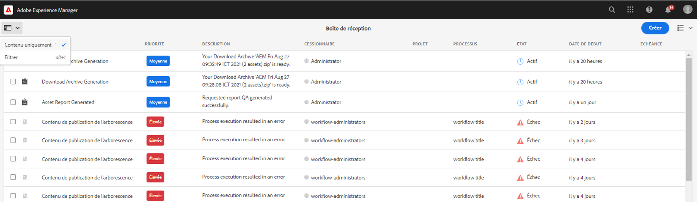

# Configurer des filtres de recherche pour la boîte de réception {#configure-search-filters-inbox}

Vous pouvez configurer des filtres de recherche pour les éléments contenus dans la boîte de réception. Basez vos critères de recherche sur une colonne spécifique de la boîte de réception pour filtrer les résultats.

Par exemple, pour filtrer les éléments contenus dans la boîte de réception selon une plage de colonnes Date de naissance, vous pouvez utiliser le prédicat Période pour définir la plage de dates.

Voici les types de prédicats disponibles pour la boîte de réception :

* Prédicat de plage

* Prédicat de texte

* Prédicat de période

* Prédicat de propriété d’options

>[!NOTE]
>
>Assurez-vous d’être membre du groupe `workflow-administrators` afin de configurer les filtres de recherche pour la boîte de réception.

## Créer ou ouvrir une configuration personnalisée {#creating-opening-customized-configuration}

1. Accédez à **[!UICONTROL Outils]**, **[!UICONTROL Général]**, **[!UICONTROL Formulaires de recherche]**.

1. Sélectionnez la configuration **[!UICONTROL Rail de recherche de la boîte de réception]** et sélectionnez **[!UICONTROL Modifier]**.
1. Incorporez les modifications de configuration de prédicat à l’aide de **[!UICONTROL Modifier des formulaires de recherche]**.
1. Sélectionnez **[!UICONTROL Terminé]** pour enregistrer la configuration.

## Supprimer une configuration personnalisée {#delete-customized-configuration}

Pour supprimer une configuration personnalisée :

1. Accédez à **[!UICONTROL Outils]**, **[!UICONTROL Général]**, **[!UICONTROL Formulaires de recherche]**.

1. Sélectionnez la configuration **[!UICONTROL Rail de recherche de la boîte de réception]** et sélectionnez **[!UICONTROL Supprimer]**.

## Configuration du prédicat de plage {#range-predicate}

Vous pouvez filtrer les éléments de la boîte de réception pour rechercher une plage de nombres dans une colonne de la boîte de réception à l’aide du prédicat de plage. Vous pouvez également choisir d’inclure des valeurs décimales pour les nombres.

Pour configurer un prédicat de plage :

1. Ouvrez le formulaire [pour configuration](#creating-opening-customized-configuration).
1. Sélectionnez l’onglet **[!UICONTROL Sélectionner le prédicat]** et faites glisser **[!UICONTROL Prédicat de plage]** vers le formulaire.
1. Dans l’onglet **[!UICONTROL Paramètres]**, sélectionnez le nom de la colonne de la boîte de réception sur laquelle baser votre recherche, dans le champ **[!UICONTROL Nom de la colonne]**.
1. Indiquez le libellé du filtre dans le champ **[!UICONTROL Libellé du filtre]**. Cochez la case **[!UICONTROL Activer les valeurs décimales]** pour accepter les valeurs décimales des nombres lors de la définition de la plage.
1. Spécifiez une description facultative pour la configuration et sélectionnez **[!UICONTROL Terminé]** pour l’enregistrer.

Les modifications apportées à la configuration sont répercutées lorsque vous ouvrez la page Filtres. Le libellé de filtre que vous avez spécifié à l’étape 4 s’affiche comme libellé avec une option permettant de définir les valeurs maximale et minimale. Lorsque vous appuyez sur la touche Entrée, [!DNL Experience Manager] applique les critères de recherche au nom de colonne spécifié à l’étape 3 et renvoie les éléments de la boîte de réception.

>[!NOTE]
>
>Cet article répertorie les dernières options de l’interface utilisateur. Les noms des options sont mis à jour dans l’interface utilisateur de la prochaine version.

## Configurer l’attribut de texte {#text-predicate}

Filtrez les éléments de la boîte de réception pour rechercher une chaîne de texte dans une colonne de la boîte de réception à l’aide du prédicat de texte.

Pour configurer un prédicat de texte :

1. Ouvrez le formulaire [pour configuration](#creating-opening-customized-configuration).
1. Sélectionnez l’onglet **[!UICONTROL Sélectionner le prédicat]** et faites glisser **[!UICONTROL Prédicat de texte]** vers le formulaire.
1. Dans l’onglet **[!UICONTROL Paramètres]**, sélectionnez le nom de la colonne de la boîte de réception sur laquelle baser votre recherche, dans le champ **[!UICONTROL Nom de la colonne]**.
1. Spécifiez le texte qui s’affiche dans la zone de texte Rechercher comme texte d’espace réservé dans le champ **[!UICONTROL Zone de texte de recherche Espace réservé]**.
1. Spécifiez une description facultative pour la configuration et sélectionnez **[!UICONTROL Terminé]** pour l’enregistrer.

Les modifications apportées à la configuration sont répercutées lorsque vous ouvrez la page Filtres. Lorsque vous appuyez sur la touche Entrée, [!DNL Experience Manager] applique le texte de recherche spécifié à l’étape 4 au nom de colonne spécifié à l’étape 3 et renvoie les éléments de la boîte de réception.

## Configuration du prédicat de plage de dates {#date-range-predicate}

Vous pouvez filtrer les éléments de la boîte de réception pour rechercher une plage de dates dans une colonne de la boîte de réception à l’aide du prédicat de plage de dates.

Pour configurer un prédicat de plage de dates :

1. Ouvrez le formulaire [pour configuration](#creating-opening-customized-configuration).
1. Sélectionnez l’onglet **[!UICONTROL Sélectionner le prédicat]** et faites glisser **[!UICONTROL Prédicat de plage de dates]** vers le formulaire.
1. Dans l’onglet **[!UICONTROL Paramètres]**, sélectionnez le nom de la colonne de la boîte de réception sur laquelle baser votre recherche, dans le champ **[!UICONTROL Nom de la colonne]**.
1. Indiquez le libellé du filtre de plage de dates dans le champ **[!UICONTROL Libellé du filtre]**.
1. Indiquez les libellés de date de début et de fin pour le filtre.
1. Spécifiez une description facultative pour la configuration et sélectionnez **[!UICONTROL Terminé]** pour l’enregistrer.

Les modifications apportées à la configuration sont répercutées lorsque vous ouvrez la page Filtres. Le libellé de filtre spécifié à l’étape 4 s’affiche comme libellé pour le filtre de période, ainsi que les libellés de date de début et de fin spécifiés à l’étape 5. [!DNL Experience Manager] applique les critères de recherche au nom de colonne spécifié à l’étape 3 et renvoie les éléments de la boîte de réception.

## Configurer le prédicat d’options de colonne personnalisée {#custom-column-options-predicate}

Vous pouvez filtrer les éléments de la boîte de réception pour rechercher une option personnalisée dans une colonne de la boîte de réception à l’aide du prédicat d’options de colonne personnalisée.

Pour configurer le prédicat d’options de colonne personnalisée :

1. Ouvrez le formulaire [pour configuration](#creating-opening-customized-configuration).
1. Sélectionnez l’onglet **[!UICONTROL Sélectionner le prédicat]** et faites glisser **[!UICONTROL Prédicat d’options de colonne personnalisée]** vers le formulaire.
1. Dans l’onglet **[!UICONTROL Paramètres]**, sélectionnez le nom de la colonne de la boîte de réception sur laquelle baser votre recherche, dans le champ **[!UICONTROL Nom de la colonne]**.
1. Indiquez le libellé du filtre des options de colonne personnalisée dans le champ **[!UICONTROL Libellé du filtre]**.
1. Cochez la case **[!UICONTROL Sélection simple]** pour activer la sélection d’une seule option lors de l’application d’un filtre sur une colonne de la boîte de réception.
1. Dans la section **[!UICONTROL Ajouter des options]** :
   1. Sélectionnez **[!UICONTROL Manuel]** pour définir manuellement les options de recherche de filtre. Sélectionnez **[!UICONTROL Ajouter des options de filtre]** pour définir la première option. Indiquez le libellé de l’option de colonne et le texte de la valeur de l’option à rechercher. Par exemple, si vous souhaitez rechercher **Femme** comme valeur dans une colonne de la boîte de réception, vous pouvez spécifier **F** comme libellé pour l’option de colonne et ajouter **Femme** comme texte de valeur d’option. De même, vous pouvez ajouter d’autres options de filtre.
   1. Sélectionnez **[!UICONTROL Chemin JSON]** pour définir les options à l’aide d’un chemin d’accès au fichier JSON. Voici un exemple de fichier JSON pour définir les options de filtrage :

      ```JSON
          {
         "options":[
            {
            "text":"Female",
            "value":"F"
            },
            {
            "text":"Male",
            "value":"M"
            }
          ]
        }
      ```

   1. Sélectionnez **[!UICONTROL Chemin d’accès aux options CRX]** pour définir les options à l’aide de chemins de référentiel CRX. Sélectionnez **[!UICONTROL Ajouter des chemins d’accès aux options]** pour ajouter plusieurs chemins d’accès. Voici un exemple pour définir les options de filtre `Male` et `Female` :

      ```JSON
         <gender jcr:primaryType="sling:OrderedFolder">
                        <male
                            jcr:primaryType="nt:unstructured"
                            jcr:title="Male"
                            value="M"/>
                        <female
                            jcr:primaryType="nt:unstructured"
                            jcr:title="Female"
                            value="F"/>
                    </gender>
      ```

1. Spécifiez une description facultative pour la configuration et sélectionnez **[!UICONTROL Terminé]** pour l’enregistrer.

Les modifications apportées à la configuration sont répercutées lorsque vous ouvrez la page Filtres. Le libellé de filtre que vous avez spécifié à l’étape 4 s’affiche comme libellé pour le prédicat d’option de colonne personnalisée. [!DNL Experience Manager] applique les critères de recherche définis à l’étape 6 au nom de colonne spécifié à l’étape 3 et renvoie les éléments de la boîte de réception.

La vidéo suivante illustre les étapes de filtrage d’une colonne en fonction des valeurs des options `true` et `false`.

>[!VIDEO](https://video.tv.adobe.com/v/335679)

## Affichage des filtres de recherche en fonction de prédicats {#view-search-filters-for-predicates}

Vous pouvez afficher des filtres de recherche en fonction de prédicats. Sélectionnez **[!UICONTROL Filtrer]** sur la page Boîte de réception. Les filtres s’affichent dans le volet de gauche. Vous pouvez ensuite spécifier les critères de recherche pour filtrer les éléments de la boîte de réception.



Pour plus d’informations sur la gestion des configurations de prédicat, voir [Configuration des formulaires de recherche](search-forms.md).
