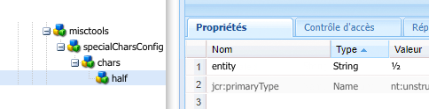

# Configuration des modules externes d’éditeur de texte enrichi {#configure-the-rich-text-editor-plug-ins}

Les fonctionnalités d’éditeur de texte enrichi sont rendues disponibles par l’intermédiaire d’une série de modules externes, chacun avec sa propriété features. Vous pouvez configurer la propriété features afin d’activer ou de désactiver une ou plusieurs fonctions de l’éditeur de texte enrichi. Cet article décrit comment configurer spécifiquement les modules externes RTE.

For details about the other RTE configurations, see [configure Rich Text Editor](/help/implementing/developing/extending/rich-text-editor.md).

>[!NOTE]
>
>When working with CRXDE Lite, it is recommended to save the changes regularly using [!UICONTROL Save All] option.

## Activation d’un module externe et configuration de la propriété features {#activateplugin}

Pour activer un module externe, suivez ces étapes. Certaines étapes sont uniquement nécessaires lorsque vous configurez un module externe pour la première fois, car les nœuds correspondants n’existent pas.

By default, `format`, `link`, `list`, `justify`, and `control` plugins and all their features are enabled in RTE.

>[!NOTE]
>
>The respective `rtePlugins` node is referred to as `<rtePlugins-node>` to avoid duplication in this article.

1. À l’aide de CRXDE Lite, cherchez le composant Texte pour votre projet.
1. Create the parent node of `<rtePlugins-node>` if it does not exist, before configuring any RTE plug-ins:

   * Selon votre composant, les noeuds parents sont les suivants :

      * `config: .../text/cq:editConfig/cq:inplaceEditing/config`
      * un nœud de configuration`.../text/cq:editConfig/cq:inplaceEditing/inplaceEditingTextConfig` alternatif: 
      * `text: .../text/dialog/items/tab1/items/text`
   * Are of type: **jcr:primaryType** `cq:Widget`
   * Possèdent tous deux les propriétés suivantes :

      * **Nom** `name`
      * **Type** `String`
      * **Valeur** `./text`


1. Depending on the interface you are configuring for, create a node `<rtePlugins-node>`, if it does not exist:

   * **Nom** `rtePlugins`
   * **Type** `nt:unstructured`

1. Ci-dessous, créez un noeud pour chaque module externe à activer :

   * **Type** `nt:unstructured`
   * **Nom** ID du module externe requis

After activating a plug-in, follow these guidelines to configure the `features` property.

|  | Activer toutes les fonctions | Activer des fonctions spécifiques | Désactiver toutes les fonctions |
|---|---|---|---|
| Name (Nom) | features | features | features |
| Type | Chaîne | String[] (multi-string; set Type to String and click Multi in CRXDE Lite) | Chaîne |
| Valeur | `*` (astérisque) | définie sur une ou plusieurs valeurs de fonctions | - |

## Compréhension du module externe findreplace {#findreplace}

The `findreplace` plug-in does not need any configuration. Ça marche de la boîte.

Lors de l’utilisation de la fonctionnalité de remplacement, la chaîne à remplacer doit être saisie en même temps que la chaîne de recherche. Cependant, vous pouvez toujours cliquer sur Rechercher pour rechercher la chaîne avant de la remplacer. Si la chaîne de remplacement est saisie après avoir cliqué sur Rechercher, la recherche est réinitialisée au début du texte.

La boîte de dialogue de recherche et de remplacement devient transparente lorsque l’utilisateur clique sur Rechercher et devient opaque lorsque l’utilisateur clique sur Remplacer. Cela permet à l’auteur de vérifier le texte qui sera remplacé. Si les utilisateurs cliquent sur Tout remplacer, la boîte de dialogue se ferme et affiche le nombre de remplacements effectués.

## Configuration des modes de collage {#pastemodes}

Lors de l’utilisation de l’éditeur de texte enrichi, les auteurs peuvent copier le contenu selon l’un des trois modes suivants :

* **Mode Navigateur** : collage de texte avec la mise en œuvre de collage par défaut du navigateur. Il ne s’agit pas d’une méthode recommandée, car elle peut introduire des balises indésirables.

* **Mode Texte brut** : collage du contenu du Presse-papiers en tant que texte brut. Cela supprime tous les éléments de style et de mise en forme du contenu copié avant insertion dans le composant AEM.

* **Mode MS Word** : collage du texte, y compris des tableaux, avec la mise en forme lors de la copie à partir de MS Word. La copie et le collage de texte depuis une autre source, telle qu’une page web ou MS Excel ne sont pas pris en charge et conservent uniquement une mise en forme partielle.

### Configuration des options de collage disponibles sur la barre d’outils de l’éditeur de texte enrichi  {#configure-paste-options-available-on-the-rte-toolbar}

Les trois icônes ci-dessous peuvent être mises à la disposition des auteurs dans la barre d’outils de l’éditeur de texte enrichi :

* **[!UICONTROL Coller (Ctrl + V)]** : peut être préconfigurée pour correspondre à l’un des trois modes de collage ci-dessus.

* **[!UICONTROL Coller comme texte]**: Fournit une fonctionnalité de mode texte brut.

* **[!UICONTROL Coller à partir de Word]** : fournit la fonctionnalité du mode MS Word.

Pour configurer l’éditeur de texte enrichi pour qu’il affiche les icônes requises, procédez comme suit.

1. Accédez à votre composant, par exemple `/apps/<myProject>/components/text`.
1. Navigate to the node `rtePlugins/edit`. Voir [Activation d’un module externe](#activateplugin) si le nœud n’existe pas.
1. Créez la propriété `features` sur le nœud `edit` et ajoutez une ou plusieurs des fonctions. Enregistrez toutes les modifications.

### Configuration du comportement de l’icône Coller (Ctrl + V) et du raccourci {#configure-the-behavior-of-the-paste-ctrl-v-icon-and-shortcut}

Vous pouvez préconfigurer le comportement de l’icône **[!UICONTROL Coller (Ctrl + V)]** en procédant comme suit. Cette configuration définit également le comportement du raccourci clavier Ctrl + V que les auteurs utilisent pour coller du contenu.

Cette configuration permet trois scénarios d’utilisation, à savoir :

* Collage de texte avec la mise en œuvre de collage par défaut du navigateur. Il ne s’agit pas d’une méthode recommandée, car elle peut introduire des balises indésirables. Configured using `browser` below.

* Collage du contenu du Presse-papiers en tant que texte brut. Cela supprime tous les éléments de style et de mise en forme du contenu copié avant insertion dans le composant AEM. Configured using `plaintext` below.

* Collage du texte, y compris des tableaux, avec la mise en forme lors de la copie à partir de MS Word. La copie et le collage de texte depuis une autre source, telle qu’une page web ou MS Excel ne sont pas pris en charge et conservent uniquement une mise en forme partielle. Configured using `wordhtml` below.

1. In your component, navigate to `<rtePlugins-node>/edit` node. Créez les nœuds s’ils n’existent pas. Pour plus d’informations, voir [Activation d’un module externe](#activateplugin).
1. Dans le nœud `edit`, créez une propriété à l’aide des informations suivantes :

   * **Nom** `defaultPasteMode`
   * **Type** `String`
   * **Valeur** L’un des modes de collage `browser`, `plaintext`ou `wordhtml`requis.

### Configuration des formats autorisés lors du collage de contenu {#pasteformats}

The paste-as-Microsoft-Word (`paste-wordhtml`) mode can be further configured so that you can explicitly define which styles are allowed when pasting in AEM from another program, such as Microsoft Word.

Par exemple, si seuls les formats et les listes en gras doivent être autorisés lors du collage dans AEM, vous pouvez filtrer les autres formats. Il s’agit du filtrage du collage configurable, qui peut être effectué pour les deux types de filtrage :

* [Texte](#pastemodes)
* [Liens](#linkstyles)

Pour les liens, vous pouvez également définir les protocoles acceptés automatiquement.

Pour configurer les formats autorisés pour coller du texte dans AEM à partir d’un autre programme :

1. In your component, navigate to the node `<rtePlugins-node>/edit`. Créez les nœuds s’ils n’existent pas. Pour plus d’informations, voir [Activation d’un module externe](#activateplugin).
1. Créez un nœud sous le nœud `edit` destiné à contenir les règles de collage HTML :

   * **Nom** `htmlPasteRules`
   * **Type** `nt:unstructured`

1. Créez un nœud sous `htmlPasteRules`, destiné à contenir les détails des formats de base autorisés :

   * **Nom** `allowBasics`
   * **Type** `nt:unstructured`

1. Pour contrôler les différents formats admis, créez une ou plusieurs des propriétés ci-dessous sur le nœud `allowBasics` :

   * **Nom** `bold`
   * **Nom** `italic`
   * **Nom** `underline`
   * **Nom** `anchor` (pour les liens et les ancres nommées)
   * **Nom** `image`

   All properties are of **Type** `Boolean`, so in the appropriate **Value** you can either select or remove the check mark to enable or disable the functionality.

   >[!NOTE]
   >
   >Si le format n’est pas défini explicitement, la valeur par défaut true est utilisée et le format est admis.

1. D’autres formats peuvent également être définis à l’aide de différentes propriétés ou de différents nœuds, également appliqués au nœud `htmlPasteRules` :

<table>
 <tbody>
  <tr>
   <td><strong>Propriétés</strong></td>
   <td><strong>Type</strong></td>
   <td><strong>Description</strong></td>
  </tr>
  <tr>
   <td>allowBlockTags</td>
   <td>Chaîne[]</td>
   <td><p>Définit la liste des balises block autorisées.</p> <p>Voici quelques balises de bloc possibles :</p>
    <ul>
     <li>Titres (h1, h2, h3)</li>
     <li>Paragraphes (p)</li>
     <li>Listes (ol, ul)</li>
     <li>Tableaux (table)</li>
    </ul> </td>
  </tr>
  <tr>
   <td>fallbackBlockTag</td>
   <td>Chaîne</td>
   <td><p>Définit la balise block utilisée pour tout bloc contenant une balise block ne figurant pas dans allowBlockTags.</p> <p> p est suffisant dans la plupart des cas.</p> </td>
  </tr>
  <tr>
   <td>table</td>
   <td>nt:unstructured</td>
   <td><p>Définit le comportement lors du collage de tableaux.<br /> </p> <p>Ce nœud doit comporter la propriété <code>allow</code> (de type <code>Boolean</code>) pour définir s’il est autorisé de coller des tableaux.</p> <p>If <code>allow</code> is set to <code>false</code>, you must specify the property <code>ignoreMode</code> (type<code> String</code>) to define how pasted table content is handled. Valid values for <code>ignoreMode</code> are:</p>
    <ul>
     <li><code>remove</code>: Supprime le contenu du tableau.</li>
     <li><code>paragraph</code>: Transforme les cellules du tableau en paragraphes.</li>
    </ul> </td>
  </tr>
  <tr>
   <td>list</td>
   <td>nt:unstructured</td>
   <td><p>Définit le comportement lors du collage de listes.<br /> </p> <p>Doit comporter la propriété <code>allow</code> (de type <code>Boolean</code>) pour définir s’il est autorisé de coller des listes.</p> <p>If <code>allow</code> is set to <code>false</code>, you must specify the property <code>ignoreMode</code> (type <code>String</code>) to define how to handle any list content pasted. Valid values for <code>ignoreMode</code> are:</p>
    <ul>
     <li><code>remove</code>: Supprime le contenu de la liste.</li>
     <li><code>paragraph</code>: Transforme les éléments de liste en paragraphes.</li>
    </ul> </td>
  </tr>
 </tbody>
</table>

Example of a valid `htmlPasteRules` structure:

```xml
"htmlPasteRules": {
    "allowBasics": {
        "italic": true,
        "link": true
    },
    "allowBlockTags": [
        "p", "h1", "h2", "h3"
    ],
    "list": {
        "allow": false,
        "ignoreMode": "paragraph"
    },
    "table": {
        "allow": true,
        "ignoreMode": "paragraph"
    }
}
```

1. Enregistrez toutes les modifications.

## Configuration des styles de texte {#textstyles}

Les auteurs peuvent appliquer des styles pour modifier l’apparence d’une portion de texte. Les styles reposent sur les classes CSS que vous prédéfinissez dans votre feuille de style CSS. Le contenu stylisé est inclus dans les balises `span` à l’aide de l’attribut `class` pour faire référence à la classe CSS. Par exemple :

`<span class=monospaced>Monospaced Text Here</span>`

Lorsque le module externe Styles est activé pour la première fois, aucun style n’est disponible par défaut. La liste contextuelle est vide. Pour fournir des styles aux auteurs, procédez comme suit :

* Activez le sélecteur de liste déroulante Style.
* Spécifiez l’emplacement de la ou des feuilles de style.
* Spécifiez les différents styles qui peuvent être sélectionnés dans la liste déroulante Style.

Pour les configurations ultérieures (par exemple, afin d’ajouter davantage de styles), suivez les instructions pour faire référence à une nouvelle feuille de style et spécifier les styles supplémentaires.

>[!NOTE]
>
>Des styles peuvent également être définis pour [des tableaux ou des cellules de tableau](configure-rich-text-editor-plug-ins.md#tablestyles). Ces configurations nécessitent des procédures distinctes.

### Activation de la liste du sélecteur de liste déroulante Style {#styleselectorlist}

Cette opération et effectuée en activant le module externe Styles.

1. In your component, navigate to the node `<rtePlugins-node>/styles`. Créez les nœuds s’ils n’existent pas. Pour plus d’informations, voir [Activation d’un module externe](#activateplugin).
1. Create the `features` property on the `styles` node:

   * **Nom** `features`
   * **Type** `String`
   * **Valeur** `*` (astérisque)

1. Enregistrez toutes les modifications.

>[!NOTE]
>
>Une fois que le module externe Styles est activé, la liste déroulante Style s’affiche dans la boîte de dialogue de modification. Cependant, la liste est vide lorsqu’aucun style n’est configuré.

### Spécification de l’emplacement de la feuille de style {#locationofstylesheet}

Ensuite, spécifiez l’emplacement de la ou des feuilles de style à référencer :

1. Navigate to the root node of your text component, for example `/apps/<myProject>/components/text`.
1. Add the property `externalStyleSheets` to the parent node of `<rtePlugins-node>`:

   * **Nom** `externalStyleSheets`
   * **Type** `String[]` (plusieurs chaînes ; cliquez sur **Multi** dans CRXDE).
   * **Valeur(s)** Chemin d’accès et nom de fichier de chaque feuille de style à inclure. Utilisez les chemins de référentiel.

   >[!NOTE]
   >
   >Vous pouvez ajouter des références à d’autres feuilles de style ultérieurement.

1. Enregistrez toutes les modifications.

>[!NOTE]
>
>Lors de l’utilisation de l’éditeur de texte enrichi dans une boîte de dialogue (IU classique), vous pouvez spécifier des feuilles de style optimisées pour la modification de texte enrichi. En raison de restrictions techniques, le contexte CSS est perdu dans l’éditeur. Vous devrez peut-être émuler ce contexte afin d’améliorer l’expérience WYSIWYG.
>
>L’éditeur de texte enrichi utilise un élément DOM de conteneur avec un ID de `CQrte`, qui peut être utilisé pour fournir différents styles pour l’affichage et la modification :
>
>
```
>#CQ td {
> // defines the style for viewing
> }
>```
>
>
```
>#CQrte td {
> // defines the style for editing
> }
>```

### Spécification des styles disponibles dans la liste contextuelle {#stylesindropdown}

1. In the component definition, navigate to the node `<rtePlugins-node>/styles`, as created in [Enabling the style drop-down selector](#styleselectorlist).
1. Sous le nœud `styles`, créez un nœud (également appelé `styles`) destiné à contenir la liste mise à disposition :

   * **Nom** `styles`
   * **Type** `cq:WidgetCollection`

1. Créez un nœud sous le nœud `styles` pour représenter un style individuel :

   * **Nom**, vous pouvez spécifier le nom, mais il doit être adapté au style
   * **Type** `nt:unstructured`

1. Ajoutez la propriété `cssName` à ce nœud pour référencer la classe CSS :

   * **Nom** `cssName`
   * **Type** `String`
   * **Valeur** Nom de la classe CSS (non précédé d’un point « . ». ; for example, `cssClass` instead of `.cssClass`)

1. Ajoutez la propriété `text` au même nœud. Elle définit le texte affiché dans la boîte de dialogue de sélection :

   * **Nom** `text`
   * **Type** `String`
   * **Valeur** Description du style ; apparaît dans la boîte de dialogue de sélection de la liste déroulante Style.

1. Enregistrez les modifications.

   Répétez les étapes ci-dessus pour chaque style requis.

### Configuration de l’éditeur de texte enrichi pour des coupures de mots optimales en japonais {#jpwordwrap}

Les auteurs qui utilisent AEM pour créer du contenu en japonais peuvent appliquer un style aux caractères afin d’éviter un saut de ligne lorsqu’il n’est pas nécessaire. Les auteurs peuvent ainsi couper les phrases où ils le souhaitent. Le style de cette fonctionnalité repose sur la classe CSS prédéfinie dans la feuille de style CSS.

>[!NOTE]
>
>Cette fonction nécessite au moins AEM 6.5 Service Pack 1.

Pour créer le style que les auteurs peuvent appliquer au texte japonais, procédez comme suit :

1. Créez un nœud sous le nœud styles. Consultez [spécification d’un nouveau style](#stylesindropdown).
   * Nom: `jpn-word-wrap`
   * Type : `nt:unstructure

1. Ajoutez la propriété `cssName` au nœud pour référencer la classe CSS. Ce nom de classe est un nom réservé pour la fonction japonaise de retour automatique à la ligne.
   * Nom: `cssName`
   * Type : `String`
   * Valeur : `jpn-word-wrap` (sans précédent `.`)

1. Ajoutez la propriété text au même nœud. La valeur est le nom du style que les auteurs voient lors de la sélection du style.
   * Name: `text`
*Type: `String`
Valeur: `Japanese word-wrap`
   * Créez une feuille de style et spécifiez son chemin d’accès. Consultez [spécification de l’emplacement de la feuille de style](#locationofstylesheet). Ajoutez le contenu suivant à la feuille de style. Modifiez la couleur d’arrière-plan selon vos besoins.

1. 

   ```css
   .text span.jpn-word-wrap {
       display:inline-block;
   }
   .is-edited span.jpn-word-wrap {
       background-color: #ffddff;
   }
   ```

   Configuration des formats de paragraphe {#paraformats}](assets/rte_jpwordwrap_stylesheet.jpg)

## Tout texte saisi dans l’éditeur de texte enrichi est placé dans une balise block dont la valeur par défaut est `<p>`. By enabling the `paraformat` plug-in, you specify additional block tags that can be assigned to paragraphs, using a drop-down selection list. Les formats de paragraphe déterminent le type de paragraphe en affectant la balise block appropriée. L’auteur peut les sélectionner et les affecter à l’aide du sélecteur Format. Les balises block comprennent, par exemple, le paragraphe standard &lt;p> et les titres standard &lt;h1>, &lt;h2> et ainsi de suite.

[!CAUTION]`paraformat`

>[!CAUTION]Ce module externe n’est pas adapté au contenu présentant une structure complexe, tel que les listes et les tableaux.
>
>[!NOTE]

>[!NOTE]Si une balise block, par exemple une balise &lt;hr>, ne peut pas être affectée à un paragraphe, ce n’est pas un cas d’utilisation valide pour un module externe paraformat.
>
>Lorsque le module externe Formats des paragraphes est activé pour la première fois, aucun format de paragraphe n’est disponible par défaut. La liste contextuelle est vide. Pour fournir des formats de paragraphes aux auteurs, procédez comme suit :

Activez la liste de sélection déroulante Format.

* Spécifiez les balises block qui peuvent être sélectionnées dans la liste déroulante.
* Pour les configurations ultérieures, par exemple, afin d’ajouter davantage de formats, suivez uniquement la partie correspondante des instructions.

Activation du sélecteur de liste déroulante Format {#formatselectorlist}

### Commencez d’abord par activer le module externe paraformat :{#formatselectorlist}

In your component, navigate to the node `<rtePlugins-node>/paraformat`. Créez les nœuds s’ils n’existent pas. Pour plus d’informations, voir [Activation d’un module externe](#activateplugin).

1. Create the `features` property on the `paraformat` node:](#activateplugin)
1. **Nom** `features`

   * **Type** `String`
   * **Valeur** `*` (astérisque)
   * [!NOTE]**`*`

>[!NOTE]Si le module externe n’est pas configuré davantage, les formats par défaut suivants sont activés :
Paragraphe ( `<p>`)
* En-tête 1 ( `<h1>`)
* En-tête 2 ( `<h2>`)
* En-tête 3 ( `<h3>`)
* [!CAUTION]


>Lors de la configuration des formats de paragraphe de l’éditeur de texte enrichi, ne supprimez pas la balise de paragraphe &lt;p> comme option de mise en forme. If the `<p>` tag is removed, then the content author can not select the **Paragraph formats** option even if there are additional formats configured.
Spécification des formats de paragraphe disponibles {#paraformatsindropdown}****

### Les formats de paragraphe peuvent être mis à disposition pour être sélectionnés :{#paraformatsindropdown}

In the component definition, navigate to the node `<rtePlugins-node>/paraformat`, as created in [Enabling the format drop-down selector](#styleselectorlist).

1. Sous le nœud `paraformat`, créez un nœud destiné à contenir la liste de formats :[](#styleselectorlist)
1. **Nom** `formats`

   * **Type** `cq:WidgetCollection`
   * Créez un nœud sous le nœud `formats`, qui contient les détails pour un format spécifique :**`cq:WidgetCollection`

1. **Nom**, vous pouvez spécifier le nom, mais il doit être adapté au format (par exemple, myparagraph, myheading1).

   * **Type** `nt:unstructured`
   * **Sur ce nœud, ajoutez la propriété pour définir la balise block utilisée :**`nt:unstructured`

1. **Nom** `tag`

   * **Type** `String`
   * **Valeur** La balise block pour le format, par exemple : p, h1, h2, etc.`String`
   * **Vous n’avez pas besoin de saisir les crochets de séparation.**

      Sur le même nœud, ajoutez une autre propriété pour que le texte descriptif s’affiche dans la liste déroulante :

1. **Nom** `description`

   * **Type** `String`
   * **Valeur** Texte descriptif pour ce format, par exemple, paragraphe, titre 1, titre 2, etc. Ce texte s’affiche dans la liste de sélection Format.`String`
   * **Enregistrez les modifications.**

1. Répétez la procédure pour chaque format requis.

   [!CAUTION]

>If you define custom formats, the default formats (`<p>`, `<h1>`, `<h2>`, and `<h3>`) are removed. Re-create `<p>` format as it is the default format.
Configuration des caractères spéciaux {#spchar}`<h1>``<h2>``<h3>``<p>`

## Dans une installation AEM standard, lorsque le module externe `misctools` est activé pour les caractères spéciaux (`specialchars`), une sélection par défaut est disponible immédiatement. Par exemple, les symboles de copyright et de marque.

Vous pouvez configurer l’éditeur de texte enrichi de manière à mettre à disposition votre propre sélection de caractères, en définissant des caractères distincts ou une séquence entière.`misctools``specialchars`

[!CAUTION]

>[!CAUTION]Si vous ajoutez vos propres caractères spéciaux, ils remplacent la sélection par défaut. Si nécessaire, définissez ou redéfinissez ces caractères dans votre sélection.
Définition d’un caractère unique {#definesinglechar}

### In your component, navigate to the node `<rtePlugins-node>/misctools`. Créez les nœuds s’ils n’existent pas. Pour plus d’informations, voir [Activation d’un module externe](#activateplugin).

1. Create the `features` property on the `misctools` node:](#activateplugin)
1. **Nom** `features`

   * **Type** `String[]`
   * **Valeur** `specialchars`
   *     (or `String / *` if applying all features for this plug-in)**`specialchars`

      Sous `misctools`, créez un nœud destiné à contenir les configurations de caractères spéciaux :

1. **Nom** `specialCharsConfig`

   * **Type** `nt:unstructured`
   * Sous `specialCharsConfig`, créez un autre nœud destiné à contenir la liste de caractères :**`nt:unstructured`

1. **Nom** `chars`

   * **Type** `nt:unstructured`
   * Sous `chars`, ajoutez un nouveau nœud destiné à contenir une définition de caractère individuel :**`nt:unstructured`

1. **Nom** Vous pouvez spécifier le nom, mais il doit être refléter le caractère, par exemple, « moitié ».

   * **Type** `nt:unstructured`
   * **À ce nœud, ajoutez la propriété suivante :**`nt:unstructured`

1. **Nom** `entity`

   * **Type** `String`
   * **Valeur** de la représentation HTML du caractère requis ; par exemple, `&189;` pour la fraction moitié.
   * **Enregistrez les modifications.**`&189;`

1. Dans CRXDE, une fois la propriété enregistrée, le caractère représenté s’affiche. Voir ci-dessous sous l’exemple du caractère demi. Répétez les étapes ci-dessus pour rendre plus de caractères spéciaux disponibles aux auteurs.



Définition d’une série de caractères {#definerangechar}](assets/chlimage_1-106.png "")

### Utilisez les étapes 1 à 3 de la section [Définition d’un caractère unique](#definingasinglecharacter).

1. Sous `chars`, ajoutez un nouveau nœud destiné à contenir la définition de la plage de caractères :](#definingasinglecharacter)
1. **Nom** Vous pouvez spécifier le nom, mais il doit refléter la plage de caractères, par exemple, « crayons ».

   * **Type** `nt:unstructured`
   * **Sous ce nœud (nommé en fonction de votre plage de caractères spéciaux), ajoutez les deux propriétés suivantes :**`nt:unstructured`

1. **Nom** `rangeStart`


   * **Type** `Long`
      **Valeur** de la représentation [Unicode[#$tu253] (décimale) du premier caractère de la plage      

   * **Type** `Long`
      **Valeur** de la représentation [Unicode[#$tu257] (décimale) du dernier caractère de la plage      

1. Par exemple, la définition d’une série de 9998 à 10000 vous permet de bénéficier des caractères suivants.

   

   *Figure : Dans CRXDE, définissez une plage de caractères à rendre disponible dans RTE.*

   

   Configuration des styles de tableau {#tablestyles}](assets/rtepencil.png "")

## Les styles sont généralement appliqués au texte, mais un jeu de styles distinct peut également être appliqué à un tableau ou à certaines cellules de tableau. Ces styles sont à la disposition des auteurs au niveau de la boîte du sélecteur de style dans la boîte de dialogue de propriétés de la cellule ou du tableau. Les styles sont disponibles lors de la modification d’un tableau dans un composant Texte (ou dérivé), et non dans le composant Tableau standard.{#tablestyles}

[!NOTE]

>[!NOTE]Vous pouvez définir des styles pour les tableaux et les cellules uniquement pour l’IU classique.
[!NOTE]

>[!NOTE]La copie et le collage de tableaux dans ou à partir d’un composant d’éditeur de texte enrichi dépendent du navigateur. Ils ne sont pas pris en charge nativement pour tous les navigateurs. Vous pouvez obtenir des résultats variables selon la structure du tableau et le navigateur. Par exemple, lorsque vous copiez et collez un tableau dans un composant RTE dans Mozilla Firefox dans l’interface utilisateur classique et l’interface utilisateur tactile, la disposition du tableau n’est pas conservée.
Within your component navigate to the node `<rtePlugins-node>/table`. Créez les nœuds s’ils n’existent pas. Pour plus d’informations, voir [Activation d’un module externe](#activateplugin).

1. Create the `features` property on the `table` node:](#activateplugin)
1. **Nom** `features`

   * **Type** `String`
   * **Valeur** `*`
   * [!NOTE]**`*`

   >Si vous ne souhaitez pas activer toutes les fonctionnalités de tableau, vous pouvez créer la propriété `features`, comme suit :
   **Type** `String[]`
   * **Valeurs** Un ou deux des éléments ci-dessous, au besoin :`String[]`

   * `table` pour permettre de modifier les propriétés du tableau, dont les styles.**
      * `cellprops` pour autoriser la modification des propriétés des cellules, y compris les styles.
      * Définissez l’emplacement des feuilles de style CSS pour y faire référence. Voir [Spécification de l’emplacement d’une feuille de style](#locationofstylesheet), car il s’agit de la même procédure que lorsque vous définissez des [styles de texte](#textstyles). L’emplacement peut être défini si vous avez défini d’autres styles.


1. Sous le nœud `table`, créez les nœuds suivants (au besoin) :](#locationofstylesheet)[](#textstyles)
1. Pour définir des styles pour le tableau entier (disponibles sous **Propriétés du tableau**) :

   * **Nom** `tableStyles`

      * **Type** `cq:WidgetCollection`
      * Pour définir des styles pour des cellules individuelles (disponibles sous **Propriétés de la cellule**) :`cq:WidgetCollection`
   * **Nom** `cellStyles`

      * **Type** `cq:WidgetCollection`
      * Create a new node (under the `tableStyles` or `cellStyles` node as appropriate) to represent an individual style:`cq:WidgetCollection`


1. **Nom** vous pouvez spécifier le nom, mais il doit refléter le style.

   * **Type** `nt:unstructured`
   * **Sur ce nœud, créez les propriétés :**`nt:unstructured`

1. Pour définir le style CSS à référencer

   * **Nom** `cssName`

      * **Type** `String`
      * **Valeur** du nom de la classe CSS (sans précédent `.`, par exemple, `cssClass` au lieu de `.cssClass`)
      * **Pour définir un texte descriptif à afficher dans le sélecteur de liste déroulante**`.``cssClass``.cssClass`
   * **Nom** `text`

      * **Type** `String`
      * **Valeur** Texte à afficher dans la liste de sélection`String`
      * **Enregistrez toutes les modifications.**


1. Répétez les étapes ci-dessus pour chaque style requis.

Configuration d’en-têtes masquées dans les tableaux pour l’accessibilité {#hiddenheader}

### Dans certains cas, vous pouvez créer des tableaux de données sans texte visuel dans un en-tête de colonne en supposant que l’objectif de l’en-tête est induit par la relation visuelle de la colonne avec d’autres colonnes. Dans ce cas, il est nécessaire d’indiquer un texte masqué à l’intérieur de la cellule d’en-tête pour permettre aux lecteurs d’écran et aux autres dispositifs d’assistance d’aider les utilisateurs, indépendamment de leur validité, à comprendre l’objectif de la colonne.{#hiddenheader}

Pour améliorer l’accessibilité dans de telles situations, l’éditeur de texte enrichi prend en charge les cellules d’en-tête masquées. De plus, il fournit des paramètres de configuration associés aux en-têtes masqués dans les tableaux. Ces paramètres vous permettent d’appliquer des styles CSS aux en-têtes masqués en mode de modification et de prévisualisation. Pour aider les créateurs à identifier les en-têtes masqués en mode modification, incluez les paramètres ci-dessous dans votre code :

`hiddenHeaderEditingCSS`: Indique le nom de la classe CSS appliquée à la cellule d’en-tête masqué, lorsque RTE est modifié.

* `hiddenHeaderEditingStyle`: Indique une chaîne Style appliquée à la cellule d’en-tête masqué lorsque RTE est modifié.
* `hiddenHeaderEditingStyle`Si vous spécifiez la chaîne CSS et la chaîne Style dans le code, la classe CSS prévaut sur la chaîne Style et peut remplacer les modifications apportées à la configuration en raison de la chaîne Style.

Pour aider les auteurs à appliquer des CSS aux en-têtes masqués en mode prévisualisation, vous pouvez inclure les paramètres suivants dans votre code :

`hiddenHeaderClassName` : spécifie le nom de la classe CSS appliquée à la cellule d’en-tête masqué en mode aperçu.

* `hiddenHeaderStyle` : spécifie une chaîne Style appliquée à la cellule d’en-tête masqué en mode aperçu.
* `hiddenHeaderStyle`Si vous spécifiez la chaîne CSS et la chaîne Style dans le code, la classe CSS prévaut sur la chaîne Style et peut remplacer les modifications apportées à la configuration en raison de la chaîne Style.

Ajout de dictionnaires au vérificateur orthographique {#adddict}

## Lorsque le module externe Contrôle d’orthographe est activé, l’éditeur de texte enrichi utilise les dictionnaires de chaque langue appropriée. Ils sont sélectionnés en fonction de la langue du site web, d’après la propriété language de la sous-arborescence ou à partir de la langue de l’adresse URL, par exemple. the `/en/` branch is checked as English, the `/de/` branch as German.

[!NOTE]`/de/`

>[!NOTE]Le message « Échec de la vérification orthographique » s’affiche si le système tenter d’effectuer une vérification pour une langue non installée.
Une installation AEM standard comprend les dictionnaires pour les langues suivantes :

Anglais américain (en_us)

* Anglais britannique (en_gb)
* [!NOTE]

>The standard dictionaries are located at `/libs/cq/spellchecker/dictionaries`, along with the appropriate readme files. Ne modifiez pas les fichiers.
Pour ajouter d’autres dictionnaires, si nécessaire, procédez comme suit.`/libs/cq/spellchecker/dictionaries`

Accédez à la page [https://extensions.openoffice.org/[#$tu323].

1. 
1. [!CAUTION]

   >Seuls les dictionnaires au format `MySpell` for OpenOffice.org v2.0.1 ou version inférieure, sont pris en charge. Comme les dictionnaires sont désormais des fichiers archives, il est recommandé de les vérifier après les avoir téléchargés.
   Recherchez les fichiers .aff et.dic. Conservez le nom en lettres minuscules. Par exemple, `de_de.aff` et `de_de.dic`.

1. Load the .aff and .dic files in the repository at `/apps/cq/spellchecker/dictionaries`.`de_de.dic`
1. [!NOTE]

>[!NOTE]Le vérificateur orthographique de l’éditeur de texte enrichi est disponible sur demande. Il n’est pas exécuté automatiquement lorsque vous commencez à saisir du texte.
Pour exécuter le vérificateur orthographique, appuyez/cliquez sur le bouton Vérificateur orthographique de la barre d’outils. L’éditeur de texte enrichi vérifie l’orthographe des mots et souligne les mots mal orthographiés.
Si vous incorporez des modifications que le vérificateur orthographique suggère, l’état des modifications apportées au texte et les mots mal orthographiés n’est plus mis en surbrillance. Pour exécuter la vérification orthographique, appuyez/cliquez de nouveau sur le bouton Vérificateur orthographique.
Configuration de la taille de l’historique pour les actions d’annulation et de rétablissement {#undohistory}

## L’éditeur de texte enrichi permet aux auteurs d’annuler ou de rétablir quelques-unes des dernières modifications. Par défaut, 50 modifications sont stockées dans l’historique. Vous pouvez configurer cette valeur, au besoin.{#undohistory}

Within your component navigate to the node `<rtePlugins-node>/undo`. Créez ces nœuds s’ils n’existent pas. Pour plus d’informations, voir [Activation d’un module externe](#activateplugin).

1. Sur le nœud `undo`, créez la propriété :[](#activateplugin)
1. **Nom** `maxUndoSteps`

   * **Type** `Long`
   * **Valeur** Nombre d’étapes annulées à enregistrer dans l’historique. La valeur par défaut est de 50. Utilisez `0` pour désactiver complètement l&#39;annulation/la restauration.
   * **Enregistrez les modifications.**`0`

1. Configuration de la taille de tabulation {#tabsize}

## Lorsque le caractère de tabulation est activé dans un texte, un nombre prédéfini d’espaces est inséré. Par défaut, il s’agit de trois espaces insécables et d’un espace.{#tabsize}

Pour définir la taille de la tabulation :

In your component, navigate to the node `<rtePlugins-node>/keys`. Créez les nœuds s’ils n’existent pas. Pour plus d’informations, voir [Activation d’un module externe](#activateplugin).

1. Sur le nœud `keys`, créez la propriété :[](#activateplugin)
1. **Nom** `tabSize`

   * **Type** `String`
   * **Valeur** Nombre d’espaces à utiliser pour le tabulateur.`String`
   * **Enregistrez les modifications.**

1. Définition de la marge de retrait {#indentmargin}

## Lorsque la mise en retrait est activée (par défaut), vous pouvez définir la taille du retrait :{#indentmargin}

[!NOTE]

>[!NOTE]Cette taille de retrait n’est appliquée qu’aux paragraphes (blocs) de texte. Elle n’affecte pas la mise en retrait des listes réelles.
Within your component navigate to the node `<rtePlugins-node>/lists`. Créez ces nœuds s’ils n’existent pas. Pour plus d’informations, voir [Activation d’un module externe](#activateplugin).

1. On the `lists` node create the `identSize` parameter:](#activateplugin)
1. **Nom**: `identSize`

   * **Type**: `Long`
   * **Valeur** Nombre de pixels nécessaires pour la marge en retrait.`Long`
   * Configuration de la hauteur de l’espace modifiable {#editablespace}**

## [!NOTE]

>[!NOTE]Ceci s’applique uniquement lors de l’utilisation de l’ETC dans une boîte de dialogue (sans modification statique dans l’interface utilisateur classique).
Vous pouvez définir la hauteur de l’espace modifiable affiché dans la boîte de dialogue du composant :

On the `../items/text` node in the dialog definition for the component, create a new property:

1. **Nom** `height`

   * **Type** `Long`
   * **Valeur** Hauteur du canevas de publication, exprimée en pixels.`Long`
   * [!NOTE]**

   >[!NOTE]Cette opération ne modifie pas la hauteur de la fenêtre de la boîte de dialogue.
   Enregistrez les modifications.

1. Configuration des styles et des protocoles pour les liens {#linkstyles}

## Lorsque vous ajoutez des liens dans AEM, vous pouvez définir les éléments suivants :{#linkstyles}

Styles CSS à utiliser

* Protocoles admis automatiquement
* Pour configurer la façon dont les liens sont ajoutés dans AEM à partir d’un autre programme, définissez des règles HTML.

À l’aide de CRXDE Lite, cherchez le composant Texte pour votre projet.

1. Create a new node at the same level as `<rtePlugins-node>`, that is, create the node under the parent node of `<rtePlugins-node>`:
1. **Nom** `htmlRules`

   * **Type** `nt:unstructured`
   * [!NOTE]**`nt:unstructured`

   >The `../items/text` node has the property:
   **Nom** `xtype`
   * **Type** `String`
   * **Valeur** `richtext`
   * The location of the `../items/text` node can vary, depending on the structure of your dialog; two examples include:**`richtext`

   `/apps/myProject>/components/text/dialog/items/text`
   * `/apps/<myProject>/components/text/dialog/items/panel/items/text`
   * Sous `htmlRules`, créez un nœud.


1. **Nom** `links`

   * **Type** `nt:unstructured`
   * Sous le nœud `links`, définissez les propriétés, au besoin :**`nt:unstructured`

1. Style CSS pour les liens internes :`links`

   * **Nom** `cssInternal`

      * **Type** `String`
      * **Valeur** Nom de la classe CSS (non précédé d’un point « . ». ; for example, `cssClass` instead of `.cssClass`)
      * **Style CSS pour les liens externes**`cssClass``.cssClass`
   * **Nom** `cssExternal`

      * **Type** `String`
      * **Valeur** Nom de la classe CSS (non précédé d’un point « . ». ; for example, `cssClass` instead of `.cssClass`)
      * Array of valid **protocols** (including https://, https:// file://, mailto:, amongst others)`cssClass``.cssClass`
   * **Nom** `protocols`

      * **Type** `String[]`
      * **Valeurs** Un ou plusieurs protocoles`String[]`
      * **defaultProtocol** (propriété de type **String**) : protocole à utiliser si l’utilisateur n’en a pas spécifié un explicitement.
   * **Nom** `defaultProtocol`**

      * **Type** `String`
      * **Valeurs** Un ou plusieurs protocoles par défaut`String`
      * **Définition de la gestion de l’attribut cible d’un lien. Créez un nœud :**
   * **Nom** `targetConfig`

      * **Type** `nt:unstructured`
      * Sur le nœud `targetConfig` : définissez les propriétés nécessaires :**`nt:unstructured`

      Spécifiez le mode cible :`targetConfig`

      * **Nom** `mode`

         * **Type** `String`)
         * **Valeurs** :`String`
         * `auto`: signifie qu&#39;une cible automatique est choisie**

            * (spécifié par la `targetExternal` propriété pour les liens externes ou `targetInternal` pour les liens internes).

               `manual` : non applicable dans ce contexte`targetInternal`

            * `blank` : non applicable dans ce contexte
            * `blank`Cible des liens internes :
      * **Nom** `targetInternal`

         * **Type** `String`
         * **Valeur** de la cible pour les liens internes (à utiliser uniquement lorsque le &quot;mode&quot; est `auto`)
         * **Cible des liens externes :**`auto`
      * **Nom** `targetExternal`

         * **Type** `String`
         * **Valeur** Cible des liens externes (utilisé uniquement lorsque le mode est `auto`).
         * **Enregistrez toutes les modifications.**`auto`


1. Save all changes.
