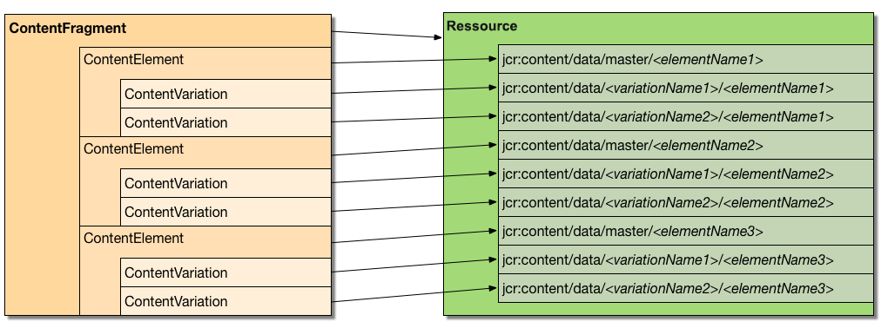
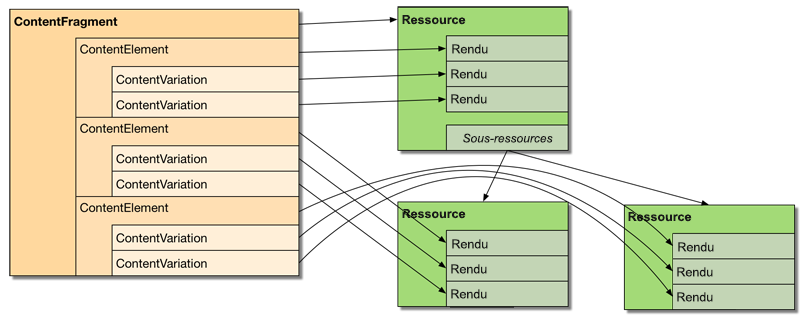

# Personnalisation et extension des fragments de contenu{#customizing-and-extending-content-fragments}

Dans Adobe Experience Manager en tant que service Cloud, un fragment de contenu étend une ressource standard ; voir:

* [Création et gestion des fragments de contenu](/help/assets/content-fragments/content-fragments.md) et [Création de pages avec des fragments de contenu](/help/sites-cloud/authoring/fundamentals/content-fragments.md) pour plus d’informations sur les fragments de contenu.

* [Gestion des ressources](/help/assets/manage-digital-assets.md) et [personnalisation et extension de l’éditeur](/help/assets/extend-asset-editor.md) de ressources pour plus d’informations sur les ressources standard.

## Architecture {#architecture}

Les [parties constituantes](/help/assets/content-fragments/content-fragments.md#constituent-parts-of-a-content-fragment) de base d’un fragment de contenu sont les suivantes :

* A *Content Fragment*,
* consisting of one or more *Content Elements*,
* and which can have one or more *Content Variations*.

Selon le type de fragment, les modèles ou le modèle de fragment **simple** sont également utilisés :

>[!CAUTION]
>
>[Les modèles](/help/assets/content-fragments/content-fragments-models.md) de fragments de contenu sont désormais recommandés pour la création de tous vos fragments.
>
>Les modèles de fragments de contenu sont utilisés pour tous les exemples dans WKND.

* Modèles de fragment de contenu:

   * utilisés pour définir des fragments de contenu comportant le contenu structuré.
   * Les modèles de fragment de contenu définissent la structure d’un fragment de contenu lors de sa création.
   * Un fragment référençant le modèle, les modifications du modèle peuvent impacter tous les fragments dépendants.
   * Les modèles sont composés de types de données.
   * Les fonctions pour ajouter des variations, etc., doivent mettre à jour le fragment en conséquence.
   >[!NOTE]
   >
   >Pour afficher/rendre un fragment de contenu, votre compte doit disposer d’autorisations de lecture pour le modèle.

   >[!CAUTION]
   >
   >Toutes les modifications apportées à un modèle de fragment de contenu existant peuvent impacter les fragments dépendants, ce qui peut engendrer des propriétés orphelines dans ces fragments.

* Modèle de fragment de contenu - Fragment **simple**:

   * utilisés pour définir des fragments de contenu simples.

   * Ce modèle définit la structure (de base, texte uniquement) d’un fragment de contenu lorsqu’il est créé.

   * Le modèle est copié dans le fragment lors de sa création.

   * Les fonctions pour ajouter des variations, etc., doivent mettre à jour le fragment en conséquence.

   * The Content fragment template (**Simple Fragment**) operates in a different manner to that of other templating mechanisms within the AEM ecosystem (e.g. page templates, etc.). Il convient donc de l&#39;examiner séparément.

   * When based on the **Simple Fragment** template the MIME type of the content is managed on the actual content; this means that each element and variation can have a different MIME type.

### Intégration de sites aux ressources {#integration-of-sites-with-assets}

La gestion des fragments de contenu (CFM) fait partie d’AEM Assets pour les raisons suivantes :

* Les fragments de contenu sont des ressources.
* Ils utilisent la fonctionnalité Assets existante.
* Ils sont entièrement intégrés à Assets (consoles d’administration, etc.).

Les fragments de contenu sont considérés comme une fonctionnalité de sites :

* Elles sont utilisées lors de la création de vos pages.

#### Mappage de fragments de contenu structuré à Assets {#mapping-structured-content-fragments-to-assets}



Les fragments de contenu avec du contenu structuré (c’est-à-dire basé sur un modèle de fragment de contenu) sont mappés à une ressource unique :

* All content is stored under the `jcr:content/data` node of the asset:

   * Les données d’élément sont stockées sous le sous-noeud maître :
      `jcr:content/data/master`

   * Variations are stored under a sub-node that carries the name of the variation:
e.g. `jcr:content/data/myvariation`

   * The data of each element is stored in the respective sub-node as a property with the element name:
e.g. the content of element `text` is stored as property `text` on `jcr:content/data/master`

* Metadata and associated content is stored below `jcr:content/metadata`
Except for the title and description, which are not considered traditional metadata and stored on `jcr:content`

#### Mappage des fragments de contenu simples à Assets {#mapping-simple-content-fragments-to-assets}



Simple content fragments (based on the **Simple Fragment** template) are mapped to a composite consisting of a main asset and (optional) sub-assets:

* Toutes les informations d’un fragment ne correspondant pas à du contenu (telles que le titre, la description, les métadonnées et la structure) sont gérées sur la ressource principale de manière exclusive.
* Le contenu du premier élément d’un fragment est mappé au rendu d’origine de la ressource principale.

   * Les variations du premier élément (si elles existent) sont mappées à d’autres rendus de la ressource principale.

* Les éléments supplémentaires (s’ils existent) sont mappés aux sous-ressources de la ressource principale.

   * Le contenu principal de ces éléments supplémentaires correspond au rendu initial de la sous-ressource correspondante.
   * Les autres variations (le cas échéant) de tout élément supplémentaire sont mappées aux autres rendus de la sous-ressource respective.

#### Emplacement des ressources {#asset-location}

Comme pour les ressources standard, un fragment de contenu est conservé sous :

`/content/dam`

#### Autorisations de ressources {#asset-permissions}

Pour plus d’informations, voir Fragment de [contenu - Suppression de considérations](/help/assets/content-fragments/content-fragments-delete.md).

#### Intégration de fonction {#feature-integration}

Pour l’intégrer au noyau Ressources :

* La fonction Gestion des fragments de contenu (CFM) s’appuie sur le noyau Ressources.

* CFM fournit ses propres mises en oeuvre pour les éléments de la carte, de la colonne ou du  ; ces plug-ins s’intègrent aux implémentations de rendu de contenu Ressources existantes.

* Plusieurs composants Ressources ont été étendus afin de prendre en charge les fragments de contenu.

### Utilisation des fragments de contenu dans les pages {#using-content-fragments-in-pages}

>[!CAUTION]
>
>Le composant Fragment de [contenu fait partie des composants](https://docs.adobe.com/content/help/fr/experience-manager-core-components/using/components/content-fragment-component.html)principaux. Voir [Développement de composants de base](https://docs.adobe.com/content/help/en/experience-manager-core-components/using/developing/developing.html) pour plus d’informations.

Les fragments de contenu peuvent être référencés dans les pages AEM, exactement comme n’importe quel autre type de ressource. AEM fournit le composant de base de **[fragment de contenu](https://docs.adobe.com/content/help/fr/experience-manager-core-components/using/components/content-fragment-component.html)**[qui permet d’inclure des fragments de contenu sur vos pages](/help/sites-cloud/authoring/fundamentals/content-fragments.md#adding-a-content-fragment-to-your-page). You can also extend this**[Content Fragment](https://docs.adobe.com/content/help/en/experience-manager-core-components/using/developing/developing.html)** core component.

* Le composant utilise la propriété `fragmentPath` pour référencer le fragment de contenu. The `fragmentPath` property is handled in the same manner as similar properties of other asset types; for example, when the content fragment is moved to another location.

* Le composant permet de sélectionner la variation à afficher.

* En outre, une plage de paragraphes peut être sélectionnée pour limiter la sortie ; par exemple, pour la sortie en plusieurs colonnes.

* Le composant accepte le contenu intermédiaire :

   * Ici, le composant permet de placer d’autres ressources (images, etc.) entre les paragraphes du fragment référencé.

   * Pour le contenu intermédiaire, vous devez :

      * être conscient de la possibilité de références instables; le contenu intermédiaire (ajouté lors de la création d’une page) n’a aucune relation fixe avec le paragraphe en regard duquel il est placé, l’insertion d’un nouveau paragraphe (dans l’éditeur de fragments de contenu) avant que la position du contenu intermédiaire ne perde la position relative

      * prenez en compte les paramètres supplémentaires (tels que la variation et les  de paragraphe) pour configurer ce qui est rendu sur la page

>[!NOTE]
>
>**Modèle de fragment de contenu :**
>
>Lors de l’utilisation d’un fragment de contenu qui était basé sur un modèle de fragment de contenu sur une page, le modèle est référencé. Cela signifie que si le modèle n’a pas été publié lorsque vous publiez la page, celui-ci est marqué et le modèle ajouté aux ressources à publier avec la page.
>
>**Modèle de fragment de contenu - Fragment simple :**
>
>When using a content fragment that has been based on the content fragment template **Simple Fragment** on a page, there is no reference as the template was copied when creating the fragment.

### Intégration à d’autres structures {#integration-with-other-frameworks}

Les fragments de contenu peuvent être intégrés à :

* **des traductions** ;

   Les fragments de contenu sont entièrement intégrés au processus de traduction d’AEM. Au niveau architectural, cela présente les implications suivantes :

   * Les traductions d’un fragment de contenu sont en fait des fragments distincts, par exemple :

      * ils sont situés sous des racines linguistiques différentes; mais partager exactement le même chemin relatif sous la racine de langue appropriée :

         `/content/dam/<path>/en/<to>/<fragment>`

         vs.

         `/content/dam/<path>/de/<to>/<fragment>`
   * Outre les chemins basés sur des règles, il n’existe aucune connexion entre les différentes versions linguistiques d’un fragment de contenu ; elles sont traitées comme deux fragments distincts, bien que l’IU fournisse les moyens de naviguer entre les variantes de langues.
   >[!NOTE]
   >
   >The AEM translation workflow works with `/content`:
   >
   >* As the content fragment models reside in `/conf`, these are not included in such translations. Vous pouvez internationaliser les chaînes de l’IU.


* **Schémas de métadonnées**

   * Les fragments de contenu (ré)utilisent les [schémas de métadonnées](/help/assets/metadata-schemas.md) qui peuvent être définis par de ressources standard.

   * CFM fournit ses propres  spécifiques :

      `/libs/dam/content/schemaeditors/forms/contentfragment`

      cela peut être étendu si nécessaire.

   * Le formulaire de schéma respectif est intégré à l’éditeur de fragments.

## L’API de gestion des fragments de contenu – côté serveur {#the-content-fragment-management-api-server-side}

Vous pouvez utiliser l’API côté serveur pour accéder à vos fragments de contenu ; voir :

[com.adobe.cq.dam.cfm](https://docs.adobe.com/content/help/en/experience-manager-cloud-service/implementing/developing/ref/javadoc/com/adobe/cq/dam/cfm/package-frame.html)

>[!CAUTION]
>
>Il est fortement conseillé d’utiliser l’API côté serveur plutôt que d’accéder directement à la structure du contenu.

### Interfaces principales {#key-interfaces}

Les trois interfaces suivantes peuvent faire office de points d’entrée :

* **Fragment** de contenu ([Fragment](https://docs.adobe.com/content/help/en/experience-manager-cloud-service/implementing/developing/ref/javadoc/com/adobe/cq/dam/cfm/ContentFragment.html)de contenu)

   Cette interface vous permet d’utiliser un fragment de contenu de façon abstraite.

   L’interface permet les actions suivantes :

   * Gestion des informations de base (par exemple, obtenir le nom ou obtenir/définir le titre/la description)
   * Accès aux métadonnées
   * Accès aux éléments :

      * Établissement de la liste des éléments
      * Obtention des éléments par nom
      * Create new elements (see [Caveats](#caveats))

      * Access element data (see `ContentElement`)
   * Établissement de la liste des variations définies pour le fragment
   * Création des variations de manière globale
   * Gestion du contenu associé :

      * Établissement de la liste des collections
      * Ajout de collections
      * Suppression de collections
   * Accès au modèle du fragment
   Les interfaces représentant les éléments clés d’un fragment sont :

   * **Élément de contenu** ([ContentElement](https://docs.adobe.com/content/help/en/experience-manager-cloud-service/implementing/developing/ref/javadoc/com/adobe/cq/dam/cfm/ContentElement.html))

      * Obtention des informations de base (nom, titre et description)
      * Obtention/définition de contenu
      * Accès aux variations d’un élément :

         * Établissement de la liste des variations
         * Obtention des variations par nom
         * Création de variations (voir [Restrictions](#caveats))
         * Remove variations (see [Caveats](#caveats))
         * Access variation data (see `ContentVariation`)
      * Raccourci pour résoudre les variations (en appliquant une certaine logique supplémentaire spécifique à la mise en œuvre si la variation spécifiée n’est pas disponible pour un élément)
   * **Variation de contenu** ([ContentVariation](https://docs.adobe.com/content/help/en/experience-manager-cloud-service/implementing/developing/ref/javadoc/com/adobe/cq/dam/cfm/ContentVariation.html))

      * Obtention des informations de base (nom, titre et description)
      * Obtention/définition de contenu
      * Synchronisation unique, en fonction des informations sur les dernières modifications
   All three interfaces ( `ContentFragment`, `ContentElement`, `ContentVariation`) extend the `Versionable` interface, which adds versioning capabilities, required for content fragments:

   * Création d’une version de l’élément
   * Établissement de la liste des versions de l’élément
   * Obtention du contenu d’une version spécifique de l’élément dont les versions sont contrôlées


### Adaptation – utilisation d’adaptTo() {#adapting-using-adaptto}

Ce qui suit peut être adapté :

* `ContentFragment` peuvent être adaptées à:

   * `Resource` - la ressource Sling sous-jacente; la mise à jour du sous-jacent `Resource` directement nécessite la reconstruction de l’ `ContentFragment` objet.

   * `Asset` - l&#39;abstraction DAM `Asset` qui représente le fragment de contenu ; la mise à jour `Asset` directe nécessite la reconstruction de l’ `ContentFragment` objet.

* `ContentElement` peuvent être adaptées à:

   * `ElementTemplate` pour accéder aux informations structurelles de l’élément.

* `Resource` peuvent être adaptées à:

   * `ContentFragment`

### Restrictions {#caveats}

Il convient de noter les éléments suivants :

* L’API entière est conçue pour **ne pas** conserver les modifications automatiquement (sauf indication contraire dans l’API JavaDoc). Vous devez donc toujours valider le résolveur de ressources de la requête correspondante (ou le résolveur que vous utilisez).

* Tâches qui peuvent nécessiter des efforts supplémentaires :

   * Créez de nouvelles variations `ContentFragment` pour mettre à jour la structure des données.

   * La suppression des variations existantes par l’intermédiaire d’un élément `ContentElement.removeVariation()`, à l’aide de ce paramètre, ne met pas à jour les structures de données globales affectées à la variation. Pour vous assurer que ces structures de données restent synchronisées, utilisez `ContentFragment.removeVariation()` plutôt, ce qui supprime une variation globalement.

## L’API de gestion des fragments de contenu – côté client {#the-content-fragment-management-api-client-side}

>[!CAUTION]
>
>L’API côté client est interne.

### Informations supplémentaires {#additional-information}

Reportez-vous aux informations suivantes :

* `filter.xml`

   The `filter.xml` for content fragment management is configured so that it does not overlap with the Assets core content package.

## Sessions de modification {#edit-sessions}

>[!CAUTION]
>
>Veuillez tenir compte de ces informations générales. Vous n&#39;êtes pas censés changer quoi que ce soit ici (car il est marqué comme une zone ** privée dans le référentiel), mais cela peut aider dans certains cas à comprendre comment les choses fonctionnent sous le capot.

La modification d’un fragment de contenu, qui peut couvrir plusieurs  de (= pages HTML), est atomique. Les fonctionnalités d’édition de  multi-atomique ne sont donc pas un concept AEM classique, les fragments de contenu utilisent ce qu’on appelle une session *d’*&#x200B;édition.

Une session de modification est ouverte lorsque l’utilisateur ouvre un fragment de contenu dans l’éditeur. La session de modification est terminée lorsque l’utilisateur quitte l’éditeur en sélectionnant **Enregistrer** ou **Annuler**.

Techniquement, toutes les modifications sont effectuées sur du contenu *en direct* , tout comme pour toutes les autres modifications AEM. Lorsque la session de modification est lancée, une version de l’état actuel non modifié est créée. Si un utilisateur annule une modification, cette version est restaurée. Si l’utilisateur clique sur **Enregistrer**, rien de spécifique n’est fait, car toutes les modifications ont été exécutées sur du contenu *en direct* . Par conséquent, toutes les modifications sont déjà conservées. En outre, un clic sur **Enregistrer** déclenchera un certain traitement en arrière-plan (comme la création d’informations de recherche de texte intégral et/ou la gestion de fichiers multimédias).

Il existe des mesures de sécurité pour les armatures; par exemple, si l’utilisateur tente de quitter l’éditeur sans enregistrer ou annuler la session de modification. En outre, un enregistrement automatique périodique est disponible pour empêcher la perte de données.
Notez que deux utilisateurs peuvent modifier le même fragment de contenu simultanément et peuvent donc écraser les modifications les unes des autres. Pour éviter cela, le fragment de contenu doit être verrouillé en appliquant l’action *d’extraction* de l’administration DAM sur le fragment.

## Exemples {#examples}

### Exemple : accès à un fragment contenu existant {#example-accessing-an-existing-content-fragment}

Pour ce faire, vous pouvez adapter la ressource qui représente l’API à :

`com.adobe.cq.dam.cfm.ContentFragment`

Par exemple :

```java
// first, get the resource
Resource fragmentResource = resourceResolver.getResource("/content/dam/fragments/my-fragment");
// then adapt it
if (fragmentResource != null) {
    ContentFragment fragment = fragmentResource.adaptTo(ContentFragment.class);
    // the resource is now accessible through the API
}
```

### Exemple : création d’un fragment de contenu {#example-creating-a-new-content-fragment}

Pour créer un fragment de contenu par programmation, vous devez utiliser un`FragmentTemplate` fragment adapté d’un modèle ou d’une ressource de modèle.

Par exemple :

```java
Resource templateOrModelRsc = resourceResolver.getResource("...");
FragmentTemplate tpl = templateOrModelRsc.adaptTo(FragmentTemplate.class);
ContentFragment newFragment = tpl.createFragment(parentRsc, "A fragment name", "A fragment description.");
```

### Exemple : spécification de l’intervalle d’enregistrement automatique {#example-specifying-the-auto-save-interval}

The [auto save interval](/help/assets/content-fragments/content-fragments-managing.md#save-cancel-and-versions) (measured in seconds) can be defined using the configuration manager (ConfMgr):

* Node: `<conf-root>/settings/dam/cfm/jcr:content`
* Nom de la propriété: `autoSaveInterval`
* Type: `Long`

* Default: `600` (10 minutes); this is defined on `/libs/settings/dam/cfm/jcr:content`

Si vous souhaitez définir un intervalle d’enregistrement automatique de 5 minutes, vous devez définir la propriété sur le nœud, par exemple :

* Node: `/conf/global/settings/dam/cfm/jcr:content`
* Nom de la propriété: `autoSaveInterval`

* Type: `Long`

* Valeur : `300` (5 minutes correspondent à 300 secondes).

## Composants pour la création de page {#components-for-page-authoring}

Pour plus d’informations, voir :

* [Composants de base – composant de fragment de contenu](https://docs.adobe.com/content/help/fr/experience-manager-core-components/using/components/content-fragment-component.html) (recommandé)
