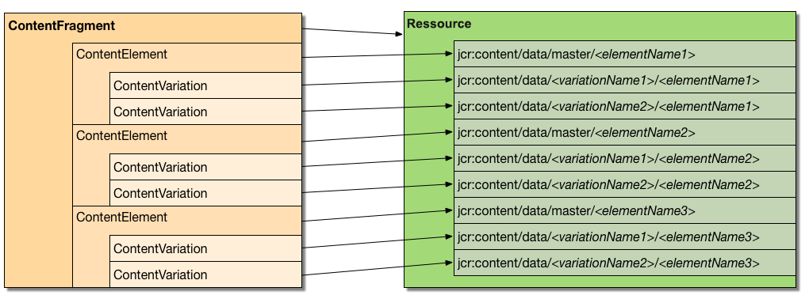

# Personnalisation et extensions de fragments de contenu{#customizing-and-extending-content-fragments}

Dans Adobe Experience Manager as a Cloud Service, un fragment de contenu étend une ressource standard ; voir :

* [Création et gestion des fragments de contenu](/help/sites-cloud/administering/content-fragments/overview.md) et [Création de pages avec des fragments de contenu](/help/sites-cloud/authoring/fragments/content-fragments.md) pour plus d’informations sur les fragments de contenu.

* [Gestion des ressources](/help/assets/manage-digital-assets.md) pour plus d’informations sur les ressources standard.

## Architecture {#architecture}

Les [parties constituantes](/help/sites-cloud/administering/content-fragments/overview.md#constituent-parts-of-a-content-fragment) de base d’un fragment de contenu sont les suivantes :

* Un *fragment de contenu*
* Il se compose d’un ou de plusieurs *éléments de contenu*
* Il peut y avoir une ou plusieurs *variations de contenu*

Les fragments de contenu individuels sont basés sur des modèles de fragment de contenu :

* Les modèles de fragment de contenu définissent la structure d’un fragment de contenu lors de sa création.
* Un fragment fait référence au modèle. Par conséquent, les modifications apportées au modèle peuvent avoir un impact ou avoir un impact sur les fragments dépendants.
* Les modèles sont composés de types de données.
* Les fonctions pour ajouter des variations, etc., doivent mettre à jour le fragment en conséquence.

  >[!NOTE]
  >
  >Pour que vous puissiez afficher/restituer un fragment de contenu, votre compte doit disposer d’autorisations de lecture (`read`) pour le modèle.

  >[!CAUTION]
  >
  >Toutes les modifications apportées à un modèle de fragment de contenu existant peuvent impacter les fragments dépendants, ce qui peut engendrer des propriétés orphelines dans ces fragments.

### Intégration de Sites à Assets {#integration-of-sites-with-assets}

La gestion des fragments de contenu (CFM) fait partie d’Assets Adobe Experience Manager (AEM) en tant que :

* les fragments de contenu sont des ressources ;
* ils utilisent la fonctionnalité Assets existante ;
* ils sont entièrement intégrés à Assets (consoles d’administration, etc.).

Les fragments de contenu sont considérés comme une fonctionnalité d’AEM Sites en tant que :

* Ils sont utilisés lors de la création de vos pages.

#### Mappage des fragments de contenu à Assets {#mapping-content-fragments-to-assets}



Les fragments de contenu, basés sur un modèle de fragment de contenu, sont mappés à une ressource unique :

* L’ensemble du contenu est stocké sous le nœud `jcr:content/data` de la ressource :

   * Les données d’élément sont stockées sous le sous-noeud maître :

     `jcr:content/data/master`

   * Les variations sont stockées sous un sous-noeud portant le nom de la variation :
par exemple, `jcr:content/data/myvariation`

   * Les données de chaque élément sont stockées dans le sous-noeud respectif comme une propriété avec le nom d’élément :
par exemple, le contenu de l’élément `text` est stocké en tant que propriété `text` sur `jcr:content/data/master`

* Les métadonnées et le contenu associé sont stockés sous `jcr:content/metadata`.
Hormis le titre et la description, qui ne sont pas considérés comme des métadonnées traditionnelles et sont stockés sur `jcr:content`.

#### Emplacement des ressources {#asset-location}

Comme pour les ressources standard, un fragment de contenu est conservé sous :

`/content/dam`

#### Autorisations de ressources {#asset-permissions}

Voir [Fragment de contenu - considérations sur la suppression](/help/sites-cloud/administering/content-fragments/delete-considerations.md).

#### Intégration de fonction {#feature-integration}

Pour une intégration au composant de base Assets :

* La fonction de gestion des fragments de contenu (CFM) s’appuie sur le composant de base Assets.

* CFM possède ses propres mises en œuvre pour les éléments dans les vues Carte/Colonnes/Liste. Celles-ci se connectent aux mises en œuvre de rendu de contenu existantes d’Assets.

* Plusieurs composants d’Assets ont été étendus pour prendre en charge les fragments de contenu.

### Utilisation des fragments de contenu dans les pages {#using-content-fragments-in-pages}

>[!CAUTION]
>
>Le [composant Fragment de contenu fait partie des composants de base](https://experienceleague.adobe.com/docs/experience-manager-core-components/using/wcm-components/content-fragment-component.html?lang=fr). Consultez la section [Développement des composants principaux](https://experienceleague.adobe.com/docs/experience-manager-core-components/using/developing/overview.html?lang=fr) pour plus d’informations.

Les fragments de contenu peuvent être référencés à partir des pages AEM, comme tout autre type de ressource. AEM fournit le **[composant principal de fragment de contenu](https://experienceleague.adobe.com/docs/experience-manager-core-components/using/wcm-components/content-fragment-component.html?lang=fr)** - un [ composant qui vous permet d’inclure des fragments de contenu sur vos pages](/help/sites-cloud/authoring/fragments/content-fragments.md#adding-a-content-fragment-to-your-page). Vous pouvez également étendre ce composant de base de **[fragment de contenu](https://experienceleague.adobe.com/docs/experience-manager-core-components/using/developing/overview.html?lang=fr)**.

* Le composant utilise la propriété `fragmentPath` pour référencer le fragment de contenu. La propriété `fragmentPath` est traitée de la même façon que les propriétés similaires d’autres types de ressources, par exemple, lorsque le fragment de contenu est déplacé vers un autre emplacement.

* Le composant vous permet de sélectionner la variation à afficher.

* En outre, une plage de paragraphes peut être sélectionnée pour limiter la sortie ; par exemple, elle peut être utilisée pour la sortie à plusieurs colonnes.

* Le composant accepte le contenu intermédiaire :

   * Ici, le composant vous permet de placer d’autres ressources (images, etc.) entre les paragraphes du fragment référencé.

   * Pour le contenu intermédiaire :

      * Soyez conscient de la possibilité de références instables. Le contenu intermédiaire (ajouté lors de la création d’une page) n’a aucune relation fixe avec le paragraphe situé à côté. L’insertion d’un nouveau paragraphe (dans l’éditeur de fragment de contenu) avant la position du contenu intermédiaire peut perdre la position relative.

      * Tenez compte des paramètres supplémentaires (tels que les filtres de variation et de paragraphe) pour configurer ce qui est rendu sur la page.

>[!NOTE]
>
>**Modèle de fragment de contenu :**
>
>Lorsqu’un fragment de contenu est utilisé sur une page, le modèle de fragment de contenu sur lequel il est basé est référencé.
>
>Cela signifie que si le modèle n’a pas été publié lorsque vous publiez la page, celui-ci est marqué et le modèle est ajouté aux ressources à publier avec la page.

### Intégration à d’autres structures {#integration-with-other-frameworks}

Les fragments de contenu peuvent être intégrés aux éléments suivants :

* **Des traductions**

  Les fragments de contenu sont entièrement intégrés au [workflow de traduction AEM](/help/sites-cloud/administering/translation/overview.md). Sur le plan architectural, cela signifie :

   * Les traductions individuelles d’un fragment de contenu sont des fragments distincts, par exemple :

      * elles se trouvent sous différentes racines de langue, mais partagent le chemin relatif sous la racine de langue appropriée :

        `/content/dam/<path>/en/<to>/<fragment>`

        ou

        `/content/dam/<path>/de/<to>/<fragment>`

   * Outre les chemins basés sur des règles, il n’existe aucune autre connexion entre les différentes versions linguistiques d’un fragment de contenu. Ils sont traités comme deux fragments distincts, bien que l’interface utilisateur fournisse les moyens de naviguer entre les variantes linguistiques.

  >[!NOTE]
  >
  >Le workflow de traduction AEM fonctionne avec `/content` :
  >
  >* Les modèles de fragment de contenu résidant dans `/conf` ; ils ne sont pas inclus dans ces traductions. Vous pouvez internationaliser les chaînes de l’IU.

* **Des schémas de métadonnées**

   * Les fragments de contenu utilisent et réutilisent les [schémas de métadonnées](/help/assets/metadata-schemas.md) qui peuvent être définis avec des ressources standard.

   * CFM fournit son propre schéma spécifique :

     `/libs/dam/content/schemaeditors/forms/contentfragment`

     il peut être étendu, si nécessaire.

   * Le formulaire de schéma respectif est intégré à l’éditeur de fragments.

## API de gestion des fragments de contenu – côté serveur {#the-content-fragment-management-api-server-side}

Vous pouvez utiliser l’API côté serveur pour accéder à vos fragments de contenu, voir :

[com.adobe.cq.dam.cfm](https://developer.adobe.com/experience-manager/reference-materials/cloud-service/javadoc/com/adobe/cq/dam/cfm/package-summary.html#package.description)

>[!CAUTION]
>
>Adobe recommande d’utiliser l’API côté serveur au lieu d’accéder directement à la structure de contenu.

### Interfaces principales {#key-interfaces}

Les trois interfaces suivantes peuvent faire office de points d’entrée :

* **Fragment de contenu** ([ContentFragment](https://developer.adobe.com/experience-manager/reference-materials/cloud-service/javadoc/com/adobe/cq/dam/cfm/ContentFragment.html))

  Cette interface vous permet d’utiliser un fragment de contenu de façon abstraite.

  L’interface permet les actions suivantes :

   * Gestion des informations de base (par exemple, obtenir le nom ou obtenir/définir le titre/la description)
   * Accéder aux métadonnées
   * Accéder aux éléments :

      * Répertorier les éléments
      * Obtenir les éléments par nom
      * Créer des éléments (voir [Avertissements](#caveats))

      * Accès aux données des éléments (voir `ContentElement`)

   * Répertorier les variations définies pour le fragment
   * Créer des variations globalement
   * Gérer le contenu associé :

      * Répertorier les collections
      * Ajouter des collections
      * Supprimer des collections

   * Accès au modèle du fragment

  Les interfaces qui représentent les éléments principaux d’un fragment sont les suivantes :

   * **Élément de contenu** ([ContentElement](https://developer.adobe.com/experience-manager/reference-materials/cloud-service/javadoc/com/adobe/cq/dam/cfm/ContentElement.html))

      * Obtention des informations de base (nom, titre et description)
      * Obtenir/définir du contenu
      * Accéder aux variations d’un élément :

         * Répertorier des variations
         * Obtentir les variations par nom
         * Créer des variations (voir [Avertissements](#caveats))
         * Suppression de variations (voir [Restrictions](#caveats))
         * Accès aux données de variation (voir `ContentVariation`)

      * Raccourci pour résoudre les variations (application d’une logique de secours supplémentaire spécifique à l’implémentation si la variation spécifiée n’est pas disponible pour un élément)

   * **Variation de contenu** ([ContentVariation](https://developer.adobe.com/experience-manager/reference-materials/cloud-service/javadoc/com/adobe/cq/dam/cfm/ContentVariation.html))

      * Obtention des informations de base (nom, titre et description)
      * Obtenir/définir du contenu
      * Synchronisation simple, basée sur la dernière information modifiée

  Chacune des trois interfaces (`ContentFragment`, `ContentElement` et `ContentVariation`) étend l’interface `Versionable`, ce qui ajoute des fonctionnalités de contrôle de version, requises pour les fragments de contenu :

   * Créer une version de l’élément
   * Liste des versions de l’élément
   * Obtention du contenu d’une version spécifique de l’élément versionné

### Adaptation – utilisation d’adaptTo() {#adapting-using-adaptto}

Ce qui suit peut être adapté :

* `ContentFragment` peut être adapté en :

   * `Resource` – ressource Sling sous-jacente ; la mise à jour directe de la `Resource` sous-jacente nécessite la reconstruction de l’objet `ContentFragment`.

   * `Asset` – abstraction `Asset` DAM représentant le fragment de contenu ; la mise à jour directe de la `Asset` sous-jacente nécessite la reconstruction de l’objet `ContentFragment`.

* `ContentElement` peut être adapté en :

   * [`ElementTemplate`](https://developer.adobe.com/experience-manager/reference-materials/cloud-service/javadoc/com/adobe/cq/dam/cfm/ElementTemplate.html) pour accéder aux informations structurelles de l’élément.

* [`FragmentTemplate`](https://developer.adobe.com/experience-manager/reference-materials/cloud-service/javadoc/com/adobe/cq/dam/cfm/FragmentTemplate.html)

* `Resource` peut être adapté en :

   * `ContentFragment`

### Restrictions {#caveats}

Il convient de noter les éléments suivants :

* L’API entière est conçue pour **ne pas** conserver les modifications automatiquement (sauf indication contraire dans l’API JavaDoc). Ainsi, validez toujours le résolveur de ressource de la requête correspondante (ou le résolveur que vous utilisez réellement).

* Tâches pouvant nécessiter un effort supplémentaire :

   * Adobe vous recommande de créer des variations à partir de `ContentFragment`. Cela garantit que tous les éléments partagent cette variation et que les structures de données globales appropriées sont mises à jour si nécessaire pour refléter la nouvelle variation dans la structure de contenu.

   * La suppression de variations existantes via un élément, à l’aide de `ContentElement.removeVariation()`, ne met pas à jour les structures de données globales affectées à la variation. Pour garantir le maintien de la synchronisation de ces structures, utilisez plutôt `ContentFragment.removeVariation()`, ce qui supprime globalement une variation.

## API de gestion des fragments de contenu – côté client {#the-content-fragment-management-api-client-side}

>[!CAUTION]
>
>L’API côté client est interne.

### Informations supplémentaires {#additional-information}

Reportez-vous aux informations suivantes :

* `filter.xml`

  Le fichier `filter.xml` pour la gestion des fragments de contenu est configuré pour ne pas chevaucher le package de contenu de base d’Assets.

## Sessions de modification {#edit-sessions}

>[!CAUTION]
>
>Il est recommandé de tenir compte des informations générales suivantes. Vous n’êtes pas censé changer quoi que ce soit ici (car il est marqué comme *zone privée* dans le référentiel), mais cela peut parfois aider à comprendre comment les choses fonctionnent en arrière-plan.

La modification d’un fragment de contenu qui peut être réparti sur plusieurs vues (= pages HTML) est atomique. Comme les fonctionnalités d’édition à vues multiples atomiques ne sont pas un concept AEM classique, les fragments de contenu utilisent un processus appelé *session de modification*.

Une session de modification est lancée lorsque l’utilisateur ouvre un fragment de contenu dans l’éditeur. La session de modification est terminée lorsque l’utilisateur quitte l’éditeur en sélectionnant **Enregistrer** ou **Annuler**.

Techniquement, toutes les modifications sont effectuées sur le contenu *live*, comme avec toute autre modification AEM. Lorsque la session de modification est lancée, une version de l’état actuel non modifié est créée. Si un utilisateur annule une modification, cette version est restaurée. Si l’utilisateur clique sur **Enregistrer**, rien de spécifique n’est fait, car la modification a été exécutée sur le contenu *en direct*. Par conséquent, toutes les modifications sont déjà conservées. En outre, le fait de cliquer sur **Enregistrer** déclenche un traitement en arrière-plan tel que la création d’informations de recherche de texte intégral ou la gestion de ressources multimédias mixtes, ou les deux.

Il existe des mesures de sécurité pour les cas extrêmes ; par exemple, si l’utilisateur tente de quitter l’éditeur sans enregistrer ou annuler la session de modification. En outre, un enregistrement automatique périodique est disponible pour empêcher la perte de données.
Deux utilisateurs peuvent modifier simultanément le même fragment de contenu et, par conséquent, remplacer les modifications de l’autre. Pour éviter cela, le fragment de contenu doit être verrouillé en appliquant l’action *Checkout* de l’administration DAM sur le fragment.

## Exemples {#examples}

### Exemple : accès à un fragment de contenu existant {#example-accessing-an-existing-content-fragment}

Pour ce faire, vous pouvez adapter la ressource qui représente l’API à :

`com.adobe.cq.dam.cfm.ContentFragment`

Par exemple :

```java
// first, get the resource
Resource fragmentResource = resourceResolver.getResource("/content/dam/fragments/my-fragment");
// then adapt it
if (fragmentResource != null) {
    ContentFragment fragment = fragmentResource.adaptTo(ContentFragment.class);
    // the resource is now accessible through the API
}
```

### Exemple : création d’un fragment de contenu {#example-creating-a-new-content-fragment}

Pour créer un fragment de contenu par programmation, utilisez un `FragmentTemplate` adapté d’une ressource de modèle.

Par exemple :

```java
Resource modelRsc = resourceResolver.getResource("...");
FragmentTemplate tpl = modelRsc.adaptTo(FragmentTemplate.class);
ContentFragment newFragment = tpl.createFragment(parentRsc, "A fragment name", "A fragment description.");
```

### Exemple : spécification de l’intervalle d’enregistrement automatique {#example-specifying-the-auto-save-interval}

L’ [intervalle d’enregistrement automatique](/help/sites-cloud/administering/content-fragments/managing.md#save-close-and-versions) (exprimé en secondes) peut être défini à l’aide de Configuration Manager (ConfMgr) :

* Nœud : `<conf-root>/settings/dam/cfm/jcr:content`
* Nom de la propriété : `autoSaveInterval`
* Type : `Long`

* Valeur par défaut : `600` (10 minutes) ; cette valeur est définie sur `/libs/settings/dam/cfm/jcr:content`

Si vous souhaitez définir un intervalle d’enregistrement automatique de 5 minutes, définissez la propriété sur votre noeud.

Par exemple :

* Nœud : `/conf/global/settings/dam/cfm/jcr:content`
* Nom de la propriété : `autoSaveInterval`

* Type : `Long`

* Valeur : `300` (5 minutes correspondent à 300 secondes).

## Composants pour la création de page {#components-for-page-authoring}

Pour en savoir plus, voir

* [Composants principaux : composant de fragment de contenu](https://experienceleague.adobe.com/docs/experience-manager-core-components/using/wcm-components/content-fragment-component.html?lang=fr) (recommandé)
