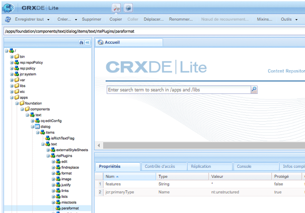

# Configuration de l’éditeur de texte enrichi pour créer des sites accessibles {#configure-rte-accessible-sites}

[!DNL Adobe Experience Manager] prend en charge les fonctions d’accessibilité standard, telles que le texte de remplacement des images, ainsi que des fonctions supplémentaires accessibles lors de la création de contenu. Les auteurs de contenu appliquent ces fonctionnalités avec des composants qui utilisent l’éditeur de texte enrichi (RTE). Les fonctionnalités comprennent l’ajout de texte de remplacement, d’informations structurelles par le biais d’en-têtes et d’éléments de paragraphe, etc.

Pour connaître les configurations types de l’éditeur de texte enrichi, voir [Configuration de l’éditeur de texte enrichi](rich-text-editor.md) et [Configuration des modules externes d’éditeur de texte enrichi pour des fonctionnalités spécifiques](configure-rich-text-editor-plug-ins.md).

Utilisez la configuration des modules externes de l’éditeur de texte enrichi pour configurer et personnaliser les fonctionnalités liées à l’accessibilité. For example, use `paraformat` to add extra block level semantic elements, including extending the number of heading levels supported beyond the basic `H1`, `H2` and `H3` provided by default. La modification de texte enrichi est possible à l’aide de nombreux composants de l’interface utilisateur de création. Les composants couramment utilisés sont les textes, les images, les téléchargements, etc.

La fonctionnalité d’éditeur de texte enrichi peut être rendue disponible dans de nombreux composants. Le composant principal est le composant `Text`.

For the `Text` component in [!DNL Experience Manager], the following screenshot displays the rich text editor with a range of plug-ins enabled, including `paraformat`:


## Configure the plug-in features {#configuring-the-plugin-features}

Pour obtenir des instructions sur la configuration de l’éditeur de texte enrichi, voir la page [Configuration de l’éditeur de texte enrichi](rich-text-editor.md). L’article aborde les sujets suivants :

* [Plug-ins et leurs fonctionnalités](rich-text-editor.md#aboutplugins)
* [Emplacements de configuration](rich-text-editor.md#understand-the-configuration-paths-and-locations)
* [Activation d’un module externe et configuration de la propriété features](rich-text-editor.md#enable-rte-functionalities-by-activating-plug-ins)
* [Configuration d’autres fonctionnalités de l’éditeur de texte enrichi](rich-text-editor.md#enable-rte-functionalities-by-activating-plug-ins)

To activate a few or all features for a plug-in, configure the plug-in within the appropriate `rtePlugins` sub-branch in CRXDE Lite.



### Example to specify paragraph formats available in RTE selection field {#example-specifying-paragraph-formats-available-in-rte-selection-field}

De nouveaux formats de blocs sémantiques sont disponibles pour la sélection.

1. Selon votre éditeur de texte enrichi, déterminez l’[emplacement de configuration](rich-text-editor.md#understand-the-configuration-paths-and-locations) et accédez-y.
1. [Activez le champ](rich-text-editor.md) de sélection de paragraphes en [activant le module externe](rich-text-editor.md#enable-rte-functionalities-by-activating-plug-ins).
1. [Spécifiez les formats qui doivent être disponibles dans le champ de sélection Paragraphes](rich-text-editor.md).
1. Les formats de paragraphe sont ensuite à la disposition de l’auteur du contenu des champs de sélection dans l’éditeur de texte enrichi.

With structural elements available in the RTE via the paragraph format options, [!DNL Experience Manager] provides a good basis for the development of accessible content. Les auteurs de contenu ne peuvent pas utiliser l’éditeur de texte enrichi pour formater la taille de la police ou les couleurs ou d’autres attributs associés, empêchant la création de formatage en ligne. En revanche, les auteurs peuvent sélectionner les éléments structurels appropriés, tels que les en-têtes et utiliser les styles globaux choisis dans l’option Styles pour assurer le nettoyage des annotations et des options plus importantes pour les utilisateurs qui naviguent avec leurs propres feuilles de style et le contenu correctement structuré.

## Use of the Source Edit feature {#use-of-the-source-edit-feature}

Dans certains cas, les auteurs de contenu constateront qu’il est nécessaire d’examiner et d’ajuster le code source HTML créé à l’aide de l’éditeur de texte enrichi. For example, a piece of content created within the RTE may require more markup to ensure compliance with WCAG 2.0. This can be done with the [source edit](rich-text-editor.md#aboutplugins) option of the RTE. You can specify the [`sourceedit` feature on the `misctools` plug-in](rich-text-editor.md#aboutplugins).

>[!CAUTION]
>
>Utilisez la fonction `sourceedit` avec prudence. Les erreurs de saisie et les fonctionnalités non prises en charge peuvent poser problème.

<!--
TBD ENGREVIEW: Is this only applicable to Classic UI? 

## Adding Support for further HTML Elements and Attributes {#adding-support-for-additional-html-elements-and-attributes}

To further extend the accessibility features of [!DNL Experience Manager], it is possible to extend the existing components based on the RTE (such as the `Text` and `Table` components) with extra elements and attributes.

The following procedure illustrates how to extend the `Table` component with a `Caption` element that provides information about a data table to assistive technology users:

### Example: Add a caption to a table properties dialog {#example-adding-the-caption-to-the-table-properties-dialog}

In the constructor of the `TablePropertiesDialog`, add an extra text input field that is used for editing the caption. Set the `itemId` to `caption` (the DOM attribute’s name) to automatically handle its content.

In a `Table`, set the attribute to the DOM element or or remove it from the DOM element. The dialog in the `config` object passed the value. Set or remove the DOM attributes using the corresponding `CQ.form.rte.Common` methods (`com` is a shortcut for `CQ.form.rte.Common`). Using `CQ.form.rte.Common` methods avoids common pitfalls with browser implementations.

>[!NOTE]
>
>This procedure is only suitable for the classic UI.

### Step-by-step instructions {#step-by-step-instructions}

1. Start CRXDE Lite. For example: [http://localhost:4502/crx/de/](http://localhost:4502/crx/de/)

1. Copy `/libs/cq/ui/widgets/source/widgets/form/rte/commands/Table.js` to `/apps/cq/ui/widgets/source/widgets/form/rte/commands/Table.js`. Create intermediate folders if those do not exist.

1. Copy `/libs/cq/ui/widgets/source/widgets/form/rte/plugins/TablePropertiesDialog.js` to `/apps/cq/ui/widgets/source/widgets/form/rte/plugins/TablePropertiesDialog.js`.

1. Open `/apps/cq/ui/widgets/source/widgets/form/rte/plugins/TablePropertiesDialog.js` file to edit.

1. In the `constructor` method, before the mention of `var dialogRef = this;`, add the following code:

   ```javascript
   editItems.push({
       "itemId": "caption",
       "name": "caption",
       "xtype": "textfield",
       "fieldLabel": CQ.I18n.getMessage("Caption"),
       "value": (this.table && this.table.caption ? this.table.caption.textContent : "")
   });
   ```

1. Open `/apps/cq/ui/widgets/source/widgets/form/rte/commands/Table.js` file.

1. Add the following code at the end of the `transferConfigToTable` method:

   ```javascript
   /**
    * Adds Caption Element
   */
   var captionElement;
   if (dom.firstChild && dom.firstChild.tagName.toLowerCase() == "caption")
   {
      captionElement = dom.firstChild;
   }
   if (config.caption)
   {
       var captionTextNode = document.createTextNode(config.caption)
       if (captionElement)
       {
          dom.replaceNode(captionElement.firstChild,captionTextNode);
       } else
       {
           captionElement = document.createElement("caption");
           captionElement.appendChild(captionTextNode);
           if (dom.childNodes.length>0)
           {
              dom.insertBefore(captionElement, dom.firstChild);
           } else
           {
              dom.appendChild(captionElement);
           }
       }
   } else if (captionElement)
   {
     dom.removeChild(captionElement);
   }
   ```

1. To save your changes, click **[!UICONTROL Save All]**.

## Best practices and limitations {#best-practices-limitations-tips}

* A plain text field is not the only type of input allowed for the value of the caption element. You can use any ExtJS widget, that provides the caption’s value through its `getValue()` method.
* To add editing capabilities for more elements and attributes, ensure that:

  * The `itemId` property for each corresponding field is set to the name of the appropriate DOM attribute (`TablePropertiesDialog`).
  * The attribute is set and/or removed on the DOM element explicitly (`Table`).
-->

>[!MORELIKETHIS]
>
>* [Guide rapide relatif aux normes WCAG](/help/onboarding/accessibility/quick-guide-wcag.md)
>* [Création de contenu accessible dans le Experience Manager](/help/sites-cloud/authoring/fundamentals/accessible-content.md)

