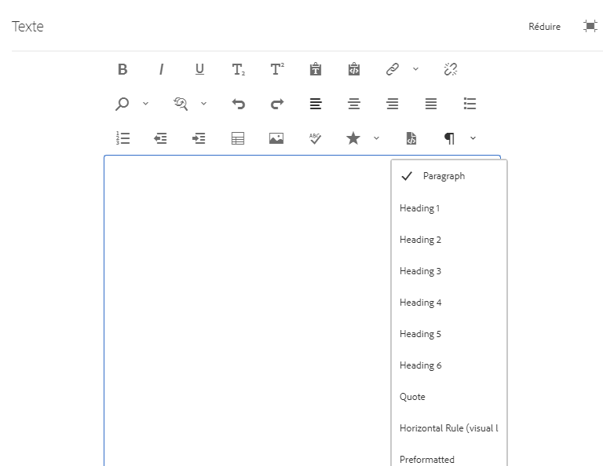

# Configure RTE to create accessible sites {#configure-rte-accessible-sites}

Adobe Experience Manager prend en charge les fonctions d’accessibilité standard, telles que le texte de remplacement des images, ainsi que d’autres fonctions accessibles lors de la création de contenu. Les auteurs de contenu utilisent ces fonctionnalités avec des composants qui utilisent l’éditeur de texte enrichi (RTE). Cela inclut l’ajout de texte de remplacement, d’informations structurelles au moyen d’en-têtes et d’éléments de paragraphe, etc.

Pour une compréhension des configurations types de RTE, voir [configurer RTE](rich-text-editor.md) et [configurer des modules externes RTE pour des fonctionnalités](configure-rich-text-editor-plug-ins.md)spécifiques.

Utilisez la configuration des modules externes RTE pour configurer et personnaliser les fonctionnalités liées à l’accessibilité. For example, use `paraformat` to add additional block level semantic elements, including extending the number of heading levels supported beyond the basic `H1`, `H2` and `H3` provided by default. La modification de texte enrichi est possible à l’aide de nombreux composants de l’interface utilisateur de création. Les composants couramment utilisés sont le texte, l’image, le téléchargement, etc.

La fonctionnalité RTE peut être rendue disponible dans de nombreux composants. Le composant principal est le `Text` composant.

Pour le `Text` composant d’Experience Manager, la capture d’écran suivante affiche l’éditeur de texte enrichi avec une gamme de modules externes activés, notamment `paraformat`:



## Configuration des fonctionnalités du module externe {#configuring-the-plugin-features}

Pour obtenir des instructions sur la configuration de RTE, voir [Configuration de la page Editeur](rich-text-editor.md) de texte enrichi. L&#39;article couvre :

* [Modules externes et leurs fonctionnalités](rich-text-editor.md#aboutplugins)
* [Emplacements de configuration](rich-text-editor.md#understand-the-configuration-paths-and-locations)
* [Activation d’un module externe et configuration de la propriété features](rich-text-editor.md#enable-rte-functionalities-by-activating-plug-ins)
* [Configurer d&#39;autres fonctionnalités du RTE](rich-text-editor.md#enable-rte-functionalities-by-activating-plug-ins)

Pour activer quelques fonctions ou toutes pour un module externe, configurez le module externe dans la `rtePlugins` sous-branche appropriée de CRXDE Lite.


### Example - Specify paragraph formats available in RTE selection field {#example-specifying-paragraph-formats-available-in-rte-selection-field}

De nouveaux formats de bloc sémantique peuvent être rendus disponibles pour la sélection comme suit :

1. Selon votre éditeur de texte enrichi, déterminez l’[emplacement de configuration](rich-text-editor.md#understand-the-configuration-paths-and-locations) et accédez-y.
1. [Activez le champ](rich-text-editor.md) de sélection des paragraphes en [activant le module externe](rich-text-editor.md#enable-rte-functionalities-by-activating-plug-ins).
1. [Spécifiez les formats que vous souhaitez voir disponibles dans le champ](rich-text-editor.md)de sélection des paragraphes.
1. Les formats de paragraphe sont ensuite à la disposition de l’auteur du contenu des champs de sélection dans l’éditeur de texte enrichi.

Grâce aux éléments structuraux disponibles dans l’ETC via les options de format de paragraphe, Experience Manager fournit une bonne base pour le développement de contenu accessible. Les auteurs de contenu ne peuvent pas utiliser l’éditeur de texte enrichi pour formater la taille de la police ou les couleurs ou d’autres attributs associés, empêchant la création de formatage en ligne. À la place, ils doivent sélectionner les éléments structurels appropriés comme les en-têtes et utiliser des styles globaux choisis via l’option Styles. Ceci garantit une mise en forme nette, de meilleures options pour les utilisateurs qui naviguent avec leurs propres feuilles de style et un contenu correctement structuré.

## Utilisation de l’option Modification de la source {#use-of-the-source-edit-feature}

Dans certains cas, les auteurs de contenu constateront qu’il est nécessaire d’examiner et d’ajuster le code source HTML créé à l’aide de l’éditeur de texte enrichi. Par exemple, un élément de contenu créé dans l’éditeur de texte enrichi peut nécessiter une mise en forme supplémentaire pour être conforme à la norme WCAG 2.0. Ceci peut s’effectuer avec l’option [Modification de la source](rich-text-editor.md#aboutplugins) de l’éditeur de texte enrichi. You can specify the [`sourceedit` feature on the `misctools` plugin](rich-text-editor.md#aboutplugins).

>[!CAUTION]
>
>Use the `sourceedit` feature carefully. Les fautes de frappe et/ou les fonctions non prises en charge peuvent entraîner d’autres problèmes.

<!--
TBD ENGREVIEW: Is this only applicable to Classic UI? 

## Adding Support for Additional HTML Elements and Attributes {#adding-support-for-additional-html-elements-and-attributes}

To further extend the accessibility features of Experience Manager, it is possible to extend the existing components based on the RTE (such as the `Text` and `Table` components) with additional elements and attributes.

The following procedure illustrates how to extend the `Table` component with a `Caption` element that provides information about a data table to assistive technology users:

### Example: Add a caption to a table properties dialog {#example-adding-the-caption-to-the-table-properties-dialog}

In the constructor of the `TablePropertiesDialog`, add an additional text input field that is used for editing the caption. Set the `itemId` to `caption` (the DOM attribute’s name) to automatically handle its content.

In a `Table`, set the attribute to the DOM element or or remove it from the DOM element. The dialog in the `config` object passed the value. Set or remove the DOM attributes using the corresponding `CQ.form.rte.Common` methods (`com` is a shortcut for `CQ.form.rte.Common`). Using `CQ.form.rte.Common` methods avoids common pitfalls with browser implementations.

>[!NOTE]
>
>This procedure is only suitable for the classic UI.

### Step-by-step instructions {#step-by-step-instructions}

1. Start CRXDE Lite. For example: [http://localhost:4502/crx/de/](http://localhost:4502/crx/de/)

1. Copy `/libs/cq/ui/widgets/source/widgets/form/rte/commands/Table.js` to `/apps/cq/ui/widgets/source/widgets/form/rte/commands/Table.js`. Create intermediate folders if those do not exist.

1. Copy `/libs/cq/ui/widgets/source/widgets/form/rte/plugins/TablePropertiesDialog.js` to `/apps/cq/ui/widgets/source/widgets/form/rte/plugins/TablePropertiesDialog.js`.

1. Open `/apps/cq/ui/widgets/source/widgets/form/rte/plugins/TablePropertiesDialog.js` file to edit.

1. In the `constructor` method, before the mention of `var dialogRef = this;`, add the following code:

   ```javascript
   editItems.push({
       "itemId": "caption",
       "name": "caption",
       "xtype": "textfield",
       "fieldLabel": CQ.I18n.getMessage("Caption"),
       "value": (this.table && this.table.caption ? this.table.caption.textContent : "")
   });
   ```

1. Open `/apps/cq/ui/widgets/source/widgets/form/rte/commands/Table.js` file.

1. Add the following code at the end of the `transferConfigToTable` method:

   ```javascript
   /**
    * Adds Caption Element
   */
   var captionElement;
   if (dom.firstChild && dom.firstChild.tagName.toLowerCase() == "caption")
   {
      captionElement = dom.firstChild;
   }
   if (config.caption)
   {
       var captionTextNode = document.createTextNode(config.caption)
       if (captionElement)
       {
          dom.replaceNode(captionElement.firstChild,captionTextNode);
       } else
       {
           captionElement = document.createElement("caption");
           captionElement.appendChild(captionTextNode);
           if (dom.childNodes.length>0)
           {
              dom.insertBefore(captionElement, dom.firstChild);
           } else
           {
              dom.appendChild(captionElement);
           }
       }
   } else if (captionElement)
   {
     dom.removeChild(captionElement);
   }
   ```

1. To save your changes, click **[!UICONTROL Save All]**.

## Best practices and limitations {#best-practices-limitations-tips}

* A plain text field is not the only type of input allowed for the value of the caption element. You can use any ExtJS widget, that provides the caption’s value through its `getValue()` method.
* To add editing capabilities for further additional elements and attributes, ensure that:

  * The `itemId` property for each corresponding field is set to the name of the appropriate DOM attribute (`TablePropertiesDialog`).
  * The attribute is set and/or removed on the DOM element explicitly (`Table`).
-->

>[!MORELIKETHIS]
>
>* [Un guide rapide des normes WCAG](/help/onboarding/accessibility/quick-guide-wcag.md)
>* [Création de contenu accessible dans Experience Manager](/help/sites-cloud/authoring/fundamentals/accessible-content.md)

