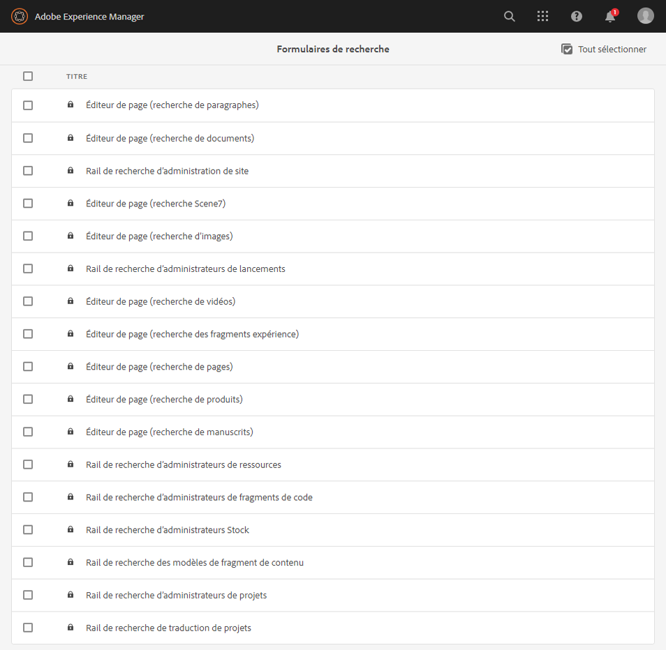
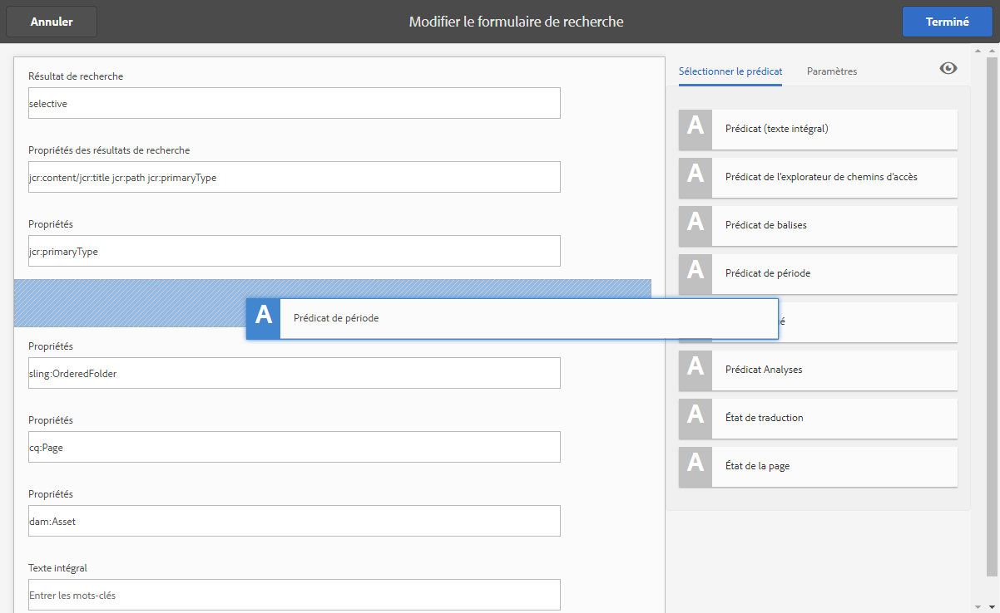
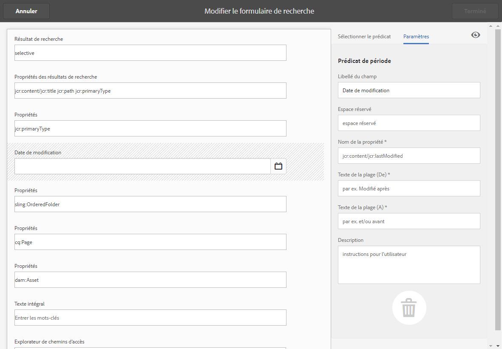
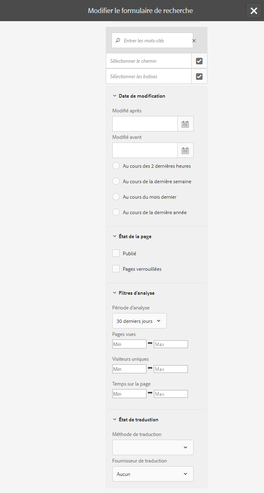
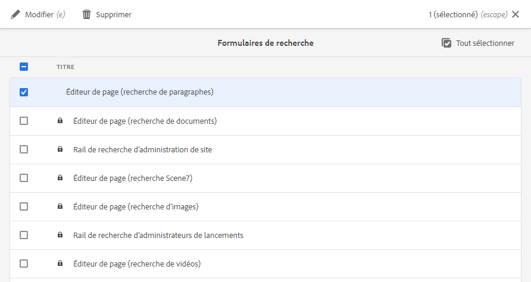
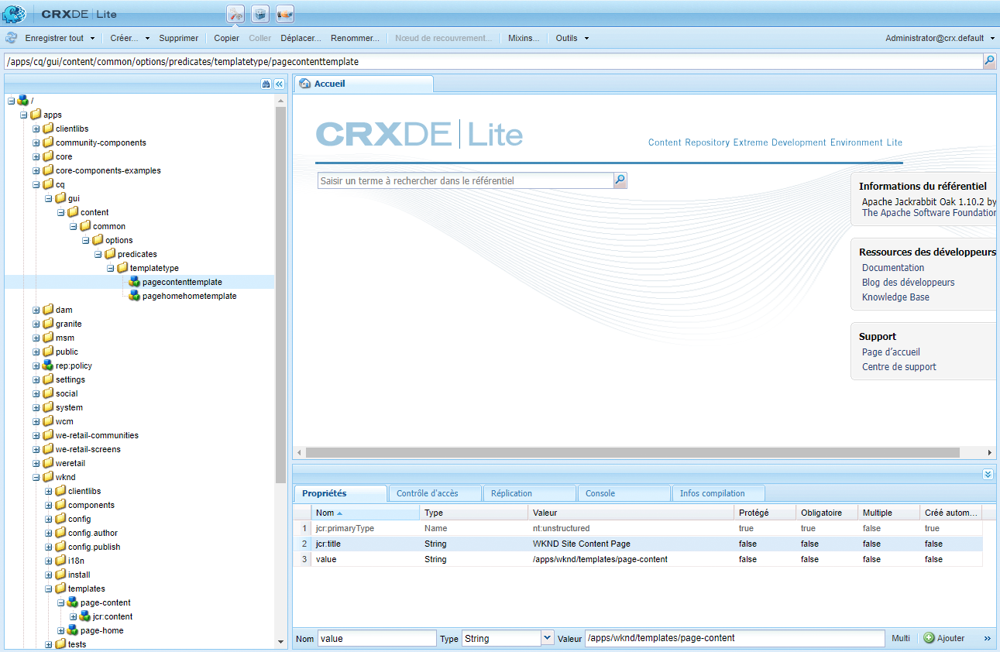

# Configuration des formulaires de recherche {#configuring-search-forms}

Adobe Experience Manager as a Cloud Service est fourni avec un puissant mécanisme de [recherche](/help/sites-cloud/authoring/getting-started/search.md).

Il existe également un ensemble d’options prédéfinies pour vous aider à filtrer votre contenu. Ces fonctions contiennent des facettes prédéfinies, telles que **Date de modification**, **État de publication** ou **État Livecopy**, pour vous aider à accéder rapidement aux ressources dont vous avez besoin.

Ensemble, ces outils visent à vous aider à localiser rapidement et facilement votre contenu à partir des éléments suivants :

* [Rechercher et filtrer](/help/sites-cloud/authoring/getting-started/search.md#search-and-filter)
* [Sélecteur de rail](/help/sites-cloud/authoring/getting-started/basic-handling.md#rail-selector)
* [Navigateur de ressources](/help/sites-cloud/authoring/fundamentals/environment-tools.md#assets-browser) (lors de la modification de pages)

>[!NOTE]
>
>Vous pouvez configurer le service [Recherche et indexation de contenu](/help/operations/indexing.md) sous-jacent.

À l’aide des **Formulaires de recherche**, vous pouvez personnaliser et étendre ces panneaux en fonction de vos besoins spécifiques.

Les **Formulaires de recherche** fournissent une sélection immédiate de [prédicats](#predicates-and-their-settings) que vous pouvez combiner et définir. Les [boîtes de dialogue de configuration de ces formulaires](#configuring-your-search-forms) sont accessibles en sélectionnant :

* **Outils**

   * **Général**

      * **Formulaires de recherche**

## Formulaires par défaut {#default-forms}

Lorsque vous accédez à la console **Formulaires de recherche** pour la première fois, vous pouvez constater que toutes les configurations comportent un symbole de cadenas. Cela signifie que la configuration correspondante est la configuration par défaut (prête à l’emploi) et qu’elle ne peut pas être supprimée. Une fois que vous avez personnalisé et enregistré une configuration, le cadenas disparaît. Il réapparaît si vous [supprimez votre configuration personnalisée](#deleting-a-configuration-to-reinstate-the-default), auquel cas la valeur par défaut (et l’indicateur de cadenas) est rétablie.

Les configurations par défaut (classées dans l’ordre alphabétique) disponibles sont les suivantes :

* **Rail de recherche d’administrateurs de ressources :**

* **Éditeur de page (recherche de documents) :**

* **Éditeur de page (recherche des fragments expérience) :**

* **Éditeur de page (recherche d’images) :**

* **Éditeur de page (recherche de manuscrits) :**

* **Éditeur de page (recherche de pages) :**

* **Éditeur de page (recherche de paragraphes) :**

* **Éditeur de page (recherche de produits) :**

* **Éditeur de page (recherche Scene7)** :

* **Éditeur de page (recherche de vidéos)** :

* **Rail de recherche d’administrateurs de projets :**

* **Rail de recherche de traduction de projets :**

* **Rail de recherche d’administrateurs de sites** :

* **Rail de recherche d’administrateurs de fragments de code** :

* **Rail de recherche d’administrateurs Stock** :

>[!NOTE]
>
> Pour plus d’informations sur les formulaires de recherche liés aux ressources, voir [Ressources – Facettes de recherche](/help/assets/search-facets.md)

## Prédicats et paramètres associés {#predicates-and-their-settings}

### Prédicats {#predicates}

En fonction de la configuration, les prédicats disponibles sont les suivants :

<table>
 <tbody>
  <tr>
   <th>Prédicat</th>
   <th>Objectif</th>
   <th>Paramètres</th>
  </tr>
  <tr>
   <td>Analyses</td>
   <td>Fonctionnalités de recherche/filtrage dans le navigateur Sites lors de l’affichage de données optimisées par l’analyse. Les filtres de recherche Analyses sont chargés de façon à correspondre aux colonnes Analyses personnalisées mappées.</td>
   <td>
    <ul>
     <li>Libellé du champ</li>
     <li>Description</li>
    </ul> </td>
  </tr>
  <tr>
   <td>État d’approbation</td>
   <td>Recherchez selon l’état d’approbation.</td>
   <td>
    <ul>
     <li>Libellé du champ</li>
     <li>Nom de la propriété*</li>
     <li>Description</li>
    </ul> 
   </td>
  </tr>
  <tr>
   <td>Création</td>
   <td>Recherchez selon l’auteur.</td>
   <td>
    <ul>
     <li>Espace réservé</li>
     <li>Nom de la propriété*</li>
     <li>Description</li>
    </ul> 
   </td>
  </tr>
  <tr>
   <td>Extraits par</td>
   <td>Recherchez des ressources extraites par un utilisateur spécifique.</td>
   <td>
    <ul>
     <li>Libellé du champ</li>
     <li>Espace réservé</li>
     <li>Description</li>
    </ul> 
   </td>
  </tr>
  <tr>
   <td>État d’extraction</td>
   <td>Recherchez des ressources ayant un état d’extraction spécifique.</td>
   <td>
    <ul>
     <li>Libellé du champ</li>
     <li>Nom de la propriété*</li>
     <li>Description</li>
    </ul> 
   </td>
  </tr>
  <tr>
   <td>Composants</td>
   <td>Permet à un auteur de rechercher/filtrer des pages comportant un composant spécifique. Par exemple, une galerie d’images.  </td>
   <td>
    <ul>
     <li>Espace réservé</li>
     <li>Nom de la propriété*</li>
     <li>Détails de propriété</li>
     <li>Description</li>
    </ul> </td>
  </tr>
  <tr>
   <td>Date  Plage</td>
   <td>Recherchez des ressources créées dans une plage spécifiée pour une propriété de date. Dans le panneau Rechercher, vous pouvez spécifier des dates de début et de fin.</td>
   <td>
    <ul>
     <li>Libellé du champ</li>
     <li>Espace réservé</li>
     <li>Nom de la propriété*</li>
     <li>Texte de la plage (De)*</li>
     <li>Texte de la plage (À)*</li>
     <li>Description</li>
    </ul> </td>
  </tr>
  <tr>
   <td>État d’expiration</td>
   <td>Recherchez des ressources en fonction de l’état d’expiration.</td>
   <td>
    <ul>
     <li>Libellé du champ</li>
     <li>Nom de la propriété*</li>
     <li>Description</li>
    </ul> </td>
  </tr>
  <tr>
   <td>Taille de fichier</td>
   <td>Filtrez des ressources en fonction de leur taille.</td>
   <td>
    <ul>
     <li>Libellé du champ</li>
     <li>Nom de la propriété*</li>
     <li>Chemin d’accès aux options</li>
     <li>Description</li>
    </ul> </td>
  </tr>
  <tr>
   <td>Type de fichier</td>
   <td>Recherchez des ressources en fonction du type de fichier/MIME.</td>
   <td>
    <ul>
     <li>Libellé du champ</li> 
     <li>Nom de la propriété*</li>
     <li>Chemin de type MIME</li>
     <li>Description</li>
    </ul> 
   </td>
  </tr>
  <tr>
   <td>Texte intégral</td>
   <td>Prédicat de recherche pour les recherches en texte intégral.. Il est mappé à l’opérateur jcr:contains.</td>
   <td>
    <ul>
     <li>Espace réservé</li>
     <li>Nom de la propriété</li>
     <li>Description</li>
    </ul> </td>
  </tr>
  <tr>
   <td>Groupe</td>
   <td>Prédicat de recherche pour le groupe (utilisé uniquement dans le prédicat Statistiques).</td>
   <td>
    <ul>
     <li>Libellé du champ</li>
     <li>Description</li>
    </ul> </td>
  </tr>
  <tr>
   <td>Masqué  Filtrer</td>
   <td>Filtrez selon la propriété et la valeur, invisible pour l’utilisateur.</td>
   <td>
    <ul>
     <li>Nom de la propriété*</li>
     <li>Valeur de la propriété*</li>
     <li>Description</li>
    </ul> </td>
  </tr>
  <tr>
   <td>Statistiques</td>
   <td>Recherchez selon une sélection de paramètres Statistiques.</td>
   <td>Il s’agit d’un prédicat complexe composé de plusieurs prédicats :
    <ul>
     <li>Groupe</li>
     <li>Plage</li>
     <li>Options</li>
    </ul> 
   </td>
  </tr>
  <tr>
   <td>Membre de la collection</td>
   <td>Recherchez des ressources qui sont membres d’une collection.</td>
   <td>
    <ul>
     <li>Description</li>
    </ul> 
   </td>
  </tr>
  <tr>
   <td>Propriété à plusieurs valeurs</td>
   <td>Recherchez plusieurs valeurs d’une propriété spécifiée.</td>
   <td>
    <ul>
     <li>Libellé du champ</li>
     <li>Espace réservé</li>
     <li>Nom de la propriété*</li>
     <li>Prise en charge des délimiteurs</li>
     <li>Délimiteurs d’entrée</li>
     <li>Ignorer la casse</li>
     <li>Description</li>
    </ul> 
   </td>
  </tr>
  <tr>
   <td>Options </td>
   <td>
Les options sont des nœuds de contenu créés par l’utilisateur.
 
Pour plus d’informations, voir <a href="#addinganoptionspredicate">Ajout d’un prédicat Options</a>.
 </td>
   <td>
    <ul>
     <li>Libellé du champ</li>
     <li>Nom de la propriété*</li>
     <li>Sélection simple</li>
     <li>Ajouter des options</li>
     <li>Manuel</li>
     <li>Description</li>
    </ul> </td>
  </tr>
  <tr>
   <td>Options  Propriétés</td>
   <td>Recherchez une ou plusieurs propriétés de l’option.</td>
   <td>
    <ul>
     <li>Libellé du champ</li>
     <li>Nom de la propriété*</li>
     <li>Chemin d’accès au nœud d’options</li>
     <li>Détails de propriété</li>
     <li>Sélection simple</li>
     <li>Description</li>
    </ul> </td>
  </tr>
  <tr>
   <td>Page  État</td>
   <td>Filtrez des pages en fonction de leur état.</td>
   <td>
    <ul>
     <li>Libellé du champ</li>
     <li>Nom de la propriété de publication*</li>
     <li>Nom de propriété de pages verrouillées*</li>
     <li>Description</li>
    </ul> </td>
  </tr>
  <tr>
   <td>Chemin</td>
   <td>Filtrez selon un chemin d’accès spécifique. Vous pouvez spécifier plusieurs chemins d’accès sous la forme d’options.</td>
   <td>
    <ul>
     <li>Libellé du champ</li>
     <li>Ajouter les chemins de recherche</li>
     <li>Description</li>
    </ul> </td>
  </tr>
  <tr>
   <td>Chemin  Navigateur</td>
   <td>Fournissez un navigateur de chemins d’accès pour effectuer une recherche sous un chemin racine prédéfini.</td>
   <td>
    <ul>
     <li>Espace réservé</li>
     <li>Chemin racine</li>
     <li>Description</li>
    </ul> 
   </td>
  </tr>
  <tr>
   <td>Chemin  Masqué</td>
   <td>Filtrez selon le chemin, invisible pour l’utilisateur.</td>
   <td>
    <ul>
     <li>Nom de propriété (path)</li>
     <li>Valeur de propriété (/content/dam)</li>
    </ul> 
   </td>
  </tr>
  <tr>
   <td>Propriétés</td>
   <td>Effectuez une recherche sur une propriété spécifiée.</td>
   <td>
    <ul>
     <li>Libellé du champ</li>
     <li>Espace réservé</li>
     <li>Nom de la propriété</li>
     <li>Recherche partielle</li>
     <li>Ignorer la casse</li>
     <li>Description</li>
    </ul> 
   </td>
  </tr>
  <tr>
   <td>État de publication</td>
   <td>Filtrez des ressources en fonction de leur état de publication.</td>
   <td>
    <ul>
     <li>Libellé du champ</li>
     <li>Nom de la propriété*</li>
     <li>Description</li>
    </ul> </td>
  </tr>
  <tr>
   <td>Plage</td>
   <td>Recherchez des ressources figurant dans une plage spécifiée. Vous pouvez spécifier, dans le panneau Rechercher, les valeurs minimale et maximale de la plage concernée.</td>
   <td>
    <ul>
     <li>Libellé du champ</li>
     <li>Nom de la propriété*</li>
     <li>Description</li>
    </ul> </td>
  </tr>
  <tr>
   <td>Évaluation</td>
   <td>Recherchez des ressources en fonction de leur note moyenne.  </td>
   <td>
    <ul>
     <li>Libellé du champ</li>
     <li>Nom de la propriété*</li>
     <li>Chemin d’accès aux options</li>
     <li>Description</li>
    </ul> </td>
  </tr>
  <tr>
   <td>Date relative</td>
   <td>Filtrez des ressources en fonction de la date relative de leur création. Par exemple, il y a 1 semaine, 1 mois.</td>
   <td>
    <ul>
     <li>Libellé du champ</li>
     <li>Nom de la propriété*</li>
     <li>Date relative</li>
     <li>Description</li>
    </ul> </td>
  </tr>
  <tr>
   <td>Plage du curseur</td>
   <td>Prédicat de recherche courant étendant le prédicat de plage avec la fonctionnalité de curseur. La valeur de la propriété recherchée doit être comprise entre les limites du curseur.</td>
   <td>
    <ul>
     <li>Libellé du champ</li>
     <li>Nom de la propriété*</li>
     <li>Chemin d’accès au nœud d’options</li>
     <li>Description</li>
    </ul> </td>
  </tr>
  <tr>
   <td>État</td>
   <td>Effectuez une recherche en fonction de l’état d’approbation et d’extraction.</td>
   <td>Il s’agit d’un prédicat complexe composé de plusieurs prédicats :
    <ul>
     <li>État d’approbation</li>
     <li>État d’extraction</li>
    </ul> 
   </td>
  </tr>
  <tr>
   <td>Balises</td>
   <td>Effectuez une recherche en fonction de balises.</td>
   <td>
    <ul>
     <li>Niveau de champ</li>
     <li>Espace réservé</li>
     <li>Nom de la propriété*</li>
     <li>Option d’affichage de correspondance de toutes les balises</li>
     <li>Chemin d’accès aux balises racines</li>
     <li>Description</li>
    </ul> </td>
  </tr>
  <tr>
   <td>Modèles</td>
   <td>Effectuez une recherche en fonction du modèle sélectionné.</td>
   <td>
    <ul>
     <li>Espace réservé</li>
     <li>Nom de la propriété*</li>
     <li>Description</li>
    </ul> 
   </td>
  </tr>
  <tr>
   <td>État de traduction</td>
   <td>Effectuez une recherche en fonction de l’état de traduction.</td>
   <td>
    <ul>
     <li>Libellé du champ</li>
    </ul> 
   </td>
  </tr>
 </tbody>
</table>

<!--
  <tr>
   <td>Date ???</td>
   <td>Slider-based search of assets based on a date property.</td>
   <td>
    <ul>
     <li>Field Label</li>
     <li>Property Name*</li>
     <li>Description</li>
    </ul> </td>
  </tr>
  <tr>
   <td>Asset Last Modified ?????</td>
   <td>Date the asset was last modified.  </td>
   <td>A customized predicate, based on the Date Predicate.</td>
  </tr>
  <tr>
   <td>Range Options ???</td>
   <td>A specific search predicate for Assets and the same as common Slider Predicate. Is still available due to backward compatibilty issues.</td>
   <td>
    <ul>
     <li>Field Label</li>
     <li>Property Name*</li>
     <li>Option Path</li>
     <li>Description</li>
    </ul> </td>
  </tr>
  <tr>
   <td>Tag </td>
   <td>Search assets based on tags. You can configure the Path property to populate various tags in the Tags list.</td>
   <td>
    <ul>
     <li>Field Label</li>
     <li>Property Name*</li>
     <li>Option Path</li>
     <li>Description</li>
    </ul> </td>
  </tr>
-->

>[!NOTE]
>
>* Les prédicats de recherche courants sont définis dans :
   >  `/libs/cq/gui/components/common/admin/customsearch/searchpredicates`
>
>
Ces informations sont proposées à des fins de référence seulement. Vous ne devez pas apporter de modifications au répertoire `/libs`.

<!--
>* Search predicates related only to siteadmin (classic UI) are located under:
> `/libs/cq/gui/components/siteadmin/admin/searchpanel/searchpredicates`
>   * These are deprecated and only available for backward compatibility.
>
-->

### Paramètres de prédicat {#predicate-settings}

En fonction du prédicat, une sélection de paramètres est disponible pour la configuration, y compris :

* **Libellé du champ**

   Libellé qui s’affiche sous forme d’en-tête réductible ou de libellé de champ du prédicat.

* **Description**

   Informations descriptives à l’intention de l’utilisateur.

* **Espace réservé**

   Texte non renseigné ou espace réservé du prédicat au cas où aucun texte de filtrage ne serait saisi.

* **Nom de la propriété**

   Propriété selon laquelle effectuer la recherche. Elle utilise un chemin relatif et les caractères génériques `*/*/*` pour spécifier la profondeur de la propriété par rapport au nœud `jcr:content` (chaque astérisque représente un niveau de nœud).

   Si vous souhaitez effectuer une recherche uniquement sur le nœud enfant de premier niveau de la ressource, dont la propriété `x` est égale au nœud `jcr:content`, utilisez `*/jcr:content/x`.

* **Détails de propriété**

   Détails maximum selon lesquels rechercher cette propriété dans les ressources. Une recherche sur cette propriété peut donc être exécutée sur une ressource et des enfants récursifs jusqu’au niveau auquel les enfants sont égaux à la profondeur spécifiée.

* **Valeur de la propriété**

   Valeur de la propriété sous forme de chaîne absolue ou de langage utilisant des expressions ; par exemple, `cq:Page` ou

   `${empty requestPathInfo.suffix ? "/content" : requestPathInfo.suffix}`.

* **Texte de la plage**

   Libellé du champ de plage dans le prédicat **Plage de dates**.

* **Chemin d’accès aux options**

   L’utilisateur peut sélectionner le chemin d’accès à l’aide de l’Explorateur de chemins d’accès dans l’onglet Paramètres de prédicat, puis cliquer sur l’icône « **+** » pour ajouter la sélection à la liste des options valides (puis sur l’icône « **-** » pour la supprimer, si nécessaire).

   Les options sont des nœuds de contenu créés par l’utilisateur, qui possèdent la structure suivante :

   `(jcr:primaryType = nt:unstructured, value (String), jcr:title (String))`

* **Chemin d’accès au nœud d’options**
Globalement identique à **Chemin d’accès aux options**, à la différence qu’il se trouve dans le champ de prédicat commun, tandis que l’autre est spécifique aux ressources.

* **Sélection simple**
Si cette case est cochée, les options sont présentées sous forme de cases à cocher qui ne permettent qu’une sélection simple. Si cette option est sélectionnée par erreur, vous pouvez désélectionner la case à cocher correspondante.

* **Nom des propriétés de publication et Live Copy**
Libellés des cases à cocher Publication et Live Copy pour le prédicat spécifique aux sites.

* L’astérisque (&amp;ast;) figurant dans les libellés de champ de l’onglet **Paramètres** désigne les champs obligatoires, pour lesquels un message d’erreur s’affiche s’ils ne sont pas renseignés.

## Configuration des formulaires de recherche {#configuring-your-search-forms}

### Création/ouverture d’une configuration personnalisée {#creating-opening-a-customized-configuration}

1. Accédez à **Outils**, **Général**, **Formulaires de recherche**.

1. Sélectionnez la configuration que vous souhaitez personnaliser.
1. Utilisez l’icône **Modifier** pour ouvrir la configuration pour la mise à jour.
1. S’il s’agit d’une nouvelle personnalisation, vous allez probablement [ajouter de nouveaux champs de prédicat et définir les paramètres](#add-edit-a-predicate-field-and-define-field-settings) requis. S’il s’agit d’une personnalisation existante, vous pouvez sélectionner un champ existant et [mettre à jour les paramètres](#add-edit-a-predicate-field-and-define-field-settings).
1. Sélectionnez **Terminé** pour enregistrer la configuration. Vos modifications seront visibles lors de la prochaine utilisation de la configuration.

   >[!NOTE]
   >
   >Les configurations personnalisées sont enregistrées (de façon appropriée) sous :
   >
   >* `/apps/cq/gui/content/facets/<option>`
   >* `/apps/commerce/gui/content/facets/<option>`

### Ajout/modification d’un champ de prédicat et définition des paramètres de champ {#add-edit-a-predicate-field-and-define-field-settings}

Vous pouvez ajouter ou modifier des champs et définir/mettre à jour leurs paramètres :

1. [Ouvrez la configuration personnalisée](#creating-opening-a-customized-configuration) pour la mise à jour.
1. Si vous souhaitez ajouter un nouveau champ, ouvrez l’onglet **Sélectionner le prédicat** et faites glisser le prédicat souhaité vers l’emplacement souhaité. Par exemple, le **prédicat de plage de dates** :

   

1. Selon que :

   * Vous ajoutiez ou non un nouveau champ :

      Après l’ajout du prédicat, l’onglet **Paramètres** s’ouvre et affiche les propriétés qui peuvent être définies.

   * Vous souhaitiez ou non mettre à jour un prédicat existant :

      Sélectionnez le champ de prédicat (à droite), puis ouvrez l’onglet **Paramètres**.
   Par exemple, les paramètres du **prédicat de plage de dates** :

   

1. Apportez les modifications nécessaires et confirmez-les en cliquant sur **Terminé**. Vos modifications seront visibles lors de la prochaine utilisation de la configuration.

### Aperçu de la configuration de recherche {#previewing-the-search-configuration}

1. Sélectionnez l’icône Aperçu :

   

1. Les formulaires de recherche s’affichent tels qu’ils apparaissent (totalement développés) dans la colonne Rechercher de la console appropriée.

   

1. **Fermez** l’aperçu pour terminer la configuration.

### Suppression d’un champ de prédicat  {#deleting-a-predicate-field}

1. [Ouvrez la configuration personnalisée](#creating-opening-a-customized-configuration) pour la mise à jour.
1. Sélectionnez le champ de prédicat (à droite), ouvrez l’onglet **Paramètres**, puis sélectionnez l’icône **Supprimer** (dans le coin inférieur gauche).

   

1. Une boîte de dialogue vous invite à confirmer la suppression.

1. Confirmez la suppression et les autres modifications en cliquant sur **Terminé**.

### Suppression d’une configuration (pour rétablir la valeur par défaut) {#deleting-a-configuration-to-reinstate-the-default}

Une fois que vous avez personnalisé une configuration, cette option remplace les valeurs par défaut. Vous pouvez rétablir la configuration par défaut en supprimant la configuration personnalisée.

>[!NOTE]
>
>Vous ne pouvez pas supprimer les configurations par défaut.

Les configurations personnalisées doivent être supprimées à partir de la console :

1. Sélectionnez une configuration (par exemple, **Éditeur de page (Recherche sur des paragraphes)**), puis cliquez sur l’icône **Supprimer** de la barre d’outils :

   

1. La configuration personnalisée est supprimée et la valeur par défaut est rétablie (le symbole de cadenas réapparaît dans la console).

### Ajout de prédicats d’options  {#adding-options-predicates}

Les prédicats d’options (options, propriété d’options) permettent de configurer un élément à rechercher. Ils servent généralement à rechercher un élément directement sous la page, par exemple, une propriété sur le nœud de page.

L’exemple ci-dessous (pour effectuer une recherche en fonction du modèle utilisé pour créer une page) illustre la procédure :

1. Créez le nœud définissant la propriété à rechercher.

   Vous avez besoin d’un nœud racine contenant les définitions des différentes options disponibles pour l’utilisateur.

   Les nœuds pour les différentes options ont besoin de propriétés :

   * `jcr:title` : libellé de champ à afficher dans le champ de recherche
   * `value` : valeur de la propriété à rechercher
   

   >[!NOTE]
   >
   >Vous ne devez ***rien*** modifier dans le chemin `/libs`.
   >
   >En effet, le contenu de `/libs` est remplacé dès que vous mettez à niveau votre instance (et risque de l’être si vous appliquez un correctif ou un Feature Pack).
   >
   >La méthode recommandée pour la configuration et d’autres modifications est la suivante :
   >
   >1. Recréez l’élément nécessaire, tel qu’il existe dans `/libs`, sous `/apps`. Dans ce cas dans :
   >1. `/libs/cq/gui/content/common/options/predicates`
   >1. Apportez les modifications désirées dans `/apps.`

1. Ouvrez la console **Formulaires de recherche** et sélectionnez la configuration à mettre à jour. Par exemple, le **rail de recherche d’administrateurs de sites**. Sélectionnez ensuite **Modifier**.

1. En fonction de la configuration, ajoutez des **options** ou une **propriété d’options** à la configuration.
1. Mettez à jour les champs, en particulier :

   * **Nom de la propriété**

      Spécifique à la propriété du nœud à rechercher sur les nœuds cibles. Par exemple :

      `jcr:content/cq:template`

   * **Chemin d’accès du nœud d’option**

      Sélectionnez le chemin d’accès vers lequel vos options sont conservées. Par exemple :

      `/apps/cq/gui/content/common/options/predicates/templatetype`
   

1. Sélectionnez **Terminé** pour enregistrer la configuration.
1. Accédez à la console appropriée (dans cet exemple, **Sites**) et ouvrez le rail **Recherche – Filtres**. Les formulaires de recherche qui viennent d’être définis, ainsi que les différentes options, sont visibles. Sélectionnez l’option nécessaire pour afficher les résultats de la recherche.

   

## Autorisations d’utilisateur {#user-permissions}

Le tableau ci-dessous répertorie les autorisations nécessaires à la modification, à la suppression et à l’aperçu dans des formulaires de recherche.

<table>
 <thead>
  <tr>
   <td><strong>Action</strong></td>
   <td><strong>Autorisations</strong></td>
  </tr>
 </thead>
 <tbody>
  <tr>
   <td>Modifier </td>
   <td>Autorisations de lecture et d’écriture sur le nœud <code>/apps </code>.</td>
  </tr>
  <tr>
   <td>Supprimer</td>
   <td>Autorisations de lecture, d’écriture et de suppression sur le nœud <code>/apps</code>.</td>
  </tr>
  <tr>
   <td>Aperçu</td>
   <td>Autorisations de lecture, d’écriture et de suppression sur le nœud <code>/var/dam/content</code>.  Autorisations de lecture et d’écriture sur le nœud <code>/apps</code>.</td>
  </tr>
 </tbody>
</table>
