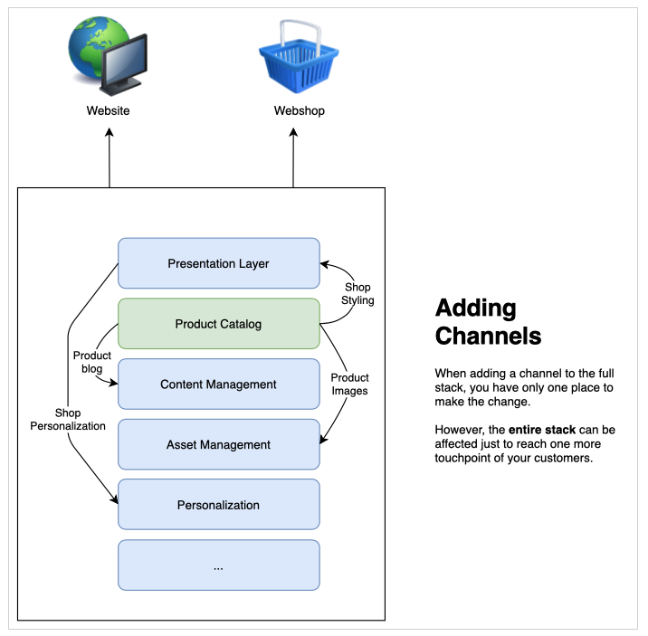

# En savoir plus sur le développement sans tête de CMS {#learn-about}

>[!CAUTION]
>
>TRAVAUX EN COURS - La création de ce document est en cours et ne doit pas être comprise comme complète ou définitive ni être utilisée à des fins de production.

Dans cette partie du [AEM Parcours de développement sans tête,](overview.md) découvrez comment la technologie sans tête est utilisée et pourquoi vous l&#39;utiliseriez.

## Intention {#objective}

Ce document vous aide à comprendre la diffusion de contenu sans en-tête et pourquoi elle doit être utilisée. Après lecture, vous devez :

* Comprendre les concepts de base et la terminologie de la diffusion de contenu sans en-tête
* Comprendre pourquoi et quand l&#39;absence de tête est requise
* Savoir à un niveau élevé comment les concepts sans tête sont utilisés et comment ils interagissent

## Diffusion de contenu en pile complète {#full-stack}

Depuis l&#39;apparition de systèmes de gestion de contenu à grande échelle (CMS) faciles à utiliser, les organisations les ont utilisés comme un lieu central pour gérer les messages, l&#39;image de marque et les communications. L&#39;utilisation du SGC comme point central pour administrer les expériences a amélioré l&#39;efficacité en éliminant la nécessité de duplicata des tâches dans des systèmes disparates.

Dans un CMS à pile complète, toutes les fonctionnalités permettant de manipuler votre contenu se trouvent dans le CMS. Les fonctionnalités du système constituent différents composants de la pile CMS. La solution de pile complète présente de nombreux avantages.

* Vous avez un système à gérer.
* Le contenu est géré de manière centralisée.
* Tous les services du système sont intégrés.
* La création de contenu est transparente.

Ainsi, si vous souhaitez ajouter un nouveau canal ou prendre en charge de nouveaux types d’expériences, vous pouvez insérer un (ou plusieurs) nouveau composant dans votre pile et vous n’avez qu’un seul emplacement pour effectuer vos modifications.

La complexité des dépendances au sein de la pile devient rapidement visible lorsque vous voyez que d&#39;autres éléments de la pile peuvent avoir besoin d&#39;être ajustés pour tenir compte des modifications.

## Limites de la Diffusion de pile complète {#limits}

L’approche de pile complète crée un silo où toutes les expériences atterrissent dans un système unique. Les modifications ou les ajouts à un composant du silo nécessitent des modifications à d&#39;autres composants, ce qui peut entraîner des changements coûteux et chronophages.

Cela est particulièrement vrai pour le système de présentation, qui dans les configurations traditionnelles, est souvent étroitement lié au CMS. Tout nouveau canal signifie généralement une mise à jour du système de présentation, qui peut affecter tous les autres canaux.

Les limites de ce silo naturel peuvent devenir évidentes lorsque vous consacrez plus d&#39;efforts à la coordination des modifications entre tous les composants de votre pile.

Les utilisateurs s’attendent à un engagement quel que soit la plate-forme ou le point de contact, ce qui nécessite une certaine agilité dans la manière dont vous proposez vos expériences.  Cette approche multicanal est la norme des expériences numériques et une approche à pile complète peut dans certaines circonstances s&#39;avérer inflexible.

## La tête sans tête {#the-head}

La tête de tout système est généralement le rendu de sortie de ce système, généralement sous la forme d&#39;une interface graphique ou d&#39;une autre sortie graphique.

Un serveur sans tête, par exemple, est probablement assis dans un rack dans une salle de serveurs quelque part et n&#39;a pas de moniteur connecté. Pour y accéder, vous devez vous y connecter à distance. Dans ce cas, le moniteur est le responsable du rendu du serveur. En tant que consommateur du service, vous fournissez votre propre tête (le moniteur) lorsque vous vous connectez à distance à celui-ci.

Lorsque nous parlons d&#39;un CMS sans tête, le CMS gère le contenu et continue de le diffuser aux consommateurs. Cependant, en ne livrant le **contenu** que de façon normalisée, un CMS sans tête omet le rendu final de la sortie, laissant au service de consommation la **présentation** du contenu.

Les services de consommation, qu’il s’agisse d’expériences AR, d’un webshop, d’expériences mobiles, d’applications Web progressives (PWA), etc., intègrent le contenu du CMS sans en-tête et fournissent leur propre rendu. Ils s&#39;occupent de donner leur propre tête pour votre contenu.

En omettant la tête, vous simplifiez le CMS en supprimant la complexité. Cette opération déplace également la responsabilité de rendre le contenu aux services qui ont réellement besoin du contenu et qui sont souvent mieux adaptés à un tel rendu.

## Découplage {#decoupling}

Une diffusion sans tête est possible en exposant un ensemble d’interfaces de programmation d’applications (API) robustes et flexibles, auxquelles toutes vos expériences peuvent s’appuyer. L’API sert de langage commun entre les services, les liant ensemble au niveau du contenu par le biais d’une diffusion de contenu normalisée, mais leur permettant de mettre en oeuvre leurs propres solutions.

L’absence d’en-tête est un exemple de découplage du contenu de sa présentation. Ou dans un sens plus générique, découpler le front end de l&#39;arrière-plan de votre pile de services. Dans une configuration sans tête, le système de présentation (la tête) est découplé de la gestion de contenu (la queue). Les deux interagissent uniquement par le biais d’appels d’API.

Ce découplage signifie que chaque service de consommation (principal) peut développer son expérience en fonction du même contenu diffusé sur les API, ce qui garantit la réutilisation et la cohérence du contenu. Les services de consommation peuvent alors mettre en oeuvre leurs propres systèmes de présentation, ce qui permet à la pile de gestions de contenu (l&#39;arrière-plan) de se mettre à l&#39;échelle horizontalement.

## Les fondements technologiques {#technology}

Une approche sans tête vous permet de créer une pile technologique qui peut s&#39;adapter facilement et rapidement aux exigences futures de l&#39;expérience numérique.

Dans le passé, les API pour les CMS étaient généralement basées sur REST. Le transfert d&#39;État de représentation (REST) fournit des ressources sous forme de texte sans état. Cela permet de lire et de modifier les ressources à l’aide d’un jeu d’opérations prédéfini. REST a permis une grande interopérabilité entre les services sur le Web en assurant une représentation sans état du contenu.

Il est toujours nécessaire d’utiliser des API REST robustes. Cependant, les demandes REST peuvent être volumineuses et détaillées. Si plusieurs consommateurs effectuent des appels REST pour tous vos canaux, cette verbosité peut être affectée et les performances peuvent être affectées.

La diffusion de contenu sans en-tête utilise souvent les API GraphQL. GraphQL permet un transfert sans état similaire, mais permet des requêtes plus ciblées, réduisant le nombre total de requêtes requises et améliorant les performances. Il est courant de voir les solutions utiliser un mélange de REST et GraphQL, en choisissant essentiellement le meilleur outil pour le travail à accomplir.

Quelle que soit l’API choisie, en définissant un système sans tête basé sur des API courantes, vous pouvez tirer parti des derniers navigateurs et d’autres technologies Web telles que les applications Web progressives (PWA). Les API créent une interface standard facilement extensible et adaptable.

En règle générale, le contenu est rendu côté client. Cela signifie généralement qu’une personne appelle votre contenu sur un périphérique mobile, que votre CMS diffusion le contenu, puis que le périphérique mobile (le client) est responsable du rendu du contenu que vous avez diffusé. Si le périphérique est ancien ou lent, votre expérience numérique est également lente.

Le découplage du contenu de la présentation permet de mieux contrôler ces problèmes de performances côté client. Le rendu côté serveur (SSR) transfère la responsabilité de rendre le contenu du navigateur du client au serveur. Cela vous permet, en tant que fournisseur du contenu, d&#39;offre à votre audience un niveau de performances garanti si c&#39;est ce qui est nécessaire.

## Défis organisationnels {#organization}

Headless vous offre un monde de flexibilité pour vous offrir des expériences numériques. Mais cette flexibilité peut aussi présenter son propre défi.

Avoir de nombreux canaux différents peut signifier qu&#39;ils ont chacun leur propre système de présentation. Bien qu’ils consomment tous le même contenu via les mêmes API, l’expérience peut être différente en raison des différentes présentations. Il faut veiller à la cohérence de l&#39;expérience client et veiller à ce qu&#39;elle soit respectée.

En mettant en oeuvre des systèmes de conception soignés, en partageant des bibliothèques de modèles et en exploitant des composants de conception réutilisables ainsi que des cadres établis et ouverts côté client, des expériences cohérentes peuvent être assurées, mais cela doit être planifié.

## L&#39;avenir est sans tête et l&#39;avenir est maintenant {#future}

Les expériences numériques continueront de définir comment les marques interagissent avec les clients. Ce qui est passionnant dans le design sans tête, c&#39;est la flexibilité qu&#39;il nous donne pour répondre à l&#39;évolution des attentes des clients.

Il est impossible de prédire l&#39;avenir, mais l&#39;absence de tête vous donne l&#39;agilité de réagir à ce que l&#39;avenir apportera.

## AEM et sans en-tête {#aem-and-headless}

Au fil de ce parcours de développement, vous découvrirez comment AEM prend en charge la diffusion sans tête en plus de ses capacités de diffusion de pile complète.

En tant que leader du secteur de la gestion de l&#39;expérience numérique, l&#39;Adobe se rend compte que la solution idéale aux défis du monde réel auxquels les créateurs d&#39;expériences sont confrontés est rarement un choix binaire. C&#39;est pourquoi AEM ne prend pas seulement en charge les deux modèles, mais permet également de manière unique la combinaison homogène hybride des deux, en mélangeant les avantages de la pile sans tête et complète, pour vous aider à mieux servir les consommateurs de votre contenu, où qu&#39;ils soient.

Ce parcours se concentre sur le modèle de diffusion de contenu sans en-tête uniquement. Cependant, une fois que vous disposez de ces connaissances fondamentales, vous pouvez explorer plus avant comment tirer parti de la puissance des deux modèles.

## Eléments suivants {#what-is-next}

Merci d&#39;avoir commencé votre parcours sans tête AEM ! Maintenant que vous avez lu ce document, vous devriez :

* Comprendre les concepts de base et la terminologie de la diffusion de contenu sans en-tête.
* Comprenez pourquoi et quand l&#39;absence de tête est requise.
* Savoir à un niveau élevé comment les concepts sans tête sont utilisés et comment ils interagissent.

Tirez parti de ces connaissances et poursuivez votre parcours sans tête en examinant ensuite le document [Pour commencer avec AEM sans tête en tant que Cloud Service](getting-started.md) où vous apprendrez comment configurer les outils nécessaires et comment commencer à réfléchir à la façon dont l&#39;AEM aborde la diffusion de contenu sans tête et ses conditions préalables.

## Ressources supplémentaires {#additional-resources}

Bien qu&#39;il soit recommandé de passer à la partie suivante du parcours de développement sans tête en examinant le document [Prise en main de l&#39;AEM sans tête en tant que Cloud Service,](getting-started.md) voici quelques ressources supplémentaires facultatives qui approfondissent certains concepts mentionnés dans ce document, mais qui ne sont pas nécessaires pour continuer sur le parcours sans tête.

* [Introduction à l&#39;architecture de Adobe Experience Manager en tant que Cloud Service](/help/core-concepts/architecture.md)  - Comprendre l&#39;AEM en tant que Cloud Service
* [AEM Tutorials](https://experienceleague.adobe.com/docs/experience-manager-learn/getting-started-with-aem-headless/overview.html?lang=fr)  sans en-tête - Utilisez ces didacticiels pratiques pour découvrir comment utiliser les différentes options de diffusion de contenu vers des points de terminaison sans en-tête avec AEM et choisissez ce qui vous convient.
