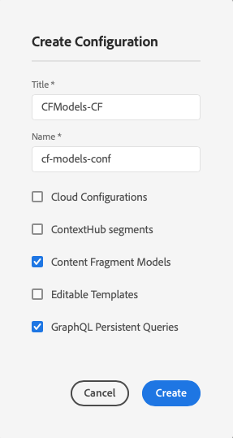

# Comment modéliser votre contenu {#model-your-content}

>[!CAUTION]
>
>OUTDATED - Ce contenu de brouillon a été remplacé par la nouvelle [documentation du Parcours développeur sans affichage.](/help/journey-headless/developer/overview.md)

Dans cette partie du [Parcours de développement AEM sans affichage](overview.md), vous pouvez apprendre à modéliser votre structure de contenu. Ensuite, réalisez cette structure pour Adobe Experience Manager (AEM) à l’aide des modèles de fragments de contenu et des fragments de contenu, en vue de la réutiliser sur plusieurs canaux.

## L&#39;histoire jusqu&#39;à présent {#story-so-far}

Au début [Découvrez le développement CMS sans affichage](learn-about.md) la diffusion de contenu sans affichage et pourquoi elle doit être utilisée. Ensuite, [Prise en main d’AEM sans tête en tant que Cloud Service](getting-started.md) décrit AEM sans tête dans le contexte de votre propre projet.

Dans le document précédent du parcours sans interface utilisateur AEM, [Chemin d’accès à votre première expérience à l’aide d’AEM sans affichage](/help/implementing/developing/headless-journey/path-to-first-experience.md), vous avez ensuite appris les étapes nécessaires à la mise en oeuvre de votre premier projet. Après l’avoir lu, vous devez :

* Comprendre les points importants de la planification pour concevoir votre contenu
* Découvrez les étapes à suivre pour implémenter sans interface utilisateur graphique en fonction des exigences de niveau d’intégration.
* Configurez les outils et les configurations AEM nécessaires.
* Découvrez les bonnes pratiques pour fluidifier votre parcours sans interface, optimiser la génération du contenu et garantir une diffusion rapide du contenu.

Cet article s’appuie sur ces principes de base pour que vous compreniez comment préparer votre propre projet AEM sans tête.

## Intention {#objective}

* **Audience** : Début
* **Objectif** : Découvrez comment modéliser votre structure de contenu, puis réaliser cette structure à l’aide AEM modèles de fragment de contenu et de fragments de contenu :
   * Découvrez les concepts et la terminologie liés à la modélisation des données/contenu.
   * Découvrez pourquoi la modélisation de contenu est nécessaire pour la diffusion de contenu sans affichage.
   * Découvrez comment réaliser cette structure à l’aide AEM modèles de fragment de contenu (et créer du contenu avec des fragments de contenu).
   * Découvrez comment modéliser votre contenu ; principes avec des exemples de base.

>[!NOTE]
>
>La modélisation des données est un champ très volumineux, car il est utilisé lors du développement de bases de données relationnelles. Il y a beaucoup de livres, et de sources d&#39;information en ligne, disponibles.
>
>Nous ne prendrons en compte que les aspects qui présentent un intérêt que lors de la modélisation des données à utiliser avec AEM sans affichage.

## Modélisation de contenu {#content-modeling}

*C&#39;est un monde grand et mauvais là-bas*.

Peut-être pas, mais c&#39;est certainement un grand ***monde*** compliqué et la modélisation des données est utilisée pour définir une représentation simplifiée d&#39;une très (très) petite sous-section, en utilisant l&#39;information spécifique nécessaire à un certain objectif.

>[!NOTE]
>
>Comme AEM traite du contenu, nous nous référons à la modélisation de données en tant que modélisation de contenu.

Par exemple :

Il y a beaucoup d&#39;écoles, mais elles ont toutes des choses en commun :

* Un emplacement
* Un professeur en chef
* Beaucoup d&#39;enseignants
* De nombreux membres du personnel non enseignant
* Beaucoup d&#39;élèves
* Beaucoup d&#39;anciens enseignants
* Beaucoup d&#39;anciens élèves
* De nombreuses salles de classe
* Beaucoup (beaucoup) de livres
* Beaucoup (beaucoup) de pièces d&#39;équipement
* De nombreuses activités extrascolaires
* et ainsi de suite....

Même dans un si petit exemple, la liste peut sembler infinie. Mais si vous souhaitez simplement que votre application effectue une tâche simple, vous devez limiter les informations aux éléments essentiels.

Par exemple, la publicité d&#39;événements spéciaux pour toutes les écoles de la région :

* Nom de l’école
* Emplacement scolaire
* Chef d&#39;enseignement
* Type d’événement
* Date de l’événement
* Organisation de l&#39;événement par le professeur

### Concepts  {#concepts}

Ce que vous souhaitez décrire est appelé **Entités**, c’est-à-dire les &quot;choses&quot; sur lesquelles nous voulons stocker des informations.

Les informations que nous voulons stocker à leur sujet sont les **Attributs** (propriétés), tels que le nom et les qualifications pour les enseignants.

Il existe ensuite diverses **relations** entre les entités. Par exemple, en général, une école n&#39;a qu&#39;un seul professeur principal, et de nombreux enseignants (et généralement le professeur principal est également enseignant).

Le processus d’analyse et de définition de ces informations, ainsi que les relations entre elles, est appelé **Modélisation de contenu**.

### Concepts de base {#basics}

Souvent, vous devez commencer par élaborer un **schéma conceptuel** qui décrit les entités et leurs relations. Il s’agit généralement d’un niveau supérieur (conceptuel).

Une fois cette situation stable, vous pouvez traduire les modèles en **Schéma logique** qui décrit les entités, ainsi que les attributs, et les relations. À ce niveau, vous devez examiner de près les définitions pour éliminer la duplication et optimiser votre conception.

>[!NOTE]
>
>Parfois, ces deux étapes sont fusionnées, souvent en fonction de la complexité de votre scénario.

Par exemple, avez-vous besoin d’entités distinctes pour `Head Teacher` et `Teacher`, ou simplement d’un attribut supplémentaire sur le modèle `Teacher` ?

### Assurer l’intégrité des données {#data-integrity}

L’intégrité des données est nécessaire pour garantir la précision et la cohérence de votre contenu tout au long de son cycle de vie. Cela implique de s’assurer que les auteurs de contenu peuvent facilement comprendre où stocker, de sorte que les éléments suivants sont essentiels :

* une structure claire
* une structure aussi concise que possible (sans sacrifier la précision)
* validation de champs individuels
* le cas échéant, limitez le contenu de champs spécifiques à ce qui est significatif.

### Suppression de la redondance de données {#data-redundancy}

La redondance des données se produit lorsque les mêmes informations sont stockées deux fois dans la structure de contenu. Cela doit être évité, car cela peut prêter à confusion lors de la création du contenu et entraîner des erreurs lors de l’interrogation ; sans parler de la mauvaise utilisation de l&#39;espace de stockage.

### Optimisation et performance {#optimization-and-performance}

En optimisant votre structure, vous pouvez améliorer les performances, tant pour la création de contenu que pour l’interrogation.

Tout est un acte d&#39;équilibrage, mais la création d&#39;une structure trop complexe, ou à trop de niveaux, peut :

* Soyez déroutant pour les auteurs qui génèrent le contenu.

* Cela affecte considérablement les performances si la requête doit accéder à plusieurs fragments de contenu imbriqués (référencés) pour récupérer le contenu requis.

## Modélisation de contenu pour AEM sans affichage {#content-modeling-for-aem-headless}

La modélisation des données est un ensemble de techniques établies, souvent utilisées lors de bases de données de relations développées. Que signifie la modélisation de contenu pour AEM sans affichage ?

### Pourquoi ? {#why}

Pour que votre application puisse demander et recevoir le contenu requis d’AEM de manière cohérente et efficace, ce contenu doit être structuré.

Cela signifie que votre application connaît à l’avance la forme de réponse et, par conséquent, comment la traiter. Cela est beaucoup plus facile que de recevoir du contenu de forme libre, qui doit être analysé pour déterminer ce qu’il contient et, par conséquent, comment il peut être utilisé.

### Introduction à Comment ? {#how}

AEM utilise des fragments de contenu pour fournir les structures nécessaires à la diffusion sans affichage de votre contenu vers vos applications.

La structure de votre modèle de contenu est la suivante :

* réalisé par la définition de votre modèle de fragment de contenu,
* utilisés comme base des fragments de contenu utilisés pour votre génération de contenu.

>[!NOTE]
>
>Les modèles de fragment de contenu sont également utilisés comme base des schémas GraphQL d’AEM, utilisés pour récupérer votre contenu - en savoir plus à ce sujet lors d’une session ultérieure.

Les demandes de contenu sont effectuées à l’aide de l’API GraphQL AEM, une mise en oeuvre personnalisée de l’API GraphQL standard. L’API GraphQL AEM vous permet d’exécuter des requêtes (complexes) sur vos fragments de contenu, chaque requête étant en fonction d’un type de modèle spécifique.

Le contenu renvoyé peut alors être utilisé par vos applications.

## Création de la structure avec des modèles de fragment de contenu {#create-structure-content-fragment-models}

Les modèles de fragment de contenu offrent divers mécanismes qui vous permettent de définir la structure de votre contenu.

Un modèle de fragment de contenu décrit une entité.

>[!NOTE]
>Vous devez activer la fonctionnalité Fragment de contenu dans l’explorateur de configurations afin de pouvoir créer de nouveaux modèles.

>[!TIP]
>
>Le modèle doit être nommé de sorte que l’auteur du contenu sache quel modèle sélectionner lors de la création d’un fragment de contenu.

Dans un modèle :

1. **Data** Type vous permet de définir les attributs individuels.
Par exemple, définissez le champ portant le nom d’un enseignant comme **Texte** et ses années de service comme **Nombre**.
1. Les types de données **Référence du contenu** et **Référence du fragment** vous permettent de créer des relations avec d’autres contenus dans AEM.
1. Le type de données **Fragment Reference** vous permet de réaliser plusieurs niveaux de structure en imbriquant vos fragments de contenu (en fonction du type de modèle). Ceci est essentiel pour la modélisation de contenu.

Par exemple :

### Types de données {#data-types}

AEM fournit les types de données suivants pour que vous puissiez modéliser votre contenu :

* Une seule ligne de texte
* Plusieurs lignes de texte
* Nombre
* Booléen
* Date et heure
* Énumération
* Balises
* Référence de contenu
* Référence du fragment
* Objet JSON

### Références et contenu imbriqué {#references-nested-content}

Deux types de données fournissent des références au contenu en dehors d’un fragment spécifique :

* **Référence**
du contenu : il s’agit d’une référence simple à tout autre contenu de n’importe quel type.
Par exemple, vous pouvez référencer une image à un emplacement spécifié.

* **Référence**
sur les fragments Cette section fournit des références à d’autres fragments de contenu.
Ce type de référence est utilisé pour créer du contenu imbriqué, présentant les relations nécessaires au modèle de votre contenu.
Le type de données peut être configuré pour permettre aux auteurs de fragments de procéder aux opérations suivantes :
   * Modifier directement le fragment référencé.
   * Créer un fragment de contenu, en fonction du modèle approprié.

### Création de modèles de fragment de contenu {#creating-content-fragment-models}

Au tout début, vous devez activer les modèles de fragment de contenu pour votre site. Pour ce faire, utilisez le navigateur de configuration. sous Outils -> Général -> Explorateur de configurations. Vous pouvez choisir de configurer l’entrée globale ou de créer une configuration. Par exemple :

>[!NOTE]
>
>Voir Ressources supplémentaires - Fragments de contenu dans l’explorateur de configurations

Ensuite, les modèles de fragments de contenu peuvent être créés et la structure définie. Vous pouvez le faire sous Outils -> Ressources -> Modèles de fragment de contenu. Par exemple :

>[!NOTE]
>
>Voir Ressources supplémentaires - Modèles de fragment de contenu.

## Utilisation du modèle pour créer du contenu avec des fragments de contenu {#use-content-to-author-content}

Les fragments de contenu sont toujours basés sur un modèle de fragment de contenu. Le modèle fournit la structure, le fragment contient le contenu.

### Sélection du modèle approprié {#select-model}

La première étape pour créer réellement votre contenu consiste à créer un fragment de contenu. Pour ce faire, utilisez Créer -> Fragment de contenu dans le dossier requis sous Ressources -> Fichiers . L’assistant vous guidera tout au long des étapes.

Un fragment de contenu est basé sur un modèle de fragment de contenu spécifique que vous sélectionnez comme première étape du processus de création.

### Création et modification de contenu structuré {#create-edit-structured-content}

Une fois votre fragment créé, vous pouvez l’ouvrir dans l’éditeur de fragments de contenu. Vous pouvez effectuer les opérations suivantes :

* Modifiez votre contenu en mode normal ou plein écran.
* Mettez en forme votre contenu en tant que texte intégral, texte brut ou Markdown.
* Créez et gérez des variations de votre contenu.
* Associer le contenu.
* Modifiez les métadonnées.
* Afficher l’arborescence.
* Prévisualisez la représentation JSON.

### Création de fragments de contenu {#creating-content-fragments}

Après avoir sélectionné le modèle approprié, un fragment de contenu est ouvert pour modification dans l’éditeur de fragment de contenu :

>[!NOTE]
>
>Voir Ressources supplémentaires - Utilisation de fragments de contenu.

## Prise en main de quelques exemples {#getting-started-examples}

<!--
tbc...
...and/or see the structures covered for the GraphQL samples...
...will those (ever) be delivered as an official sample package?
-->

Pour obtenir une structure de base en tant qu’exemple, voir Exemple de structure de fragment de contenu .

## Suite {#whats-next}

Maintenant que vous avez appris à modéliser votre structure et à créer du contenu en fonction de cela, l’étape suivante est de [Découvrez comment utiliser les requêtes GraphQL pour accéder à votre contenu de fragments de contenu](access-your-content.md) et le récupérer. Cela présentera GraphQL et en discutera, puis regardez quelques exemples de requêtes pour voir comment les choses fonctionnent dans la pratique.

## Ressources supplémentaires {#additional-resources}

* [Utilisation de fragments de contenu](/help/assets/content-fragments/content-fragments.md)  : page de tête pour les fragments de contenu.
   * [Fragments de contenu dans l’explorateur de configurations](/help/assets/content-fragments/content-fragments-configuration-browser.md)  : activez la fonctionnalité Fragment de contenu dans l’explorateur de configurations.
   * [Modèles de fragment de contenu](/help/assets/content-fragments/content-fragments-models.md)  : création et modification de modèles de fragment de contenu
   * [Gestion des fragments](/help/assets/content-fragments/content-fragments-managing.md)  de contenu : création et création de fragments de contenu ; cette page vous mènera à d’autres sections détaillées
* [AEM les schémas GraphQL](/help/implementing/developing/headless-journey/access-your-content.md)  - la manière dont GraphQL réalise les modèles
* [Exemple de structure de fragment de contenu](/help/assets/content-fragments/content-fragments-graphql-samples.md#content-fragment-structure-graphql)
* [Prise en main d’AEM sans affichage](https://experienceleague.adobe.com/docs/experience-manager-learn/getting-started-with-aem-headless/graphql/overview.html?lang=fr)  - Une courte série de tutoriels vidéo donnant un aperçu de l’utilisation AEM fonctionnalités sans affichage, notamment la modélisation de contenu et GraphQL.
