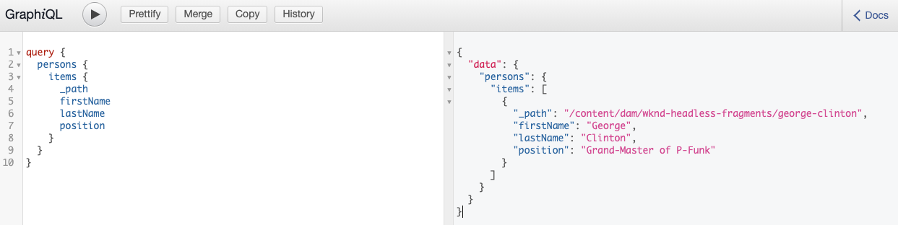

# Guide de Début rapide sans en-tête pour l&#39;accès et la diffusion de fragments de contenu {#accessing-delivering-content-fragments}

L’API REST Assets permet de gérer les fragments de contenu et l’API GraphQL permet une simple diffusion sans en-tête du contenu des fragments de contenu.

## Que sont les API REST GraphQL et Assets ? {#what-are-the-apis}

[Maintenant que vous avez créé des fragments de contenu,](create-content-fragment.md) vous pouvez utiliser AEM API pour les diffuser sans encombre.

* [L’](/help/assets/content-fragments/graphql-api-content-fragments.md) API GraphQL vous permet de créer des requêtes d’accès et de diffusion de fragments de contenu.
* [L’](/help/assets/content-fragments/assets-api-content-fragments.md) API Assets REST vous permet de créer et de modifier des fragments de contenu (et d’autres ressources).

Le reste de ce guide porte sur l&#39;accès GraphQL et la diffusion de fragments de contenu.

## Comment fournir un fragment de contenu à l’aide de GraphQL {#how-to-deliver-a-content-fragment}

Les architectes de l&#39;information devront concevoir des requêtes pour leurs points de terminaison canal afin de fournir du contenu. Ces requêtes ne doivent généralement être prises en compte qu&#39;une seule fois par point de terminaison par modèle. Pour les besoins de ce guide de prise en main, nous n&#39;aurons qu&#39;à en créer un.

1. Connectez-vous à AEM en tant que Cloud Service et dans le menu principal sélectionnez **Outils -> Ressources -> GraphQL**
   * Vous pouvez également ouvrir la page directement à `https://<host>:<port>/content/graphiql.html`.

1. GraphiQL est un éditeur de requêtes intégré au navigateur pour GraphQL. Vous pouvez l’utiliser pour créer des requêtes permettant de récupérer des fragments de contenu afin de les diffuser en mode JSON.
   * Le panneau de gauche vous permet de construire votre requête.
   * Le panneau de droite affiche les résultats.
   * L’éditeur de requêtes comprend la saisie du code et des touches d’accès rapide pour exécuter facilement la requête.
      

1. En supposant que le modèle que nous avons créé s&#39;appelle `person` avec les champs `firstName`, `lastName` et `position`, nous pouvons créer une requête simple pour récupérer le contenu de notre fragment de contenu.

   ```
   query {
     persons {
       items {
         _path
         firstName
         lastName
         position
       }
     }
   }
   ```

1. Entrez la requête dans le panneau de gauche.
   

1. Cliquez sur le bouton **Exécuter la Requête** ou utilisez la touche `Ctrl-Enter` et les résultats s’affichent sous la forme JSON dans le panneau de droite.
   

1. Cliquez sur le lien **Docs** en haut à droite de la page pour afficher la documentation contextuelle afin de vous aider à créer vos requêtes qui s’adaptent à vos propres modèles.
   

GraphQL permet aux requêtes structurées qui peuvent cible non seulement des ensembles de données spécifiques ou des objets de données individuels, mais peuvent également fournir des éléments spécifiques des objets, des résultats imbriqués, des offres prenant en charge les variables de requête, et bien plus encore.

GraphQL peut éviter les demandes d&#39;API itératives ainsi que la surdiffusion, et permet à la place la diffusion en masse de ce qui est exactement nécessaire pour le rendu en réponse à une seule requête d&#39;API. Le fichier JSON résultant peut être utilisé pour diffuser des données vers d’autres sites ou applications.

## Étapes suivantes {#next-steps}

C’est terminé ! Vous avez maintenant une compréhension de base de la gestion de contenu sans tête en AEM. Bien sûr, il y a beaucoup plus de ressources où vous pouvez creuser plus profondément pour une compréhension complète des fonctionnalités disponibles.

* **Navigateur**  de configuration - Pour plus d&#39;informations sur l&#39;AEM navigateur de configuration
* **[Fragments](/help/assets/content-fragments/content-fragments.md)**  de contenu - Pour plus d’informations sur la création et la gestion de fragments de contenu
* **[Prise en charge des fragments de contenu dans l’API](/help/assets/content-fragments/assets-api-content-fragments.md)**  HTTP AEM Assets - Pour plus d’informations sur l’accès direct au contenu AEM via l’API HTTP, via des opérations CRUD (création, lecture, mise à jour, suppression)
* **[API](/help/assets/content-fragments/graphql-api-content-fragments.md)**  GraphQL - Pour plus d&#39;informations sur la manière de diffuser des fragments de contenu sans encombre
