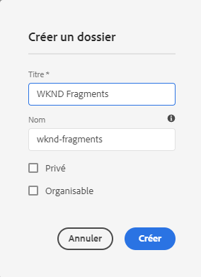
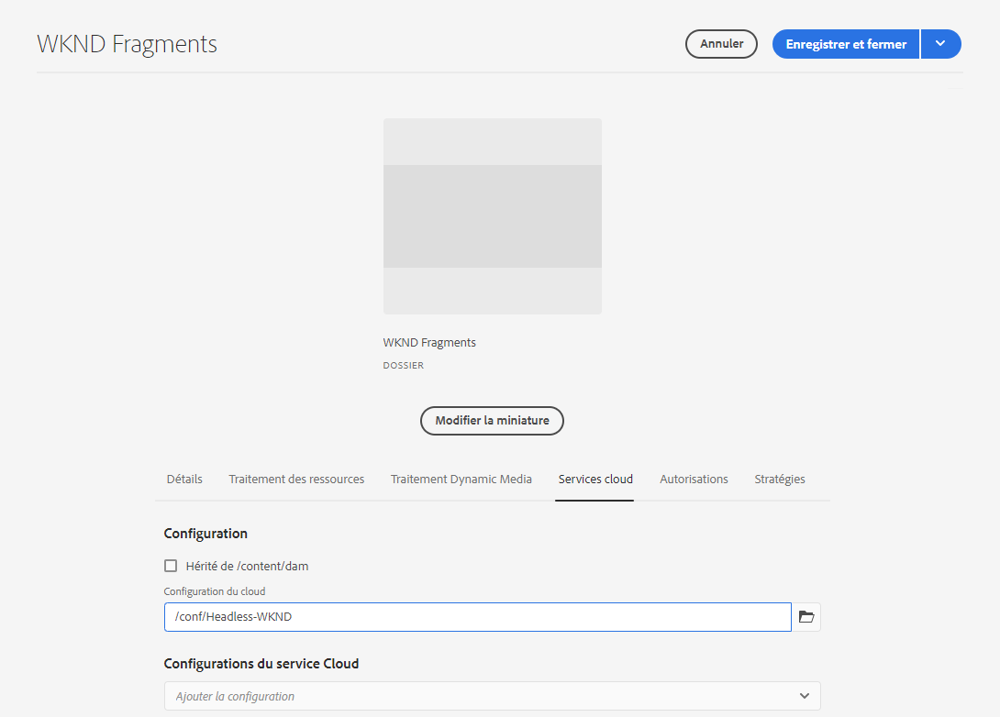
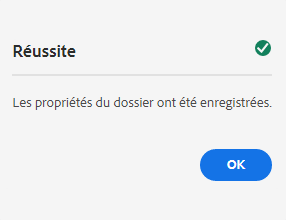

# Guide de Début rapide de création d’un dossier Ressources sans en-tête{#creating-an-assets-folder}

Les modèles de fragments de contenu définissent la structure des fragments de contenu. Les fragments de contenu sont ensuite stockés dans des dossiers de fichiers.

##  Qu’est-ce qu’un dossier Ressources ? {#what-is-an-assets-folder}

[Maintenant que vous avez créé des ](create-content-model.md) modèles de fragments de contenu qui définissent la structure souhaitée pour vos futurs fragments de contenu, vous êtes probablement ravi de créer des fragments.

Cependant, vous devez d’abord créer un dossier de fichiers dans lequel vous allez les stocker.

Les dossiers Assets sont utilisés pour [organiser les ressources de contenu traditionnelles](/help/assets/manage-digital-assets.md), telles que les images et les vidéos, ainsi que les fragments de contenu.

## Comment créer un dossier Ressources {#how-to-create-an-assets-folder}

Un administrateur n’a besoin de créer des dossiers qu’occasionnellement pour organiser le contenu au fur et à mesure de sa création. Pour les besoins de ce guide de prise en main, il suffit de créer un seul dossier.

1. Connectez-vous à AEM en tant que Cloud Service et dans le menu principal, sélectionnez **Navigation -> Ressources -> Fichiers**.
1. Appuyez ou cliquez sur **Créer -> Dossier**.
1. Indiquez un **titre** et un **nom** pour votre dossier.
   * Le **titre** doit être descriptif.
   * **Name** deviendra le nom du noeud dans le référentiel.
      * Elle sera générée automatiquement en fonction du titre et ajustée selon les [conventions d&#39;appellation AEM.](/help/implementing/developing/introduction/naming-conventions.md)
      * Il peut être ajusté si nécessaire.

   
1. Sélectionnez le dossier que vous venez de créer, puis **Propriétés** dans la barre d&#39;outils (ou utilisez le raccourci clavier `p` ).
1. Dans la fenêtre **Propriétés**, sélectionnez l&#39;onglet **Cloud Services**.
1. Pour la **Configuration du cloud** sélectionnez la configuration [que vous avez créée précédemment.](create-configuration.md)

   
1. Appuyez ou cliquez sur **Enregistrer et fermer**.
1. Appuyez ou cliquez sur **OK** dans la fenêtre de confirmation.

   

Vous pouvez créer des sous-dossiers supplémentaires dans le dossier que vous venez de créer. Les sous-dossiers hériteront de la configuration **Cloud** du dossier parent. Il peut toutefois être remplacé si vous souhaitez utiliser des modèles d’une autre configuration.

Si vous utilisez une structure de site localisée, vous pouvez [créer une racine de langue](/help/assets/translate-assets.md) sous votre nouveau dossier.

## Étapes suivantes {#next-steps}

Maintenant que vous avez créé un dossier pour vos fragments de contenu, vous pouvez passer à la quatrième partie du guide de prise en main et [créer des fragments de contenu.](create-content-fragment.md)

>[!TIP]
>
>Pour plus d’informations sur la gestion des fragments de contenu, voir la [documentation sur les fragments de contenu](/help/assets/content-fragments/content-fragments.md).
