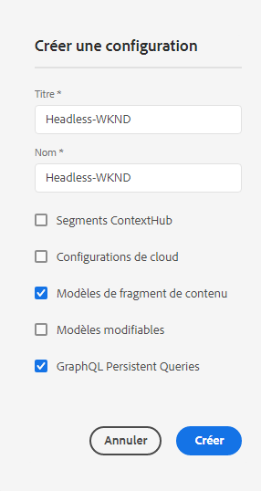

# Création d&#39;un guide de Début rapide sans en-tête de configuration {#creating-configuration}

Pour commencer à utiliser AEM sans tête en tant que Cloud Service, vous devez créer une configuration.

## Qu’est-ce qu’une configuration ? {#what-is-a-configuration}

Le navigateur de configuration fournit une API de configuration générique, une structure de contenu, un mécanisme de résolution pour les configurations dans AEM.

Dans le contexte d’une gestion de contenu sans tête en AEM, pensez à une configuration en tant que lieu de travail dans AEM où vous pouvez créer vos modèles de contenu, qui définissent la structure de votre futur contenu et de vos fragments de contenu. Vous pouvez avoir plusieurs configurations pour séparer ces modèles.

Si vous connaissez les modèles de page [dans une implémentation AEM pile complète,](/help/sites-cloud/authoring/features/templates.md) l’utilisation des configurations pour la gestion des modèles de contenu est similaire.

## Comment créer une configuration {#how-to-create-a-configuration}

Un administrateur n’a besoin de créer une configuration qu’une seule fois, ou très rarement lorsqu’un nouvel espace de travail est nécessaire pour organiser vos modèles de contenu. Pour les besoins de ce guide de prise en main, il suffit de créer une seule configuration.

1. Connectez-vous à AEM en tant que Cloud Service et sélectionnez **Outils -> Général -> Navigateur de configuration** dans le menu principal.
1. Indiquez un **Titre** et un **Nom** pour votre configuration.
   * Le **titre** doit être descriptif.
   * **Name** deviendra le nom du noeud dans le référentiel.
      * Elle sera générée automatiquement en fonction du titre et ajustée selon les [conventions d&#39;appellation AEM.](/help/implementing/developing/introduction/naming-conventions.md)
      * Il peut être ajusté si nécessaire.
1. Vérifiez les options suivantes :
   * **Modèles de fragment de contenu**
   * **Requêtes persistantes GraphQL**

   

1. Appuyez ou cliquez sur **Créer**

Vous pouvez créer plusieurs configurations si nécessaire. Les configurations peuvent également être imbriquées.

>!![NOTE]
Les options de configuration en plus des **Modèles de fragments de contenu** et **Requêtes persistantes GraphQL** peuvent être nécessaires en fonction de vos exigences d’implémentation.

## Étapes suivantes {#next-steps}

Grâce à cette configuration, vous pouvez maintenant passer à la deuxième partie du guide de prise en main et [créer des modèles de fragments de contenu.](create-content-model.md)

>!![TIP]
Pour obtenir des détails complets sur le navigateur de configuration, [consultez la documentation du navigateur de configuration.](/help/implementing/developing/introduction/configurations.md)
