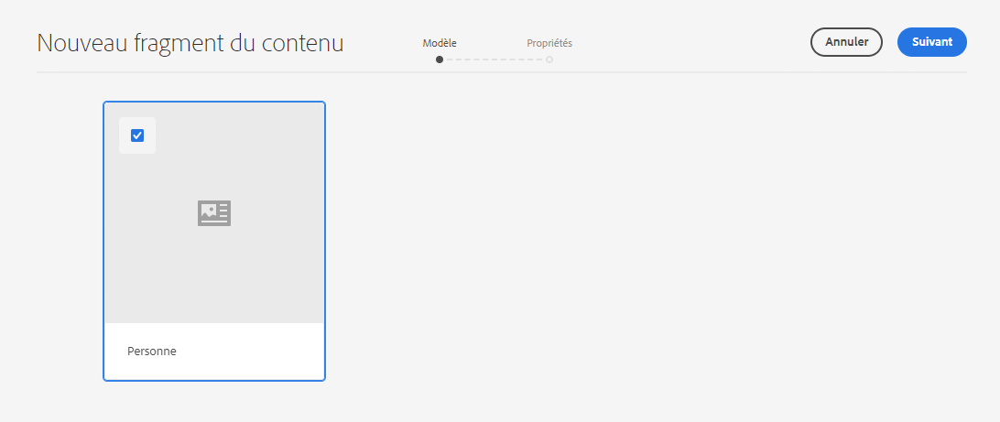
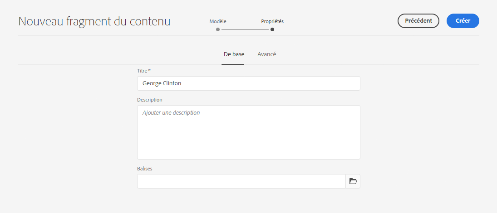
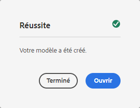
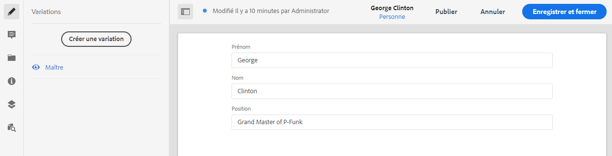

# Guide de Début rapide sans en-tête de création de fragments de contenu {#creating-content-fragments}

Les fragments de contenu vous permettent de concevoir, de créer, de traiter et d’utiliser du contenu indépendant des pages qui peut être diffusé sans encombre par AEM.

## Que sont les fragments de contenu ? {#what-are-content-fragments}

[Maintenant que vous avez créé un ](create-assets-folder.md) dossier de ressources dans lequel vous pouvez stocker vos fragments de contenu, vous pouvez maintenant créer les fragments !

Les fragments de contenu vous permettent de concevoir, de créer, de traiter et de publier du contenu indépendant des pages. Ils vous permettent de préparer du contenu prêt à être utilisé à plusieurs emplacements et sur plusieurs canaux.

Les fragments de contenu contiennent du contenu structuré et peuvent être diffusés au format JSON.

## Comment créer un fragment de contenu {#how-to-create-a-content-fragment}

Les auteurs de contenu créeront tout nombre de fragments de contenu pour représenter le contenu qu’ils créent. Ce sera leur principale tâche en AEM. Pour les besoins de ce guide de prise en main, nous n&#39;aurons qu&#39;à en créer un.

1. Connectez-vous à AEM en tant que Cloud Service et dans le menu principal, sélectionnez **Navigation -> Ressources**.
1. Appuyez ou cliquez sur le dossier [que vous avez créé précédemment.](create-assets-folder.md)
1. Appuyez ou cliquez sur **Créer -> Fragment de contenu**.
1. La création d’un fragment de contenu est présentée sous la forme d’un assistant en deux étapes. Sélectionnez d’abord le modèle à utiliser pour créer votre fragment de contenu et appuyez ou cliquez sur **Suivant**.
   * Les modèles disponibles dépendent de la [**Configuration du cloud** que vous avez définie pour le dossier de ressources](create-assets-folder.md) dans lequel vous créez le fragment de contenu.
   * Si vous recevez le message `We could not find any models`, vérifiez la configuration de votre dossier de ressources.

   
1. Indiquez un **titre**, **description** et **balises** si nécessaire, puis appuyez ou cliquez sur **Créer**.

   
1. Appuyez ou cliquez sur **Ouvrir** dans la fenêtre de confirmation.

   
1. Fournissez les détails du fragment de contenu dans l’éditeur de fragments de contenu.

   
1. Cliquez ou appuyez sur **Enregistrer**.

Les fragments de contenu peuvent faire référence à d’autres fragments de contenu, ce qui permet d’obtenir une structure de contenu imbriqué si nécessaire.

Les fragments de contenu peuvent également référencer d’autres ressources dans AEM. [Ces ressources doivent être stockées dans ](/help/assets/manage-digital-assets.md) AEM avant de créer un fragment de contenu référencé.

## Étapes suivantes {#next-steps}

Maintenant que vous avez créé un fragment de contenu, vous pouvez passer à la dernière partie du guide de prise en main et [créer des demandes d&#39;API pour accéder aux fragments de contenu et les diffuser.](create-api-request.md)

>!![TIP]
Pour plus d’informations sur la gestion des fragments de contenu, voir la [documentation sur les fragments de contenu](/help/assets/content-fragments/content-fragments.md).
