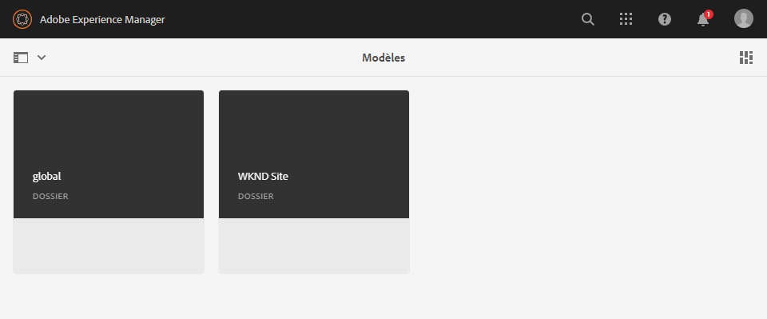
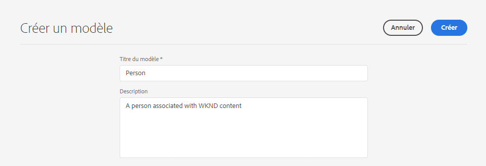
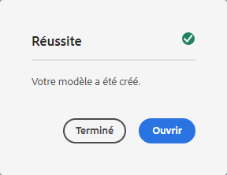
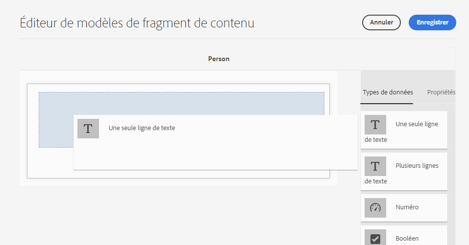
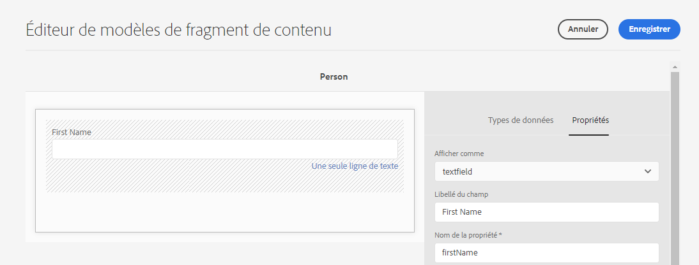
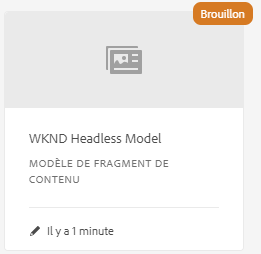
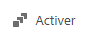
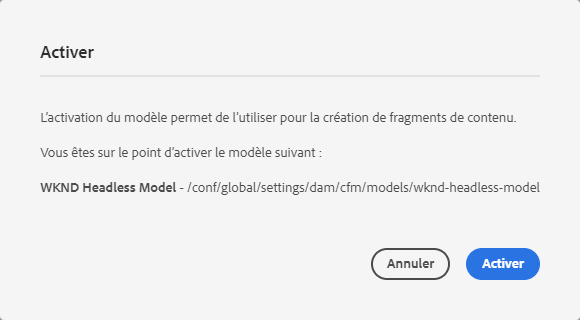
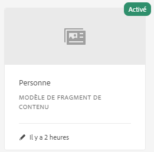

# Guide de Début rapide sans en-tête de création de modèles de fragments de contenu {#creating-content-fragment-models}

Les modèles de fragments de contenu définissent la structure du contenu que vous allez créer et diffuser à l’aide de fonctionnalités AEM sans en-tête.

## Que sont les modèles de fragments de contenu ? {#what-are-content-fragment-models}

[Maintenant que vous avez créé une configuration,](create-configuration.md) vous pouvez l’utiliser pour créer des modèles de fragments de contenu.

Les modèles de fragments de contenu définissent la structure des données et du contenu que vous allez créer et gérer dans AEM. Ils servent d&#39;échafaudage à votre contenu. Lorsque vous choisissez de créer du contenu, les auteurs sélectionneront dans les modèles de fragment de contenu que vous définissez, ce qui les guide dans la création de contenu.

## Création d’un modèle de fragment de contenu {#how-to-create-a-content-fragment-model}

Un architecte de l&#39;information ne réaliserait ces tâches que de façon sporadique, car de nouveaux modèles sont nécessaires. Pour les besoins de ce guide de prise en main, il suffit de créer un seul modèle.

1. Connectez-vous à AEM en tant que Cloud Service et dans le menu principal, sélectionnez **Outils -> Ressources -> Modèles de fragment de contenu**.
1. Appuyez ou cliquez sur le dossier créé en créant votre configuration.

   
1. Appuyez ou cliquez sur **Créer**.
1. Indiquez un **titre du modèle** et une **description**.

   
1. Dans la fenêtre de confirmation, appuyez ou cliquez sur **Ouvrir** pour configurer votre modèle.

   
1. A l&#39;aide de l&#39;**éditeur de modèle de fragment de contenu**, créez votre modèle de fragment de contenu en faisant glisser et en déposant les champs de la colonne **Types de données**.

   

1. Une fois que vous avez placé un champ, vous devez configurer ses propriétés. L’éditeur bascule automatiquement sur l’onglet **Propriétés** pour le champ ajouté où vous pouvez fournir les champs obligatoires.

   
1. Lorsque vous avez terminé de créer votre modèle, appuyez ou cliquez sur **Enregistrer**. Le modèle nouvellement créé est enregistré en mode **Brouillon**.

   
1. Le modèle doit être activé pour pouvoir l&#39;utiliser. Sélectionnez le modèle que vous venez de créer, puis appuyez ou cliquez sur **Activer**.

   
1. Confirmez l&#39;activation du modèle en appuyant ou en cliquant sur **Activer** dans la boîte de dialogue de confirmation.

   
1. Le modèle est désormais activé et prêt à l’emploi.

   

L&#39;**éditeur de modèle de fragment de contenu** prend en charge de nombreux types de données différents, tels que des champs de texte simples, des références de ressources, des références à d&#39;autres modèles et des données JSON.

Vous pouvez créer plusieurs modèles. Les modèles peuvent référencer d’autres fragments de contenu. Utilisez [configurations](create-configuration.md) pour organiser vos modèles.

## Étapes suivantes {#next-steps}

Maintenant que vous avez défini les structures de vos fragments de contenu en créant des modèles, vous pouvez passer à la troisième partie du guide de prise en main et [créer des dossiers dans lesquels vous stockerez les fragments eux-mêmes.](create-assets-folder.md)

>!![TIP]
Pour plus d’informations sur les modèles de fragments de contenu, voir la [documentation sur les modèles de fragments de contenu](/help/assets/content-fragments/content-fragments-models.md).
