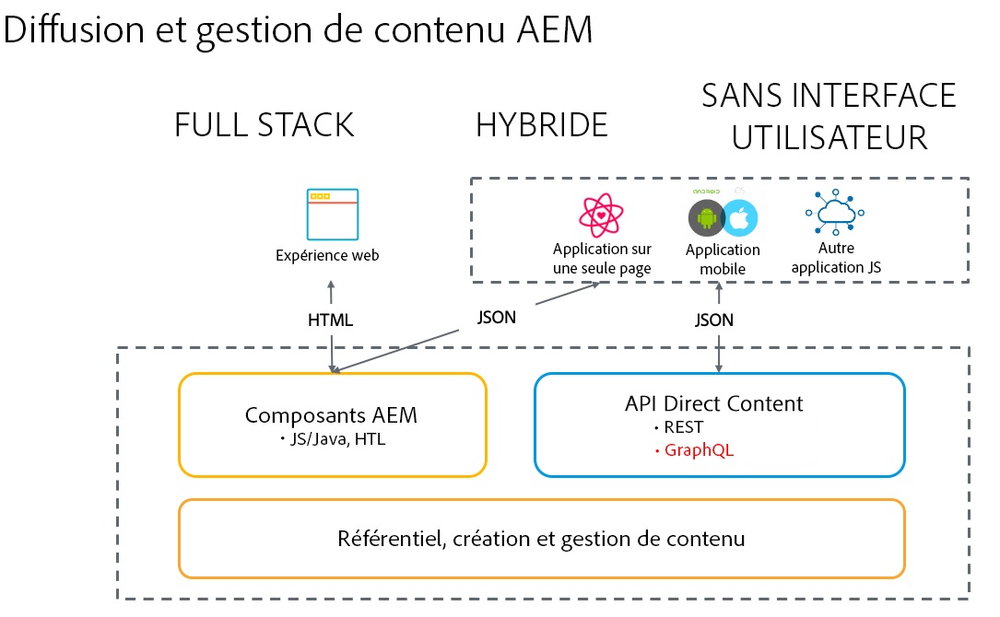

# Un développement sans tête pour l&#39;AEM Sites en tant que Cloud Service {#headless-development}

Grâce à des fonctionnalités puissantes telles que les modèles de contenu, les fragments de contenu et l’API GraphQL, AEM en tant que Cloud Service vous permet de gérer vos expériences de manière centralisée et de les diffuser sur plusieurs canaux.

## Présentation {#overview}

L’implémentation sans tête devient de plus en plus importante pour fournir des expériences à votre audience, où qu’elles se trouvent et quel que soit son canal.

L’implémentation sans en-tête interrompt la gestion des pages et des composants, comme c’est le cas dans les solutions hybrides et de pile complètes, et se concentre sur la création de fragments de contenu réutilisables et neutres en canal, ainsi que sur leur diffusion entre canaux. Il s’agit d’un modèle de développement moderne et dynamique destiné à la mise en oeuvre d’expériences Web.

## aem en tant que Cloud Service et sans en-tête {#aem-headless}

L&#39;AEM en tant que Cloud Service est un outil flexible pour le modèle d&#39;implémentation sans tête en offrant trois services puissants :

1. Modèles de contenu
   * Les modèles de contenu sont une représentation structurée du contenu.
   * Elles sont définies par des architectes d’informations dans l’éditeur de modèle de fragment de contenu AEM.
   * Les modèles de contenu servent de base aux fragments de contenu.
1. Fragments de contenu
   * Les fragments de contenu sont des instanciations de modèles de contenu.
   * Ceux-ci sont créés par les auteurs de contenu à l’aide de l’éditeur AEM Fragment de contenu.
   * Ils sont stockés dans AEM Assets et gérés dans l’interface utilisateur d’administration des ressources.
1. API de contenu pour la diffusion
   * L’API AEM GraphQL prend en charge la diffusion de fragments de contenu.
   * L’API REST AEM Assets prend en charge les opérations CRUD de fragment de contenu.
   * La diffusion directe de contenu est également possible avec l&#39;exportation JSON du composant principal de fragment de contenu [.](https://docs.adobe.com/content/help/fr-FR/experience-manager-core-components/using/components/content-fragment-component.html)

## Guides de prise en main sans en-tête {#getting-started}

Les guides de prise en main sans en-tête proposent un chemin simple pour la création, la gestion et la diffusion d’expériences en utilisant AEM comme Cloud Service en cinq étapes. Chaque guide s’appuie sur le précédent ; il est donc recommandé de les explorer en profondeur et dans l’ordre.

1. [Création d’une configuration](getting-started/create-configuration.md)
1. [Création d’un modèle de fragment de contenu](getting-started/create-content-model.md)
1. [Création d’un dossier Ressources](getting-started/create-assets-folder.md)
1. [Création d’un fragment de contenu](getting-started/create-content-fragment.md)
1. [Accès et diffusion de fragments de contenu](getting-started/create-api-request.md)

## Public {#audience}

Les tâches décrites dans les [Guides de prise en main sans en-tête](#getting-started) sont nécessaires pour une démonstration de base de bout en bout des capacités AEM sans en-tête. Toute personne disposant d’un accès administrateur à une instance de AEM de test peut suivre ces guides pour comprendre la diffusion sans tête en AEM, même si une personne ayant une expérience de développement est idéale.

Cependant, dans une situation de production, les tâches seront exécutées par des personnes différentes à un nombre variable de fois. Par exemple :

* **Les** administrateurs devront configurer la configuration initiale et la structure de dossiers pour le contenu normalement une seule fois ou de manière sporadique.
* **Les** architectures de l&#39;information ajouteront généralement de nouveaux modèles au fur et à mesure que les besoins de l&#39;organisation évolueront.
* **Les** auteurs de contenu créeront continuellement de nouveaux contenus sous la forme de fragments de contenu en fonction des modèles définis par les architectes.

Les guides de prise en main sans en-tête indiquent qui effectuerait généralement les tâches décrites et à quelle fréquence.

## Étape suivante {#next-step}

Prêt à en apprendre davantage ? Commencez ensuite par lire la première partie du Guide de prise en main sans en-tête : [Création d&#39;une configuration.](getting-started/create-configuration.md)
