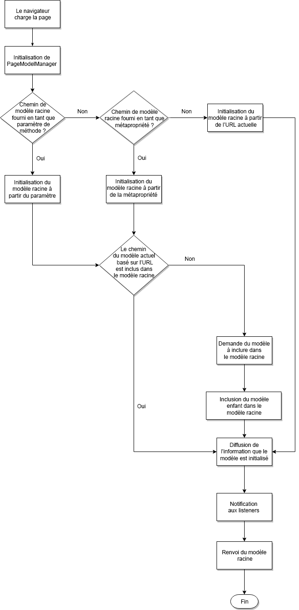

# Plan directeur d’applications sur une seule page (SPA) {#spa-blueprint}

La SPA doit respecter certaines exigences afin que l’auteur puisse utiliser l’éditeur de SPA AEM pour modifier son contenu.

{{ue-over-spa}}

## Présentation {#introduction}

Ce document décrit le contrat général que tout framework SPA devrait respecter (c’est-à-dire le type de calque de support AEM) afin de mettre en œuvre des composants SPA modifiables dans AEM.

Pour que l’auteur puisse utiliser l’éditeur de page AEM pour modifier les données exposées par un framework d’applications sur une seule page, un projet doit être en mesure d’interpréter la structure du modèle qui représente la sémantique des données stockées pour une application dans le référentiel AEM. Pour atteindre cet objectif, deux bibliothèques indépendantes du framework sont fournies : `PageModelManager` et `ComponentMapping`.

>[!NOTE]
>
>Les exigences suivantes sont indépendantes du framework. Si ces conditions sont remplies, un calque spécifique au framework composé de modules, composants et services peut être fourni.
>
>**Ces exigences sont déjà respectées pour les frameworks React et Angular dans AEM.** Les exigences de ce plan directeur ne sont pertinentes que si vous souhaitez implémenter un autre framework pour une utilisation avec AEM.

>[!CAUTION]
>
>Bien que les fonctionnalités de SPA dans AEM soient indépendantes du framework, seuls les frameworks React et Angular sont pris en charge actuellement.

## PageModelManager {#pagemodelmanager}

La bibliothèque `PageModelManager` est fournie sous la forme d’un package NPM destiné à être utilisé par un projet de SPA. Il accompagne l’application sur une seule page et fait office de gestionnaire de modèles de données.

Au nom de l’application sur une seule page, il extrait la récupération et la gestion de la structure JSON qui représente la structure de contenu proprement dite. Il assure également la synchronisation avec l’application sur une seule page, en lui faisant savoir à quel moment un nouveau rendu de ses composants doit être effectué.

Voir le package NPM [@adobe/aem-spa-model-manager](https://www.npmjs.com/package/@adobe/aem-spa-model-manager)

Lors de l’initialisation de `PageModelManager`, la bibliothèque commence par charger le modèle racine fourni de l’application (par l’intermédiaire d’un paramètre, d’une méta-propriété ou de l’URL active). Si la bibliothèque identifie que le modèle de la page active ne fait pas partie du modèle racine, elle le récupère et l’inclut comme modèle d’une page enfant.



### ComponentMapping {#componentmapping}

Le module `ComponentMapping` est fourni au projet front-end sous la forme d’un package NPM. Il stocke les composants front-end et permet à la SPA de les mettre en correspondance avec les types de ressources AEM. Cela permet une résolution dynamique des composants lors de l’analyse du modèle JSON de l’application.

Chaque élément présent dans le modèle contient un champ `:type` qui expose un type de ressource AEM. Une fois monté, le composant front-end peut être rendu à l’aide du fragment de modèle reçu des bibliothèques associées.

#### Mappage dynamique de modèle à composant {#dynamic-model-to-component-mapping}

Vous trouverez des explications sur le mappage dynamique de modèle à composant dans le SDK SPA JavaScript pour AEM dans l’article [Mappage dynamique de modèle à composant pour SPA](model-to-component-mapping.md).

### Couche spécifique au framework {#framework-specific-layer}

Une troisième couche doit être mise en œuvre pour chaque framework de front-end. Cette troisième bibliothèque assure l’interaction avec les bibliothèques sous-jacentes et fournit une série de points d’entrée bien intégrés et faciles à utiliser pour interagir avec le modèle de données.

Le reste de ce document, supposé être indépendant du framework, décrit les exigences de cette couche spécifique au framework intermédiaire. En respectant les exigences suivantes, une couche spécifique au framework peut être fournie pour que les composants du projet interagissent avec les bibliothèques sous-jacentes qui assurent la gestion du modèle de données.

## Concepts généraux {#general-concepts}

### Modèle de page {#page-model}

La structure de contenu de la page est stockée dans AEM. Le modèle de la page est utilisé pour mapper et instancier les composants de l’application sur une seule page (SPA). Les développeurs d’applications sur une seule page créent des composants SPA qu’ils mappent sur des composants AEM. Ils utilisent pour cela le type de ressource (ou le chemin d’accès au composant AEM) comme clé unique.

Les composants de la SPA doivent être synchronisés avec le modèle de page et mis à jour avec toute modification apportée au contenu. Un modèle qui a recours à des composants dynamiques doit être utilisé pour instancier des composants à la volée, suivant la structure de modèle de page fournie.

### Champs Meta {#meta-fields}

Le modèle de page utilise l’exporteur de modèle JSON, lui-même basé sur l’API [Sling Model](https://sling.apache.org/documentation/bundles/models.html). Les modèles Sling exportables exposent la liste de champs suivante afin de permettre aux bibliothèques sous-jacentes d’interpréter le modèle de données :

* `:type` : type de ressource AEM (par défaut = type de ressource)
* `:children` : enfants hiérarchiques de la ressource actuelle. Les enfants ne font pas partie du contenu interne de la ressource actuelle (on les trouve sur les éléments qui représentent une page)
* `:hierarchyType` : type hiérarchique d’une ressource. Actuellement, `PageModelManager` prend en charge le type de page.

* `:items` : ressources de contenu enfant de la ressource actuelle (structure imbriquée, présente uniquement sur les conteneurs)
* `:itemsOrder` : liste triée des enfants. L’objet carte JSON ne garantit pas l’ordre de ses champs. En disposant de la carte et du tableau actif, le consommateur de l’API bénéficie des avantages des deux structures.
* `:path` : chemin d’accès au contenu d’un élément (présent sur les éléments qui représentent une page).

Voir aussi [Prise en main d’AEM Content Services](https://experienceleague.adobe.com/docs/experience-manager-learn/getting-started-with-aem-headless/overview.html?lang=fr).

### Module spécifique au framework {#framework-specific-module}

La séparation des préoccupations facilite la mise en œuvre des projets. Il est donc utile de fournir un package spécifique à NPM. Ce package assure l’agrégation et l’exposition des modules, services et composants de base. Ces composants doivent encapsuler la logique de gestion des modèles de données et donner accès aux données attendues par le composant du projet. Le module assure également l’exposition transitoire des points d’entrée utiles des bibliothèques sous-jacentes.

Pour faciliter l’interopérabilité des bibliothèques, Adobe recommande que le module spécifique au framework regroupe les bibliothèques suivantes. Si nécessaire, la couche peut encapsuler et adapter les API sous-jacentes avant de les exposer au projet.

* [@adobe/aem-spa-model-manager](https://www.npmjs.com/package/@adobe/aem-spa-model-manager)
* [@adobe/aem-spa-component-mapping](https://www.npmjs.com/package/@adobe/aem-spa-component-mapping)

#### Mises en œuvre {#implementations}

#### React {#react}

Module npm : [@adobe/aem-response-editable-components](https://www.npmjs.com/package/@adobe/aem-react-editable-components)

#### Angular {#angular}

Module npm : [@adobe/aem-angular-editable-components](https://www.npmjs.com/package/@adobe/aem-angular-editable-components)

## Services et composants principaux {#main-services-and-components}

Les entités suivantes devraient être mises en œuvre conformément aux directives spécifiques à chaque framework. La mise en œuvre peut varier considérablement en fonction de l’architecture du framework, mais les fonctionnalités décrites doivent être fournies.

### Le fournisseur de modèles {#the-model-provider}

Les composants du projet doivent déléguer l’accès aux fragments d’un modèle à un fournisseur de modèles. Le fournisseur de modèles assure alors l’écoute des modifications apportées au fragment spécifié du modèle et le retour du modèle mis à jour au composant délégateur.

Le fournisseur de modèles doit pour cela être inscrit auprès de [`PageModelManager`](#pagemodelmanager). Ensuite, lorsqu’une modification se produit, il reçoit et transmet les données mises à jour au composant délégateur. Par convention, la propriété mise à la disposition du composant délégateur qui transportera le fragment de modèle est nommée `cqModel`. L’implémentation peut fournir cette propriété au composant, mais doit tenir compte d’aspects tels que l’intégration à l’architecture du framework, la capacité de découverte et la facilité d’utilisation.

### Le décorateur HTML du composant {#the-component-html-decorator}

Le décorateur du composant assure la décoration du code HTML externe de l’élément de chaque instance de composant avec une série d’attributs de données et de noms de classe attendus par l’éditeur de page.

#### Déclaration de composant {#component-declaration}

Les métadonnées suivantes doivent être ajoutées à l’élément HTML externe produit par le composant du projet. Elles permettent à l’éditeur de page de récupérer la configuration d’édition correspondante.

* `data-cq-data-path` : chemin d’accès à la ressource relative à `jcr:content`

#### Modification de la déclaration de capacité et de l’espace réservé {#editing-capability-declaration-and-placeholder}

Les métadonnées et noms de classe suivants doivent être ajoutés à l’élément HTML externe produit par le composant du projet. Elles permettent à l’éditeur de page d’offrir des fonctionnalités associées.

* `cq-placeholder` : nom de classe qui identifie l’espace réservé pour un composant vide
* `data-emptytext` : libellé à afficher par le recouvrement lorsqu’une instance de composant est vide

**Espace réservé pour les composants vides**

Chaque composant doit être étendu avec une fonctionnalité pour décorer l’élément HTML externe avec des attributs de données et des noms de classe spécifiques aux espaces réservés et aux recouvrements associés lorsque le composant est identifié comme vide.

**À propos de l’état vide d’un composant**

* Le composant est-il logiquement vide ?
* Quel libellé devrait être affiché par le recouvrement lorsque le composant est vide ?

### Conteneur {#container}

Un conteneur est un composant conçu pour contenir des composants enfants et en effectuer le rendu. Pour ce faire, le conteneur effectue une itération sur les propriétés `:itemsOrder`, `:items` et `:children` de son modèle.

Le conteneur obtient dynamiquement les composants enfants à partir du magasin de la bibliothèque [`ComponentMapping`](#componentmapping). Le conteneur étend ensuite le composant enfant avec les fonctionnalités du fournisseur de modèles, puis l’instancie.

### Page {#page}

Le composant `Page` étend le composant `Container`. Un conteneur est un composant conçu pour contenir des composants enfants et effectuer le rendu des composants enfants, y compris les pages enfants. Pour ce faire, le conteneur effectue une itération sur les propriétés `:itemsOrder`, `:items` et `:children` de son modèle. Le composant `Page` récupère dynamiquement les composants enfants à partir du magasin de la bibliothèque [`ComponentMapping`](#componentmapping). `Page` assure l’instanciation des composants enfants.

### Grille réactive {#responsive-grid}

Le composant Grille réactive est un conteneur. Il contient une variante spécifique du fournisseur de modèles qui représente ses colonnes. La grille réactive et ses colonnes assurent la décoration de l’élément HTML externe du composant du projet avec les noms de classe spécifiques contenus dans le modèle.

Le composant Grille réactive doit être fourni prémappé à son homologue AEM, car ce composant est complexe et rarement personnalisé.

#### Champs de modèle spécifiques {#specific-model-fields}

* `gridClassNames:` noms de classes fournis pour la grille réactive
* `columnClassNames:` noms de classes fournis pour la colonne réactive

Voir également la ressource npm [@adobe/aem-response-editable-components](https://www.npmjs.com/package/@adobe/aem-react-editable-components)

#### Espace réservé de la grille réactive {#placeholder-of-the-responsive-grid}

Le composant SPA est mappé sur un conteneur graphique, tel que Grille réactive, et doit ajouter un espace réservé enfant virtuel lorsque la création du contenu est en cours. Lorsque le contenu de l’application sur une seule page est créé par l’éditeur de page, il est incorporé dans ce dernier à l’aide d’un iFrame et l’attribut `data-cq-editor` est ajouté au nœud de document de ce contenu. Lorsque l’attribut `data-cq-editor` est présent, le conteneur doit inclure un HTMLElement pour représenter la zone avec laquelle l’auteur interagit lors de l’insertion d’un nouveau composant dans la page.

Par exemple :

```html
<div data-cq-data-path={"path/to/the/responsivegrid/*"} className="new section aem-Grid-newComponent"/>
```

>[!NOTE]
>
>Les noms de classe utilisés dans l’exemple sont actuellement requis par l’éditeur de page.
>
>* `"new section"` : indique que l’élément en cours est l’espace réservé du conteneur.
>* `"aem-Grid-newComponent"` : normalise le composant pour la création de dispositions.
>

#### Mappage de composant {#component-mapping}

La bibliothèque [`Component Mapping`](#componentmapping) sous-jacente et sa fonction `MapTo` peuvent être encapsulées et étendues afin de fournir les fonctionnalités relatives à la configuration d’édition fournie avec la classe de composants actuelle.

```javascript
const EditConfig = {

    emptyLabel: 'My Component',

    isEmpty: function() {
        return !this.props || !this.props.cqModel || this.props.cqModel.isEmpty;
    }
};

class MyComponent extends Component {

    render() {
        return <div className={'my-component'}></div>;
    }
}

MapTo('component/resource/path')(MyComponent, EditConfig);
```

Dans l’implémentation ci-dessus, le composant de projet est étendu avec la fonctionnalité de vide avant d’être enregistré dans le magasin [Mappage de composant](#componentmapping). Il faut pour cela encapsuler et étendre la bibliothèque [`ComponentMapping`](#componentmapping) afin d’introduire la prise en charge de l’objet de configuration `EditConfig` :

```javascript
/**
 * Configuration object in charge of providing the necessary data expected by the page editor to initiate the authoring. The provided data is decorating the associated component
 *
 * @typedef {{}} EditConfig
 * @property {String} [dragDropName]       If defined, adds a specific class name enabling the drag and drop functionality
 * @property {String} emptyLabel           Label to be displayed by the placeholder when the component is empty. Optionally returns an empty text value
 * @property {function} isEmpty            Should the component be considered empty. The function is called using the context of the wrapper component giving you access to the component model
 */

/**
 * Map a React component with the given resource types. If an {@link EditConfig} is provided the <i>clazz</i> is wrapped to provide edition capabilities on the AEM Page Editor
 *
 * @param {string[]} resourceTypes                      - List of resource types for which to use the given <i>clazz</i>
 * @param {class} clazz                                 - Class to be instantiated for the given resource types
 * @param {EditConfig} [editConfig]                     - Configuration object for enabling the edition capabilities
 * @returns {class}                                     - The resulting decorated Class
 */
ComponentMapping.map = function map (resourceTypes, clazz, editConfig) {};
```

## Contrat avec l’éditeur de page {#contract-with-the-page-editor}

Les composants de projet doivent générer au minimum les attributs de données suivants pour permettre à l’éditeur d’interagir avec eux.

* `data-cq-data-path` : chemin d’accès relatif du composant, tel qu’il est fourni par le `PageModel` (`"root/responsivegrid/image"`, par exemple). Cet attribut ne doit pas être ajouté aux pages.

En résumé, pour pouvoir être identifié comme modifiable par l’éditeur de page, un composant de projet doit respecter le contrat suivant :

* Fournir les attributs attendus pour associer une instance de composant front-end à une ressource AEM.
* Fournir la série attendue d’attributs et de noms de classe qui permet de créer des espaces réservés vides.
* Fournir les noms de classe attendus qui autorisent le déplacement des actifs.

### Structure d’élément HTML standard {#typical-html-element-structure}

Le fragment suivant illustre la représentation HTML type d’une structure de contenu de page. Voici quelques points importants :

* L’élément de grille réactive contient les noms de classe, précédés de `aem-Grid--`
* L’élément de colonne réactive contient les noms de classe, précédés de `aem-GridColumn--`
* Une grille réactive, qui est également la colonne d’une grille parent, est enveloppée de telle sorte que les deux préfixes précédents n’apparaissent pas sur le même élément
* Les éléments correspondant à des ressources modifiables possèdent une propriété `data-cq-data-path`. Consultez la section [Contrat avec l’éditeur de page](#contract-with-the-page-editor) de ce document.

```javascript
<div data-cq-data-path="/content/page">
    <div class="aem-Grid aem-Grid--12 aem-Grid--default--12">
        <div class="aem-container aem-GridColumn aem-GridColumn--default--12" data-cq-data-path="/content/page/jcr:content/root/responsivegrid">
            <div class="aem-Grid aem-Grid--12 aem-Grid--default--12">
                <div class="cmp-image cq-dd-image aem-GridColumn aem-GridColumn--default--12" data-cq-data-path="/root/responsivegrid/image">
                    
                </div>
            </div>
        </div>
    </div>
</div>
```

## Navigation et routage {#navigation-and-routing}

L’application assure le routage. Le développeur front-end doit d’abord implémenter un composant Navigation (mappé à un composant de navigation AEM). Ce composant doit assurer le rendu des liens URL à utiliser avec une série de chemins d’accès qui afficheront ou masqueront des fragments de contenu.

La bibliothèque [`PageModelManager`](#pagemodelmanager) sous-jacente et son module [`ModelRouter`](routing.md) (activé par défaut) assurent la prérécupération et l’accès au modèle associé à un chemin de ressource donné.

Ces deux entités se rapportent à la notion de routage, mais [`ModelRouter`](routing.md) assure uniquement le chargement de [`PageModelManager`](#pagemodelmanager) avec un modèle de données structuré en synchronisation avec l’état actuel de l’application.

Consultez l’article [Routage de modèle de SPA](routing.md) pour plus d’informations.

## SPA en action {#spa-in-action}

Découvrez comment fonctionne une SPA simple et testez-en une en consultant les documents suivants :

* [Prise en main des SPA dans AEM avec React](getting-started-react.md).
* [Prise en main des SPA dans AEM avec Angular](getting-started-angular.md).

## Informations complémentaires {#further-reading}

Pour plus d’informations sur les applications d’une seule page dans AEM, consultez les documents suivants :

* [Présentation de l’éditeur d’application sur une seule page](editor-overview.md) pour un aperçu de ces applications dans AEM et du modèle de communication
