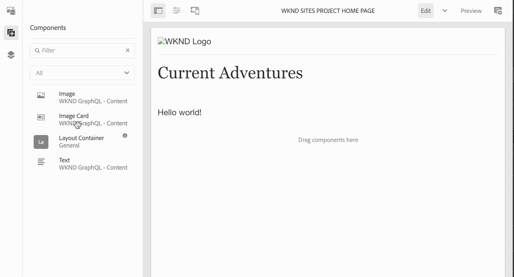

# Composants composites dans les SPA {#composite-components-in-spas}

Les composants composites exploitent la nature modulaire des composants AEM en combinant plusieurs composants de base pour en constituer un seul. Le cas d’utilisation courant d’un composant composite est celui du composant de carte, composé d’une combinaison des composants image et texte.

Lorsque les composants composites sont correctement implémentés dans la structure de l’éditeur d’application d’une seule page (SPA) d’AEM, les auteurs de contenu peuvent effectuer un glisser-déposer de ces composants comme s’ils le feraient pour d’autres, tout en étant en mesure de modifier individuellement chaque composant constituant le composant composite.

Cet article explique comment ajouter un composant composite à votre application monopage pour travailler en toute transparence avec l’éditeur d’application monopage AEM.

{{ue-over-spa}}

## Cas d’utilisation {#use-case}

Cet article utilise le composant de carte type comme cas d’utilisation. Les cartes sont des éléments d’interface utilisateur courants pour de nombreuses expériences digitales. Elles sont généralement constituées d’une image et de texte ou d’une légende associés. La personne chargée de créer du contenu souhaite pouvoir faire un glisser-déposer de l’ensemble de la carte, mais aussi modifier individuellement l’image de la carte et personnaliser le texte associé.

## Prérequis {#prerequisites}

Les modèles suivants, qui concernent la prise en charge des cas d’utilisation des composants composites, nécessitent les conditions préalables suivantes.

* Votre instance de développement AEM s’exécute localement sur le port 4502 avec un exemple de projet.
* Vous disposez d’une application React externe opérationnelle [activée pour la modification dans AEM](editing-external-spa.md).
* L’application React est chargée dans l’éditeur AEM [à l’aide du composant RemotePage](remote-page.md).

## Ajout de composants composites à une SPA {#adding-composite-components}

Il existe trois modèles différents pour mettre en œuvre votre composant composite en fonction de l’implémentation de la SPA dans AEM.

* [Le composant n’existe pas dans votre projet AEM](#component-does-not-exist).
* [Le composant existe dans votre projet AEM, mais pas le contenu requis](#content-does-not-exist).
* [Le composant et son contenu requis existent tous deux dans votre projet AEM](#both-exist).

Les sections suivantes présentent des exemples d’implémentation de chaque cas à l’aide du composant Carte.

### Le composant n’existe pas dans votre projet AEM. {#component-does-not-exist}

Commencez par créer les composants qui constitueront le composant composite, c’est-à-dire les composants de l’image et de son texte.

1. Créez le composant texte dans votre projet AEM.
1. Ajoutez le `resourceType` correspondant du projet dans le nœud `editConfig` du composant.

   ```text
    resourceType: 'wknd-spa/components/text' 
   ```

1. Utilisez l’assistant `withMappable` pour activer la modification du composant.

   ```text
   export const AEMText = withMappable(Text, TextEditConfig); 
   ```

Le composant de texte ressemble à ce qui suit.

```javascript
import React from 'react';
import { withMappable } from '@adobe/aem-react-editable-components';

export const TextEditConfig = {
  emptyLabel: 'Text',
  isEmpty: function(props) {
    return !props || !props.text || props.text.trim().length < 1;
  },
  resourceType: 'wknd-spa/components/text'
};

export const Text = ({ cqPath, richText, text }) => {
  const richTextContent = () => (
    <div className="aem_text"
      id={cqPath.substr(cqPath.lastIndexOf('/') + 1)}
      data-rte-editelement
      dangerouslySetInnerHTML={{__html: text}} />
  );
  return richText ? richTextContent() : (
     <div className="aem_text">{text}</div>
  );
};

export const AEMText = withMappable(Text, TextEditConfig);
```

Si vous créez un composant d’image de la même manière, vous pouvez le combiner avec le composant `AEMText` dans un nouveau composant de carte, en utilisant les composants d’image et de texte comme composants enfants.

```javascript
import React from 'react';
import { AEMText } from './AEMText';
import { AEMImage } from './AEMImage';

export const AEMCard = ({ pagePath, itemPath}) => (
  <div>
    <AEMText
       pagePath={pagePath}
       itemPath={`text`} />
    <AEMImage
       pagePath={pagePath}
       itemPath={`image`} />
   </div>
);
```

Ce composant composite obtenu peut ensuite être placé n’importe où dans l’application et des espaces réservés pour un composant de texte et d’image sont ajoutés dans l’éditeur de SPA. Dans l’exemple ci-dessous, le composant de carte est ajouté au composant principal au-dessous du titre.

```javascript
function Home() {
  return (
    <div className="Home">
      <h2>Current Adventures</h2>
      <AEMCard
        pagePath='/content/wknd-spa/home' />
    </div>
  );
}
```

Un espace réservé vide s’affiche alors pour un texte et une image dans l’éditeur. Lors de la saisie de valeurs pour ces éléments à l’aide de l’éditeur, elles sont stockées selon le chemin de page spécifié, c’est-à-dire `/content/wknd-spa/home` ,au niveau racine avec les noms spécifiés dans `itemPath`.


### Le composant existe dans votre projet AEM, mais pas le contenu requis. {#content-does-not-exist}

Dans ce cas, le composant de carte est déjà créé dans votre projet AEM contenant les nœuds de titre et d’image. Les nœuds enfants (texte et image) possèdent les types de ressources correspondants.


Vous pouvez ensuite l’ajouter à votre SPA et récupérer son contenu.

1. Pour cela, créez un composant correspondant dans la SPA. Assurez-vous que les composants enfants sont mappés avec leurs types de ressources AEM correspondants dans le projet SPA. Dans cet exemple, nous utilisons les mêmes composants `AEMText` et `AEMImage` que décrit [dans le cas précédent](#component-does-not-exist).

   ```javascript
   import React from 'react';
   import { Container, withMappable, MapTo } from '@adobe/aem-react-editable-components';
   import { Text, TextEditConfig } from './AEMText';
   import Image, { ImageEditConfig } from './AEMImage';
   
   export const AEMCard = withMappable(Container, {
     resourceType: 'wknd-spa/components/imagecard'
   });
   
   MapTo('wknd-spa/components/text')(Text, TextEditConfig);
   MapTo('wknd-spa/components/image')(Image, ImageEditConfig);
   ```

1. Comme il n’y a pas de contenu pour le composant `imagecard`, ajoutez la carte à la page. Incluez le conteneur existant issu d’AEM dans la SPA.
   * S’il existe déjà un conteneur dans le projet AEM, nous pouvons l’inclure dans la SPA et ajouter le composant au conteneur à partir d’AEM.
   * Assurez-vous que le composant de carte est mappé sur le type de ressource correspondant dans la SPA.

   ```javascript
   <ResponsiveGrid
    pagePath='/content/wknd-spa/home'
    itemPath='root/responsivegrid' />
   ```

1. Ajoutez le composant `wknd-spa/components/imagecard` créé aux composants autorisés pour le composant de conteneur [dans le modèle de page](/help/sites-cloud/authoring/page-editor/templates.md).

Désormais, le composant `imagecard` peut être directement ajouté au conteneur dans l’éditeur d’AEM.



### Le composant et son contenu requis existent tous deux dans votre projet AEM. {#both-exist}

Si le contenu existe dans AEM, il peut être directement inclus dans la SPA en fournissant le chemin d’accès au contenu.

```javascript
<AEMCard
    pagePath='/content/wknd-spa/home'
    itemPath='root/responsivegrid/imagecard' />
```


Le composant `AEMCard` est identique à la valeur définie [dans le cas d’utilisation précédent](#content-does-not-exist). Ici, le contenu défini à l’emplacement ci-dessus dans le projet AEM est inclus dans la SPA.
