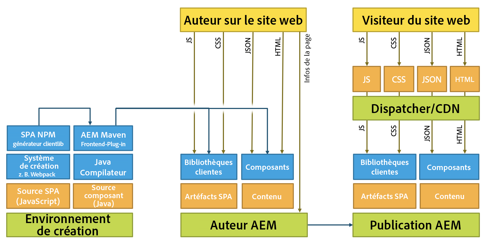

# Développement de SPA pour AEM {#developing-spas-for-aem}

Les applications sur une seule page (SPA) peuvent améliorer considérablement l’expérience des utilisateurs de sites web. Le souhait des développeurs est de pouvoir créer des sites avec des structures SPA. Les auteurs, pour leur part, souhaitent modifier facilement du contenu dans AEM pour un site conçu à l’aide de telles structures.

Cet article présente des questions importantes à prendre en compte lorsqu’un développeur front-end doit développer une SPA pour AEM. Il propose un aperçu de l’architecture d’AEM pour le déploiement de SPA sur AEM.

## Principes de développement de SPA pour AEM {#spa-development-principles-for-aem}

Le développement d’applications sur une seule page sur AEM suppose que le développeur front-end respecte les bonnes pratiques standard lors de la création d’une SPA. Si le développeur front-end respecte ces bonnes pratiques générales, ainsi que certains principes spécifiques à AEM, sa SPA sera fonctionnelle avec [AEM et ses fonctionnalités de création de contenu](introduction.md#content-editing-experience-with-spa).

* **[Portabilité](#portability)** : comme pour tout composant, les composants créés doivent être aussi portables que possible. La SPA doit être créée avec des composants portables et réutilisables.
* **[AEM détermine la structure du site](#aem-drives-site-structure)** : le développeur front-end crée des composants et possède leur structure interne, mais il dépend d’AEM pour définir la structure de contenu du site.
* **[Rendu dynamique](#dynamic-rendering)** : tout le rendu doit être dynamique.
* **[Routage dynamique](#dynamic-routing)** : la SPA assure le routage, et AEM l’écoute et s’appuie dessus pour l’extraction. Tout routage devrait également être dynamique.

Si vous gardez ces principes à l’esprit pendant le déploiement de votre SPA, elle sera aussi flexible et évolutive que possible et permettra d’utiliser toutes les fonctionnalités de création d’AEM prises en charge.

Si vous n’avez pas besoin de prendre en charge les fonctionnalités de création d’AEM, vous devrez peut-être envisager un [modèle de conception de SPA](#spa-design-models) différent.

### Portabilité {#portability}

Comme lors du développement de tout composant, vous devez créer vos composants de manière à optimiser leur portabilité. Il convient d’éviter tout modèle qui va à l’encontre de la portabilité ou de la capacité de réutilisation des composants afin de garantir la compatibilité, la flexibilité et la maintenabilité à l’avenir.

Les SPA doivent être créées avec des composants hautement portables et réutilisables.

### AEM détermine la structure du site {#aem-drives-site-structure}

Le développeur front-end doit se considérer comme responsable de la création d’une bibliothèque de composants SPA qui servent à créer l’application. Le développeur front-end contrôle entièrement la structure interne des composants. [Cependant, AEM possède toujours la structure du site.](editor-overview.md)

Cela signifie que le développeur front-end peut ajouter du contenu client avant ou après le point d’entrée des composants et peut également effectuer des appels tiers à l’intérieur du composant. Toutefois, le développeur front-end ne contrôle pas totalement la manière dont les composants sont imbriqués, par exemple.

### Rendu dynamique {#dynamic-rendering}

La SPA ne devrait reposer que sur le rendu dynamique de contenu. Il s’agit du comportement par défaut attendu lorsqu’AEM récupère tous les enfants de la structure de contenu et en effectue le rendu.

Tout rendu explicite pointant vers un contenu spécifique est considéré comme un rendu statique. Bien qu’il soit pris en charge, il ne sera pas compatible avec les fonctionnalités de création de contenu d’AEM. Cela va aussi à l’encontre du principe de [portabilité](#portability).

### Routage dynamique {#dynamic-routing}

Comme pour le rendu, l’ensemble du routage devrait également être dynamique. Dans AEM, [la SPA devrait toujours être responsable du routage](routing.md). AEM l’écoute et s’appuie dessus pour l’extraction de contenu.

Tout routage statique va à l’encontre du [principe de portabilité](#portability) et limite l’auteur en n’étant pas compatible avec les fonctionnalités de création de contenu d’AEM. Par exemple, avec un routage statique, si l’auteur du contenu souhaite modifier un chemin ou une page, il doit demander au développeur front-end de le faire.

## Archétype de projet AEM {#aem-project-archetype}

Tout projet AEM doit exploiter l’[archétype de projet AEM](https://docs.adobe.com/content/help/fr-FR/experience-manager-core-components/using/developing/archetype/overview.html), qui prend en charge les projets SPA à l’aide de React ou d’Angular et utilise le SDK SPA.

## Modèles de conception de SPA {#spa-design-models}

Si les [principes de développement des SPA dans AEM](#spa-development-principles-for-aem) sont respectés, votre SPA sera fonctionnelle avec toutes les fonctionnalités de création de contenu d’AEM prises en charge.

Il peut toutefois exister des cas dans lesquels cela n’est pas tout à fait nécessaire. Le tableau suivant présente un aperçu des différents modèles de conception, leurs avantages et leurs inconvénients.

<table>
 <tbody>
  <tr>
   <th><strong>Modèle de conception  </strong></th>
   <th><strong>Avantages</strong></th>
   <th><strong>Inconvénients</strong></th>
  </tr>
  <tr>
   <td>AEM est utilisé comme CMS sans affichage sans utiliser le <a href="/help/implementing/developing/hybrid/reference-materials.md">framework du SDK de l’éditeur de SPA.</a></td>
   <td>Le développeur front-end contrôle entièrement l’application.</td>
   <td>
Les auteurs de contenu ne peuvent pas exploiter l’expérience de création de contenu d’AEM.
 
Le code n’est ni portable ni réutilisable s’il contient des références statiques ou un routage.
 
Il ne permet pas d’utiliser l’éditeur de modèles ; le développeur front-end doit donc conserver des modèles modifiables via le JCR.
 </td>
  </tr>
  <tr>
   <td>Le développeur front-end utilise le framework du SDK de l’éditeur de SPA, mais n’ouvre que certaines zones à l’auteur de contenu.</td>
   <td>Le développeur garde le contrôle de l’application en n’autorisant la création que dans des zones restreintes de l’application.</td>
   <td>
Les auteurs de contenu sont limités à un ensemble limité d’expérience de création de contenu d’AEM.
 
Le code risque de n’être ni portable, ni réutilisable s’il contient un routage ou des références statiques.
 
Il ne permet pas d’utiliser l’éditeur de modèles ; le développeur front-end doit donc conserver des modèles modifiables via le JCR.
 </td>
  </tr>
  <tr>
   <td>Le projet tire pleinement parti du SDK de l’éditeur de SPA. Les composants front-end sont développés comme une bibliothèque, et la structure de contenu de l’application est déléguée à AEM.</td>
   <td>
L’application est réutilisable et portable.
 
L’auteur de contenu peut modifier l’application à l’aide de l’expérience de création de contenu d’AEM.  
 
La SPA est compatible avec l’éditeur de modèles.
 </td>
   <td>
Le développeur ne contrôle pas la structure de l’application et la partie du contenu déléguée à AEM.
 
Le développeur peut toutefois réserver des zones de l’application au contenu qui ne doit pas être créé à l’aide d’AEM.
 </td>
  </tr>
 </tbody>
</table>

>[!NOTE]
>
>Bien que tous les modèles soient pris en charge dans AEM, les auteurs devront impérativement mettre en œuvre le troisième (et respecter ainsi les [principes de développement de SPA recommandés dans AEM](#spa-development-principles-for-aem)) pour pouvoir interagir avec la SPA dans AEM et en modifier le contenu comme ils en ont l’habitude.

## Migration de SPA existantes vers AEM {#migrating-existing-spas-to-aem}

En règle générale, si votre SPA respecte les [principes de développement de SPA pour AEM](#spa-development-principles-for-aem), votre SPA fonctionnera dans AEM et sera modifiable à l’aide de l’éditeur de SPA d’AEM.

Respectez les étapes suivantes pour préparer l’utilisation de votre SPA existante dans AEM.

1. **Rendez vos composants JS modulaires.** - Permettez leur rendu dans n’importe quel ordre, position et taille.
1. **Utilisez les conteneurs fournis par notre SDK pour placer vos composants à l’écran.** - AEM fournit un composant de système de paragraphe et de page que vous pouvez utiliser.
1. **Créez un composant AEM pour chaque composant JS.** - Les composants AEM définissent la boîte de dialogue et la sortie JSON.

## Instructions destinées aux développeurs front-end {#instructions-for-front-end-developers}

Pour demander à un développeur front-end de créer une SPA pour AEM, la principale tâche consiste à convenir des composants et de leurs modèles JSON.

Vous trouverez ci-dessous un aperçu des étapes que doit suivre un développeur front-end lors du développement d’une SPA pour AEM.

1. **Convenir des composants et de leur modèle JSON**

   Les développeurs front-end et les développeurs AEM back-end doivent s’entendre sur les composants nécessaires et sur un modèle afin d’établir une correspondance individualisée entre les composants SPA et back-end.

   Les composants d’AEM sont toujours nécessaires, notamment pour fournir des boîtes de dialogue d’édition et exporter le modèle de composant.

1. **Dans les composants React, accéder au modèle via`this.props.cqModel`**

   Une fois les composants définis et le modèle JSON en place, le développeur front-end est libre de développer la SPA et peut accéder simplement au modèle JSON via `this.props.cqModel`.

1. **Mettre en œuvre la méthode `render()` du composant**

   Le développeur front-end met en œuvre la méthode `render()` à sa convenance et peut utiliser les champs de la propriété `cqModel`. Cela permet de générer le DOM et les fragments HTML qui seront insérés dans la page. Il s’agit de la méthode standard de création d’une application dans React.

1. **Faire correspondre le composant au type de ressource AEM via`MapTo()`**

   Le mappage stocke les classes de composants et est utilisé en interne par le composant `Container` fourni pour récupérer et instancier dynamiquement les composants en fonction du type de ressource donné.

   Il sert de « colle » entre le front-end et le back-end afin que l’éditeur sache à quels composants correspondent les composants de React.

   `Page` et `ResponsiveGrid` sont de bons exemples de classes qui étendent le `Container` de base.

1. **Définir le paramètre `EditConfig` du composant comme paramètre pour`MapTo()`**

   Ce paramètre est nécessaire pour indiquer à l’éditeur comment le composant doit être nommé tant qu’il n’a pas encore effectué de rendu ou qu’il n’a aucun rendu à effectuer.

1. **Étendre la classe `Container` fournie pour les pages et les conteneurs**

   Les pages et les systèmes de paragraphes doivent étendre cette classe afin que la délégation aux composants internes fonctionne comme prévu.

1. **Mettre en œuvre une solution de routage qui utilise l’API HTML5 `History`**

   Lorsque `ModelRouter` est activé, l’appel des fonctions `pushState` et `replaceState` déclenche une demande au `PageModelManager` de récupérer un fragment absent du modèle.

   La version actuelle de `ModelRouter` ne prend en charge que l’utilisation d’URL pointant vers le chemin de ressource réel des points d’entrée de Sling Model. Elle ne prend pas en charge l’utilisation de vanity URL ni d’alias.

   `ModelRouter` peut être désactivé ou configuré pour ignorer une liste d’expressions régulières.

## Indépendance par rapport à AEM {#aem-agnostic}

Ces blocs de code illustrent le fait que vos composants React et Angular n’ont besoin de rien qui soit spécifique à Adobe ou AEM.

* Tout ce qui se trouve à l’intérieur du composant JavaScript est indépendant d’AEM.
* Toutefois, ce qui est spécifique à AEM est que le composant JS doit être mappé à un composant AEM avec l’assistant MapTo.

L’assistant `MapTo` est la « colle » qui permet de faire correspondre les composants back-end et front-end :

* Il indique au conteneur JS (ou système de paragraphes JS) quel composant JS est responsable du rendu de chacun des composants présents dans le fichier JSON.
* Il ajoute un attribut de données HTML au code HTML généré par le composant JS, de sorte que l’éditeur de SPA sache quelle boîte de dialogue afficher pour l’auteur lors de la modification du composant.

Pour plus d’informations sur l’utilisation de `MapTo` et la création de SPA pour AEM en général, consultez le Guide de prise en main du framework choisi.

* [Prise en main des SPA dans AEM avec React](getting-started-react.md)
* [Prise en main des SPA dans AEM avec Angular](getting-started-angular.md)

## Architecture d’AEM et SPA {#aem-architecture-and-spas}

L’architecture générale d’AEM, y compris les environnements de développement, de création et de publication, ne change pas lors de l’utilisation de SPA. Il est toutefois utile de comprendre comment le développement de SPA s’inscrit dans cette architecture.

* **Environnement de création**

   C’est là que la source de l’application SPA et la source du composant sont extraites.

   * Le générateur clientlib NPM crée une bibliothèque cliente à partir du projet de SPA.
   * Cette bibliothèque sera utilisée par Maven et déployée par le module Maven Build avec le composant sur l’auteur AEM.

* **Auteur AEM**

   Le contenu est créé sur l’auteur AEM, y compris les SPA de création.

   Lorsqu’une SPA est modifiée à l’aide de l’éditeur de SPA sur l’environnement de création :

   1. La SPA demande le code HTML externe.
   1. Le fichier CSS est chargé.
   1. Le script JavaScript de la SPA est chargé.
   1. Lorsque la SPA est exécutée, le fichier JSON est demandé, ce qui permet à l’application de créer le DOM de la page, y compris les attributs `cq-data`.
   1. Ces attributs `cq-data` permettent à l’éditeur de charger des informations de pages supplémentaires afin qu’il connaisse les configurations d’édition disponibles pour les composants.

* **Publication AEM**

   C’est là où le contenu créé et les bibliothèques compilées, y compris les artefacts d’application SPA, les clientlibs et les composants, sont publiés pour être utilisés par le public.

* **Dispatcher/réseau CDN**

   Le répartiteur sert de couche de cache d’AEM pour les visiteurs sur le site.
   * Les requêtes sont traitées de la même manière que sur l’auteur AEM. Il n’y a toutefois aucune demande d’informations sur la page, car seul l’éditeur en a besoin.
   * Le code JavaScript, CSS, JSON et HTML est mis en cache afin d’optimiser la page pour une diffusion rapide.

>[!NOTE]
>
>Dans AEM, il n’est pas nécessaire d’exécuter les mécanismes de création JavaScript ni d’exécuter le script JavaScript en question. AEM héberge uniquement les artefacts compilés de la SPA.

## Étapes suivantes {#next-steps}

* [Prise en main des SPA dans AEM avec React](getting-started-react.md) présente comment créer une SPA de base pour fonctionner avec l’éditeur de SPA dans AEM avec React.
* [Prise en main des SPA dans AEM avec Angular](getting-started-angular.md) présente comment créer une SPA de base pour fonctionner avec l’éditeur de SPA dans AEM avec Angular.
* [Vue d’ensemble de l’éditeur de SPA](editor-overview.md) décrit de manière plus détaillée le modèle de communication entre AEM et la SPA.
* [WKND SPA Project](wknd-tutorial.md) est un tutoriel détaillé qui met en œuvre un projet de SPA simple dans AEM.
* [Mappage dynamique de modèle à composant pour SPA](model-to-component-mapping.md) explique le mappage dynamique du modèle au composant et son fonctionnement au sein de SPA dans AEM.
* [Plan directeur d’applications sur une seule page (SPA)](blueprint.md) explique en détail le fonctionnement du SDK SPA pour AEM pour la mise en œuvre de SPA dans AEM dans un autre framework que React ou Angular.
