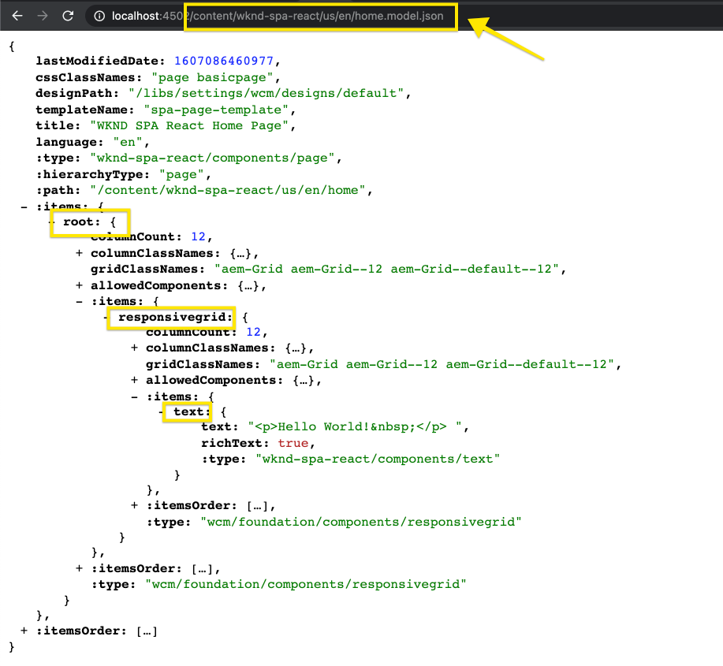
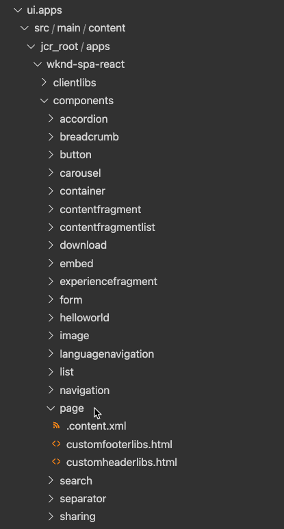

# Modification d&#39;un SPA externe dans AEM {#editing-external-spa-within-aem}

Lorsque vous décidez de [quel niveau d&#39;intégration](/help/implementing/developing/headful-headless.md) vous souhaitez avoir entre votre SPA externe et votre AEM, vous devez souvent être capable de modifier et de vue le SPA dans l&#39;.

## Présentation {#overview}

Ce document décrit les étapes recommandées pour télécharger un SPA autonome vers une instance AEM, ajouter des sections de contenu modifiables et activer la création.

## Conditions préalables {#prerequisites}

Les conditions préalables sont simples.

* Assurez-vous qu’une instance d’AEM s’exécute localement.
* Créez un projet de base AEM SPA à l&#39;aide de [l&#39;archétype de projet AEM.](https://experienceleague.adobe.com/docs/experience-manager-core-components/using/developing/archetype/overview.html?#available-properties)
   * Ce sera la base du projet AEM qui sera mis à jour pour inclure les SPA externes.
   * Pour les exemples de ce document, nous utilisons le point de départ de [le projet de SPA WKND.](https://experienceleague.adobe.com/docs/experience-manager-learn/sites/spa-editor/spa-editor-framework-feature-video-use.html#spa-editor)
* Ayez la Réaction active et externe SPA que vous souhaitez intégrer à votre portée.

## Télécharger SPA vers AEM Project {#upload-spa-to-aem-project}

Vous devez tout d&#39;abord transférer le SPA externe vers votre projet AEM.

1. Remplacez `src` dans le dossier de projet `/ui.frontend` par le dossier `src` de votre application React.
1. Incluez toutes les dépendances supplémentaires dans le fichier `package.json` de l&#39;application dans le fichier `/ui.frontend/package.json`.
   * Vérifier que les dépendances SPA SDK sont de [versions recommandées.](/help/implementing/developing/hybrid/getting-started-react.md#dependencies)
1. Incluez toutes les personnalisations dans le dossier `/public`.
1. Incluez tous les scripts ou styles intégrés ajoutés au fichier `/public/index.html`.

## Configuration de la SPA distante {#configure-remote-spa}

Maintenant que le SPA externe fait partie de votre projet AEM, il doit être configuré dans les AEM.

### Inclure les packages SDK Adobe SPA {#include-spa-sdk-packages}

Pour tirer parti des fonctionnalités AEM SPA, il y a des dépendances sur les trois paquets suivants.

* [`@adobe/aem-react-editable-components`](https://github.com/adobe/aem-react-editable-components)
* [`@adobe/aem-spa-component-mapping`](https://www.npmjs.com/package/@adobe/aem-spa-component-mapping)
* [`@adobe/aem-spa-page-model-manager`](https://www.npmjs.com/package/@adobe/aem-spa-model-manager)

`@adobe/aem-spa-page-model-manager` fournit l&#39;API pour initialiser un Model Manager et récupérer le modèle à partir de l&#39;instance AEM. Ce modèle peut ensuite être utilisé pour effectuer le rendu des composants AEM à l’aide d’API provenant de `@adobe/aem-react-editable-components` et `@adobe/aem-spa-component-mapping`.

#### Installation {#installation}

Exécutez la commande npm suivante pour installer les packages requis.

```shell
npm install --save @adobe/aem-spa-component-mapping @adobe/aem-spa-page-model-manager @adobe/aem-react-editable-components
```

### Initialisation de ModelManager {#model-manager-initialization}

Avant le rendu de l’application, l’[`ModelManager`](/help/implementing/developing/hybrid/blueprint.md#pagemodelmanager) doit être initialisé pour gérer la création de l’AEM `ModelStore`.

Cette opération doit être effectuée dans le fichier `src/index.js` de votre application ou à l’endroit où la racine de l’application est générée.

Pour ce faire, nous pouvons utiliser l&#39;API `initializationAsync` fournie par `ModelManager`.

La capture d&#39;écran suivante montre comment activer l&#39;initialisation de `ModelManager` dans une application React simple. La seule contrainte est que `initializationAsync` doit être appelé avant `ReactDOM.render()`.


Dans cet exemple, le `ModelManager` est initialisé et un `ModelStore` vide est créé.

`initializationAsync` peut éventuellement accepter un  `options` objet comme paramètre :

* `path` - Lors de l&#39;initialisation, le modèle au niveau du chemin d&#39;accès défini est récupéré et stocké dans le  `ModelStore`. Vous pouvez l&#39;utiliser pour récupérer le `rootModel` à l&#39;initialisation, si nécessaire.
* `modelClient` - Permet de fournir un client personnalisé chargé de récupérer le modèle.
* `model` - Un  `model` objet transmis en tant que paramètre généralement renseigné lors de l&#39; [utilisation de SSR.](/help/implementing/developing/hybrid/ssr.md)

### aem composants de feuilles autorisés {#authorable-leaf-components}

1. Créez/identifiez un composant AEM pour lequel un composant React autorisé sera créé. Dans cet exemple, nous utilisons le composant de texte du projet WKND.

   

1. Créez un composant de texte Réagir simple dans le SPA. Dans cet exemple, un nouveau fichier `Text.js` a été créé avec le contenu suivant.

   

1. Créez un objet de configuration pour spécifier les attributs requis pour activer la modification AEM.

   

   * `resourceType` est obligatoire pour mapper le composant Réagir au composant AEM et activer la modification lors de l’ouverture dans l’éditeur AEM.

1. Utilisez la fonction wrapper `withMappable`.

   

   Cette fonction wrapper mappe le composant React à l&#39;AEM `resourceType` spécifiée dans la configuration et active les capacités de modification lorsqu&#39;elle est ouverte dans l&#39;éditeur AEM. Pour les composants autonomes, il récupère également le contenu du modèle pour le noeud spécifique.

   >[!NOTE]
   >
   >Dans cet exemple, il existe des versions distinctes du composant : aem composants React encapsulés et non encapsulés. La version encapsulée doit être utilisée lors de l’utilisation explicite du composant. Lorsque le composant fait partie d’une page, vous pouvez continuer à utiliser le composant par défaut comme dans l’éditeur de SPA.

1. Générer le contenu dans le composant.

   Les propriétés JCR du composant de texte apparaissent comme suit dans l’AEM.

   

   Ces valeurs sont transmises en tant que propriétés au nouveau composant `AEMText` Réagir et peuvent être utilisées pour générer le contenu.

   ```javascript
   import React from 'react';
   import { withMappable } from '@adobe/aem-react-editable-components';
   
   export const TextEditConfig = {
       // Empty component placeholder label
       emptyLabel:'Text', 
       isEmpty:function(props) {
          return !props || !props.text || props.text.trim().length < 1;
       },
       // resourcetype of the AEM counterpart component
       resourceType:'wknd-spa-react/components/text'
   };
   
   const Text = ({ text }) => (<div>{text}</div>);
   
   export default Text;
   
   export const AEMText = withMappable(Text, TextEditConfig);
   ```

   C&#39;est ainsi que le composant apparaîtra une fois les configurations AEM terminées.

   ```javascript
   const Text = ({ cqPath, richText, text }) => {
      const richTextContent = () => (
         <div className="aem_text" id={cqPath.substr(cqPath.lastIndexOf('/') + 1)} data-rte-editelement dangerouslySetInnerHTML={{__html: text}}/>
      );
      return richText ? richTextContent() : (<div className="aem_text">{text}</div>);
   };
   ```

   >[!NOTE]
   >
   >Dans cet exemple, nous avons apporté d’autres personnalisations au composant rendu pour qu’il corresponde au composant de texte existant. Cela n’est toutefois pas lié à la création dans AEM.

#### Ajouter les composants autorisés à la page {#add-authorable-component-to-page}

Une fois les composants React autorisés créés, nous pouvons les utiliser dans toute l&#39;application.

Prenons un exemple de page où nous devons ajouter un texte du projet SPA WKND. Pour cet exemple, nous voulons afficher le texte &quot;Bonjour tout le monde !&quot; au `/content/wknd-spa-react/us/en/home.html`.

1. Déterminez le chemin d’accès du noeud à afficher.

   * `pagePath`: La page qui contient le noeud, dans notre exemple  `/content/wknd-spa-react/us/en/home`
   * `itemPath`: Chemin d’accès au noeud dans la page, dans notre exemple  `root/responsivegrid/text`
      * Il s&#39;agit des noms des éléments contenant sur la page.

   

1. Ajoutez le composant à la position requise dans la page.

   

   Le composant `AEMText` peut être ajouté à la position requise dans la page avec les valeurs `pagePath` et `itemPath` définies comme propriétés. `pagePath` est une propriété obligatoire.

#### Vérifier la modification du contenu du texte sur AEM {#verify-text-edit}

Nous pouvons maintenant tester le composant sur notre instance AEM en cours d&#39;exécution.

1. Exécutez la commande expert suivante à partir du répertoire `aem-guides-wknd-spa` pour générer et déployer le projet sur AEM.

```shell
mvn clean install -PautoInstallSinglePackage
```

1. Sur votre instance AEM, accédez à `http://<host>:<port>/editor.html/content/wknd-spa-react/us/en/home.html`.


Le composant `AEMText` peut désormais être autorisé sur AEM.

### aem Pages autorisées {#aem-authorable-pages}

1. Identifiez une page à ajouter pour la création dans le SPA. Cet exemple utilise `/content/wknd-spa-react/us/en/home.html`.
1. Créez un nouveau fichier (ex. `Page.js`) pour le composant de page autorisé. Ici, nous pouvons réutiliser le composant de page fourni dans `@adobe/cq-react-editable-components`.
1. Répétez l&#39;étape 4 de la section [AEM composants feuilles autorisés.](#authorable-leaf-components) Utilisez la fonction wrapper  `withMappable` sur le composant.
1. Comme précédemment, appliquez `MapTo` aux types de ressources AEM pour tous les composants enfants de la page.

   ```javascript
   import { Page, MapTo, withMappable } from '@adobe/aem-react-editable-components';
   import Text, { TextEditConfig } from './Text';
   
   export default withMappable(Page);
   
   MapTo('wknd-spa-react/components/text')(Text, TextEditConfig);
   ```

   >[!NOTE]
   >
   >Dans cet exemple, nous utilisons le composant de texte Réagir non encapsulé au lieu du composant `AEMText` encapsulé créé précédemment. En effet, lorsque le composant fait partie d’une page/conteneur et n’est pas autonome, le conteneur s’occupe de mapper le composant de manière récursive et d’activer les fonctionnalités de création et le wrapper supplémentaire n’est pas nécessaire pour chaque enfant.

1. Pour ajouter une page autorisée dans le SPA, suivez les mêmes étapes dans la section [Ajouter les composants autorisés à la page.](#add-authorable-component-to-page) Ici, nous pouvons cependant sauter la  `itemPath` propriété.

#### Vérifier le contenu de la page sur AEM {#verify-page-content}

Pour vérifier que la page peut être modifiée, suivez les mêmes étapes dans la section [Vérifier la modification du contenu de texte sur AEM.](#verify-text-edit)


La page est désormais modifiable sur AEM avec un conteneur de mise en page et un composant de texte enfant.

### Composants de feuille virtuelle {#virtual-leaf-components}

Dans les exemples précédents, nous avons ajouté des composants au SPA avec le contenu AEM existant. Toutefois, il arrive que le contenu n’ait pas encore été créé dans AEM, mais qu’il doive être ajouté ultérieurement par l’auteur du contenu. Pour ce faire, le développeur principal peut ajouter des composants aux emplacements appropriés dans le SPA. Ces composants affichent des espaces réservés lorsqu’ils sont ouverts dans l’éditeur dans AEM. Une fois que le contenu est ajouté dans ces espaces réservés par l’auteur du contenu, les noeuds sont créés dans la structure JCR et le contenu est conservé. Le composant créé permet le même ensemble d&#39;opérations que les composants feuille autonomes.

Dans cet exemple, nous réutilisons le composant `AEMText` créé précédemment. Nous voulons ajouter un nouveau texte sous le composant de texte existant sur la page d&#39;accueil WKND. L&#39;addition de composants est la même que pour les composants normaux de feuilles. Cependant, `itemPath` peut être mis à jour vers le chemin d&#39;accès où le nouveau composant doit être ajouté.

Puisque le nouveau composant doit être ajouté sous le texte existant à `root/responsivegrid/text`, le nouveau chemin d’accès sera `root/responsivegrid/{itemName}`.

```html
<AEMText
 pagePath='/content/wknd-spa-react/us/en/home'
 itemPath='root/responsivegrid/text_20' />
```

Le composant `TestPage` ressemble à ce qui suit après l&#39;ajout du composant virtuel.


>[!NOTE]
>
>Assurez-vous que le composant `AEMText` a son `resourceType` défini dans la configuration pour activer cette fonction.

Vous pouvez maintenant déployer les modifications sur AEM en suivant les étapes de la section [Vérifier la modification du contenu de texte sur AEM.](#verify-text-edit) Un espace réservé sera affiché pour le  `text_20` noeud non existant.


Lorsque l’auteur du contenu met à jour ce composant, un nouveau noeud `text_20` est créé à `root/responsivegrid/text_20` dans `/content/wknd-spa-react/us/en/home`.


#### Exigences et limites {#limitations}

Il existe un certain nombre d&#39;exigences pour ajouter des composants feuille virtuels ainsi que certaines limitations.

* La propriété `pagePath` est obligatoire pour créer un composant virtuel.
* Le noeud de page fourni au chemin d&#39;accès dans `pagePath` doit exister dans le projet AEM.
* Le nom du noeud à créer doit être fourni dans le `itemPath`.
* Le composant peut être créé à n’importe quel niveau.
   * Si nous fournissons un `itemPath='text_20'` dans l&#39;exemple précédent, le nouveau noeud sera créé directement sous la page, c.-à-d. `/content/wknd-spa-react/us/en/home/jcr:content/text_20`
* Le chemin d&#39;accès au noeud où un nouveau noeud est créé doit être valide lorsqu&#39;il est fourni par `itemPath`.
   * Dans cet exemple, `root/responsivegrid` doit exister pour que le nouveau noeud `text_20` puisse y être créé.
* Seule la création de composants feuille est prise en charge. Le conteneur virtuel et la page seront pris en charge dans les versions futures.

## Autres personnalisations {#additional-customizations}

Si vous avez suivi les exemples précédents, votre SPA externe est désormais modifiable dans AEM. Cependant, il existe d’autres aspects de votre SPA externe que vous pouvez personnaliser davantage.

### ID de noeud racine {#root-node-id}

Par défaut, nous supposons que l’application Réagir est rendue dans un `div` de l’ID d’élément `spa-root`. Si nécessaire, il est possible de personnaliser cette fonction.

Par exemple, supposons que nous ayons une SPA dans laquelle l’application est rendue dans un `div` de l’ID d’élément `root`. Il faut que cela se reflète dans trois fichiers.

1. Dans le `index.js` de l&#39;application React (ou où `ReactDOM.render()` est appelé)

   

1. Dans le `index.html` de la demande React

   

1. Dans le corps du composant de page de l’AEM application, par le biais de deux étapes :

   1. Créez un `body.html` pour le composant de page.

   

   1. Ajoutez le nouvel élément racine dans le nouveau fichier `body.html`.

   

### Modification d&#39;un SPA de réaction avec le Routage {#editing-react-spa-with-routing}

Si l&#39;application React SPA externe comporte plusieurs pages, [elle peut utiliser le routage pour déterminer la page/le composant à rendre.](/help/implementing/developing/hybrid/routing.md) Le cas d’utilisation de base consiste à faire correspondre l’URL actuellement principale au chemin d’accès fourni pour un itinéraire. Pour activer la modification sur de telles applications activées pour le routage, le chemin d’accès à comparer doit être transformé pour s’adapter aux informations spécifiques à l’AEM.

Dans l&#39;exemple suivant, nous avons une simple application React avec deux pages. La page à rendre est déterminée en comparant le chemin d&#39;accès fourni au routeur à l&#39;URL principale. Par exemple, si nous utilisons `mydomain.com/test`, `TestPage` sera rendu.


Pour activer la modification dans AEM pour cet exemple SPA, les étapes suivantes sont requises.

1. Identifiez le niveau qui agirait comme racine sur AEM.

   * Pour notre échantillon, nous considérons wknd-spa-response/us/en comme la racine du SPA. Cela signifie que tout ce qui précède ce chemin est AEM uniquement pages/contenu.

1. Créez une page au niveau requis.

   * Dans cet exemple, la page à modifier est `mydomain.com/test`. `test` se trouve dans le chemin racine de l’application. Cela doit également être conservé lors de la création de la page dans AEM. Par conséquent, nous pouvons créer une nouvelle page au niveau racine défini à l&#39;étape précédente.
   * La nouvelle page créée doit porter le même nom que la page à modifier. Dans cet exemple pour `mydomain.com/test`, la nouvelle page créée doit être `/path/to/aem/root/test`.

1. Ajoutez des assistants dans SPA routage.

   * La page nouvellement créée n’affichera pas encore le contenu attendu dans AEM. Ceci est dû au fait que le routeur attend un chemin d&#39;accès `/test` alors que le chemin d&#39;accès principal de l&#39;AEM est `/wknd-spa-react/us/en/test`. Pour prendre en compte la partie spécifique à l’AEM de l’URL, nous devons ajouter des aides du côté SPA.

   

   * L&#39;aide `toAEMPath` fournie par `@adobe/cq-spa-page-model-manager` peut être utilisée pour cela. Il transforme le chemin d’accès fourni pour que le routage inclut des portions spécifiques à AEM lorsque l’application est ouverte sur une instance AEM. Il accepte trois paramètres :
      * Chemin d&#39;accès requis pour le routage
      * URL d’origine de l’instance AEM où le SPA est modifié
      * La racine du projet sur l&#39;AEM, telle que déterminée lors de la première étape
   * Ces valeurs peuvent être définies en tant que variables d’environnement pour plus de flexibilité.


1. Vérifiez la modification de la page dans AEM.

   * Déployez le projet pour AEM et accédez à la nouvelle page `test` créée. Le contenu de la page est désormais rendu et AEM composants sont modifiables.

## Ressources supplémentaires {#additional-resources}

Le document de référence ci-après peut être utile pour comprendre SPA dans le contexte de l&#39;AEM.

* [En tête et sans tête en AEM](/help/implementing/developing/headful-headless.md)
* [Archétype de projet AEM](https://experienceleague.adobe.com/docs/experience-manager-core-components/using/developing/archetype/overview.html)
* [Le projet SPA WKND](https://experienceleague.adobe.com/docs/experience-manager-learn/sites/spa-editor/spa-editor-framework-feature-video-use.html)
* [Prise en main des SPA dans AEM avec React](/help/implementing/developing/hybrid/getting-started-react.md)
* [Documents de référence SPA (références API)](/help/implementing/developing/hybrid/reference-materials.md)
* [SPA Plan directeur et PageModelManager](/help/implementing/developing/hybrid/blueprint.md#pagemodelmanager)
* [Routage du modèle de SPA ](/help/implementing/developing/hybrid/routing.md)
* [SPA et rendu côté serveur](/help/implementing/developing/hybrid/ssr.md)
