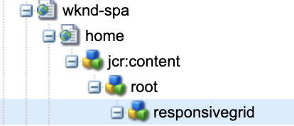

# Modification d’une SPA externe dans AEM {#editing-external-spa-within-aem}

Lorsque vous décidez [quel niveau d’intégration ?](/help/implementing/developing/headful-headless.md) si vous souhaitez passer de votre SPA externe à votre AEM, considérez que vous devez souvent pouvoir modifier et afficher le  dans.

## Présentation {#overview}

Ce document décrit les étapes recommandées pour charger une SPA autonome vers une instance AEM, ajouter des sections de contenu modifiables et permettre la création.

## Prérequis {#prerequisites}

Les conditions préalables sont simples.

* Assurez-vous qu’une instance d’AEM s’exécute localement.
* Créez un projet de base de SPA AEM à l’aide de [l’archétype de projet AEM](https://experienceleague.adobe.com/docs/experience-manager-core-components/using/developing/archetype/overview.html?lang=fr?#available-properties).
   * Forms est la base du projet AEM qui est mis à jour pour inclure le SPA externe.
   * Pour les exemples de ce document, Adobe utilise le point de départ de [le projet SPA WKND ;](https://experienceleague.adobe.com/docs/experience-manager-learn/sites/spa-editor/spa-editor-framework-feature-video-use.html?lang=fr#spa-editor).
* Gardez la SPA React externe que vous souhaitez intégrer active et à portée de main.

## Chargement de la SPA vers le projet AEM {#upload-spa-to-aem-project}

Tout d’abord, vous devez charger le SPA externe dans votre projet AEM.

1. Remplacez `src` dans le dossier de projet `/ui.frontend` par le dossier `src` de votre application React.
1. Incluez toutes les dépendances supplémentaires dans le `package.json` de l’application dans le fichier `/ui.frontend/package.json`.
   * Assurez-vous que les dépendances du SDK SPA sont de [versions recommandées](/help/implementing/developing/hybrid/getting-started-react.md#dependencies).
1. Incluez toutes les personnalisations dans le dossier `/public`.
1. Incluez tous les scripts ou styles intégrés ajoutés dans le fichier `/public/index.html`.

## Configuration de la SPA distante {#configure-remote-spa}

Maintenant que la SPA externe fait partie de votre projet AEM, elle doit être configurée dans.

### Inclusion des packages du SDK SPA Adobe {#include-spa-sdk-packages}

Pour tirer parti des fonctionnalités de SPA AEM, vous pouvez utiliser les dépendances des trois packages suivants.

* [`@adobe/aem-react-editable-components`](https://github.com/adobe/aem-react-editable-components)
* [`@adobe/aem-spa-component-mapping`](https://www.npmjs.com/package/@adobe/aem-spa-component-mapping)
* [`@adobe/aem-spa-page-model-manager`](https://www.npmjs.com/login?next=/package/@adobe/aem-spa-model-manager)

Le `@adobe/aem-spa-page-model-manager` Le package fournit l’API pour initialiser un gestionnaire de modèles et récupérer le modèle à partir de l’instance AEM. Ce modèle peut ensuite être utilisé pour effectuer le rendu des composants AEM à l’aide d’API provenant de `@adobe/aem-react-editable-components` et `@adobe/aem-spa-component-mapping`.

#### Installation {#installation}

Exécutez les opérations suivantes `npm` pour pouvoir installer les packages requis.

```shell
npm install --save @adobe/aem-spa-component-mapping @adobe/aem-spa-page-model-manager @adobe/aem-react-editable-components
```

### Initialisation de ModelManager {#model-manager-initialization}

Avant le rendu de l’application, la variable [`ModelManager`](/help/implementing/developing/hybrid/blueprint.md#pagemodelmanager) doit être initialisé pour gérer la création de l’AEM `ModelStore`.

Cette initialisation doit être effectuée dans la variable `src/index.js` de votre application ou où la racine de l’application est générée.

Pour effectuer cette initialisation, vous pouvez utiliser `initializationAsync` API fournie par `ModelManager`.

La capture d’écran suivante montre comment activer l’initialisation de `ModelManager` dans une application React simple. La seule contrainte est que `initializationAsync` doit être appelé avant `ReactDOM.render()`.


Dans cet exemple, `ModelManager` est initialisé et un `ModelStore` vide est créé.

Le `initializationAsync` peut éventuellement accepter une `options` objet en tant que paramètre :

* `path` – Lors de l’initialisation, le modèle au niveau du chemin d’accès défini est récupéré et stocké dans le `ModelStore`. Ce chemin d’accès peut être utilisé pour récupérer la variable `rootModel` au moment de l’initialisation, si nécessaire.
* `modelClient` – Permet de fournir un client personnalisé chargé de récupérer le modèle.
* `model` - Un objet `model` transmis en tant que paramètre généralement renseigné lors de l’[utilisation de SSR](/help/implementing/developing/hybrid/ssr.md).

### Composants feuille AEM modifiables {#authorable-leaf-components}

1. Créez/identifiez un composant AEM pour lequel un composant React autorisable est créé. Dans cet exemple, il utilise le composant textuel du projet WKND.

   

1. Créez un simple composant texte React dans la SPA. Dans cet exemple, un nouveau fichier `Text.js` a été créé avec le contenu suivant.

   

1. Créez un objet de configuration afin de pouvoir spécifier les attributs requis pour activer la modification AEM.

   

   * `resourceType` est obligatoire pour mapper le composant React au composant AEM et activer la modification lors de l’ouverture dans l’éditeur AEM.

1. Utilisez la fonction Wrapper `withMappable`.

   

   Cette fonction wrapper mappe le composant React à l’AEM `resourceType` spécifié dans la configuration et active les fonctionnalités d’édition lorsqu’elles sont ouvertes dans l’éditeur d’AEM. Pour les composants autonomes, il récupère également le contenu du modèle pour le noeud spécifique.

   >[!NOTE]
   >
   >Dans cet exemple, il existe des versions distinctes du composant : AEM les composants React encapsulés et non encapsulés. La version encapsulée doit être utilisée lors de l’utilisation explicite du composant. Lorsque le composant fait partie d’une page, vous pouvez continuer à utiliser le composant par défaut comme dans l’éditeur de SPA.

1. Générez le contenu dans le composant.

   Les propriétés JCR du composant texte apparaissent comme suit dans AEM.

   

   Ces valeurs sont transmises en tant que propriétés au nouveau créé. `AEMText` Composant React et peut être utilisé pour effectuer le rendu du contenu.

   ```javascript
   import React from 'react';
   import { withMappable } from '@adobe/aem-react-editable-components';
   
   export const TextEditConfig = {
       // Empty component placeholder label
       emptyLabel:'Text', 
       isEmpty:function(props) {
          return !props || !props.text || props.text.trim().length < 1;
       },
       // resourcetype of the AEM counterpart component
       resourceType:'wknd-spa-react/components/text'
   };
   
   const Text = ({ text }) => (<div>{text}</div>);
   
   export default Text;
   
   export const AEMText = withMappable(Text, TextEditConfig);
   ```

   Voici comment le composant s’affiche lorsque les configurations AEM sont terminées.

   ```javascript
   const Text = ({ cqPath, richText, text }) => {
      const richTextContent = () => (
         <div className="aem_text" id={cqPath.substr(cqPath.lastIndexOf('/') + 1)} data-rte-editelement dangerouslySetInnerHTML={{__html: text}}/>
      );
      return richText ? richTextContent() : (<div className="aem_text">{text}</div>);
   };
   ```

   >[!NOTE]
   >
   >Dans cet exemple, d’autres personnalisations ont été apportées au composant rendu pour correspondre au composant de texte existant. Il n’est pas lié à la création dans AEM.

#### Ajout de composants modifiables à la page {#add-authorable-component-to-page}

Une fois les composants React modifiables créés, vous pouvez les utiliser dans l’ensemble de l’application.

Prenons un exemple de page où vous devez ajouter un texte du projet SPA WKND. Pour cet exemple, vous souhaitez afficher le texte &quot;Hello World!&quot; à `/content/wknd-spa-react/us/en/home.html`.

1. Déterminez le chemin d’accès du nœud à afficher.

   * `pagePath`: La page qui contient le noeud, dans cet exemple `/content/wknd-spa-react/us/en/home`
   * `itemPath`: Chemin d’accès au noeud dans la page, dans cet exemple `root/responsivegrid/text`
      * Se compose des noms des éléments qui contiennent sur la page.

   

1. Ajoutez le composant à la position requise sur la page.

   

   Le composant `AEMText` peut être ajouté à la position requise sur la page avec les valeurs `pagePath` et `itemPath` définies en tant que propriétés. `pagePath` est une propriété obligatoire.

#### Vérification de la modification du contenu texte dans AEM {#verify-text-edit}

Testez maintenant le composant sur l’instance AEM en cours d’exécution.

1. Exécutez la commande Maven suivante à partir du `aem-guides-wknd-spa` afin que vous puissiez créer et déployer le projet vers AEM.

```shell
mvn clean install -PautoInstallSinglePackage
```

1. Sur votre instance AEM, accédez à `http://<host>:<port>/editor.html/content/wknd-spa-react/us/en/home.html`.


Le composant `AEMText` est désormais modifiable sur AEM.

### Pages AEM modifiables {#aem-authorable-pages}

1. Identifiez une page à ajouter pour la création dans la SPA. Cet exemple utilise `/content/wknd-spa-react/us/en/home.html`.
1. Créer un fichier (par exemple, `Page.js`) pour le composant de page modifiable. Utilisez le composant de page fourni dans `@adobe/cq-react-editable-components`.
1. Répétez l’étape 4 de la section [Composants feuille AEM modifiables](#authorable-leaf-components). Utilisez la fonction Wrapper `withMappable` sur le composant.
1. Comme précédemment, appliquez `MapTo` aux types de ressources AEM pour tous les composants enfants de la page.

   ```javascript
   import { Page, MapTo, withMappable } from '@adobe/aem-react-editable-components';
   import Text, { TextEditConfig } from './Text';
   
   export default withMappable(Page);
   
   MapTo('wknd-spa-react/components/text')(Text, TextEditConfig);
   ```

   >[!NOTE]
   >
   >Dans cet exemple, le composant de texte React non encapsulé est utilisé à la place de l’élément encapsulé. `AEMText` créé précédemment. En effet, lorsque le composant fait partie d’une page/d’un conteneur et qu’il n’est pas autonome, le conteneur s’occupe de mapper récursivement le composant. De plus, l’activation des fonctionnalités de création et du wrapper supplémentaire n’est pas nécessaire pour chaque enfant.

1. Pour ajouter une page autorisée dans la SPA, suivez les mêmes étapes de la section [Ajout de composants modifiables à la page](#add-authorable-component-to-page). Vous pouvez ignorer le `itemPath` .

#### Vérification du contenu de la page sur AEM {#verify-page-content}

Pour vérifier que la page peut être modifiée, suivez les mêmes étapes que dans la section [Vérification de la modification du contenu texte dans AEM](#verify-text-edit).


La page est désormais modifiable dans AEM avec un conteneur de disposition et un composant texte enfant.

### Composants feuille virtuels {#virtual-leaf-components}

Dans les exemples précédents, vous avez ajouté des composants à la SPA avec le contenu AEM existant. Cependant, il arrive que le contenu n’ait pas encore été créé dans AEM, mais qu’il doive être ajouté ultérieurement par l’auteur du contenu. Pour répondre à ce scénario, le développeur front-end peut ajouter des composants aux emplacements appropriés dans le SPA. Ces composants affichent des espaces réservés lorsqu’ils sont ouverts dans l’éditeur dans AEM. Une fois que le contenu est ajouté dans ces espaces réservés par l’auteur du contenu, les noeuds sont créés dans la structure JCR et le contenu est conservé. Le composant créé permet le même ensemble d’opérations que les composants feuilles autonomes.

Dans cet exemple, vous réutilisez le `AEMText` du composant créé précédemment. Vous souhaitez ajouter du nouveau texte sous le composant de texte existant sur la page d’accueil WKND. L’ajout de composants est le même que pour les composants feuille normaux. Toutefois, la variable `itemPath` peut être mis à jour vers le chemin d’accès où le nouveau composant doit être ajouté.

Parce que le nouveau composant doit être ajouté sous le texte existant à l’adresse `root/responsivegrid/text`, le nouveau chemin est `root/responsivegrid/{itemName}`.

```html
<AEMText
 pagePath='/content/wknd-spa-react/us/en/home'
 itemPath='root/responsivegrid/text_20' />
```

Le composant `TestPage` ressemble à ce qui suit après l’ajout du composant virtuel.


>[!NOTE]
>
>Assurez-vous que la variable `AEMText` a son composant `resourceType` dans la configuration afin que vous puissiez activer cette fonction.

Vous pouvez maintenant déployer les modifications sur AEM en suivant les étapes de la section [Vérification de la modification du contenu texte dans AEM](#verify-text-edit). Un espace réservé s’affiche pour les variables qui ne sont actuellement pas existantes. `text_20` noeud .


Lorsque l’auteur du contenu met à jour ce composant, un nœud `text_20` est créé sur `root/responsivegrid/text_20` dans `/content/wknd-spa-react/us/en/home`.


#### Exigences et restrictions {#limitations}

Il existe plusieurs exigences pour ajouter des composants feuille virtuels et certaines limites.

* La propriété `pagePath` est obligatoire pour créer un composant virtuel.
* Le nœud de page fourni au chemin d’accès dans `pagePath` doit exister dans le projet AEM.
* Le nom du nœud à créer doit être fourni dans le `itemPath`.
* Le composant peut être créé à n’importe quel niveau.
   * Si vous fournissez un `itemPath='text_20'` dans l’exemple précédent, le nouveau noeud est créé directement sous la page, c’est-à-dire : `/content/wknd-spa-react/us/en/home/jcr:content/text_20`
* Le chemin d’accès où le nœud doit être créé doit être valide lorsqu’il est fourni par `itemPath`.
   * Dans cet exemple, `root/responsivegrid` doit exister pour que le nœud `text_20` puisse y être créé.
* Seule la création de composants feuille est prise en charge. Les conteneurs et pages virtuels seront pris en charge dans les versions futures.

### Conteneurs virtuels {#virtual-containers}

La possibilité d’ajouter des conteneurs, même si le conteneur correspondant n’est pas encore créé dans AEM, est prise en charge. Le concept et l’approche sont semblables à celles des [composants feuilles virtuels](#virtual-leaf-components).

Le développeur front-end peut ajouter les composants de conteneur aux emplacements appropriés dans la SPA et ces composants affichent des espaces réservés lorsqu’ils sont ouverts dans l’éditeur d’AEM. L’auteur peut ensuite ajouter des composants et leur contenu au conteneur qui crée les noeuds requis dans la structure JCR.

Par exemple, si un conteneur existe à l’adresse `/root/responsivegrid`, et le développeur souhaite ajouter un conteneur enfant :


Le `newContainer` n’existe pas encore dans l’AEM.

Lors de la modification de la page contenant ce composant dans AEM, un espace réservé vide pour un conteneur s’affiche dans lequel l’auteur peut ajouter du contenu.




Une fois que l’auteur ajoute un composant enfant au conteneur, le nouveau nœud de conteneur est créé avec le nom correspondant dans la structure JCR.


Il est désormais possible d’ajouter davantage de composants et de contenu au conteneur, selon les besoins de l’auteur, et les modifications sont conservées.

#### Exigences et restrictions {#container-limitations}

Il existe plusieurs exigences pour ajouter des conteneurs virtuels et certaines limites.

* La stratégie permettant de déterminer les composants qui peuvent être ajoutés est héritée du conteneur parent.
* Le parent immédiat du conteneur à créer doit exister dans AEM.
   * Si le conteneur `root/responsivegrid` existe dans le conteneur AEM, un nouveau conteneur peut être créé en indiquant le chemin d’accès. `root/responsivegrid/newContainer`.
   * Cependant, `root/responsivegrid/newContainer/secondNewContainer` n’est pas possible.
* Un seul nouveau niveau de composant peut être créé à la fois.

## Personnalisations supplémentaires {#additional-customizations}

Si vous avez suivi les exemples précédents, votre SPA externe est désormais modifiable dans AEM. Cependant, vous pouvez personnaliser encore davantage d’autres aspects de votre SPA externe.

### ID de nœud racine {#root-node-id}

Par défaut, vous pouvez supposer que l’application React est rendue dans une `div` de l’ID d’élément `spa-root`. Au besoin, cette syntaxe peut être personnalisée.

Supposons, par exemple, que vous ayez un SPA dans lequel l’application est rendue dans un `div` de l’ID d’élément `root`. Cette syntaxe doit être reflétée dans trois fichiers.

1. Dans le fichier `index.js` de l’application React (ou à l’endroit où `ReactDOM.render()` est appelé)

   

1. Dans le fichier `index.html` de l’application React

   

1. Dans le corps du composant de page de l’application AEM, opération possible en deux étapes :

   1. Créez un `body.html` pour le composant de page.

   

   1. Ajoutez l’élément racine dans la nouvelle `body.html` fichier .

   

### Modification d’une SPA React avec le routage {#editing-react-spa-with-routing}

Si l’application SPA React externe comporte plusieurs pages, [elle peut utiliser le routage pour déterminer la page ou le composant à rendre](/help/implementing/developing/hybrid/routing.md). Le cas d’utilisation typique consiste à faire correspondre l’URL actuellement principale au chemin d’accès fourni pour un itinéraire. Pour activer l’édition sur ces applications activées pour le routage, le chemin d’accès à associer doit être transformé pour tenir compte des informations spécifiques à AEM.

Dans l’exemple suivant, vous disposez d’une application React simple de deux pages. La page à rendre est déterminée en comparant le chemin d’accès fourni au routeur avec l’URL active. Par exemple, si vous utilisez `mydomain.com/test`, `TestPage` est rendue.


Pour activer la modification dans AEM pour cet exemple de SPA, vous devez suivre les étapes suivantes.

1. Identifiez le niveau racine pour AEM.

   * Pour votre exemple, considérez wknd-spa-response/us/en comme la racine du SPA. Cette racine signifie que tout ce qui précède ce chemin d’accès AEM uniquement les pages/le contenu.

1. Créez une page au niveau requis.

   * Dans cet exemple, la page à modifier est `mydomain.com/test`. `test` se trouve dans le chemin racine de l’application. Ce chemin racine doit également être conservé lors de la création de la page dans AEM. Par conséquent, vous pouvez créer une page au niveau racine défini à l’étape précédente.
   * La page créée doit porter le même nom que la page à modifier. Dans cet exemple, pour `mydomain.com/test`, la nouvelle page créée doit être `/path/to/aem/root/test`.

1. Ajoutez des assistants pour le routage de la SPA.

   * La page nouvellement créée ne peut pas encore afficher le contenu attendu dans AEM. La raison est que le routeur attend un chemin de `/test` alors que l’principal chemin est `/wknd-spa-react/us/en/test`. Pour tenir compte de la partie spécifique à l’AEM de l’URL, vous devez ajouter quelques assistants du côté SPA.

   

   * Le `toAEMPath` assistance fournie par `@adobe/cq-spa-page-model-manager` peut être utilisé. Elle adapte le chemin d’accès fourni pour que le routage intègre les portions spécifiques à AEM lorsque l’application est ouverte sur une instance AEM. Elle accepte trois paramètres :
      * Le chemin d’accès requis pour le routage
      * L’URL d’origine de l’instance AEM dans laquelle la SPA est modifiée
      * La racine du projet sur AEM, telle que déterminée lors de la première étape

   * Ces valeurs peuvent être définies en tant que variables d’environnement pour plus de flexibilité.

1. Vérifiez la modification de la page dans AEM.

   * Déployez le projet pour AEM et accédez à la page `test` créée. Le contenu de la page est désormais rendu et les composants AEM sont modifiables.

## Restrictions du framework {#framework-limitations}

Le composant RemotePage s’attend à ce que l’implémentation fournisse un manifeste de ressource comme [celui-ci](https://github.com/shellscape/webpack-manifest-plugin). Le composant RemotePage, en revanche, a été testé uniquement pour fonctionner avec le framework React (et Next.js via le composant remote-page-next) et il ne prend donc pas en charge le chargement à distance d’applications à partir d’autres frameworks tels qu’Angular.

## Ressources supplémentaires {#additional-resources}

Les documents de référence suivants peuvent être utiles pour comprendre le fonctionnement des SPA dans le contexte d’AEM.

* [Couplage et découplage dans AEM](/help/implementing/developing/headful-headless.md)
* [Archétype de projet AEM](https://experienceleague.adobe.com/docs/experience-manager-core-components/using/developing/archetype/overview.html?lang=fr)
* [Projet de SPA WKND](https://experienceleague.adobe.com/docs/experience-manager-learn/sites/spa-editor/spa-editor-framework-feature-video-use.html?lang=fr)
* [Prise en main des SPA dans AEM avec React](/help/implementing/developing/hybrid/getting-started-react.md)
* [Documents de référence relatifs aux SPA (référence de l’API)](/help/implementing/developing/hybrid/reference-materials.md)
* [Plan directeur d’applications sur une seule page (SPA) et PageModelManager](/help/implementing/developing/hybrid/blueprint.md#pagemodelmanager)
* [Routage du modèle de SPA](/help/implementing/developing/hybrid/routing.md)
* [SPA et rendu côté serveur](/help/implementing/developing/hybrid/ssr.md)
