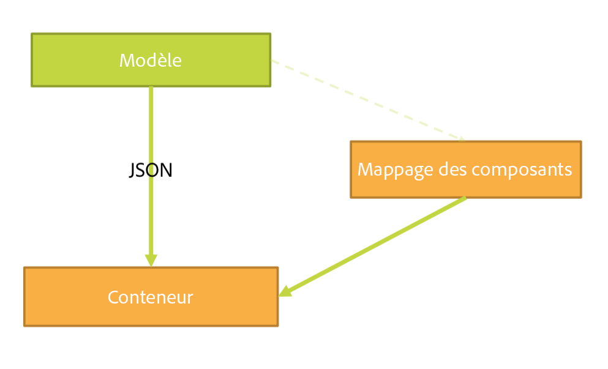
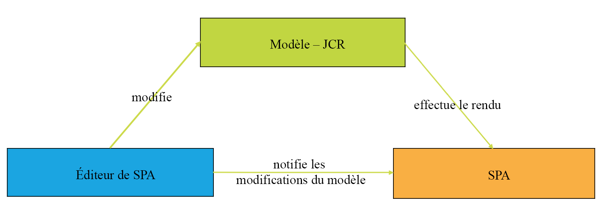
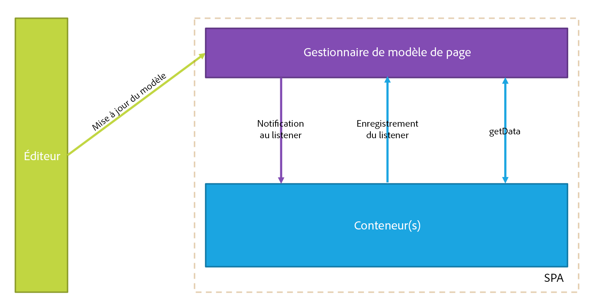
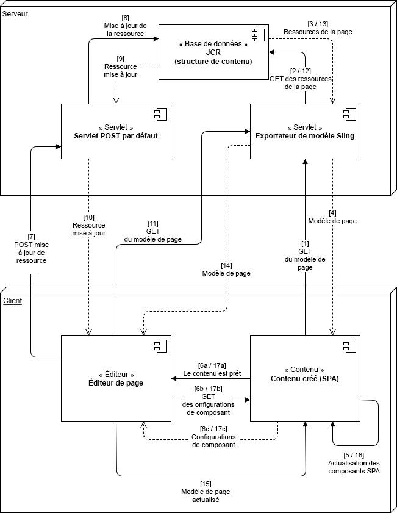
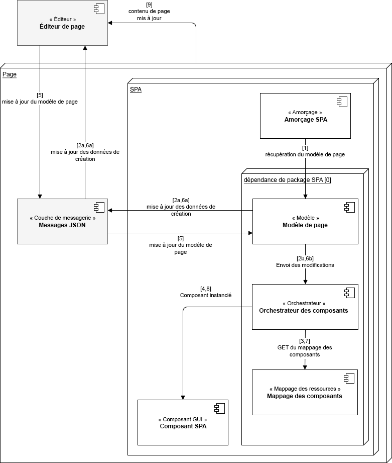

# Présentation de l’éditeur de SPA {#spa-editor-overview}

Les applications monopage (SPA) peuvent améliorer considérablement l’expérience des sites web. Les développeurs et développeuses souhaitent pouvoir créer des sites avec des frameworks SPA. Les auteurs et autrices, pour leur part, souhaitent modifier facilement du contenu dans AEM pour un site conçu à l’aide de tels frameworks.

L’éditeur de SPA constitue une solution complète pour la prise en charge des SPA dans AEM. Cette page donne une vue d’ensemble de la structure de la prise en charge SPA dans AEM, du fonctionnement de l’éditeur de SPA et de la synchronisation entre le framework SPA et AEM.

{{ue-over-spa}}

## Présentation {#introduction}

Les sites créés à l’aide de frameworks SPA courantes, telles que React et AngularJS, chargent leur contenu via le format JSON dynamique et ne fournissent pas le framework HTML dont l’éditeur de page AEM a besoin pour passer des commandes de modification.

Pour activer la modification d’applications sur une seule page dans AEM, il faut qu’il y ait une correspondance entre la sortie JSON de l’application et le modèle de contenu dans le répertoire AEM afin d’enregistrer les modifications apportées au contenu.

La prise en charge des applications sur une seule page dans AEM s’accompagne d’une fine couche JS qui interagit avec le code JS de l’application lorsqu’elle est chargée dans l’éditeur de pages avec lequel des événements peuvent être envoyés. L’emplacement des commandes d’édition peut être activé pour permettre une modification en contexte. Cette fonctionnalité s’appuie sur le concept de point d’entrée de l’API Content Services , car le contenu de la SPA doit être chargé au moyen de Content Services.

Pour plus d’informations sur les SPA dans AEM, reportez-vous aux sections suivantes :

* [&#x200B; Plan directeur d’application d’une seule page &#x200B;](blueprint.md) pour les exigences techniques d’une application monopage.
* [Prise en main des SPA dans AEM à l’aide de React](getting-started-react.md) pour une présentation rapide d’une SPA simple à l’aide de React.
* [Prise en main des SPA dans AEM à l’aide d’Angular](getting-started-angular.md) pour une présentation rapide d’une SPA simple à l’aide d’Angular.

## Conception {#design}

Le composant de page d’une application sur une seule page ne fournit pas les composants HTML de ses composants enfants via le fichier HTL ou JSP. Cette opération est déléguée à la structure SPA. La représentation du modèle ou des composants enfants est récupérée en tant que structure de données JSON à partir du JCR. Les composants de SPA sont ensuite ajoutés à la page en fonction de cette structure. Ce comportement différencie la composition initiale du corps du composant de page de ses équivalents non SPA.

### Gestion du modèle de page {#page-model-management}

La résolution et la gestion du modèle de page sont déléguées à une bibliothèque `PageModel` fournie à cet effet. La SPA doit utiliser la bibliothèque de modèle de page pour pouvoir être initialisée et créée par l’éditeur de SPA. La bibliothèque de modèle de page est fournie indirectement au composant de page AEM via le npm `aem-react-editable-components`. Le modèle de page est un interpréteur entre AEM et la SPA. Il doit donc être toujours présent. Lorsque la page est créée, une bibliothèque supplémentaire `cq.authoring.pagemodel.messaging` doit être ajoutée afin de permettre la communication avec l’éditeur de page.

Si le composant de page SPA hérite du composant principal de la page, deux options sont possibles pour faire en sorte que la catégorie de la bibliothèque cliente `cq.authoring.pagemodel.messaging` soit disponible :

* Si le modèle est modifiable, ajoutez-le à la politique de page.
* Vous pouvez également ajouter les catégories via `customfooterlibs.html`.

Pour chaque ressource du modèle exporté, la SPA mappe un composant réel chargé d’effectuer le
rendu. Le modèle, représenté sous la forme JSON, est ensuite rendu à l’aide des mappages de composants dans un conteneur.

>[!CAUTION]
>
>L’inclusion de la catégorie `cq.authoring.pagemodel.messaging` doit être limitée au contexte de l’éditeur de SPA.

### Type de données de communication {#communication-data-type}

Lorsque la catégorie `cq.authoring.pagemodel.messaging` est ajoutée à la page, elle envoie un message à l’éditeur de page afin de créer un type de données de communication JSON. Lorsque le type de données de communication est défini sur JSON, les requêtes GET communiquent avec les points d’entrée du modèle Sling d’un composant. À la suite d’une mise à jour dans l’éditeur de page, la représentation JSON du composant mis à jour est envoyée à la bibliothèque modèle de page. Celle-ci informe ensuite l’application sur une seule page des mises à jour.

## Workflow {#workflow}

Pour vous représenter le flux de l’interaction entre une SPA et AEM, vous pouvez considérer l’éditeur de SPA comme un intermédiaire entre les deux.

* La communication entre l’éditeur de page et la SPA est effectuée à l’aide de JSON au lieu de HTML.
* L’éditeur de page fournit la dernière version du modèle de page à l’application sur une seule page par le biais de l’API de messagerie et de l’iFrame.
* Le gestionnaire de modèles de page informe l’éditeur qu’il est prêt à être modifié et transmet le modèle de page sous la forme d’une structure JSON.
* L’éditeur ne modifie pas la structure DOM de la page en cours de création ; en fait, il n’y accède même pas. Au lieu de cela, il fournit le modèle de page le plus récent.

### Workflow de base de l’éditeur de SPA {#basic-spa-editor-workflow}

En gardant à l’esprit les éléments clés de l’éditeur de SPA, le workflow général de modification d’une SPA dans AEM apparaît comme suit pour l’auteur.

1. L’éditeur de SPA est chargé.
1. La SPA est chargée dans un cadre distinct.
1. La SPA demande du contenu JSON et effectue le rendu des composants côté client.
1. L’éditeur de SPA détecte les composants rendus et génère des incrustations.
1. L’auteur ou l’autrice clique sur l’incrustation et affiche la barre d’outils de modification du composant.
1. L’éditeur de SPA conserve les modifications avec une requête POST envoyée au serveur.
1. L’éditeur de SPA demande le JSON mis à jour, qui est envoyé à la SPA avec un événement DOM.
1. La SPA restitue à nouveau le composant concerné en mettant à jour son DOM.

>[!NOTE]
>
>À retenir :
>
>* La SPA est toujours responsable de son affichage.
>* L’éditeur de SPA est isolé de la SPA elle-même.
>* En cours de production (publication), l’éditeur de SPA n’est jamais chargé.

### Workflow d’édition de pages client-serveur {#client-server-page-editing-workflow}

Cette section donne un aperçu plus détaillé de l’interaction client-serveur lors de l’édition d’une SPA.

1. La SPA s’initialise et demande le modèle auprès de l’exportateur de modèle Sling.
1. À son tour, l’exportateur demande au référentiel les ressources qui composent la page.
1. Le référentiel renvoie alors les ressources demandées.
1. L’exportateur de modèle Sling renvoie le modèle de la page.
1. La SPA instancie ses composants sur la base du modèle de page.
1. **6a** Le contenu informe l’éditeur qu’il est prêt pour la création.

   **6b** L’éditeur de page demande les configurations de création de composants.

   **6c** L’éditeur de page reçoit les configurations de composant.
1. Lorsque l’auteur modifie un composant, l’éditeur de page envoie une demande de modification au servlet POST par défaut.
1. La ressource est mise à jour dans le référentiel.
1. La ressource mise à jour est fournie au servlet POST.
1. Le servlet POST par défaut informe l’éditeur de page que la ressource a été mise à jour.
1. L’éditeur de page demande le nouveau modèle de page.
1. Les ressources qui composent la page font l’objet d’une demande auprès du référentiel.
1. Les ressources qui composent la page sont fournies à l’exportateur de modèle Sling par le référentiel.
1. Le modèle de page mis à jour est renvoyé à l’éditeur.
1. L’éditeur de page met à jour la référence de modèle de page de l’application sur une seule page.
1. La SPA met à jour ses composants en fonction de la nouvelle référence de modèle de page.
1. Les configurations de composant des éditeurs de page sont mises à jour.

   **17a** La SPA signale à l’éditeur de page que le contenu est prêt.

   **17b** L’éditeur de page fournit les configurations de composant à l’application sur une seule page.

   **17c** La SPA fournit des configurations de composant mises à jour.

### Workflow de création {#authoring-workflow}

Il s’agit d’un aperçu plus détaillé axé sur l’expérience de création.

1. La SPA récupère le modèle de page.
1. **2a** Le modèle de page fournit à l’éditeur les données requises pour la création.

   **2b** Une fois informé, l’orchestrateur de composants met à jour la structure de contenu de la page.
1. L’orchestrateur de composants interroge le mappage entre le type de ressource AEM et un composant SPA.
1. L’orchestrateur de composants instancie, de manière dynamique, le composant SPA sur la base du mappage entre le modèle de page et le composant.
1. L’éditeur de page met à jour le modèle de page.
1. **6a** Le modèle de page fournit des données de création mises à jour à l’éditeur de page.

   **6b** Le modèle de page distribue les modifications à l’orchestrateur de composants.
1. L’orchestrateur de composants récupère le mappage de composant.
1. L’orchestrateur de composants met à jour le contenu de la page.
1. Une fois que la SPA a terminé la mise à jour du contenu de la page, l’éditeur de page charge l’environnement de création.

## Conditions requises et restrictions {#requirements-limitations}

Pour permettre à l’auteur d’utiliser l’éditeur de page afin de modifier le contenu d’une SPA, l’application d’une seule page doit être mise en œuvre pour interagir avec le SDK de l’éditeur de SPA d’AEM. Consultez le document [Prise en main des SPA dans AEM avec React](getting-started-react.md) afin de disposer des informations minimales nécessaires pour faire fonctionner la vôtre.

### Frameworks pris en charge {#supported-frameworks}

Le SDK de l’éditeur de SPA prend en charge les versions minimales suivantes :

* React 16.x et supérieures
* Angular 6.x et supérieures

Les versions précédentes de ces frameworks peuvent fonctionner avec le SDK de l’éditeur de SPA d’AEM, mais ne sont pas prises en charge.

### Autres frameworks {#additional-frameworks}

Il est possible de mettre en œuvre des frameworks SPA pour utiliser le SDK de l’éditeur de SPA d’AEM. Consultez le document [Plan directeur d’applications monopages (SPA)](blueprint.md) pour connaître les exigences qu’un framework doit satisfaire pour créer une couche spécifique composée des modules, composants et services nécessaires pour travailler avec l’éditeur de SPA d’AEM.

### Utilisation de plusieurs sélecteurs {#multiple-selectors}

Il est possible de définir et personnaliser d’autres sélecteurs dans le cadre d’une SPA développée pour le SDK de l’éditeur de SPA d’AEM. Toutefois, cette prise en charge nécessite que le sélecteur `model` soit le premier et que l’extension soit `.json`, conformément aux exigences de l’exportateur JSON.

### Exigences relatives à l’éditeur de texte {#text-editor-requirements}

Si vous souhaitez utiliser l’éditeur statique d’un composant de texte créé dans une SPA, une configuration supplémentaire est nécessaire.

1. Définissez un attribut (arbitraire) dans l’élément wrapper de conteneur incluant le texte HTML. Dans le cas du projet SPA WKND, il s’agit d’un élément `
` et le sélecteur qui a été utilisé est `data-rte-editelement`.
1. Définissez la configuration `editElementQuery` sur la `cq:InplaceEditingConfig` du composant de texte AEM correspondant qui pointe vers ce sélecteur, par exemple `data-rte-editelement`. L’éditeur sait ainsi quel élément HTML encapsule le texte HTML.

Pour plus d’informations sur la propriété `editElementQuery` et la configuration de l’éditeur de texte enrichi, consultez la section [Configurer l’éditeur de texte enrichi](/help/implementing/developing/extending/rich-text-editor.md).

### Limites {#limitations}

Le SDK de l’éditeur de SPA d’AEM est entièrement pris en charge par Adobe et continue d’être amélioré et développé. Les fonctionnalités d’AEM suivantes ne sont pas encore prises en charge par l’éditeur de SPA :

* Mode cible
* ContextHub
* Modification des images en ligne
* Modifier les configurations (par exemple, les écouteurs)
* Annuler/rétablir
* Outil de comparaison des pages et déformation temporelle
* Fonctionnalités exécutant la réécriture HTML côté serveur, telles que le [vérificateur de liens](/help/operations/link-checker.md) le service de réécriture CDN, le raccourcissement d’URL, etc.
* Mode Développeur
* Lancements AEM
