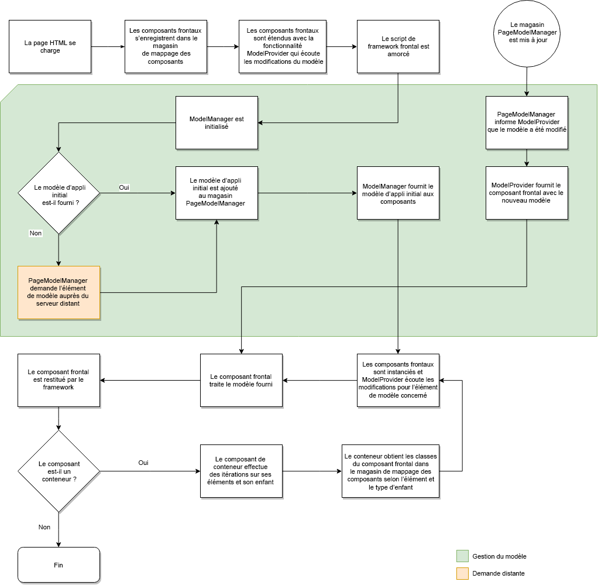

# Mappage du modèle dynamique avec les composants pour les SPA {#dynamic-model-to-component-mapping-for-spas}

Ce document décrit le fonctionnement du mappage du modèle dynamique avec les composants dans le SDK JavaScript SPA pour AEM.

{{ue-over-spa}}

## Module ComponentMapping {#componentmapping-module}

Le module `ComponentMapping` est fourni au projet front-end sous la forme d’un package NPM. Il contient les composants front-end et permet à l’application sur une seule page (SPA) de mapper les composants front-end avec les types de ressources AEM. Le module permet une résolution dynamique des composants lors de l’analyse du modèle JSON de l’application.

Chaque élément présent dans le modèle contient un champ `:type` qui expose un type de ressource AEM. Une fois monté, le composant front-end peut être rendu à l’aide du fragment de modèle reçu des bibliothèques associées.

Pour plus d’informations sur l’analyse des modèles et l’accès des composants front-end, consultez le document [Plan directeur d’applications monopages (SPA)](blueprint.md).

Voir aussi le package npm : [@adobe/aem-spa-component-mapping](https://www.npmjs.com/package/@adobe/aem-spa-component-mapping)

## SPA pilotée par un modèle {#model-driven-single-page-application}

Les applications monopages qui utilisent le SDK JavaScript d’application monopage pour AEM sont basées sur des modèles :

1. Les composants front-end s’enregistrent eux-mêmes dans le [magasin de mappage de composants](#componentmapping-module).
1. Ensuite, le [conteneur](blueprint.md#container), qui a reçu un modèle du [fournisseur de modèles](blueprint.md#the-model-provider), effectue une itération sur son contenu de modèle (`:items`).

1. S’il y a une page, ses enfants (`:children`) obtiennent d’abord une classe de composant du [mappage des composants](blueprint.md#componentmapping), puis l’instancient.

## Initialisation de l’application {#app-initialization}

Chaque composant est étendu grâce aux capacités du [`ModelProvider`](blueprint.md#the-model-provider). L’initialisation se présente donc sous la forme générale suivante :

1. Chaque fournisseur de modèles s’initialise et écoute les modifications apportées au fragment de modèle qui correspond à son composant interne.
1. Le gestionnaire [`PageModelManager`](blueprint.md#pagemodelmanager) doit être initialisé tel qu’il est représenté par le [flux d’initialisation](blueprint.md).

1. Une fois stocké, le gestionnaire de modèles de page renvoie le modèle complet de l’application.
1. Ce modèle est ensuite transmis au composant racine front-end [Conteneur](blueprint.md#container) de l’application.
1. Les fragments du modèle sont finalement propagés à chaque composant enfant.

