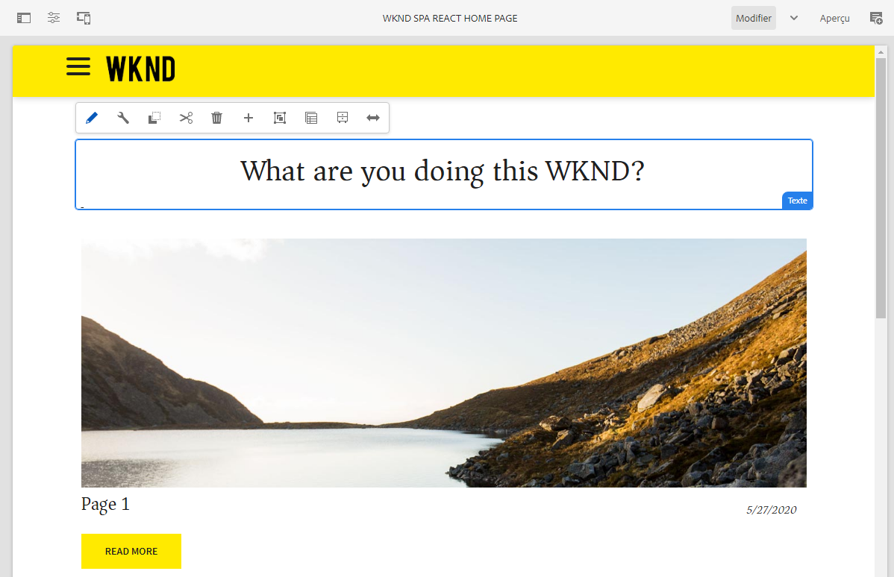

# Projet SPA WKND {#wknd-spa-project}

{{ue-over-spa}}
{{traditional-aem}}

Découvrez le développement d’applications sur une seule page (SPA) grâce à ce tutoriel en plusieurs parties. Vous serez guidé tout au long de la mise en œuvre de la configuration du projet, du mappage des composants, des outils de développement front-end et du routage d’applications pour mettre en œuvre vos propres SPA.

Tout comme celui relatif à WKND pour AEM, ce tutoriel consacré aux applications monopages offre un exemple de bout en bout de la création de vos propres applications monopages, modifiables à l’aide d’AEM, depuis la configuration du projet jusqu’au routage de l’application.

* [Créer votre première SPA Angular dans AEM](https://experienceleague.adobe.com/docs/experience-manager-learn/getting-started-with-aem-headless/spa-editor/angular/overview.html?lang=fr)
* [Créer votre première SPA React dans AEM](https://experienceleague.adobe.com/docs/experience-manager-learn/getting-started-with-aem-headless/spa-editor/react/overview.html?lang=fr)

Toutefois, avant de vous engager dans votre propre projet SPA pour AEM, vous pouvez également consulter le document [Développement de SPA pour AEM](developing.md).
